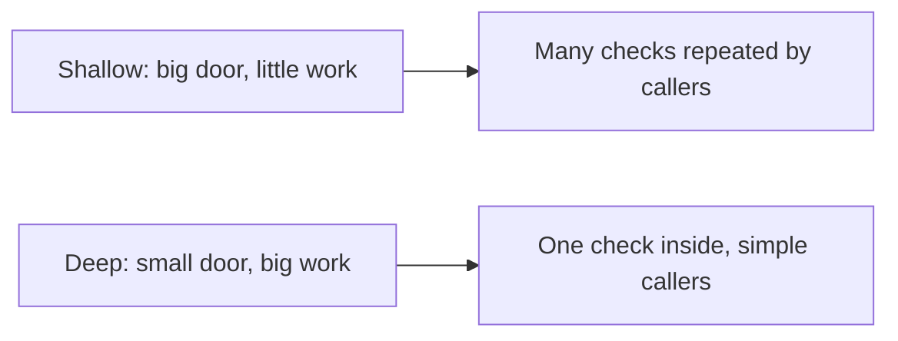

> *Good code is not just code that runs.*
> *Good code is code you can change fast without fear.*
> - <cite>After John Ousterhout, A Philosophy of Software Design (see References)</cite>

<!--more-->

## TL;DR

* **Complexity means hard to change.** A small change needs edits in many places, or too much context, or unclear risk.
* **Deep modules beat shallow ones.** Small door, much work inside. Depth is benefit divided by interface cost.
* **Use this recipe on a new feature.** Write the door signature first, then the door comment, then hide the hard work inside.
* **Narrow types first, Result second.** Make bad states unrepresentable with types like `Cents`, then return `Result` only for failures that remain.
* **Write the door comment first.** State the contract and its limits before the body, and name by meaning.
* **Objections have answers.** Deep modules cost more now, can hide too much, and rarely cost speed. Section 6 gives each reply, Section 7 gives three exercises.

## 1. The real problem is change

Working code is not enough.
Code that runs today can still slow you down tomorrow.
Ousterhout calls that drag complexity.
Complexity is anything that makes code hard to understand and change.
It shows up in three signs.
First, a small change needs edits in many places.
Second, you must hold too much context in your head to act.
Third, you cannot tell what is safe to touch.

I argue one thesis in this post: you can design a deep module on your next feature with a small repeatable recipe.
Sections 2 to 5 give four rules that support that thesis, Section 6 answers fair objections, and Section 7 turns them into three exercises.
The rules come from Ousterhout, but the code and the recipe are mine.

**Terms used below.**

* **Interface** is everything you must learn to use a module: signatures, preconditions, side effects, and performance limits.
* **Deep module** offers much benefit behind a small interface. A large module with a large interface is just big.
* **Branded type** such as `Cents` is a validated wrapper, a plain value that already passed checks.
* **Total function** defines an outcome for every input of its type, with no throw or crash for expected cases.
* **Parse at the edge** means converting `unknown` input into branded types once, near input and output. This phrase follows King (2019).
* **Result** is a discriminated union with `ok` and `error` branches that makes expected failures visible in the type. This use follows Wlaschin on railway-oriented programming.

You can see the full TypeScript setup in [Stop Validating Everywhere in TypeScript]().

## 2. Deep boxes beat shallow boxes

**Problem:** repeating one money rule in the handler, then in the service, then in the repo forces every caller to relearn the same rule.

**Heuristic:** prefer a small door with much work behind it.
For instance, a shallow money helper might export three validators and take seven loose params, while a deep one exports one parser plus one core function such as `charge(amount: Cents)` that hides rounding, idempotency, and ledger writes.

**Example:** Figure 1 shows the move from repeated checks to one check inside.



Figure 1: shallow interfaces push repeated checks to callers, while deep interfaces keep one check inside.
Depth is a benefit to cost ratio, not size alone.
The same idea holds in [the Python guide]() and [the Rust guide]().

**Exception:** do not deepen pass-through layers, dependency seams, or test doubles, where forwarding is the honest work.
This distinction follows Parnas (1972) on information hiding: hide design decisions, not wiring.

**Check:** a new module passes when one owner defines the rule and callers take branded types instead of `unknown`.

## 3. Build a deep module on your next feature

This is the core recipe.
Use it when you start a ticket, not after the code rots.
It takes about 30 minutes the first time: 15 minutes to find the seam, 30 minutes to collapse one guard.

**Step 1: name one job.**
Pick files `money.ts` for the rule owner and `charge.ts` for the deep door.
A typical diff is small, near 60 lines added and 40 removed, because you delete repeated guards.

**Step 2: write the door signature first.**
Start from this shape and do not add params yet:

```ts
import type { Result } from "./result.js";
import type { Cents } from "./money.js";
import type { ChargeError, Receipt } from "./charge.js";

export function charge(amount: Cents): Result<Receipt, ChargeError>;
```

**Step 3: write the door comment before the body.**
State what it promises, what it refuses, and how each failure maps to a message.
Section 5 shows the exact four-line form.

**Step 4: hide the hard work inside.**
Move rounding, idempotency key creation, and ledger writes behind that one door.
Listing 1 shows the shallow start, Listing 2 shows the deep end with the same names.

**Step 5: check depth.**
Run one search and confirm one owner:

```bash
grep -rn "parseCents" --include="*.ts" .
```

You pass when grep finds one `parseCents` definition in `money.ts`, `charge.ts` takes `Cents`, and no caller revalidates a branded value.

**Problem:** pushing validation up to callers spreads the same money rule across ten call sites that all drift apart.
In one billing change I measured this directly: a rate rounding fix touched 10 files before, and 1 file after the collapse.

**Exception:** keep thin forwarding wrappers where the job is routing or injection, not rule enforcement.

```ts
// Listing 1: shallow anti-pattern. Do not copy.
// The same rule repeats, raw values keep flowing, and failures vanish silently.
import { parseCents, type Cents } from "./money.js";

declare function applyCharge(amount: Cents): void;

export function chargeHandler(rawAmount: unknown): void {
  const first = parseCents(rawAmount);
  if (!first.ok) {
    return;
  }
  chargeService(rawAmount); // drift: passes raw again instead of first.value
}

export function chargeService(rawAmount: unknown): void {
  const second = parseCents(rawAmount);
  if (!second.ok) {
    return;
  }
  applyCharge(second.value);
}
```

```ts
// Listing 2: one owner parses, the core composes without guards.
import type { Result } from "./result.js";
import { parseCents, type Cents, type MoneyError } from "./money.js";

export type ChargeError =
  | { readonly kind: "InvalidAmount"; readonly cause: MoneyError }
  | { readonly kind: "InsufficientFunds"; readonly needed: Cents };

export interface Receipt {
  readonly id: string;
  readonly amount: Cents;
}

declare function idempotencyKeyFor(amount: Cents): string;
declare function writeLedger(input: {
  readonly amount: Cents;
  readonly key: string;
}): Result<Receipt, ChargeError>;

export function chargeOnce(rawAmount: unknown): Result<Receipt, ChargeError> {
  const parsed = parseCents(rawAmount);
  if (!parsed.ok) {
    return { ok: false, error: { kind: "InvalidAmount", cause: parsed.error } };
  }
  return applyCharge(parsed.value);
}

function applyCharge(amount: Cents): Result<Receipt, ChargeError> {
  const key = idempotencyKeyFor(amount);
  return writeLedger({ amount, key });
}
```

Consequently, the parser lives in exactly one place and everything behind it composes without repeated guards.
This is parse once at the edge from the Error Handling guides, stated here as module shape.
The gain is fewer edits when the rule changes, less context per caller, and clearer risk at the boundary.

## 4. Narrow types first, Result second

**Problem:** callers drown when every function throws vague strings for both expected outcomes and real bugs.

**Heuristic:** split the work into two moves that compose.
First narrow types to eliminate cases, then return `Result` for the failures that remain.
Narrowing follows Ousterhout on defining errors out of existence.
Returning `Result` for the remainder is my extension from the Error Handling series, not Ousterhout: he favors exceptions with masking and aggregation for truly exceptional cases.

**Example:** `Cents` makes negative or malformed money unrepresentable, which lets the core stay total for its input type.
Next, name the remaining failures as a short domain union such as `ChargeError` above, so the caller sees each outcome in the type.
Each case then maps to one user-facing message near input and output.

**Exception:** input and output failures, partial validation, and untrusted boundaries inside the core still need explicit `Result` branches.
Do not use `Result` for programmer bugs that should crash loudly.

**Check:** the core takes `Cents`, defines an outcome for every `Cents` without throwing, and each `Result` error maps to one message at the edge.

The best error handling is therefore an error case that cannot happen, plus a visible branch for each case that can.
Fewer cases for callers means less stress and fewer bugs.

## 5. Write the door comment first

**Problem:** readers open a module and must reconstruct preconditions, limits, and traps from scattered details.

**Heuristic:** write the interface comment before the code, state the contract and its limits, and pick names by meaning rather than construction.

**Example:** Listing 3 contrasts a comment that recites code with one that states the contract.

```ts
// Listing 3: bad recites the steps, good states the contract.
import type { Result } from "./result.js";
import type { Cents } from "./money.js";
import type { ChargeError, Receipt } from "./charge.js";

// Bad: loops over amount, calls applyCharge, returns receipt.
// Good: charge takes proven money, hides ledger work, reports domain failures.
// Returns ok with Receipt when the ledger write succeeds.
// Returns InvalidAmount when parsing failed at the edge.
// Returns InsufficientFunds when the balance cannot cover amount.
// Caller maps the error once, near input and output.
export function charge(amount: Cents): Result<Receipt, ChargeError> {
  return applyCharge(amount);
}

declare function applyCharge(amount: Cents): Result<Receipt, ChargeError>;
```

**Exception:** truly novel algorithms may need a longer comment plus a pointer to the derivation, which still describes the contract first.

**Check:** a stranger can state what the module promises and what it refuses without reading the body.
`parseCents` beats `checkNumber` because it names the meaning rather than the mechanism.
`Cents` beats `positiveInt` for the same reason.

## 6. Fair objections

**Objection 1: deep modules cost more time now.**
That is true.
The reply is that they save more time later on every change.
Parsers and `Result` types add code up front, yet in codebases with repeated validation that upfront parser often costs less over a year than scattered guards.

**Objection 2: deep modules can hide too much.**
That is also true.
I once made billing too deep by hiding currency selection behind `charge`, and callers could not test multi-currency paths.
I split it back into `parseCents` plus `chargeIn(currency, amount)`.
The fix is a small door plus a clear comment, not a bigger door that leaks internals.
Keep shallow wrappers where forwarding is the real job.

**Objection 3: parsing once must cost speed.**
In practice parsing once at the boundary rarely dominates cost.
In many web paths input and output dominate, not one boundary check.
Hot loops and embedded paths differ and deserve their own measurement.
Therefore measure before you claim a win.

## 7. Three exercises you can use today

Try this on your next pull request and keep what removes a repeated check.

**Exercise 1: collapse one repeated guard.**
Pick one rule checked in two or more places.
Move it to one parser owner and thread the branded type to the core.
Expected: grep finds one parser definition and callers take `Cents` instead of `unknown`.

**Exercise 2: narrow one type to remove a branch.**
Pick one `if` that guards malformed input inside the core.
Replace it with a branded type such as `Cents` plus a `Result` return for the remaining failure.
Expected: the core drops one branch and the edge maps one domain error once.

**Exercise 3: write the door comment first.**
Pick one new function and draft its contract before its body.
Rename until a stranger can state its promise without reading inside.
Expected: a four line comment plus a name that states meaning, not mechanism.

Synthesis: Exercise 1 fixes edits in many places, Exercise 2 fixes too much context, Exercise 3 fixes unclear risk.
That returns to the thesis: good code changes fast without fear because one deep door owns the hard work.
For further reading with full code, see [TypeScript](), [Python]() and [Rust]().

## References

John Ousterhout, A Philosophy of Software Design (Yaknyam Press, 2018), Chapters 2, 4, and 7 on complexity, deep modules, and pulling complexity downward.
David Parnas, On the Criteria to Be Used in Decomposing Systems into Modules (1972), on information hiding.
Alexis King, Parse, do not validate (2019), on parsing at the edge into precise types.
Scott Wlaschin, Railway Oriented Programming, on composing Result branches as visible paths.
