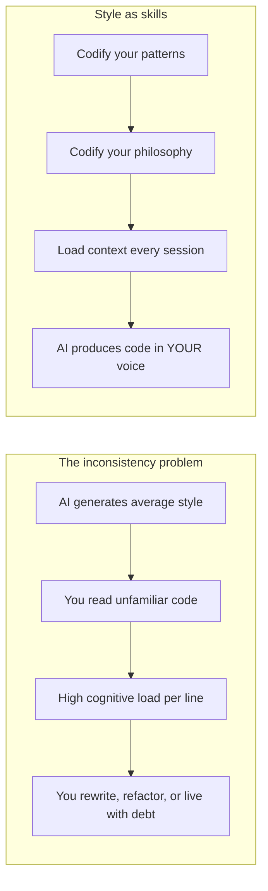

> *Every line of code you read but did not write is a line you have to think about twice.*
> *The cheaper it is for you to read, the closer it is to code you would have written.*
> — <cite>Personal Experience</cite>

<!--more-->

## TL;DR

* **The real problem with AI-generated code is not correctness, it is consistency.** A model that writes a perfect algorithm in a style you would never write still costs you time on every single line.
* **Coding style is a fingerprint.** Researchers can identify you as the author of a piece of code, and your style is more than cosmetics. It is how you decompose problems, which patterns you reach for, and your mental model of the world.
* **AI generates the style of a developer who does not exist.** It averages millions of repos into a generic voice, so the code is always slightly foreign to you.
* **The fix is not a better prompt, it is externalizing your style.** Codify your patterns and philosophy into reusable context (skills, AGENTS.md, examples) so the model produces code you can read without effort.

---

I spent a long time wondering why AI-assisted development did not feel as productive as it should.

The code was correct. The logic was sound. The tests passed. And yet, reviewing every pull request felt like reading a book written by a stranger. I would find myself rewriting whole functions not because they were wrong, but because they were written in a way I would never have written them.

That is when I had the realization that became this post.

The bottleneck was never the AI's ability to produce working code. The bottleneck was the distance between the code it produces and the code I would produce myself.

## Rule 1: Code Is a Fingerprint

Every person builds a mental model of the world.

That model shapes how you read a problem statement, how you break it into pieces, and which solutions feel *natural* to you. Two senior developers given the same bug will not write the same refactor. One reaches for a `Result` type, the other reaches for exceptions. One names things with domain vocabulary, the other with implementation vocabulary. Both are correct. Both are different.

Your code is not just a description of what the machine should do.

Your code is a description of how you think.

This is not a poetic claim, it is a measurable fact. There is an entire research field dedicated to it: **code authorship attribution** [^1]. The idea is simple. If a piece of source code carries your stylistic fingerprint, then you can be identified as its author.

And the researchers are remarkably good at it:

* Modern LLM-based approaches attribute code to its author with high precision, effectively in seconds [^2].
* Your style survives even compilation. Researchers have de-anonymized programmers from compiled executable binaries [^3].
* The style is stable enough that dedicated work exists on both attacking attribution (adversarial style transformation) and defending it [^4].

The conclusion is inescapable: style is identity. It is learnable, it is detectable, and it is stable over time.

If that is true, then every AI that writes code *has* a style. The question is whose.

## Rule 2: The Problem Is Not Quality, It Is Consistency

Here is the part that took me too long to understand.

Reading code is more expensive than writing it. Classic software engineering literature puts the ratio at around 10 minutes of reading for every minute of writing [^5]. When you write, your intent is already in your head, so the code is just transcription. When you read someone else's code, you have to reconstruct their intent from scratch.

Now think about what an LLM does when it generates code.

It samples from a probability distribution trained on the public history of software. Millions of repositories, millions of authors, each with a different style, different preferences, different mental models. The output is an *average* of all those voices.

But that average does not exist in reality.

Nobody writes code in the average style. Every real developer writes code in *their* style. So the LLM hands you something that is almost, but not quite, like any code you have seen before. It is a foreigner in every codebase.

This has a concrete cost. When you review AI-generated code you cannot rely on your intuition. Your pattern matching, the automatic recognition that tells you "this is the user lookup, this is the validation boundary, this is where the error should be handled" fails. You have to read carefully, line by line, and reconstruct intent that you never formed.

Every line the AI writes that you would not have written is cognitive debt. You will pay for it now, when you review it, and again later, when you have to modify it.

Correctness is necessary but not sufficient. A solution is only *cheap* for you when it is written the way you think.

## Rule 3: The Research Already Knows

I assumed this was an under-explored corner of the field. I was wrong.

There is a small but growing body of work, and it converges on exactly this problem from three different directions.

### Direction 1: LLMs write differently than humans

The most direct evidence comes from a paper that empirically compares the coding style of LLM output against human-written code [^6]. The authors summarize a taxonomy of **coding style inconsistencies** across readability, conciseness, and robustness. The differences are systematic, not random.

Complementary work shows that those differences are even statistically detectable: classifiers can reliably tell human-authored code from ChatGPT-generated code [^7].

### Direction 2: Functional correctness is not what developers want

Benchmarks have historically measured whether generated code passes tests, and nothing else. Several papers push back on that.

One benchmark, *NoFunEval*, shows that code language models falter on requirements beyond functional correctness [^8]. Developers think about *how* a feature is implemented, not just *what* it does. They care about maintainability, efficiency, security, and fit with the surrounding system. The models fail to demonstrate that understanding.

Another benchmark, *CodeAlignBench*, evaluates whether models can follow developer-preferred adjustments, instructions that go beyond correctness [^9].

The message is consistent: correctness benchmarks measure the wrong thing, and the community knows it.

### Direction 3: Personalization is the open frontier

The most exciting work is the direct attack on the problem: generating personalized code.

*MPCoder* is a multi-user personalized code generator that learns a user's style across two dimensions [^10]. Explicit style learning captures the syntax and naming conventions. Implicit style learning captures the semantic and architectural conventions. This is remarkably close to how I think about my own style, and I describe it that way below.

*CodeFavor* trains models to predict developer code preferences from pairs of candidates [^11]. The framing, "developer code tastes", is precisely the thing I found missing everywhere else.

But here is the gap that none of these close.

## Rule 4: Everyone Talks About Teams, Nobody Talks About You

Read the practical advice about AI code consistency online and you find the same themes repeated [^12] [^13] [^14]:

* Define team coding standards.
* Add linters and formatters to CI.
* Create prompt templates shared across the team.
* Review systematically.

This is all true, and all useful, and all aimed at the wrong unit. The team is the wrong unit. The *individual* is the right unit.

A linter catches brace placement, but it cannot catch that you reach for `Result` types while your colleague reaches for exceptions. A prompt template can standardize phrasing, but it cannot encode how you decompose a problem into layers. No shared standard can make AI code feel like *your* code, because your code is shaped by your personal mental model of the world.

The research direction understands this. MPCoder is explicitly about *multiple users*, each with their own style. But the implementation path they chose, fine-tuning, does not scale to an individual developer. You cannot fine-tune a model for every developer on the team. It is too expensive, too slow, and it requires labeled data in your style.

There is a simpler path, and it is the one I have been using.

## Rule 5: My Solution, Style as Skills

Let me be clear about one thing first.

I have not fully solved this problem. The results are good, but they are not optimal, and I will be honest about that in the next section. What I have built is a direction that feels right, and I want to share it.

The core idea is this: **if style is identity, and identity is stable, then style can be codified.**

I externalized my style into reusable context. Instead of trying to make the AI read my mind, I wrote down how I think and made that context load every time.

I keep this in a small repository of skills [^15]. Each skill is a focused set of instructions the AI loads when the task matches. Two of them carry most of the weight.

### The error-handling skill

The best example is my error-handling skill. It encodes the architecture I describe in my posts about error handling [^16] [^17]. The core rules are:

* Validate at the edges with a `Result` type, defensively.
* Parse with Pydantic and branded types, never just validate.
* Assert in the core with a fail-fast assertion, offensively.
* Never use a bare `assert`, because Python strips it under `-O`.

These rules sound like engineering choices. For me they are something more. The Layers of Trust pattern, the `Result` type, the branded types, that is my signature. It is how I think about where errors can happen and who is responsible for them. When the AI follows these rules, it is not just producing good code. It is producing code that matches my mental model, so I can read it without translating it.

### The to-plan skill

The second skill is about plans, and it taught me something important.

I noticed that the same inconsistency problem happens before the code exists. When the AI plans a feature, the plan it produces does not match how I decompose problems. So I codified my planning format too.

The result is a plan format with a specific structure: a human-facing PRD and an executable agent spec, with seams, guardrails, and evals. Now the AI produces plans in the exact format I designed, which means I can review a plan the same way I review my own.

The pattern generalizes beyond these two skills.

What makes this work is the level of the codified decisions.

* **Level 1, conventions:** naming, formatting, file layout. Easy to codify, easy to enforce, but low value. A linter does this.
* **Level 2, patterns:** which idioms you use, which libraries, which architectural shapes. Higher value, and this is where most of my skills live.
* **Level 3, philosophy:** how you decompose problems, what you consider simple, where you place trust boundaries. The highest value, and the hardest to write down, but the most important to capture.

My error-handling skill is mostly Level 2 with a heavy dose of Level 3. The trust boundary philosophy is the Level 3 part, and it is the part that makes the generated code feel mine.

## Rule 6: Results and Honest Limitations

I want to report what actually happened, including the parts that did not go well.

### What worked

The error-handling skill genuinely changed my workflow.

The AI now reaches for `Result` types at the edges and assertions in the core without being told every time. The generated code follows the Layers of Trust shape I would have used. Reviews are faster because I do not have to mentally translate the architecture. The consistency across sessions, which is the actual goal, is real.

The to-plan skill had a similar effect upstream. Plans now arrive in a format I can evaluate quickly, and I can spot a wrong seam immediately instead of reading ten paragraphs to find it.

### What did not work

I have to be honest about the limits.

First, consistency is probabilistic, not deterministic. The same skill produces the same architecture most of the time, but not always. One session out of ten, the AI still drifts toward the average voice, and I catch it in review.

Second, context is finite. A skill that encodes everything I believe about coding would not fit in a context window, so I have to choose what matters most. The error-handling skill wins because error handling touches every function. Other aspects of my style are still uncaptured.

Third, skills encode what I know I do, not what I actually do. The gap between the two is invisible to me, and the skill inherits that blindness. An AI that watches my real history could close it, but that is a future version of this idea.

And fourth, there is a maintenance tax. My style evolves, and each skill has to evolve with it, or it starts enforcing decisions I no longer make.

None of these feel like dead ends. They feel like the normal friction of a young technique.

## The Takeaway

Correctness made the AI a powerful tool.

Consistency is what makes it feel like *my* tool.

A model that writes working code in an alien voice is a code generator I must supervise. A model that writes code the way I would is an extension of my thinking. The difference is not measured by tests. It is measured by how little effort it takes to read the output.

To close that gap, stop optimizing the prompt and start externalizing the style:

1. **Accept that style is identity.** Your patterns and philosophy are a signature, and they are worth treating as a first-class asset.
2. **Codify Level 2 and Level 3 decisions**, not just conventions. Write down the architecture you reach for and the philosophy behind it.
3. **Load that context automatically.** Make the style a skill that loads itself, not a prompt you remember to paste.
4. **Feed corrections back.** Every fix you make in review is a lesson about your style. Capture it or the drift returns.

The goal was never to generate more correct code. The goal is to generate code you can read without effort, code that is practically yours.

<mark>Stop trying to make the AI smarter. Make it write like you, and the AI becomes an extension of your thinking instead of a stranger in your codebase.</mark>

## References

[^1]: [Code authorship attribution](https://arxiv.org/abs/1512.08546) is a research field that identifies the author of a piece of source code from its style.
[^2]: [I Can Find You in Seconds! Leveraging Large Language Models for Code Authorship Attribution](https://arxiv.org/abs/2501.08165), 2024.
[^3]: [When Coding Style Survives Compilation: De-anonymizing Programmers from Executable Binaries](https://arxiv.org/abs/1512.08546), 2015.
[^4]: [RoPGen: Towards Robust Code Authorship Attribution via Automatic Coding Style Transformation](https://arxiv.org/abs/2202.06043), 2022.
[^5]: R. Glass, [Facts and Fallacies of Software Engineering](https://en.wikipedia.org/wiki/Software_engineering), Addison-Wesley, 2002. The reading-to-writing ratio of code is cited as roughly 10:1.
[^6]: [Beyond Functional Correctness: Investigating Coding Style Inconsistencies in Large Language Models](https://arxiv.org/abs/2407.00456), 2024.
[^7]: [Discriminating Human-authored from ChatGPT-Generated Code Via Discernable Feature Analysis](https://arxiv.org/abs/2306.14397), 2023.
[^8]: [NoFunEval: Funny How Code LMs Falter on Requirements Beyond Functional Correctness](https://arxiv.org/abs/2401.15963), 2024.
[^9]: [CodeAlignBench: Assessing Code Generation Models on Developer-Preferred Code Adjustments](https://arxiv.org/abs/2510.27565), 2024.
[^10]: [MPCoder: Multi-user Personalized Code Generator with Explicit and Implicit Style Representation Learning](https://arxiv.org/abs/2406.17255), 2024.
[^11]: [Learning Code Preference via Synthetic Evolution](https://arxiv.org/abs/2410.03837), 2024.
[^12]: [The AI Code Consistency Problem: How to Maintain Coding Standards When Using AI](https://nosemicolons.com/posts/ai-code-consistency-standards/), 2026.
[^13]: [Maintaining AI-Generated Code Consistency with Team Style Guides](https://www.onspace.ai/blog/ai-code-consistency-style-guides), 2025.
[^14]: [The AI Code Generation Consistency Matrix](https://nosemicolons.com/posts/ai-code-generation-consistency-matrix/), 2026.
[^15]: [dinoesau/skills](https://github.com/dinoesau/skills/tree/main/skills) is a repository of reusable skills, including error-handling, coding-guide, and to-plan.
[^16]: [Stop Validating Everywhere: An Architectural Guide to Error Handling in TypeScript]()
[^17]: [Stop Validating Everywhere: An Architectural Guide to Error Handling in Python]()
