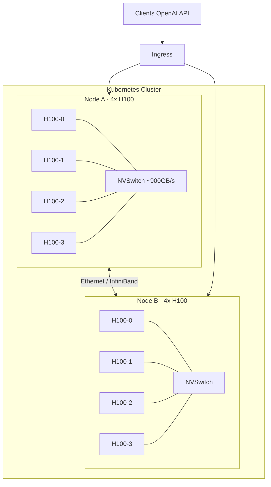
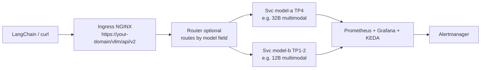
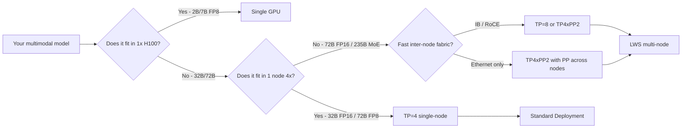
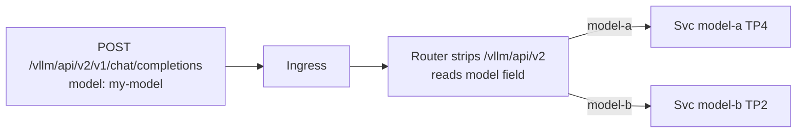
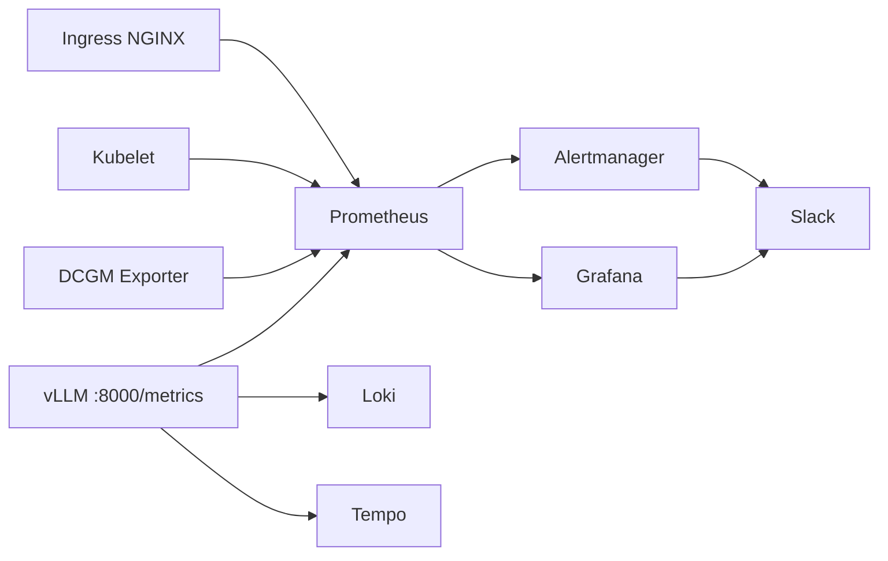

> Serving a model is the easy part.
> Keeping it observable, scalable, secure, and fast under real traffic is the other 70% — and the part most tutorials skip.
> This is the missing checklist, distilled from running multimodal inference on 2 nodes x 4 H100s in Kubernetes.

<!--more-->

## 📌 TL;DR

* **Serving is only 30%.** A `Deployment` that answers `curl` is not production.
  Without observability, autoscaling, weight management, and security, the first traffic spike leaves you blind with saturated GPUs while Kubernetes thinks everything is idle.
* **Start simple, scale by the model.** Most multimodal models (7B-32B) fit on a single node with Tensor Parallel `TP=4` — two independent replicas give you HA without crossing the network.
* **Only go multi-node when the model forces you.** `70B+` dense or `200B+` MoE needs LeaderWorkerSet (`LWS`) with `TP x PP` — higher complexity, slower cold start, and a hard dependency on inter-node networking.
* **The production checklist is always the same:** `GPU Operator + DCGM` -> `ServiceMonitor + alerts + dashboards` -> `TLS + auth + rate limiting` -> `versioned weights + pinned images` -> `KEDA on vLLM metrics` -> `PDB + anti-affinity`.
* **This guide is model-agnostic.** Examples use `Qwen3-VL` and `Gemma` family models, but every pattern applies to any multimodal model that vLLM supports (LLaVA, Pixtral, InternVL, etc).

---

If you have ever followed a `vLLM on Kubernetes` tutorial, you know the pattern.
You install the GPU Operator, you apply a `Deployment` with `--tensor-parallel-size 4`, you port-forward, you `curl /v1/chat/completions`, and you celebrate.
Then you expose it to real users and everything breaks in ways Kubernetes cannot see.

This post is the bridge between that tutorial and a real production service.
It is based on an [investigation of vLLM + Qwen3-VL on 2 nodes x 4 H100 SXM5 80GB](https://gist.github.com/dinoesau/b8e86151579b282dd353520bf5bd255d) — but generalized so you can apply it to any multimodal model.

We will cover:

1. The architecture you are actually building.
2. The non-negotiable foundation that makes H100s visible to Kubernetes.
3. The three parallelism concepts you need in 60 seconds.
4. Three deployment patterns that cover 95% of cases.
5. The other 70%: weights, images, and ingress.
6. The observability stack that prevents blind saturation.
7. Autoscaling that actually reacts to the engine queue.
8. A prioritized production checklist you can copy.

## 1. What you are actually building

Assume two on-prem nodes, each with `4x H100 SXM5 80GB` (total 8 GPUs).
Intra-node interconnect is `NVLink 4.0 + NVSwitch (~900 GB/s)` — ideal for Tensor Parallel.
Inter-node interconnect is the variable: if you have `InfiniBand NDR 400G` or `RoCE`, cross-node Tensor Parallel is viable with `NCCL + GDRDMA`.
If you only have `Ethernet 25/100G`, prefer Pipeline Parallel across nodes.

We also assume `Kubernetes >= 1.27` with `containerd` and `nvidia-container-toolkit`.



At the end you want this:



Every multimodal model behind that ingress speaks the same OpenAI-compatible API at `/v1/chat/completions` — text, image, and video blocks travel as `image_url` parts.

## 2. The ground floor: exposing H100s to Kubernetes

Without this layer no vLLM pattern is stable on H100.
It is boring, it is mandatory, and it is where most on-prem setups fail silently.

### 2.1 NVIDIA GPU Operator

This is the standard CNCF pattern for 2025-2026.
One Helm chart installs `driver 550+`, `toolkit`, `device-plugin`, `DCGM Exporter`, `Node Feature Discovery`, and optionally `MIG Manager`.
It is the only supported way to get `DCGM` metrics, auto-upgrades, and time-slicing/MIG via ConfigMap without manual installs.

```bash
helm repo add nvidia https://helm.ngc.nvidia.com/nvidia
helm repo update
helm upgrade --install gpu-operator nvidia/gpu-operator \
  --create-namespace --namespace gpu-operator \
  --set driver.enabled=true \
  --set toolkit.enabled=true \
  --set dcgmExporter.enabled=true \
  --wait

kubectl get nodes -o custom-columns=NAME:.metadata.name,GPU:.status.allocatable."nvidia\.com/gpu"
# expected: 4 and 4
```

If you see `0 GPUs`, check `kubectl describe node` for `nvidia.com/gpu` and `dmesg` for `XID errors` before touching vLLM.

The manual alternative (`driver` + standalone `nvidia-device-plugin` DaemonSet) loses `DCGM` and lifecycle management — do not use it in production.

### 2.2 How to share a GPU (and when not to)

| Mode | How it works | When to use it | Key trade-off |
| :--- | :--- | :--- | :--- |
| **Exclusive (default)** | `nvidia.com/gpu: 1` reserves a whole GPU | Production for any model >= 7B | Best performance and isolation |
| **Time-slicing** | Operator ConfigMap multiplexes time slots | Dev/staging, small auxiliary models | No VRAM isolation, 5-15% overhead |
| **MIG** | Partitions H100 into up to 7 physical instances | Hard multi-tenant isolation by team | Breaks NVLink, incompatible with TP that needs a full GPU |

For production multimodal inference, use `Exclusive`.
Time-slicing and MIG only make sense for dev or for small side models that must coexist without stealing a full H100 from vLLM.

### 2.3 The Pod spec every vLLM Pod needs

This is independent of the deployment pattern.
Without `/dev/shm` and `IPC_LOCK`, `NCCL` fails with `Bus error` or silently falls back to `NET/Socket` and latency multiplies by 10x.

```yaml
resources:
  limits: { nvidia.com/gpu: "4" }
  requests: { nvidia.com/gpu: "4" }
securityContext:
  capabilities: { add: ["IPC_LOCK"] }
volumes:
  - name: dshm
    emptyDir: { medium: Memory, sizeLimit: 16Gi }
volumeMounts:
  - { mountPath: /dev/shm, name: dshm }
```

Verify after deploy with `NCCL_DEBUG=TRACE` — you must see `via NET/IB/GDRDMA`, not `Socket`.

## 3. Parallelism in 60 seconds

Multimodal models add a vision encoder on top of the language model, but the scaling math is the same.

* **Tensor Parallel (TP):** splits every layer across GPUs, needs synchronous `AllReduce` per layer.
  Fast inside a node (NVLink), expensive across nodes.
* **Pipeline Parallel (PP):** splits by layers, each GPU or node runs a stage.
  Less communication, but introduces pipeline bubbles.
* **Data Parallel (DP):** replicates the whole model and shards requests — horizontal throughput.
* **Expert Parallel (EP):** only for MoE, scales experts without replicating them.

The official vLLM rule is `TP = GPUs per node` and `PP = number of nodes`.



Sizing rule of thumb for multimodal: `weights + vision cache + KV cache < VRAM * gpu-memory-utilization`.
Each `1024px` image adds `1-2 GB` of vision/KV cache — with `--limit-mm-per-prompt image=4` reserve `4-8 GB` extra.

## 4. Three patterns that cover 95%

The full investigation documents six patterns.
In practice, three are enough — the others are wrappers or dev-only variants.

### 4.1 Pattern 1: Single-node Deployment with `TP=4` (start here)

One `Deployment` per model, `nvidia.com/gpu: 4`, `--tensor-parallel-size 4`.
Each replica is self-sufficient and never crosses the network.
You scale horizontally by adding replicas behind a `ClusterIP Service`.
This is the canonical example from `docs.vllm.ai/deployment/k8s`.

```yaml
apiVersion: apps/v1
kind: Deployment
metadata: { name: llm-multimodal-32b, namespace: llm-serving }
spec:
  replicas: 2
  selector: { matchLabels: { app: llm-multimodal } }
  template:
    metadata: { labels: { app: llm-multimodal } }
    spec:
      affinity:
        podAntiAffinity:
          preferredDuringSchedulingIgnoredDuringExecution:
            - weight: 100
              podAffinityTerm:
                labelSelector: { matchLabels: { app: llm-multimodal } }
                topologyKey: kubernetes.io/hostname
      volumes:
        - { name: cache, persistentVolumeClaim: { claimName: model-cache } }
        - { name: dshm, emptyDir: { medium: Memory, sizeLimit: 16Gi } }
      containers:
        - name: vllm
          image: vllm/vllm-openai:v0.11.0
          command: ["/bin/sh","-c"]
          args:
            - |
              vllm serve YOUR_MODEL_ID \
                --tensor-parallel-size 4 \
                --gpu-memory-utilization 0.90 \
                --max-model-len 16384 \
                --enable-prefix-caching \
                --enable-chunked-prefill \
                --limit-mm-per-prompt image=4,video=1 \
                --mm-encoder-tp-mode data \
                --trust-remote-code \
                --served-model-name llm-multimodal-32b
          ports: [{ containerPort: 8000, name: http }]
          env:
            - name: HF_TOKEN
              valueFrom: { secretKeyRef: { name: hf-token-secret, key: token } }
          resources:
            limits: { nvidia.com/gpu: "4", cpu: "16", memory: 96Gi }
            requests: { nvidia.com/gpu: "4", cpu: "8", memory: 32Gi }
          volumeMounts:
            - { mountPath: /root/.cache/huggingface, name: cache }
            - { mountPath: /dev/shm, name: dshm }
          startupProbe: { httpGet: { path: /health, port: 8000 }, failureThreshold: 60, periodSeconds: 10 }
          readinessProbe: { httpGet: { path: /health, port: 8000 }, periodSeconds: 5 }
          livenessProbe: { httpGet: { path: /health, port: 8000 }, periodSeconds: 10 }
---
apiVersion: v1
kind: Service
metadata: { name: llm-multimodal, namespace: llm-serving }
spec: { selector: { app: llm-multimodal }, ports: [{ name: http, port: 8000, targetPort: 8000 }] }
```

**When to choose it:** any dense model that fits in `4x H100` (`~320 GB VRAM`) — typically up to `32B FP16` or `70B FP8`.
Your `2x4` cluster gives you two replicas for HA with zero cross-node traffic.
Cold start `60-180s` for a 32B model.

Add `--quantization fp8` or a pre-quantized `FP8` variant if you are VRAM-constrained — on H100, FP8 is native and gives ~2x throughput without perceptible quality loss for most tasks.

### 4.2 Pattern 2: Multi-node with LeaderWorkerSet (`LWS`) — `TP x PP`

A single logical server spread across two Pods that cooperate.
Uses the `LeaderWorkerSet` CRD (`kubernetes-sigs/lws`) for atomic co-scheduling and discovery via `LWS_GROUP_SIZE`, `LWS_LEADER_ADDRESS`, `LWS_WORKER_INDEX`.
Startup is `--nnodes 2 --node-rank $IDX --master-addr $LEADER --tensor-parallel-size 4 --pipeline-parallel-size 2`.

```yaml
apiVersion: leaderworkerset.x-k8s.io/v1
kind: LeaderWorkerSet
metadata: { name: llm-multimodal-72b, namespace: llm-serving }
spec:
  replicas: 1
  leaderWorkerTemplate:
    size: 2
    restartPolicy: RecreateGroupOnPodRestart
    leaderTemplate:
      spec:
        containers:
          - name: vllm-leader
            image: vllm/vllm-openai:v0.11.0
            args:
              - |
                vllm serve YOUR_LARGE_MODEL_ID \
                  --tensor-parallel-size 4 --pipeline-parallel-size 2 \
                  --nnodes $(LWS_GROUP_SIZE) --node-rank $(LWS_WORKER_INDEX) \
                  --master-addr $(LWS_LEADER_ADDRESS) \
                  --gpu-memory-utilization 0.90 --max-model-len 32768 \
                  --limit-mm-per-prompt image=8 --enable-prefix-caching --trust-remote-code
            resources: { limits: { nvidia.com/gpu: "4", memory: 400Gi } }
    workerTemplate:
      spec:
        containers:
          - name: vllm-worker
            image: vllm/vllm-openai:v0.11.0
            args:
              - |
                vllm serve YOUR_LARGE_MODEL_ID \
                  --tensor-parallel-size 4 --pipeline-parallel-size 2 \
                  --nnodes $(LWS_GROUP_SIZE) --node-rank $(LWS_WORKER_INDEX) \
                  --master-addr $(LWS_LEADER_ADDRESS) --headless \
                  --gpu-memory-utilization 0.90 --max-model-len 32768 \
                  --limit-mm-per-prompt image=8 --trust-remote-code
            resources: { limits: { nvidia.com/gpu: "4", memory: 400Gi } }
```

**When to choose it:** only when the model does not fit in 4 GPUs — `70B+ FP16` or `200B+` MoE with `--enable-expert-parallel`.
Complexity is high, latency has PP bubbles, `20-40%` throughput drop on plain Ethernet, the whole group fails if one node fails, and cold start reaches `3-5 minutes`.
If you lack InfiniBand, quantize to `FP8` to stay on Pattern 1 instead of adopting `LWS`.

### 4.3 Pattern 3: vLLM Production Stack (Helm)

A Helm chart from `vllm-project/production-stack` that wraps Patterns 1 and 2 with `ServiceMonitor`, `PDB`, `KEDA ScaledObject`, optional prefix-aware router, and Grafana dashboards.

```yaml
replicaCount: 2
model:
  name: YOUR_MODEL_ID
  tensorParallelism: 4
  gpuMemoryUtilization: 0.90
  maxModelLen: 16384
  extraArgs: "--limit-mm-per-prompt image=4 --mm-encoder-tp-mode data --enable-prefix-caching"
resources: { limits: { nvidia.com/gpu: 4 } }
router: { enabled: true, prefixAwareRouting: true }
observability: { prometheus: true, grafana: true }
```

**When to choose it:** you want to go from PoC to production without hand-writing manifests, and you are okay coupling to Prometheus Operator.
It does not yet cover `LWS` multi-node — for that you still need Pattern 2.

Other platforms (`KServe`, `KubeAI`, `AIBrix`, `llm-d`) follow the same idea — they expose an `InferenceService` or `Model` CRD and create a vLLM `Deployment` underneath.
Use them if your org already runs them; otherwise they add abstraction that hides `OOM` and `NCCL` issues for a single model.

| Criterion | P1 Deployment TP4 | P2 LWS TPxPP | P3 Production Stack |
| :--- | :--- | :--- | :--- |
| Complexity | Low | High | Low-Med |
| Models supported | Up to 4 GPUs | Up to 8 GPUs | Same as P1 |
| Latency | Best (NVLink only) | Worse on Ethernet | Same as P1 |
| Throughput per replica | 1 node | Limited by PP bubbles | Same as P1 |
| HA | Yes (independent replicas) | No (monolithic group) | Yes |
| Network needed | NVLink only | IB/RoCE preferred | NVLink only |
| Cold start | 60-180s (32B) | 180-300s | Same as P1 |
| When to use | Default start | Only if model > 4 GPUs | Team wants Helm conventions |

**Practical recommendation:** start with Pattern 1 for any `7B-32B` multimodal model, evolve to a prefix-aware router (Pattern 3 or `AIBrix`/`llm-d`) when traffic exceeds `100-200 qps`, and only adopt Pattern 2 if the use case truly demands a `70B+` model that does not fit otherwise.

## 5. The other 70%: weights, images, and ingress

This is what separates a demo from a service.

### 5.1 Weight storage

| Option | How | Pros | Cons |
| :--- | :--- | :--- | :--- |
| PVC `RWO` + initContainer | `huggingface-cli` fills PVC per Pod | Simple | No multi-node, each Pod downloads 60 GB |
| PVC `RWX` NFS/CephFS | One shared RWX PVC | Works for LWS and replicas | NFS slow for 70 GB |
| `hostPath` + DaemonSet prefetch | DaemonSet downloads to `/mnt/models` | Fast local load | Coupled to nodes |
| Baked image `COPY models` | Model baked into `FROM vllm` image | Minimal cold start | 70 GB image |

Recommended: `PVC RWX` with `CephFS`/`NFS` if you might need `LWS` later, otherwise `hostPath` if you will stay on Pattern 1.
Always pre-warm with a `Job` before rolling vLLM:

```bash
huggingface-cli download YOUR_MODEL_ID --local-dir /cache/model --local-dir-use-symlinks False
```

Mount it at `/root/.cache/huggingface` and verify `startupProbe.failureThreshold >= 60` with `periodSeconds: 10` — a 32B model needs `90-180s` to load and a short probe will restart it prematurely with `KeyboardInterrupt: terminated`.

Pin the image tag — never `latest`.
Use `vllm/vllm-openai:v0.11.0` or newer for recent multimodal families, and a dedicated `gemma` or nightly tag if your model family requires it.

### 5.2 Multimodal flags that actually matter

These are not optional for multimodal; omitting them either breaks inference or wastes 20% performance.

* `--limit-mm-per-prompt image=4,video=1` — caps vision tokens per request.
  Too low and users hit `400: Too many images`; too high and you reserve `4-8 GB` of extra vision/KV cache.
* `--mm-encoder-tp-mode data` — sharding the vision encoder by data gives `6-19%` speedup on `512-1024px` images with `TP>1`.
* `--enable-prefix-caching` + `--enable-chunked-prefill` — reduce `TTFT` when prompts share a prefix or when images inflate prompt length.

On H100, `FP8` is first-class: use a pre-quantized variant or `--quantization fp8` for ~2x throughput.

### 5.3 Exposing under a custom base path

vLLM serves OpenAI-compatible at `/v1/chat/completions`, `/v1/models`, `/health`, `/metrics`.
You usually want `https://your-domain/vllm/api/v2/...` as the public root.
Pick one approach and do not mix:

**Option A — rewrite at the ingress (recommended):**

```yaml
apiVersion: networking.k8s.io/v1
kind: Ingress
metadata:
  name: vllm-gateway
  namespace: llm-serving
  annotations:
    nginx.ingress.kubernetes.io/use-regex: "true"
    nginx.ingress.kubernetes.io/rewrite-target: /$2
    nginx.ingress.kubernetes.io/proxy-body-size: "50m"
    nginx.ingress.kubernetes.io/proxy-read-timeout: "300"
    nginx.ingress.kubernetes.io/proxy-send-timeout: "300"
    cert-manager.io/cluster-issuer: letsencrypt-prod
spec:
  ingressClassName: nginx
  tls: [{ hosts: [your-domain.com], secretName: vllm-tls }]
  rules:
    - host: your-domain.com
      http:
        paths:
          - path: /vllm/api/v2(/|$)(.*)
            pathType: ImplementationSpecific
            backend: { service: { name: vllm-router, port: { number: 80 } } }
```

The client calls `https://your-domain/vllm/api/v2/v1/chat/completions` and vLLM receives `/v1/chat/completions`.

**Option B — `--root-path` in vLLM (no rewrite):**

```bash
vllm serve YOUR_MODEL_ID --host 0.0.0.0 --port 8000 --root-path /vllm/api/v2 --served-model-name my-model
```

Then the ingress uses `path: /vllm/api/v2` `pathType: Prefix` without `rewrite-target`.

For multiple models behind one host, keep a single ingress and let the `model` field route — a prefix-aware router (`Production Stack`, `AIBrix`, `llm-d`) reads `model: my-model-a` vs `my-model-b` and forwards to the right `Service`.
Do not create `/vllm/api/v2/model-a` vs `/model-b` subpaths — the `model` field is already the selector.



Whatever you choose, set `proxy-body-size 50m` for `1024px` images and `proxy-read-timeout 300` because long contexts and reasoning can take seconds.

## 6. Observability: the most expensive thing to skip

This is the answer to "do we really need monitoring?"
Yes — and it is the most expensive thing to omit.



### 6.1 Which metrics to collect

vLLM exposes at `:8000/metrics` with prefix `vllm:`.
For H100 multimodal the critical ones are `vllm:time_to_first_token_seconds` (TTFT), `vllm:inter_token_latency_seconds` (TPOT), `vllm:e2e_request_latency_seconds`, `vllm:num_requests_waiting`, `vllm:num_requests_running`, `vllm:num_requests_swapped`, `vllm:kv_cache_usage_perc`, `vllm:prefix_cache_hits_total`, and token counters.
`DCGM Exporter` adds `DCGM_FI_DEV_GPU_UTIL`, `DCGM_FI_DEV_FB_USED`, `DCGM_FI_DEV_GPU_TEMP`, and `DCGM_FI_DEV_XID_ERRORS`.

The gap between `vllm:kv_cache_usage_perc` and `DCGM_FI_DEV_FB_USED` is normal: vLLM pre-reserves `gpu-memory-utilization` (e.g. `0.90`) at startup and `DCGM` sees that reservation as used even when the KV pool is at 3%.

### 6.2 Scraping

Without a `ServiceMonitor`, Prometheus never discovers `/metrics` even if the Pod is healthy.

```yaml
apiVersion: monitoring.coreos.com/v1
kind: ServiceMonitor
metadata: { name: llm-multimodal, namespace: llm-serving, labels: { release: kube-prometheus-stack } }
spec:
  selector: { matchLabels: { app: llm-multimodal } }
  endpoints: [{ port: http, path: /metrics, interval: 15s, scrapeTimeout: 10s }]
```

For `DCGM`, the GPU Operator already creates its own `ServiceMonitor` when `dcgmExporter.enabled=true`.

### 6.3 Alerting

The most common silent failure: comparing `vllm:kv_cache_usage_perc > 90` instead of `> 0.9` — it never fires because the metric is `0-1`, not `0-100`.

```yaml
apiVersion: monitoring.coreos.com/v1
kind: PrometheusRule
metadata: { name: llm-alerts, namespace: llm-serving }
spec:
  groups:
    - name: vllm.slo
      interval: 30s
      rules:
        - alert: LLMHighTTFT
          expr: histogram_quantile(0.95, sum by (le) (rate(vllm:time_to_first_token_seconds_bucket[5m]))) > 2
          for: 2m
          labels: { severity: warning }
          annotations: { summary: "TTFT p95 > 2s" }
        - alert: LLMQueueBacklog
          expr: vllm:num_requests_waiting > 5
          for: 5m
          labels: { severity: critical }
          annotations: { summary: "vLLM queue > 5 per replica — engine saturated" }
        - alert: LLMKVCacheSaturated
          expr: vllm:kv_cache_usage_perc > 0.9
          for: 5m
          labels: { severity: critical }
          annotations: { summary: "KV cache > 90% — add replica or reduce max-model-len" }
        - alert: LLMMetricsAbsent
          expr: absent(vllm:num_requests_running)
          for: 5m
          labels: { severity: critical }
          annotations: { summary: "No vLLM metrics — Pod not exposing /metrics" }
        - alert: GPUOverheating
          expr: DCGM_FI_DEV_GPU_TEMP > 85
          for: 5m
          labels: { severity: critical }
        - alert: GPUXidError
          expr: increase(DCGM_FI_DEV_XID_ERRORS[5m]) > 0
          labels: { severity: critical }
```

Do not build dashboards from scratch.
Import Grafana IDs `25263` (vLLM modern), `24756` (Monitoring V2), `23856` (KServe vLLM), and `25620` (serving overview), then add `DCGM` panels.
The Production Stack already ships them.

Expected SLOs for interactive multimodal chat: `TTFT p95 < 300ms`, `inter-token p95 < 50ms`.
If `kv_cache > 0.9` sustained, you are saturated even if `DCGM` says `94% VRAM`.

Centralize logs with `Loki` or `ELK` and alert on `CUDA OOM` and `KeyboardInterrupt: terminated` — the latter means your `startupProbe` is too short.
For deeper correlation, enable `OpenTelemetry` to `Tempo`/`Jaeger` to trace gateway -> prefill -> decode, and enable `pprof` only in staging.

## 7. Autoscaling and cold start

Do not use `HPA` on CPU.
vLLM saturates `GPU` while `CPU` looks idle and the queue forms inside the engine — `HPA` never triggers.

Use `KEDA` with Prometheus on `vllm:num_requests_waiting` and `vllm:kv_cache_usage_perc`.

```yaml
apiVersion: keda.sh/v1alpha1
kind: ScaledObject
metadata: { name: llm-scaler, namespace: llm-serving }
spec:
  scaleTargetRef: { name: llm-multimodal-32b }
  minReplicaCount: 1
  maxReplicaCount: 2
  cooldownPeriod: 300
  triggers:
    - type: prometheus
      metadata:
        serverAddress: http://kube-prometheus-stack-prometheus.monitoring:9090
        metricName: vllm_requests_waiting_per_replica
        query: 'sum(vllm:num_requests_waiting{namespace="llm-serving"}) / scalar(count(up{job="vllm"}==1) or vector(1))'
        threshold: "5"
```

In on-prem with two fixed nodes, `Cluster Autoscaler`/`Karpenter` cannot add GPU nodes — you only scale Pods.
Mitigate cold start with pre-warmed weights, a generous `startupProbe`, and optionally `NVIDIA Dynamo` snapshots to restore loaded state.

## 8. The production checklist (P0/P1/P2)

If the `Deployment` was 30%, this is the 70%.

| Block | Priority | Effort | Risk if skipped |
| :--- | :--- | :--- | :--- |
| Metrics + alerts + dashboards | **P0** | Medium | Blind operation — saturated GPUs look idle |
| Ingress TLS + auth + rate limit + NetworkPolicy | **P0** | Medium | One loop empties 8 H100s |
| Versioned weights + RWX PVC + pinned image | **P0** | Medium | Random cold starts, non-reproducible deploys |
| KEDA on vLLM metrics | **P0** | Low | Never scales with the real queue |
| PDB + anti-affinity + ResourceQuota + PriorityClass | **P1** | Low | Drain kills your only replica |
| Runbook for cold start + `NCCL_DEBUG` check | **P1** | Low | High MTTR |
| Backup PVC + rotate `HF_TOKEN` | **P1** | Low | Lost cache, leaked secret |
| Traces (OTel) + profiling | **P2** | Medium | Slow debugging |
| Canary + CI/CD + SLO error budget | **P2** | High | Deploys without rollback |

**Definition of Done for prod:** all four P0s are green.
Dashboards show `TTFT` and `KV cache`, alerts fire in staging, ingress has `TLS` and auth verified with `curl` from outside, PVC has pre-warmed weights and `startupProbe` has no restarts, and `KEDA` scales on `vllm:num_requests_waiting` under load test.

**Suggested order:**

* Week 1 — foundations: `GPU Operator`, verify `4+4` GPUs, deploy `kube-prometheus-stack` with `DCGM`.
* Week 2 — PoC Pattern 1: deploy a small multimodal model (`7B TP1`) then your target (`32B TP4`), validate `/health` and multimodal `curl`.
* Week 3 — storage and tuning: move to `RWX` or `hostPath` pre-warmed, enable `FP8` if applicable, tune `gpu-memory-utilization` and `max-model-len`, add `ServiceMonitor` and `PrometheusRule`.
* Week 4 — production: add `KEDA`, ingress with `TLS` and auth, `PDB`, anti-affinity, `NetworkPolicy`, PVC backup, and dashboards `25263`/`24756`.
* Only if needed — `LWS` for `70B+`/`MoE`.

## 9. Calling it from your app

vLLM is OpenAI-compatible, so any OpenAI client works — `LangChain` is just a wrapper.
Point `base_url` to your ingress or to the `ClusterIP Service` inside the cluster.

```python
from langchain_openai import ChatOpenAI
from langchain_core.messages import HumanMessage
import base64

# via public ingress - note the /v1 suffix after your base path
llm = ChatOpenAI(
    model="my-multimodal-model",
    base_url="https://your-domain.com/vllm/api/v2/v1",
    api_key="dummy",  # or real key if your ingress requires it
    temperature=0.2,
    max_tokens=1024,
)

# text only
print(llm.invoke("Explain PagedAttention in 3 bullets.").content)

# multimodal - local image as base64
with open("ticket.jpg", "rb") as f:
    b64 = base64.b64encode(f.read()).decode()
    data_url = f"data:image/jpeg;base64,{b64}"

msg = HumanMessage(content=[
    {"type": "text", "text": "Extract date, vendor and total as JSON."},
    {"type": "image_url", "image_url": {"url": data_url}},
])
print(llm.invoke([msg]).content)

# inside the cluster without ingress
# ChatOpenAI(model="my-multimodal-model", base_url="http://llm-multimodal.llm-serving.svc:8000/v1", api_key="dummy")
```

If you see `400: Too many images`, you exceeded `--limit-mm-per-prompt` — raise the flag or send fewer images.
If you see `503` or high latency, correlate with `vllm:num_requests_waiting` and `vllm:kv_cache_usage_perc` in Grafana before retrying — more retries on a saturated `KV cache > 0.9` only makes the queue worse.

Inside the cluster the same endpoint answers at `http://llm-multimodal.llm-serving.svc:8000/v1/chat/completions` — no ingress needed for service-to-service calls.

## 10. Closing: the model is not the product

Picking a multimodal model is a one-line change in `vllm serve YOUR_MODEL_ID`.
Making that model observable, routable, autoscaled, and resilient on Kubernetes with H100s is the actual product.

Start with Pattern 1.
Ship the P0 checklist before you optimize the prompt.
Everything else — `LWS`, canary, traces — can come after you can answer "how long is the queue and how full is the KV cache?" at 3 AM.

> The full investigation that inspired this guide — with exhaustive YAML, the six-pattern matrix, and step-by-step commands — is available at [gist.github.com/dinoesau/b8e86151579b282dd353520bf5bd255d](https://gist.github.com/dinoesau/b8e86151579b282dd353520bf5bd255d).
> Model families evolve fast (Qwen, Gemma, Pixtral, InternVL) — verify the exact HuggingFace tag and `vLLM >= 0.11.0` image before you `vllm serve`.

---

## Sources and further reading

* `docs.vllm.ai/deployment/k8s`, `docs.vllm.ai/serving/parallelism_scaling`, `docs.vllm.ai/deployment/frameworks/lws`.
* `docs.vllm.ai/design/metrics` and `docs.vllm.ai/usage/metrics`.
* `grafana.com` dashboards `25263`, `24756`, `23856`, `25620`.
* `github.com/qwenlm/qwen3-vl` and HuggingFace model cards for multimodal flags.
* Production patterns from `thegoodshell.com/vllm-kubernetes`, `scaleops.com/blog/vllm-kubernetes`, and `spheron.network`.
