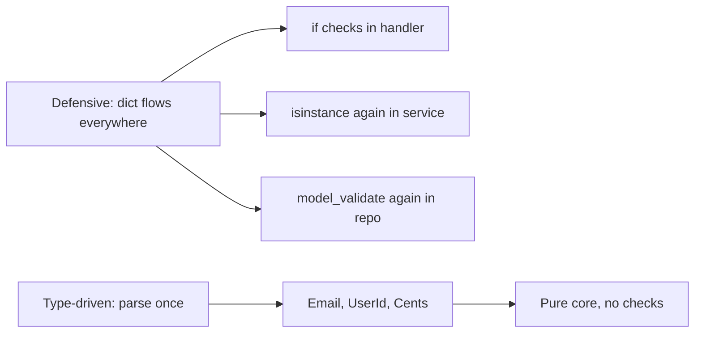
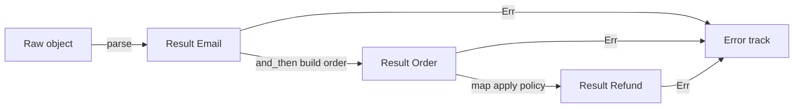
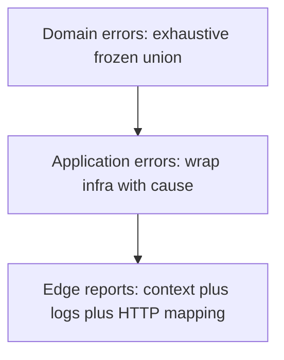
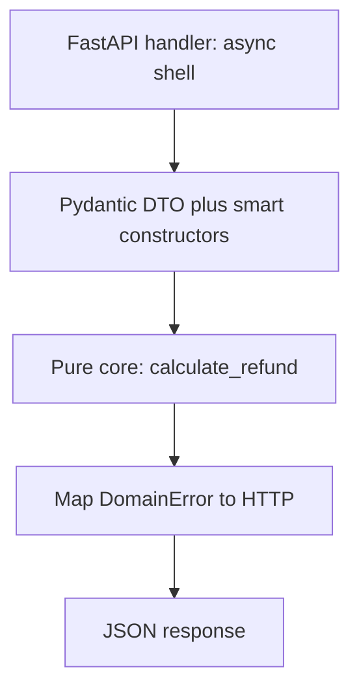

> *A junior developer validates nothing and hopes for the best.*
> *A mid-level developer validates everything, everywhere, with `if` and `isinstance` on every layer.*
> *A senior developer parses once at the boundary and lets the type system prove the rest.*
> - <cite>Software Engineering Proverb, Python edition</cite>

<!--more-->

## TL;DR

* **Validate once, at the edge.**
  Expect untrusted `dict`, `str`, and `Any` at the system boundary.
  Parse them there into proof-bearing domain types.
* **Parse, don't validate.**
  Validation keeps the weak type and returns `bool`.
  Parsing consumes the weak type and returns `Result[StrongType, Error]`.
* **Model the domain with types.**
  Use `NewType` as a stepping stone, frozen value objects with smart constructors, sum types, product types, and total functions.
  Make illegal states unrepresentable by construction.
* **Stratify errors.**
  Use an exhaustive frozen union for domain errors and wrap infrastructure failures once at the application edge.
* **Push invariants into the checker.**
  Use the type-state pattern, `mypy --strict` / `pyright`, parse-once value objects with `slots`, and a pure functional core wrapped by a thin FastAPI and Pydantic shell.
* This post is the Python chapter of the Error Handling series.
  It assumes only Python 3.12+, `mypy --strict`, and Pydantic v2, and builds every pattern from dataclasses, modules, and `Result`.

---

## 1. Introduction: The Antipattern of Defensive Python

The tempting habit in dynamic Python is to accept `dict`, `str`, and `Any` in every function and re-check them on every layer.
You validate the same payload in the handler, then in the service, then in the repository, because no signature records what was already proven.

Consider the classic primitive soup.

```python
from fastapi import FastAPI, Request
from fastapi.responses import JSONResponse

app = FastAPI()


@app.post("/refund")
async def process_refund(req: Request) -> JSONResponse:
    # ❌ Antipattern: dict/Any flows through every layer.
    try:
        body: object = await req.json()  # Raises on malformed JSON.

        # Defensive check 1: who validated the payload shape?
        if not isinstance(body, dict):
            raise ValueError("Invalid payload")

        # Defensive check 2: who validated user_id?
        if "userId" not in body or not isinstance(body["userId"], str):
            raise ValueError("Missing UserId")

        # Defensive check 3: who validated amount?
        amount = body.get("amount")
        if not isinstance(amount, (int, float)) or amount <= 0:
            raise ValueError("Invalid amount")

        user = await get_user(body["userId"])
        if user is None:
            raise ValueError("User not found")  # Expected error? Or DB bug?

        # Business logic is buried under guards.
        await gateway.refund(user.stripe_id, amount)
        return JSONResponse({"message": "Success"}, status_code=200)
    except Exception as exc:
        # Is this a 400 typo or a 500 outage? The type is lost.
        return JSONResponse({"error": str(exc)}, status_code=400)
```

This code compiles, passes review, and slowly rots the codebase.
Every function repeats the same three guards.
Every caller wonders whether the callee already checked.
Every change to the amount rule requires a shotgun edit across handlers, services, and repositories.
A more insidious variant repeats `RefundSchema.model_validate()` in each layer instead of raw `if` statements.
The shape changed but the architecture did not.
You still pay the parse cost on the hot path and you still couple business rules to infrastructure code.

The deepest cost is **paranoia**.
No signature tells you what is already proven, so you check again.
And the `except Exception -> 400` confuses a user typo with a dead database: both become `400 Bad Request`, the outage goes unpaged, and the client retries a request that will never succeed.

Python gives you a better contract, within honest limits.
Parse untrusted data once at the boundary.
Hand the core only types that are wrong by convention violation, not by accident.
Delete the duplicated guards forever.



The rest of this guide shows how to build that contract in five pillars, honestly accounting for what `mypy` and `pyright` can and cannot enforce.
Python has no physical privacy and no total compile-time proof.
The guarantee is **convention plus type checker plus one minimal runtime guard at the boundary**.

---

## 2. The Paradigm Shift: Parse, Don't Validate

Alexis King captured the core idea in [Parse, don't validate](https://lexi-lambda.github.io/blog/2019/11/05/parse-don-t-validate/) (2019).
Validation inspects a value and keeps the weak type.
Parsing consumes the weak type and produces a strong type with the proof embedded in it.
That distinction changes your architecture.

Validation has this shape.
It answers a question and throws the answer away.

```python
# Validation: checks, then keeps str.
# Every downstream function must ask again.
def is_valid_email(raw: str) -> bool:
    parts = raw.split("@")
    return len(parts) == 2 and parts[0] != "" and "." in parts[1]


def notify(raw_email: str) -> None:
    if is_valid_email(raw_email):
        # raw_email is still str here.
        # The checker learned nothing.
        # The next function must check again.
        print(f"sending to {raw_email}")
```

Parsing has a different shape.
It transforms and certifies in one move.

```python
from dataclasses import dataclass


@dataclass(frozen=True, slots=True)
class Ok[T]:
    value: T


@dataclass(frozen=True, slots=True)
class Err[E]:
    error: E


type Result[T, E] = Ok[T] | Err[E]


@dataclass(frozen=True, slots=True)
class MissingAt:
    pass


@dataclass(frozen=True, slots=True)
class EmptyLocalPart:
    pass


@dataclass(frozen=True, slots=True)
class InvalidDomain:
    reason: str


type EmailError = MissingAt | EmptyLocalPart | InvalidDomain


@dataclass(frozen=True, slots=True)
class Email:
    """Proof-bearing email. Only mintable via parse_email."""
    _value: str

    def __str__(self) -> str:
        return self._value


def parse_email(raw: object) -> Result[Email, EmailError]:
    if not isinstance(raw, str):
        return Err(MissingAt())
    trimmed = raw.strip()
    at = trimmed.find("@")
    if at < 0:
        return Err(MissingAt())
    if trimmed[:at] == "":
        return Err(EmptyLocalPart())
    if "." not in trimmed[at + 1 :]:
        return Err(InvalidDomain(reason="domain must contain a dot"))
    # The single sanctioned construction in the codebase.
    # It lives here, reviewed once, tested with Hypothesis.
    return Ok(Email(_value=trimmed))


def notify_parsed(email: Email) -> None:
    # No check here. The type is the proof.
    print(f"sending to {email}")
```

After `parse_email` succeeds, no downstream function checks the `@` again.
The type is the proof.
The signature `notify_parsed(email: Email)` documents the invariant better than any comment.

Here is the architectural boundary you want.

```text
                       SYSTEM BOUNDARY
   Untrusted outside              Parsed inside
┌──────────────────┐     ┌─────────────────────────────┐
│ dict / str / Any │     │ Email, UserId, Cents        │
│ raw JSON         │────▶│ Order, Refund, Policy       │
│ query params     │parse │ Proof-bearing domain types  │
│ DB rows          │     │ Total functions only        │
└──────────────────┘     └─────────────────────────────┘
        │                             │
   may be anything              illegal states are unrepresentable
   must be checked              must only be composed
```

The rule is simple.
Data crosses the boundary as `dict` and `str`.
It travels inside the core as `Email`, `UserId`, and `Cents`.
The parser lives in exactly one module per type.
Everything behind it composes without guards.
This is the same move Edwin Brady teaches in *Type-Driven Development with Idris*.
Let the type guide the control flow.
Reject bad programs as early as the checker allows instead of discovering them in production logs.

---

## 3. Pillar 1: Domain Modeling with NewTypes, Value Objects, and Smart Constructors

Eric Evans calls them Value Objects in *Domain-Driven Design*.
They are small, immutable, self-validating concepts with no identity beyond their value.
Python models them with a frozen dataclass plus a smart constructor.
Module discipline plus a private-by-convention field provides the barrier that the runtime cannot.

Start with `NewType` and understand why it is not enough.

```python
from typing import NewType

# NewType is zero-cost at runtime: it is the identity function.
ValidatedUserId = NewType("ValidatedUserId", str)
PositiveAmount = NewType("PositiveAmount", float)


def charge(user_id: ValidatedUserId, amount: PositiveAmount) -> None:
    print(f"charging {user_id} {amount}")


# ❌ Forges instantly. The checker trusts you, the runtime does nothing.
charge(ValidatedUserId(""), PositiveAmount(-99.0))
```

`NewType` is only a hint for the checker.
It can be forged from any module with one call.
It carries no validation logic and no place to put it.
Use it as documentation for already-parsed primitives, never as the enforcement mechanism.

The real pattern is a **frozen value object with a smart constructor**.

```python
from dataclasses import dataclass


@dataclass(frozen=True, slots=True)
class UserId:
    """Branded UUID. Mint only via UserId.parse."""
    _value: str

    @classmethod
    def parse(cls, raw: object) -> Result["UserId", str]:
        import uuid

        if not isinstance(raw, str):
            return Err("user id must be a string")
        try:
            uuid.UUID(raw)
        except ValueError:
            return Err(f"invalid uuid: {raw!r}")
        return Ok(cls(_value=raw))

    def __str__(self) -> str:
        return self._value


@dataclass(frozen=True, slots=True)
class Cents:
    """Non-negative integer money in minor units."""
    _value: int

    @classmethod
    def parse(cls, raw: object) -> Result["Cents", str]:
        if isinstance(raw, bool) or not isinstance(raw, int):
            return Err(f"amount must be an int, got {type(raw).__name__}")
        if raw <= 0:
            return Err(f"amount must be positive, got {raw}")
        return Ok(cls(_value=raw))

    def to_int(self) -> int:
        return self._value
```

Key properties:

* **`frozen=True`** makes instances hashable and non-mutating. No setter can silently break the invariant after construction.
* **`slots=True`** removes `__dict__`, cutting memory and attribute-injection surface on hot paths.
* **`_value` by convention** signals "do not construct directly". Python cannot enforce it physically, so the module boundary is disciplinary: only `parse` mints, reviewers reject direct `Email("...")` outside the defining module, and a lint rule can flag it.
* **`parse` returns `Result`**, never raises for expected bad input. Callers must handle `Err` before touching the value.

Pydantic v2 fits as the parser implementation inside the smart constructor, not as the domain.
Use `Annotated` metadata plus `field_validator` so the rule stays visible at the definition site.

```python
from typing import Annotated

from pydantic import BaseModel, ValidationError, field_validator


class _RefundInput(BaseModel):
    user_id: str
    amount_cents: int

    @field_validator("user_id")
    @classmethod
    def _must_be_uuid(cls, v: str) -> str:
        import uuid

        uuid.UUID(v)
        return v

    @field_validator("amount_cents")
    @classmethod
    def _must_be_positive(cls, v: int) -> int:
        if v <= 0:
            raise ValueError("amount_cents must be positive")
        return v


# Annotated documents the transport contract for OpenAPI and TypeAdapter.
UserIdRaw = Annotated[str, "uuid-string"]
CentsRaw = Annotated[int, "positive-int"]


@dataclass(frozen=True, slots=True)
class TrustedRefund:
    user_id: UserId
    amount: Cents


def parse_refund_request(data: object) -> Result[TrustedRefund, list[str]]:
    try:
        raw = _RefundInput.model_validate(data)
    except ValidationError as exc:
        return Err([f"{'.'.join(map(str, e['loc']))}: {e['msg']}" for e in exc.errors(include_input=False)])
    user_id = UserId.parse(raw.user_id)
    amount = Cents.parse(raw.amount_cents)
    match (user_id, amount):
        case (Ok(uid), Ok(cents)):
            return Ok(TrustedRefund(user_id=uid, amount=cents))
        case (Err(e), _):
            return Err([e])
        case (_, Err(e)):
            return Err([e])
```

The same shape scales to `Order`: a frozen product of already-proven pieces, constructible only from proven inputs.

```python
@dataclass(frozen=True, slots=True)
class Order:
    order_id: str
    user_id: UserId
    email: Email
    amount: Cents
```

Be honest about the limit.
In Rust, `pub struct Email(String)` with a private field is physically unforgeable outside the module.
In Python, any module can write `Email(_value="garbage")`.
Unforgeability here is disciplinary, not physical.
Sustain it with three rules: keep direct construction inside the defining module, forbid it elsewhere by review and lint, and never re-export the raw field name as public API.
Review every direct construction like a `sudo` invocation.

---

## 4. Pillar 2: Functional Foundations (Algebraic Data Types and Total Functions)

Paul Chiusano and Runar Bjarnason teach this in *Functional Programming in Scala*.
Model with precise types, write total functions, and compose with combinators instead of throwing across the stack.
Python unions and frozen dataclasses are algebraic data types, and `Result` is your `Either`.

Sum types enumerate exclusive alternatives.

```python
from typing import Literal


@dataclass(frozen=True, slots=True)
class Card:
    kind: Literal["card"] = "card"
    last_four: str = ""


@dataclass(frozen=True, slots=True)
class Transfer:
    kind: Literal["transfer"] = "transfer"
    iban: str = ""


@dataclass(frozen=True, slots=True)
class Cash:
    kind: Literal["cash"] = "cash"


type PaymentMethod = Card | Transfer | Cash
```

Product types combine independent facts.

```python
@dataclass(frozen=True, slots=True)
class OrderShape:
    user_id: UserId
    email: Email
    amount: Cents
    method: PaymentMethod
```

There is no `None` escape hatch, no stringly typed `method: str`, and no half-built object.
Exhaustiveness is enforced with a `Never`-taking helper. Never use the builtin `assert` for invariants: it vanishes under `python -O`.

```python
from typing import Never


def assert_never(value: Never) -> Never:
    raise AssertionError(f"unhandled case: {value!r}")


def fee_for(method: PaymentMethod) -> int:
    match method:
        case Card():
            return 30
        case Transfer():
            return 10
        case Cash():
            return 0
```

Add a new variant such as `Crypto` and `fee_for` fails type-checking until you handle it.
With `mypy --strict`, an unhandled `match` arm without a wildcard is flagged when the subject is a union.
That check break is the feature.

A total function is defined for 100 percent of its input values.
It never raises for expected cases, never returns `None` by surprise, and never hides an effect.
A partial function pretends to be total but explodes on some inputs.

```python
# ❌ Partial: raises ZeroDivisionError on zero, hides NaN and negatives.
def refund_share_partial(amount: int, parts: int) -> int:
    return amount // parts


@dataclass(frozen=True, slots=True)
class EmptyParts:
    pass


@dataclass(frozen=True, slots=True)
class NotDivisible:
    amount: int
    parts: int


type SplitError = EmptyParts | NotDivisible


# ✅ Total: every input maps to an explicit outcome.
def refund_share_total(amount: Cents, parts: int) -> Result[Cents, SplitError]:
    if parts <= 0:
        return Err(EmptyParts())
    raw = amount.to_int()
    if raw % parts != 0:
        return Err(NotDivisible(amount=raw, parts=parts))
    return Ok(Cents(_value=raw // parts))
```

Composition uses `map`, `and_then`, and `map_err` instead of nested `if` pyramids.
This is Railway Oriented Programming from Scott Wlaschin, expressed with `Result`.



```python
from typing import Callable, TypeVar

T = TypeVar("T")
U = TypeVar("U")
E = TypeVar("E")
F = TypeVar("F")


def map_result(result: Result[T, E], fn: Callable[[T], U]) -> Result[U, E]:
    match result:
        case Ok(value):
            return Ok(fn(value))
        case Err(_):
            return result


def and_then(result: Result[T, E], fn: Callable[[T], Result[U, F]]) -> Result[U, E | F]:
    match result:
        case Ok(value):
            return fn(value)
        case Err(_):
            return result


def map_err(result: Result[T, E], fn: Callable[[E], F]) -> Result[T, F]:
    match result:
        case Ok(_):
            return result
        case Err(error):
            return Err(fn(error))
```

Combinators are precise but noisy for long chains, so Python uses the manual `?` via early return.
It is the same monadic bind with identical semantics.

```python
def build_order_clean(raw_email: object, raw_amount: object) -> Result[OrderShape, str]:
    email = parse_email(raw_email)
    if isinstance(email, Err):
        return Err(f"bad email: {email.error!r}")
    amount = Cents.parse(raw_amount)
    if isinstance(amount, Err):
        return Err(f"bad amount: {amount.error}")
    user = UserId.parse("00000000-0000-4000-8000-000000000000")
    if isinstance(user, Err):  # Impossible by construction, kept for totality.
        return Err(user.error)
    return Ok(OrderShape(user_id=user.value, email=email.value, amount=amount.value, method=Cash()))
```

Both versions keep two parallel tracks.
The happy track carries values forward.
The error track short-circuits without raising.
The error type tells the handler exactly which status to return, so a 400 typo can never masquerade as a 500 outage.

---

## 5. Pillar 3: The Lisp Connection, Metaprogramming and Expression-Oriented Design

Abelson and Sussman celebrate in *Structure and Interpretation of Computer Programs* a style where programs are built from expressions that evaluate to values, and where code itself is data that programs can manipulate.
Python inherits that soul through `match`, ternaries, and comprehensions that return values you assign directly.
`Annotated` metadata is the second half: a schema object describing your domain that Pydantic inspects at runtime.

Prefer expressions over statements when building domain values.

```python
def tier_for(amount_cents: int) -> str:
    # The ternary chain is an expression assigned once.
    return "enterprise" if amount_cents > 100_000 else "standard" if amount_cents > 1_000 else "micro"


def describe_email(result: Result[Email, EmailError]) -> str:
    # match is an exhaustive expression.
    match result:
        case Ok(value):
            return f"valid: {value}"
        case Err(error):
            return f"invalid: {type(error).__name__}"


def active_emails(raw_items: list[object]) -> list[Email]:
    # The comprehension is the value. No push-to-mutable-list dance.
    return [r.value for r in (parse_email(raw) for raw in raw_items) if isinstance(r, Ok)]
```

No `result = None` dance.
No uninitialized variable.
The checker verifies that every branch yields the declared type, and `assert_never` breaks the build when the union grows.

Code as data appears in two places: `Annotated` metadata that Pydantic reads, and decorators that generate parsers.

```python
from pydantic import TypeAdapter

EmailAdapter: TypeAdapter[Email] = TypeAdapter(Email)
```

A stronger move is a small decorator that mechanizes the proof shape across twenty value objects without hiding the rule.

```python
from typing import Any


def branded_str_validator(pattern: str) -> Any:
    import re

    compiled = re.compile(pattern)

    def _validate(v: object) -> str:
        if not isinstance(v, str):
            raise ValueError("must be a string")
        cleaned = v.strip()
        if not compiled.fullmatch(cleaned):
            raise ValueError(f"must match {pattern}")
        return cleaned

    return _validate
```

Applied with the rule visible at the call site:

```python
from pydantic import BeforeValidator

SlugRaw = Annotated[str, BeforeValidator(branded_str_validator(r"[a-z0-9-]+"))]


class _SlugInput(BaseModel):
    slug: SlugRaw


@dataclass(frozen=True, slots=True)
class Slug:
    _value: str

    @classmethod
    def parse(cls, raw: object) -> Result["Slug", str]:
        try:
            cleaned = _SlugInput.model_validate({"slug": raw}).slug
        except ValidationError:
            return Err(f"invalid slug: {raw!r}")
        return Ok(cls(_value=cleaned))
```

The rule for decorators, descriptors, and metaclasses is strict: the helper may remove boilerplate around `strip`, regex, and `model_validate`, but the invariant itself must stay visible in the domain module.
If a reviewer cannot see the slug rule without opening the decorator, the abstraction has gone too far.
The rule lives in the definition, the decorator only mechanizes.

---

## 6. Pillar 4: Exhaustive, Stratified Error Handling

Not all errors belong in the same type.
Domain errors are expected business outcomes and must be exhaustive.
Infrastructure errors are operational failures and need cause chains.
Mixing them in one `str` or one bare `except Exception` destroys that signal.

Stratify into three layers.



Model domain errors as a frozen discriminated union.
Every variant is a business fact the caller must handle.

```python
@dataclass(frozen=True, slots=True)
class InvalidEmail:
    detail: EmailError


@dataclass(frozen=True, slots=True)
class InvalidAmount:
    detail: str


@dataclass(frozen=True, slots=True)
class UserNotFound:
    user_id: str


@dataclass(frozen=True, slots=True)
class InsufficientFunds:
    requested: int
    balance: int


@dataclass(frozen=True, slots=True)
class AlreadyRefunded:
    order_id: str


type DomainError = InvalidEmail | InvalidAmount | UserNotFound | InsufficientFunds | AlreadyRefunded
```

Exhaustive `match` now forces product decisions, and `assert_never` turns a forgotten case into a loud failure.

```python
def domain_to_status(error: DomainError) -> int:
    match error:
        case InvalidEmail() | InvalidAmount():
            return 400
        case UserNotFound():
            return 404
        case InsufficientFunds() | AlreadyRefunded():
            return 422


def domain_to_message(error: DomainError) -> str:
    match error:
        case InvalidEmail(detail=detail):
            return f"invalid email: {type(detail).__name__}"
        case InvalidAmount(detail=detail):
            return f"invalid amount: {detail}"
        case UserNotFound():
            return "user not found"
        case InsufficientFunds(requested=requested, balance=balance):
            return f"insufficient funds: requested {requested}, balance {balance}"
        case AlreadyRefunded(order_id=order_id):
            return f"refund already processed for order {order_id}"
```

Wrap infrastructure errors once at the application layer with an explicit cause.

```python
@dataclass(frozen=True, slots=True)
class DbError:
    cause: str


@dataclass(frozen=True, slots=True)
class GatewayError:
    cause: str


type AppError = DomainError | DbError | GatewayError


def app_to_status(error: AppError) -> int:
    match error:
        case DbError() | GatewayError():
            return 500
        case _:
            # Narrowed to DomainError by exhaustion above.
            domain: DomainError = error
            return domain_to_status(domain)
```

Add context and logs only at the edge, where humans read them.

```python
import logging

logger = logging.getLogger(__name__)


def report_app_error(error: AppError) -> tuple[int, dict[str, str]]:
    # Domain is never imported by a logger module; the shell owns this call.
    match error:
        case DbError(cause=cause) | GatewayError(cause=cause):
            logger.error("infrastructure failure", extra={"kind": type(error).__name__, "cause": cause})
            return 500, {"error": "internal error"}
        case _:
            domain: DomainError = error
            return domain_to_status(domain), {"error": domain_to_message(domain)}
```

Three rules keep the stratification honest.
Never return a bare `str` from a domain function: name the union instead.
Never `raise` for domain outcomes: return `Result[T, DomainError]`.
Never let the domain import the HTTP framework or the logger: the dependency arrow points inward from shell to core, never outward.
Reserve `raise` for the edge and for internal bug assertions that should become 500s.

---

## 7. Pillar 5: Compile-Time Invariants with the Type-State Pattern

Some invariants are not about single values but about sequences.
An order cannot be paid before it is submitted.
A refund cannot be issued twice.
Runtime booleans like `is_submitted` can be forgotten or checked in the wrong order.
Type-state encodes the workflow in generics so wrong sequences are rejected by `mypy` or `pyright`.

This is Brady-style type-driven design applied to business lifecycles.

```python
from typing import Generic


@dataclass(frozen=True, slots=True)
class Draft:
    stage: Literal["draft"] = "draft"


@dataclass(frozen=True, slots=True)
class Submitted:
    stage: Literal["submitted"] = "submitted"


@dataclass(frozen=True, slots=True)
class Paid:
    stage: Literal["paid"] = "paid"


S = TypeVar("S", bound=object)


@dataclass(frozen=True, slots=True)
class OrderState(Generic[S]):
    order_id: str
    amount: Cents
    state: S


def create_draft(order_id: str, amount: Cents) -> OrderState[Draft]:
    return OrderState(order_id=order_id, amount=amount, state=Draft())


def submit_order(order: OrderState[Draft]) -> OrderState[Submitted]:
    # Conceptually consumes the draft: callers should drop the old binding.
    return OrderState(order_id=order.order_id, amount=order.amount, state=Submitted())


def pay_order(order: OrderState[Submitted]) -> OrderState[Paid]:
    return OrderState(order_id=order.order_id, amount=order.amount, state=Paid())


# Only paid orders expose a receipt.
def receipt_for(order: OrderState[Paid]) -> str:
    return f"paid {order.amount.to_int()} for {order.order_id}"
```

Correct usage flows through the checker.

```python
def checkout_demo(amount: Cents) -> str:
    draft = create_draft("ord_1", amount)
    submitted = submit_order(draft)
    paid = pay_order(submitted)
    return receipt_for(paid)
```

Illegal transitions are static errors.

```python
def illegal_demo(amount: Cents) -> None:
    draft = create_draft("ord_1", amount)
    paid = pay_order(draft)  # type: ignore[arg-type] -- mypy: needs OrderState[Submitted]
    _ = paid
```

Run `mypy --strict` and the second line fails with `Argument 1 has incompatible type OrderState[Draft]; expected OrderState[Submitted]`.
`pyright` reports the same mismatch.
Keep a minimal runtime net for data rehydrated from the database, where the checker cannot see the row:

```python
def rehydrate_paid(order_id: str, amount: Cents, stage: object) -> Result[OrderState[Paid], str]:
    if stage != "paid":
        return Err(f"cannot rehydrate paid order from stage {stage!r}")
    return Ok(OrderState(order_id=order_id, amount=amount, state=Paid()))
```

Python cannot destroy the old `draft` binding the way Rust moves it.
`submit_order(draft)` does not invalidate `draft` at runtime.
Sustain the pattern by discipline: prefer rebinding (`order = submit_order(order)`), keep transition functions in a small module, and never hand-forge `OrderState[Paid]` outside it.
Honesty matters here: the checker proves the new value has the right stage, but only code review proves the old binding was dropped.

Use type-state when the sequence matters and the cost of a wrong transition is high: payments, provisioning, publishing, and multi-step onboarding.
A good heuristic is two or more ordered states with different available operations.
Do not use it for every boolean, or generic noise will drown the domain.
A single `is_archived` flag with one branch is a runtime check, not a lifecycle.

---

## 8. Advanced Engineering: Parse-Once Performance and Property-Based Testing

`NewType` is a genuinely zero-cost abstraction: it is the identity function at runtime.
Frozen dataclasses with `slots` are close: one small allocation, no `__dict__`, no per-instance validators after construction.
The proof lives in the type and in the single `parse` call, not in repeated checks.

That property dictates the performance rule: parse once at the edge, then pass the proven value by reference.
Never call `model_validate` again inside the service and the repository for a value that is already a `Cents` or `Email`.

```python
# ❌ Wasteful: re-parsing a proven value on the hot path.
from pydantic import TypeAdapter

AmountAdapter = TypeAdapter(int)


def charge_twice(raw_amount: object) -> None:
    first = Cents.parse(raw_amount)
    if isinstance(first, Err):
        return
    # ... later, in another layer ...
    second = Cents.parse(first.value.to_int())  # Redundant work.
    if isinstance(second, Err):
        return


# ✅ Parse once, thread the brand.
def charge_once(raw_amount: object) -> None:
    parsed = Cents.parse(raw_amount)
    if isinstance(parsed, Err):
        return
    apply_charge(parsed.value)  # No second parse. Cents is already proven.


def apply_charge(_amount: Cents) -> None:
    # Hot path: zero checks, zero extra allocations beyond the object itself.
    pass
```

Parsing logic deserves stronger tests than hand-picked examples.
Property-based testing with [Hypothesis](https://hypothesis.readthedocs.io/) throws hundreds of synthetic inputs at your smart constructor, including Unicode, control characters, and pathological lengths.

```python
from hypothesis import example, given
from hypothesis import strategies as st

email_strategy = st.tuples(
    st.text(alphabet="abcdefghijklmnopqrstuvwxyz0123456789", min_size=1, max_size=16),
    st.text(alphabet="abcdefghijklmnopqrstuvwxyz", min_size=1, max_size=8),
    st.text(alphabet="abcdefghijklmnopqrstuvwxyz", min_size=2, max_size=4),
).map(lambda parts: f"{parts[0]}@{parts[1]}.{parts[2]}")


@given(email_strategy)
def test_valid_shaped_emails_always_parse(raw: str) -> None:
    assert isinstance(parse_email(raw), Ok)


@given(st.text(min_size=1, max_size=32).filter(lambda s: "@" not in s))
def test_missing_at_never_parses(raw: str) -> None:
    assert isinstance(parse_email(raw), Err)


@given(st.text(alphabet=st.characters()))
def test_parse_never_raises_on_arbitrary_unicode(raw: str) -> None:
    # Any input must map to Ok or Err, never raise.
    assert isinstance(parse_email(raw), (Ok, Err))


@given(st.text(alphabet="abcdefghijklmnopqrstuvwxyz", min_size=1, max_size=8))
@example("  ALICE@Example.COM  ")
def test_parsed_value_is_trimmed_input(local: str) -> None:
    raw = f"  {local}@example.com  "
    result = parse_email(raw)
    assert isinstance(result, Ok)
    assert str(result.value) == raw.strip()
```

Run with `pytest` and keep the failing seed.
Hypothesis shrinks failures to the minimal reproducer and prints the seed.
Check that seed in with `@example` as a regression test.
Your parser gains mathematical robustness instead of anecdotal coverage: valid shapes always pass, invalid shapes always fail, hostile Unicode never raises, and normalization round-trips.

---

## 9. Architecture Pattern: Functional Core, Imperative Shell (FastAPI and Pydantic)

Gary Bernhardt summarized the healthiest architecture in one line: Functional Core, Imperative Shell.
The core is pure, synchronous, and total.
It takes domain types in and returns `Result` out.
No `await`, no sockets, no clock reads, no FastAPI imports.
The shell is thin and effectful.
It speaks HTTP and JSON, parses at the boundary, calls the core, and maps typed errors to status codes.



Define the pure core first.

```python
# core/refunds.py - pure, sync, no IO.
@dataclass(frozen=True, slots=True)
class RefundPolicy:
    max_cents: int


@dataclass(frozen=True, slots=True)
class Refund:
    order_id: str
    amount: Cents


@dataclass(frozen=True, slots=True)
class OrderSnapshot:
    order_id: str
    balance: int
    already_refunded: bool


def calculate_refund(
    order: OrderSnapshot,
    requested: Cents,
    policy: RefundPolicy,
) -> Result[Refund, DomainError]:
    # Pure function: all inputs are already proven types.
    if order.already_refunded:
        return Err(AlreadyRefunded(order_id=order.order_id))
    if requested.to_int() > order.balance:
        return Err(InsufficientFunds(requested=requested.to_int(), balance=order.balance))
    if requested.to_int() > policy.max_cents:
        return Err(InvalidAmount(detail="exceeds policy maximum"))
    return Ok(Refund(order_id=order.order_id, amount=requested))
```

Pydantic DTOs stay dumb and raw in the shell.

```python
# shell/dto.py - raw transport shapes, no business rules.
class RefundRequestDto(BaseModel):
    order_id: str
    email: str
    amount_cents: int
```

The FastAPI handler bridges the two worlds and nothing more.

```python
# shell/handlers.py - thin async shell around the pure core.
from fastapi import FastAPI
from fastapi.responses import JSONResponse
from pydantic import ValidationError

shell_app = FastAPI()


@shell_app.post("/refund")
async def refund_handler(payload: object) -> JSONResponse:
    # 1. Parse at the boundary: unknown JSON becomes proven brands.
    try:
        shaped = RefundRequestDto.model_validate(payload)
    except ValidationError as exc:
        return JSONResponse({"error": exc.errors(include_input=False)}, status_code=400)

    email = parse_email(shaped.email)
    if isinstance(email, Err):
        err: DomainError = InvalidEmail(detail=email.error)
        return JSONResponse({"error": domain_to_message(err)}, status_code=domain_to_status(err))

    amount = Cents.parse(shaped.amount_cents)
    if isinstance(amount, Err):
        err = InvalidAmount(detail=amount.error)
        return JSONResponse({"error": domain_to_message(err)}, status_code=domain_to_status(err))

    # 2. Rehydrate minimal state, then call the pure core.
    order = OrderSnapshot(order_id=shaped.order_id, balance=10_000, already_refunded=False)
    refund = calculate_refund(order, amount.value, RefundPolicy(max_cents=500_000))
    if isinstance(refund, Err):
        return JSONResponse(
            {"error": domain_to_message(refund.error)},
            status_code=domain_to_status(refund.error),
        )

    # 3. Map to transport. No business logic here.
    return JSONResponse(
        {"orderId": refund.value.order_id, "refundedCents": refund.value.amount.to_int()},
        status_code=200,
    )
```

Testing splits cleanly.
Unit test `calculate_refund` with plain structs and no mocks: it is sync and deterministic.
Integration test the handler with real JSON payloads over HTTP: malformed JSON, bad email, negative amount, and double refund each assert their status code.
The core stays fast because effects live only in the shell.

---

## 10. Pattern Reference: Defensive Python vs. Type-Driven Python

| Concept | Defensive Python | Type-Driven Python | Architectural Benefit |
|---|---|---|---|
| Boundary parsing | `if` and `isinstance` repeated in every function over raw `dict` | `parse_email(object)` returns `Result[Email, EmailError]` once, then moves the proof in the type | Single source of truth for the invariant, zero repeated checks in the core |
| Branded / value types | Plain `str` aliases, forgeable anywhere with no distinction | `NewType` for docs plus frozen `slots` value objects minted only by `parse`, direct construction banned by review | Disciplinary unforgeability despite dynamic runtime, enforced by modules and checker |
| Totality | `amount // parts` and `row["key"]` that raise or yield `None` on edge inputs | `Cents` plus `Result` forces explicit handling of zero, negatives, and missing keys under `mypy --strict` | Edge cases become check-time obligations instead of production incidents |
| Composition | Nested `if` pyramids with early `raise` at every level | `and_then`, `map_result`, `map_err`, and manual early return on the `Result` railway | Linear happy path with a typed error track, errors classified by type |
| Domain errors | `raise ValueError(str)` messages, caught as `Exception`, easy to misclassify | Exhaustive `DomainError` union, `match` plus `assert_never` must cover every variant | Callers cannot ignore a new business case, refactors break loudly at check time |
| App edge errors | One catch-all `except Exception` mapping everything to 400 | `AppError` wrapping infra with `cause`, shell mapping domain to 4xx and infra to 500 with logs | Rich operational context where humans read logs, precise types where code branches |
| Workflow state | Boolean flags like `is_paid` checked with `if` before each action | Type-state `OrderState[Draft]` to `OrderState[Paid]` with stage generics | Illegal transitions are checker errors, stage-specific methods disappear by type |
| Hot-path cost | `model_validate` repeated in handler, service, and repo for the same value | Parse once at the edge, thread `slots` value objects with no revalidation | Proof without performance tax, ideal for routers and workers |
| Testing | Hand-picked unit cases with a few literal strings | Hypothesis with hundreds of Unicode and adversarial inputs plus shrinking and `@example` | Mathematical confidence in parsers, minimal reproducers on failure |
| Architecture | Handlers mix Pydantic parsing, DB calls, and business rules with `async` everywhere | Pure sync core with `calculate_refund` plus thin async FastAPI and Pydantic shell | Core is trivially testable and portable, effects are isolated and auditable |

Keep this table as a review checklist.
If a row drifts left, push the proof back into the type.

---

## 11. Summary and Architectural Rules of Thumb

**1. Parse once at the boundary, never validate in the core.**
Raw `dict` and `str` enter through HTTP or queue consumers and become `Email`, `UserId`, and `Cents` immediately.
Core functions accept only proven types and contain zero `is_valid` checks and zero repeated `model_validate` calls.

**2. Make illegal states unrepresentable, then delete the guards.**
Prefer unions for alternatives, frozen dataclasses for combinations, and value objects with smart constructors for invariants.
If a rule lives in a type, remove every `if` that rechecks it downstream.
Remember the Python caveat: privacy is disciplinary, so guard direct construction with module boundaries and `mypy --strict`.

**3. Write total functions and compose on the railway.**
Return `Result` for every partial operation, handle every variant, and chain with early return plus `map_result` and `and_then`.
Reserve `raise` for truly impossible bugs and infrastructure edges, never for user input or business outcomes.

**4. Stratify errors by audience.**
Domain functions expose exhaustive `DomainError` unions.
Applications wrap infra failures once with `cause`.
Edges add human context, logs, and HTTP mapping.
Never leak bare `Exception` strings from domain APIs, and never let the domain import the framework.

**5. Push workflows and costs into the type system.**
Use type-state with stage generics for ordered lifecycles with two or more distinct operations.
Use `slots` value objects on hot paths instead of repeated Pydantic parsing.
Cover parsers with Hypothesis and keep the FastAPI shell thin around a pure functional core.

Stop defending every function against data you already checked.
Prove it once, encode it in a type, and let the checker stand guard while you model the domain.
This post is part of the Error Handling series.
Continue with [Stop Validating Everywhere: An Architectural Guide to Error Handling, Invariants, and Functional Domain Modeling in TypeScript]() and [Stop Validating Everywhere: An Architectural Guide to Error Handling, Invariants, and Functional Domain Modeling in Rust]().

---

### Bibliography

* Alexis King, *Parse, don't validate* (2019).
Quotation: validation preserves the weak type, parsing produces a strong type.
* Paul Chiusano and Runar Bjarnason, *Functional Programming in Scala* (2014).
Quotation: prefer total functions, algebraic data types, and effect-free composition.
* Harold Abelson and Gerald Jay Sussman, *Structure and Interpretation of Computer Programs* (1996).
Quotation: code is data, build embedded languages to express domain intent.
* Eric Evans, *Domain-Driven Design* (2003).
Quotation: protect invariants inside aggregates with value objects and explicit boundaries.
* Edwin Brady, *Type-Driven Development with Idris* (2017).
Quotation: use types as a design tool to guide execution and reject invalid programs early.
* Scott Wlaschin, *Railway Oriented Programming* (2013).
Quotation: model success and error as parallel tracks composed with monadic bind.
* Gary Bernhardt, *Functional Core, Imperative Shell* (2012).
Quotation: keep the domain pure and push IO to a thin outer shell.
