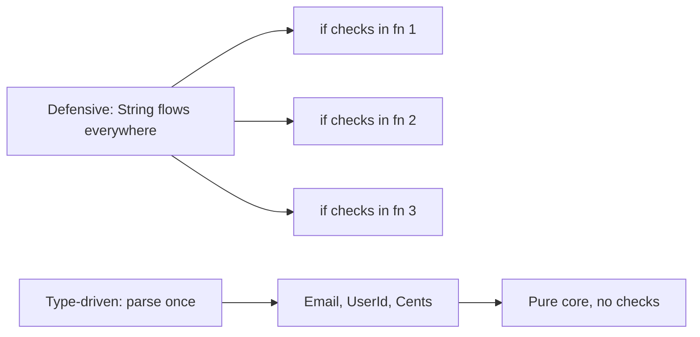
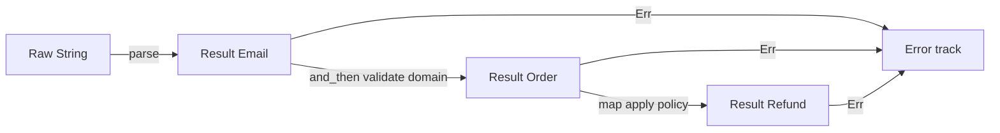
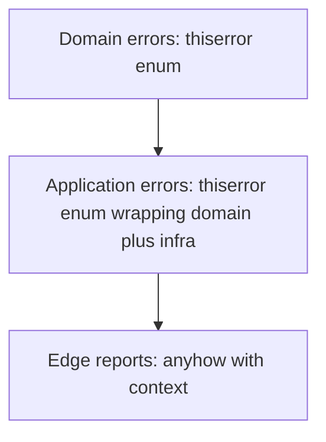
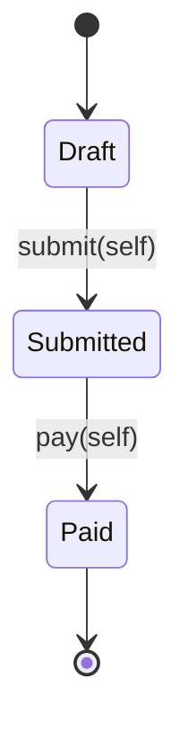
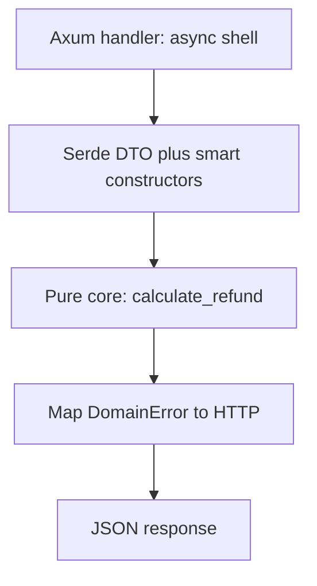

> *A junior developer validates nothing and hopes for the best.*
> *A mid-level developer validates everything, everywhere, with `if` statements on every layer.*
> *A senior developer parses once at the boundary and lets the type system prove the rest.*
> - <cite>Software Engineering Proverb, Rust edition</cite>

<!--more-->

## TL;DR

* **Validate once, at the edge.**
Expect untrusted `String`, `i32`, and JSON at the system boundary.
Parse them there into proof-bearing domain types.
* **Parse, don't validate.**
Validation keeps the weak type and returns `bool`.
Parsing consumes the weak type and returns `Result<StrongType, Error>`.
* **Model the domain with types.**
Use newtypes, smart constructors, sum types, product types, and total functions.
Make illegal states unrepresentable by construction.
* **Stratify errors.**
Use `thiserror` for exhaustive domain errors in libraries and `anyhow` with context only at the application edge.
* **Push invariants into the compiler.**
Use the type-state pattern, zero-cost borrowed newtypes, and a pure functional core wrapped by a thin Axum and Serde shell.
* This post is the Rust chapter of the Error Handling series.
If you come from TypeScript, start with [Stop Validating Everywhere in TypeScript]().
If you come from Python, compare with [Stop Validating Everywhere in Python]().

---

## 1. Introduction: The Antipattern of Defensive Rust

If you come from TypeScript or Python, you bring a survival habit with you.
You check every input in every function because the type system erased the proof two calls ago.
In Rust, copying that habit is expensive and unnecessary.
The compiler is not a syntax checker.
It is a compile-time theorem prover, and defensive `if` chains waste it.

Consider the classic primitive soup.

```rust
// ❌ Antipattern: primitives flow through every layer.
use std::collections::HashMap;

pub struct Database {
    balances: HashMap<String, i64>,
}

impl Database {
    pub fn get_balance(&self, user_id: &str) -> Option<i64> {
        self.balances.get(user_id).copied()
    }
}

pub fn process_refund(
    db: &Database,
    user_id: String,
    email: String,
    amount_cents: i32,
) -> Result<String, String> {
    // Defensive check 1: who validated user_id?
    if user_id.trim().is_empty() {
        return Err("invalid user_id".to_string());
    }
    // Defensive check 2: who validated email?
    if !email.contains('@') {
        return Err("invalid email".to_string());
    }
    // Defensive check 3: who validated amount?
    if amount_cents <= 0 {
        return Err("invalid amount".to_string());
    }
    // Business logic is buried under guards.
    let balance = db
        .get_balance(&user_id)
        .ok_or_else(|| "user not found".to_string())?;
    if balance < amount_cents as i64 {
        return Err("insufficient funds".to_string());
    }
    Ok(format!("refunded {amount_cents} to {user_id}"))
}

pub fn send_receipt(user_id: String, email: String, amount_cents: i32) -> Result<(), String> {
    // Same three checks, copied again.
    if user_id.trim().is_empty() {
        return Err("invalid user_id".to_string());
    }
    if !email.contains('@') {
        return Err("invalid email".to_string());
    }
    if amount_cents <= 0 {
        return Err("invalid amount".to_string());
    }
    // ... send email ...
    Ok(())
}
```

This code compiles, passes review, and slowly rots the codebase.
Every function repeats the same three guards.
Every caller wonders if the callee already checked.
Every change to the email rule requires a shotgun edit across layers.
Performance pays for repeated scanning and branching on the hot path.
Coupling grows because business rules about identity and money leak into infrastructure code.
The deepest cost is paranoia.
No signature tells you what is already proven, so you check again.

Rust gives you a better contract.
Parse untrusted data once at the boundary.
Hand the core only types that cannot be wrong.
Delete the duplicated guards forever.



The rest of this guide shows how to build that contract in five pillars.

---

## 2. The Paradigm Shift: Parse, Don't Validate

Alexis King captured the core idea in [Parse, don't validate](https://lexi-lambda.github.io/blog/2019/11/05/parse-don-t-validate/) (2019).
Validation inspects a value and keeps the weak type.
Parsing consumes the weak type and produces a strong type with the proof embedded in it.
That distinction changes your architecture.

Validation has this shape.
It answers a question and throws the answer away.

```rust
// Validation: checks, then keeps String.
pub fn is_valid_email(raw: &str) -> bool {
    let parts: Vec<&str> = raw.split('@').collect();
    parts.len() == 2 && !parts[0].is_empty() && parts[1].contains('.')
}

pub fn notify(raw_email: String) {
    if is_valid_email(&raw_email) {
        // raw_email is still String here.
        // The compiler learned nothing.
        // The next function must check again.
        println!("sending to {raw_email}");
    }
}
```

Parsing has a different shape.
It transforms and certifies in one move.

```rust
// Parsing: consumes String, produces proof-bearing Email.
#[derive(Debug, Clone, PartialEq, Eq)]
pub struct Email(String);

#[derive(Debug, Clone, PartialEq, Eq)]
pub enum EmailError {
    MissingAt,
    EmptyLocalPart,
    InvalidDomain,
}

impl Email {
    pub fn parse(raw: String) -> Result<Self, EmailError> {
        let raw = raw.trim().to_string();
        let (_, domain) = raw.split_once('@').ok_or(EmailError::MissingAt)?;
        let local = raw.split('@').next().unwrap_or_default();
        if local.is_empty() {
            return Err(EmailError::EmptyLocalPart);
        }
        if !domain.contains('.') {
            return Err(EmailError::InvalidDomain);
        }
        Ok(Self(raw))
    }

    pub fn as_str(&self) -> &str {
        &self.0
    }
}
```

After `Email::parse` succeeds, no downstream function checks the `@` again.
The type is the proof.
The signature `fn notify(email: Email)` documents the invariant better than any comment.

Here is the architectural boundary you want.

```text
                         SYSTEM BOUNDARY
   Untrusted outside              Parsed inside
┌──────────────────┐     ┌─────────────────────────────┐
│ String           │     │ Email, UserId, Cents        │
│ i32              │────▶│ Order, Refund, Policy       │
│ serde_json::Value│parse │ Proof-bearing domain types  │
│ Raw query params │     │ Total functions only        │
└──────────────────┘     └─────────────────────────────┘
        │                             │
   may be anything              illegal states do not compile
   must be checked              must only be composed
```

The rule is simple.
Data crosses the boundary as `String` and `i32`.
It travels inside the core as `Email`, `UserId`, and `Cents`.
The parser lives in exactly one module per type.
Everything behind it composes without guards.

This is the same move Edwin Brady teaches in *Type-Driven Development with Idris*.
Let the type guide the control flow.
Reject bad programs during compilation instead of discovering them in production logs.

---

## 3. Pillar 1: Domain Modeling with Newtypes, Value Objects, and Smart Constructors

Eric Evans calls them Value Objects in *Domain-Driven Design*.
They are small, immutable, self-validating concepts with no identity beyond their value.
Rust models them with the newtype pattern plus a smart constructor.
Module privacy makes the guarantee physical, not social.

The trick is the private field.

```rust
// src/domain/email.rs
use std::fmt;
use std::str::FromStr;

#[derive(Debug, Clone, PartialEq, Eq, Hash)]
pub struct Email(String);

#[derive(Debug, Clone, PartialEq, Eq)]
pub enum EmailError {
    MissingAt,
    EmptyLocalPart,
    InvalidDomain,
}

impl std::fmt::Display for EmailError {
    fn fmt(&self, f: &mut fmt::Formatter<'_>) -> fmt::Result {
        match self {
            Self::MissingAt => write!(f, "email must contain @"),
            Self::EmptyLocalPart => write!(f, "email local part is empty"),
            Self::InvalidDomain => write!(f, "email domain must contain ."),
        }
    }
}

impl std::error::Error for EmailError {}

impl Email {
    /// Smart constructor: the only way to build an Email.
    pub fn parse(raw: String) -> Result<Self, EmailError> {
        let trimmed = raw.trim().to_string();
        let (local, domain) = trimmed.split_once('@').ok_or(EmailError::MissingAt)?;
        if local.is_empty() {
            return Err(EmailError::EmptyLocalPart);
        }
        if !domain.contains('.') {
            return Err(EmailError::InvalidDomain);
        }
        Ok(Self(trimmed))
    }

    pub fn as_str(&self) -> &str {
        &self.0
    }
}

impl FromStr for Email {
    type Err = EmailError;

    fn from_str(s: &str) -> Result<Self, Self::Err> {
        Self::parse(s.to_string())
    }
}

impl fmt::Display for Email {
    fn fmt(&self, f: &mut fmt::Formatter<'_>) -> fmt::Result {
        f.write_str(&self.0)
    }
}

impl AsRef<str> for Email {
    fn as_ref(&self) -> &str {
        &self.0
    }
}
```

Because the inner `String` is private and the struct lives in its own module, no other module can write `Email("garbage".to_string())`.
The compiler rejects it.
The only path is `Email::parse`, which returns `Result`.
This is the Aggregate boundary from DDD, enforced by `mod`, not by discipline.

Apply the same pattern to every primitive that carries a rule.

```rust
use std::num::TryFromIntError;

#[derive(Debug, Clone, Copy, PartialEq, Eq, PartialOrd, Ord, Hash)]
pub struct Cents(u64);

#[derive(Debug, Clone, PartialEq, Eq)]
pub enum MoneyError {
    NonPositive,
}

impl Cents {
    pub fn parse(raw: i64) -> Result<Self, MoneyError> {
        if raw <= 0 {
            return Err(MoneyError::NonPositive);
        }
        Ok(Self(raw as u64))
    }

    pub fn value(self) -> u64 {
        self.0
    }
}

impl TryFrom<i64> for Cents {
    type Error = MoneyError;

    fn try_from(value: i64) -> Result<Self, Self::Error> {
        Self::parse(value)
    }
}

#[derive(Debug, Clone, PartialEq, Eq, Hash)]
pub struct UserId(String);

#[derive(Debug, Clone, PartialEq, Eq)]
pub enum UserIdError {
    Empty,
}

impl UserId {
    pub fn parse(raw: String) -> Result<Self, UserIdError> {
        let trimmed = raw.trim().to_string();
        if trimmed.is_empty() {
            return Err(UserIdError::Empty);
        }
        Ok(Self(trimmed))
    }
}
```

Now your core signatures prove their preconditions.

```rust
pub fn process_refund_typed(
    db: &Database,
    user_id: UserId,
    email: Email,
    amount: Cents,
) -> Result<String, DomainError> {
    // No email check here.
    // No amount check here.
    // The types already proved it.
    let _ = email;
    let balance = db
        .get_balance(user_id.as_str())
        .ok_or(DomainError::UserNotFound)?;
    if balance < amount.value() as i64 {
        return Err(DomainError::InsufficientFunds);
    }
    Ok(format!("refunded {} to {}", amount.value(), user_id.as_str()))
}
```

You still need `as_str` or `Display` accessors, and that is intentional.
Callers can read the value but cannot forge it.
That is encapsulation without runtime cost.

---

## 4. Pillar 2: Functional Foundations (Algebraic Data Types and Total Functions)

Paul Chiusano and Runar Bjarnason teach this in *Functional Programming in Scala*, often called the Red Book.
Model with precise types, write total functions, and compose with combinators instead of branching on exceptions.
Rust enums and structs are algebraic data types, and `Result` is your `Either` monad.

Sum types enumerate exclusive alternatives.

```rust
#[derive(Debug, Clone, PartialEq, Eq)]
pub struct CardDetails {
    pub last_four: String,
}

#[derive(Debug, Clone, PartialEq, Eq)]
pub struct TransferDetails {
    pub iban: String,
}

#[derive(Debug, Clone, PartialEq, Eq)]
pub enum PaymentMethod {
    Card(CardDetails),
    Transfer(TransferDetails),
    Cash,
}
```

Product types combine independent facts.

```rust
use crate::domain::email::Email;

#[derive(Debug, Clone, PartialEq, Eq)]
pub struct Order {
    pub id: UserId,
    pub email: Email,
    pub amount: Cents,
    pub method: PaymentMethod,
}
```

There is no null, no undefined, and no stringly typed method field.
A `match` on `PaymentMethod` must handle every arm or the build fails.
That exhaustiveness is a proof about your business branches.

A total function is defined for 100 percent of its input values.
It never panics, never blocks on hidden input, and never throws across the stack.
A partial function pretends to be total but explodes on some inputs.

```rust
// ❌ Partial: panics on zero and on overflow in debug builds.
pub fn refund_share_partial(amount: u64, parts: u64) -> u64 {
    amount / parts
}

// ✅ Total: every input maps to an explicit outcome.
#[derive(Debug, Clone, PartialEq, Eq)]
pub enum SplitError {
    EmptyParts,
}

pub fn refund_share_total(amount: Cents, parts: u64) -> Result<Cents, SplitError> {
    if parts == 0 {
        return Err(SplitError::EmptyParts);
    }
    // Integer division is safe here because parts is nonzero.
    Ok(Cents::from_raw(amount.value() / parts))
}
```

This example assumes a crate-private `from_raw` used only after proof, or you can return `u64` directly.
The point stands.
Total signatures force callers to confront edge cases at compile time.

Composition uses `map`, `and_then`, and `map_err` instead of nested `if` pyramids.
This is Railway Oriented Programming from Scott Wlaschin, expressed with `Result`.



```rust
use crate::domain::email::{Email, EmailError};

#[derive(Debug, Clone, PartialEq, Eq)]
pub enum OrderError {
    Email(EmailError),
    Money(MoneyError),
}

pub fn build_order(raw_email: String, raw_amount: i64) -> Result<Order, OrderError> {
    Email::parse(raw_email)
        .map_err(OrderError::Email)
        .and_then(|email| {
            Cents::parse(raw_amount)
                .map_err(OrderError::Money)
                .map(|amount| (email, amount))
        })
        .map(|(email, amount)| Order {
            id: UserId::parse("placeholder".to_string()).expect("static is valid"),
            email,
            amount,
            method: PaymentMethod::Cash,
        })
}
```

Better yet, use the `?` operator, which is monadic bind with early return on the error track.

```rust
pub fn build_order_clean(raw_email: String, raw_amount: i64) -> Result<Order, OrderError> {
    let email = Email::parse(raw_email).map_err(OrderError::Email)?;
    let amount = Cents::parse(raw_amount).map_err(OrderError::Money)?;
    Ok(Order {
        id: UserId::parse("placeholder".to_string()).expect("static is valid"),
        email,
        amount,
        method: PaymentMethod::Cash,
    })
}
```

Both versions keep two parallel tracks.
The happy track carries values forward.
The error track short-circuits without exceptions.
No `try` and `catch` can silently mix a 400 typo with a 500 outage, because every error is a value with a type.

---

## 5. Pillar 3: The Lisp Connection, Metaprogramming and Expression-Oriented Design

Rust inherits its expression soul from the Lisp, Scheme, and ML tradition that Abelson and Sussman celebrate in *Structure and Interpretation of Computer Programs*.
Almost everything evaluates to a value.
That lets you assign validated results directly instead of mutating temporaries through statement chains.

```rust
// Expression-driven domain construction.
use crate::domain::email::EmailError;

pub fn classify(raw: &str) -> Result<Email, EmailError> {
    let email: Email = match Email::parse(raw.to_string()) {
        Ok(valid) => valid,
        Err(EmailError::MissingAt) => {
            // Repair path stays an expression too.
            Email::parse(format!("{raw}@example.com"))?
        }
        Err(other) => return Err(other),
    };
    Ok(email)
}

pub fn label(amount: Cents) -> &'static str {
    // if is an expression, not a statement.
    let tier = if amount.value() > 1_000_00 {
        "enterprise"
    } else if amount.value() > 10_00 {
        "standard"
    } else {
        "micro"
    };
    tier
}
```

No `let mut result;` dance.
No uninitialized variable.
The compiler checks that every branch yields the declared type.

The deeper Lisp idea is code as data.
SICP teaches you to build embedded domain languages where programs manipulate programs.
Rust procedural macros do this at the abstract syntax tree level during compilation.
A macro reads your struct definition as data and emits the smart constructor, error type, and trait impls for you.

The `nutype` crate is the pragmatic version of that idea.
You declare the invariant, the macro generates the boilerplate.

```rust
// AST-level abstraction: declare the rule, derive the proof.
use nutype::nutype;

#[nutype(validate(greater > 0), derive(Debug, Clone, Copy, PartialEq, Eq))]
pub struct CentsNutype(i64);

#[nutype(validate(not_empty, len_char_max = 254), derive(Debug, Clone, PartialEq, Eq))]
pub struct EmailNutype(String);
```

`nutype` expands to a private-field newtype with `try_from`, `FromStr`, `Display`, `AsRef`, and a precise error enum.
You get the same module privacy guarantee as a hand-written smart constructor without repeating it twenty times.

When the invariant is truly domain specific, write your own derive or attribute macro.
The shape is always the same.
Parse the input `TokenStream` into `syn` types, validate the AST, and emit a `quote` output with the constructor.

```rust
// Conceptual sketch of a custom smart-constructor macro.
// Real proc macros live in a separate -macros crate.
use proc_macro::TokenStream;
use quote::quote;
use syn::{DeriveInput, parse_macro_input};

#[proc_macro_derive(NonEmptyString)]
pub fn non_empty_string(input: TokenStream) -> TokenStream {
    let ast = parse_macro_input!(input as DeriveInput);
    let name = &ast.ident;
    let expanded = quote! {
        impl #name {
            pub fn parse(raw: String) -> Result<Self, crate::domain::NonEmptyError> {
                if raw.trim().is_empty() {
                    return Err(crate::domain::NonEmptyError::Empty);
                }
                Ok(Self(raw.trim().to_string()))
            }
        }
    };
    TokenStream::from(expanded)
}
```

Use macros to remove repetition, never to hide business rules.
The invariant must stay visible in the type definition.
The macro only mechanizes the proof.

---

## 6. Pillar 4: Exhaustive, Stratified Error Handling (`thiserror` vs `anyhow`)

Not all errors belong in the same type.
Domain errors are expected business outcomes and must be exhaustive.
Infrastructure errors are operational failures and need context and backtraces.
Mixing them in one `String` or one boxed error destroys that signal.

Stratify into three layers.



Model domain errors with `thiserror`.
Every variant is a business fact the caller must handle.

```rust
// src/domain/error.rs
use thiserror::Error;

use crate::domain::email::EmailError;

#[derive(Debug, Error, PartialEq, Eq)]
pub enum DomainError {
    #[error("invalid email: {0}")]
    InvalidEmail(#[from] EmailError),

    #[error("invalid amount: must be positive")]
    InvalidAmount,

    #[error("user not found")]
    UserNotFound,

    #[error("insufficient funds")]
    InsufficientFunds,

    #[error("refund already processed for order {order_id}")]
    AlreadyRefunded { order_id: String },
}
```

Exhaustive `match` now forces product decisions.

```rust
use crate::domain::error::DomainError;

pub fn refund_status_code(err: &DomainError) -> u16 {
    // Removing a variant breaks this match at compile time.
    // That is the feature.
    match err {
        DomainError::InvalidEmail(_) | DomainError::InvalidAmount => 400,
        DomainError::UserNotFound => 404,
        DomainError::InsufficientFunds | DomainError::AlreadyRefunded { .. } => 422,
    }
}
```

Wrap infrastructure errors once at the application layer.

```rust
// src/app/error.rs
use thiserror::Error;

use crate::domain::error::DomainError;

#[derive(Debug, Error)]
pub enum AppError {
    #[error("domain error: {0}")]
    Domain(#[from] DomainError),

    #[error("database error: {0}")]
    Database(#[from] sqlx::Error),

    #[error("payment gateway error: {0}")]
    Gateway(#[from] reqwest::Error),
}
```

Use `anyhow` only at the final edge: binaries, CLIs, migration scripts, and the `main` return type.
It adds context and backtraces where humans read logs, not where libraries define contracts.

```rust
// src/main.rs
use anyhow::Context;

#[tokio::main]
async fn main() -> anyhow::Result<()> {
    let pool = sqlx::PgPool::connect(&std::env::var("DATABASE_URL")?)
        .await
        .context("failed to connect to Postgres")?;
    run_server(pool).await.context("server crashed")?;
    Ok(())
}
```

The rule of thumb is crisp.
If you publish the type, use `thiserror`.
If you run the binary, use `anyhow`.
Never return `anyhow::Error` from domain functions, because it erases the exhaustive cases your callers need.
Never use `String` errors in new code, because they erase structure and prevent programmatic matching.

---

## 7. Pillar 5: Compile-Time Invariants with the Type-State Pattern

Some invariants are not about single values but about sequences.
An order cannot be paid before it is submitted.
A refund cannot be issued twice.
Runtime booleans like `is_submitted` can be forgotten or checked in the wrong order.
Type-state encodes the workflow in generics so wrong sequences do not compile.

This is Brady-style type-driven design applied to business lifecycles.

```rust
// src/domain/order_state.rs
use std::marker::PhantomData;

#[derive(Debug, Clone, PartialEq, Eq)]
pub struct Draft;
#[derive(Debug, Clone, PartialEq, Eq)]
pub struct Submitted;
#[derive(Debug, Clone, PartialEq, Eq)]
pub struct Paid;

#[derive(Debug, Clone, PartialEq, Eq)]
pub struct Order<State> {
    id: String,
    amount: Cents,
    state: PhantomData<State>,
}

impl Order<Draft> {
    pub fn new(id: String, amount: Cents) -> Self {
        Self {
            id,
            amount,
            state: PhantomData,
        }
    }

    pub fn submit(self) -> Order<Submitted> {
        // self is moved and destroyed here.
        // The Draft value cannot be used again.
        Order {
            id: self.id,
            amount: self.amount,
            state: PhantomData,
        }
    }
}

impl Order<Submitted> {
    pub fn pay(self) -> Order<Paid> {
        Order {
            id: self.id,
            amount: self.amount,
            state: PhantomData,
        }
    }
}

impl Order<Paid> {
    pub fn receipt(&self) -> String {
        format!("paid {} cents for {}", self.amount.value(), self.id)
    }
}
```

Ownership does the heavy lifting.
Each transition takes `self` by value and returns a new state.
The old value is moved and gone.
There is no logical use-after-free where stale `Draft` handles linger and get resubmitted.

```rust
let draft = Order::<Draft>::new("ord_1".to_string(), Cents::parse(5000).unwrap());
let submitted = draft.submit();
// draft.submit(); // ❌ Compile error: value moved.
let paid = submitted.pay();
println!("{}", paid.receipt());
// paid.pay(); // ❌ Compile error: no method pay on Order<Paid>.
```



Use type-state when the sequence matters and the cost of a wrong transition is high: payments, provisioning, publishing, and multi-step onboarding.
Do not use it for every boolean, or generic noise will drown the domain.
A good heuristic is two or more ordered states with different available operations.

---

## 8. Advanced Engineering: Zero-Cost Ref Types and Property-Based Testing

Owned newtypes like `Email(String)` allocate once and are perfect for storage and APIs.
Hot paths like routers, validators, and parsers should avoid even that allocation when they only borrow.
Lifetimes let you build borrowed newtypes with zero heap cost.

```rust
// Zero-cost borrowed view: no allocation, same proof shape.
#[derive(Debug, Clone, Copy, PartialEq, Eq, Hash)]
pub struct EmailRef<'a>(&'a str);

#[derive(Debug, Clone, PartialEq, Eq)]
pub enum EmailRefError {
    MissingAt,
    EmptyLocalPart,
    InvalidDomain,
}

impl<'a> EmailRef<'a> {
    pub fn parse(raw: &'a str) -> Result<Self, EmailRefError> {
        let trimmed = raw.trim();
        let (local, domain) = trimmed.split_once('@').ok_or(EmailRefError::MissingAt)?;
        if local.is_empty() {
            return Err(EmailRefError::EmptyLocalPart);
        }
        if !domain.contains('.') {
            return Err(EmailRefError::InvalidDomain);
        }
        Ok(Self(trimmed))
    }

    pub fn as_str(self) -> &'a str {
        self.0
    }

    pub fn to_owned_email(self) -> Email {
        // Single upgrade point from borrowed to owned.
        Email::parse(self.0.to_string()).expect("borrowed was already valid")
    }
}
```

`EmailRef<'a>` is one pointer plus one length.
It copies with `Copy`, never touches the allocator, and still guarantees the invariant.
Parse borrowed at the edge, promote to owned only when you must store.
This is the zero-cost abstraction promise: safety without runtime tax.

Parsing logic deserves stronger tests than hand-picked examples.
Property-based testing with `proptest` throws thousands of synthetic inputs at your smart constructor, including Unicode, control characters, and pathological lengths.

```rust
// tests/email_properties.rs
use proptest::prelude::*;

use rust_error_handling::domain::email::Email;

proptest! {
    #[test]
    fn valid_emails_always_parse(s in "[a-z0-9]{1,16}@[a-z]{1,8}\\.[a-z]{2,4}") {
        prop_assert!(Email::parse(s).is_ok());
    }

    #[test]
    fn missing_at_never_parses(s in "[a-z0-9 ]{1,32}") {
        prop_assume!(!s.contains('@'));
        prop_assert!(Email::parse(s).is_err());
    }

    #[test]
    fn parse_never_panics(s in "\\PC*") {
        // Any Unicode string must map to Ok or Err, never panic.
        let _ = Email::parse(s);
    }

    #[test]
    fn trimmed_value_roundtrips(s in " *[a-z]{1,8}@example\\.com *") {
        let email = Email::parse(s.clone()).unwrap();
        prop_assert_eq!(email.as_str(), s.trim());
    }
}
```

Run with `cargo test` and `cargo proptest` semantics.
If a case fails, `proptest` shrinks it to the minimal reproducer and saves the seed.
Add that seed as a regression test.
Your parser gains mathematical robustness instead of anecdotal coverage.

---

## 9. Architecture Pattern: Functional Core, Imperative Shell (Axum and Serde)

Gary Bernhardt summarized the healthiest architecture in one line: Functional Core, Imperative Shell.
The core is pure, synchronous, and total.
It takes domain types in and returns `Result` out.
No `async`, no sockets, no global state, no clock reads.
The shell is thin and effectful.
It speaks HTTP and JSON, parses at the boundary, calls the core, and maps typed errors to status codes.



Define the pure core first.

```rust
// src/core/refunds.rs
use crate::domain::error::DomainError;

#[derive(Debug, Clone, PartialEq, Eq)]
pub struct RefundPolicy {
    pub max_cents: u64,
}

#[derive(Debug, Clone, PartialEq, Eq)]
pub struct Refund {
    pub order_id: String,
    pub amount: Cents,
}

pub fn calculate_refund(
    order: &Order,
    requested: Cents,
    policy: &RefundPolicy,
) -> Result<Refund, DomainError> {
    // Pure function: no IO, no async, no globals.
    // All inputs are already proven types.
    if requested.value() > order.amount.value() {
        return Err(DomainError::InsufficientFunds);
    }
    if requested.value() > policy.max_cents {
        return Err(DomainError::InvalidAmount);
    }
    Ok(Refund {
        order_id: order.id.clone(),
        amount: requested,
    })
}
```

Serde DTOs stay dumb and raw in the shell.

```rust
// src/shell/dto.rs
use serde::{Deserialize, Serialize};

#[derive(Debug, Deserialize)]
pub struct RefundRequestDto {
    pub order_id: String,
    pub email: String,
    pub amount_cents: i64,
}

#[derive(Debug, Serialize)]
pub struct RefundResponseDto {
    pub order_id: String,
    pub refunded_cents: u64,
}
```

The Axum handler bridges the two worlds and nothing more.

```rust
// src/shell/handlers.rs
use axum::{Json, extract::State, http::StatusCode, response::IntoResponse};

use crate::app::error::AppError;
use crate::core::refunds::{RefundPolicy, calculate_refund};
use crate::domain::error::DomainError;

pub async fn refund_handler(
    State(policy): State<RefundPolicy>,
    Json(raw): Json<RefundRequestDto>,
) -> Result<impl IntoResponse, AppError> {
    // 1. Parse at the boundary: String and i64 become Email, UserId, Cents.
    let email = Email::parse(raw.email).map_err(DomainError::InvalidEmail)?;
    let user_id = UserId::parse(raw.order_id).map_err(|_| DomainError::UserNotFound)?;
    let amount = Cents::parse(raw.amount_cents).map_err(|_| DomainError::InvalidAmount)?;

    // 2. Rehydrate or fetch minimal state, then call the pure core.
    let order = Order {
        id: user_id,
        email,
        amount,
        method: PaymentMethod::Cash,
    };
    let refund = calculate_refund(&order, amount, &policy)?;

    // 3. Map to DTO. No business logic here.
    let body = RefundResponseDto {
        order_id: refund.order_id,
        refunded_cents: refund.amount.value(),
    };
    Ok((StatusCode::OK, Json(body)))
}
```

Map typed errors to HTTP once, exhaustively.

```rust
impl IntoResponse for AppError {
    fn into_response(self) -> axum::response::Response {
        let (status, message) = match &self {
            Self::Domain(err) => match err {
                DomainError::InvalidEmail(_) | DomainError::InvalidAmount => {
                    (StatusCode::BAD_REQUEST, err.to_string())
                }
                DomainError::UserNotFound => (StatusCode::NOT_FOUND, err.to_string()),
                DomainError::InsufficientFunds | DomainError::AlreadyRefunded { .. } => {
                    (StatusCode::UNPROCESSABLE_ENTITY, err.to_string())
                }
            },
            Self::Database(_) | Self::Gateway(_) => (
                StatusCode::INTERNAL_SERVER_ERROR,
                "internal error".to_string(),
            ),
        };
        (status, Json(serde_json::json!({ "error": message }))).into_response()
    }
}
```

Testing splits cleanly.
Unit test `calculate_refund` with plain structs and no mocks.
Integration test the handler with `tower::ServiceExt::oneshot` and real JSON payloads.
The core stays fast and deterministic because effects live only in the shell.

---

## 10. Comparison Matrix: TypeScript Defensive Checks vs. Rust Functional and Type Guarantees

| Concept | TypeScript (Zod and Runtime) | Rust (Type-Driven and Functional) | Architectural Benefit |
|---|---|---|---|
| Boundary parsing | `z.string().email().parse(raw)` returns a branded type at runtime on every call | `Email::parse(String)` returns `Result<Email, EmailError>` once, then moves the proof in the type | Single source of truth for the invariant, zero repeated checks in the core |
| Newtypes | Branded types via intersection and `as` casts, erasable and forgeable with a cast | `pub struct Email(String)` with private field, unforgeable outside `mod` | Physical impossibility of invalid construction, enforced by the compiler |
| Totality | `number` includes `NaN`, functions throw or return `undefined` on edge inputs | `Cents(u64)` plus `Result` forces explicit handling of zero and negative | Edge cases become compile-time obligations instead of production incidents |
| Composition | Chained `if` checks or Zod `.refine` with exception control flow | `and_then`, `map`, `map_err`, and `?` on the `Result` railway | Linear happy path with a typed error track, no exception mixing of 400 and 500 |
| Domain errors | Union of strings or Zod issues, easy to swallow or misclassify | `thiserror` exhaustive enum, `match` must cover every variant | Callers cannot ignore a new business case, refactors break loudly at build time |
| App edge errors | `try` and `catch` with `any` error payloads | `anyhow` with `.context()` only in `main` and binaries | Rich operational context where humans read logs, precise types where code branches |
| Workflow state | Boolean flags like `isPaid` checked with `if` before each action | Type-state `Order<Draft>` to `Order<Paid>` with move semantics | Illegal transitions do not compile, stale handles are destroyed by ownership |
| Hot-path cost | Repeated runtime validation and object allocation per layer | Borrowed `EmailRef<'a>` with zero heap allocation, promote to owned once | Proof without performance tax, ideal for routers and parsers |
| Testing | Example-based Jest cases with hand-picked strings | `proptest` with thousands of Unicode and adversarial inputs plus shrinking | Mathematical confidence in parsers, minimal reproducers on failure |
| Architecture | Controllers mix Zod parsing, DB calls, and business rules with `async` everywhere | Pure sync core with `calculate_refund` plus thin async Axum and Serde shell | Core is trivially testable and portable, effects are isolated and auditable |

If you want the TypeScript version of this table, read the companion post [Stop Validating Everywhere in TypeScript]().
If you want the dynamic language tradeoff, read [Stop Validating Everywhere in Python]().

---

## 11. Summary and Architectural Rules of Thumb

**1. Parse once at the boundary, never validate in the core.**
Raw `String` and `i32` enter through Serde or CLI args and become `Email`, `UserId`, and `Cents` immediately.
Core functions accept only proven types and contain zero `is_valid` checks.

**2. Make illegal states unrepresentable, then delete the guards.**
Prefer `enum` for alternatives, `struct` for combinations, and private-field newtypes for invariants.
If a rule lives in a type, remove every `if` that rechecks it downstream.

**3. Write total functions and compose on the railway.**
Return `Result` for every partial operation, handle every variant, and chain with `?`, `map`, and `and_then`.
Reserve panics for truly impossible bugs, never for user input.

**4. Stratify errors by audience.**
Domain libraries expose exhaustive `thiserror` enums.
Applications wrap infra failures once.
Binaries add human context with `anyhow`.
Never leak `anyhow` or `String` errors from domain APIs.

**5. Push workflows and costs into the type system.**
Use type-state with move semantics for ordered lifecycles.
Use borrowed `EmailRef<'a>` views on hot paths.
Cover parsers with `proptest` and keep the Axum shell thin around a pure functional core.

Stop defending every function against data you already checked.
Prove it once, encode it in a type, and let `rustc` stand guard while you model the domain.

---

### Bibliography

* Alexis King, *Parse, don't validate* (2019).
Quotation: validation preserves the weak type, parsing produces a strong type.
* Paul Chiusano and Runar Bjarnason, *Functional Programming in Scala* (2014).
Quotation: prefer total functions, algebraic data types, and effect-free composition.
* Harold Abelson and Gerald Jay Sussman, *Structure and Interpretation of Computer Programs* (1996).
Quotation: code is data, build embedded languages to express domain intent.
* Eric Evans, *Domain-Driven Design* (2003).
Quotation: protect invariants inside aggregates with value objects and explicit boundaries.
* Edwin Brady, *Type-Driven Development with Idris* (2017).
Quotation: use types as a design tool to guide execution and reject invalid programs early.
* Scott Wlaschin, *Railway Oriented Programming* (2013).
Quotation: model success and error as parallel tracks composed with monadic bind.
* Gary Bernhardt, *Functional Core, Imperative Shell* (2012).
Quotation: keep the domain pure and push IO to a thin outer shell.
