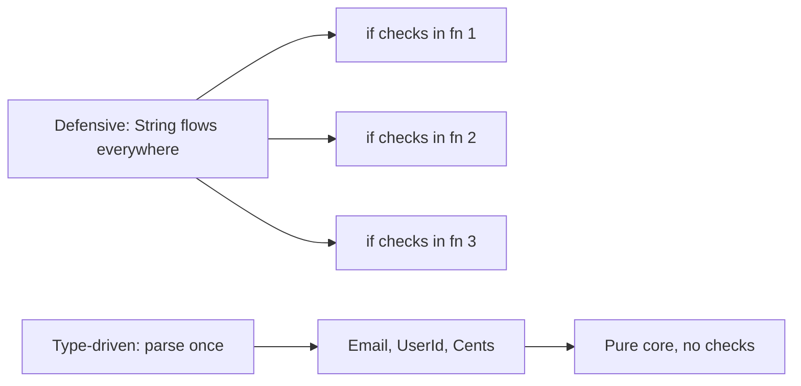
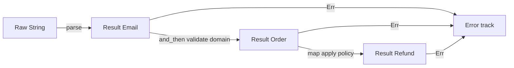
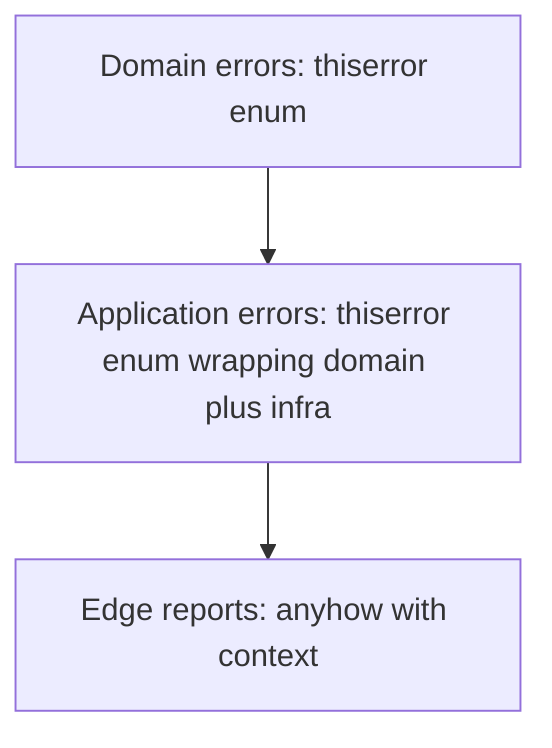
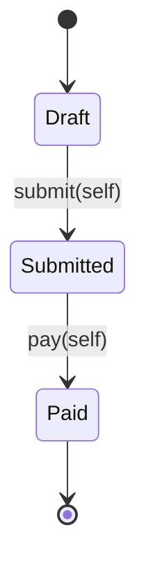
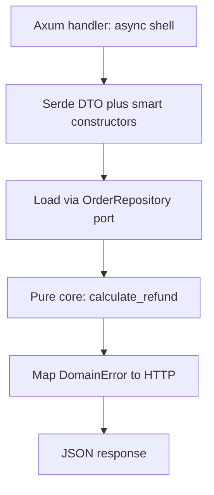

> *A junior developer validates nothing and hopes for the best.*
> *A mid-level developer validates everything, everywhere, with `if` statements on every layer.*
> *A senior developer parses once at the boundary and lets the type system prove the rest.*
> - <cite>Software Engineering Proverb, Rust edition</cite>

<!--more-->

## TL;DR

* **Validate once, at the edge.**
Expect untrusted `String`, `i32`, and JSON at the system boundary.
Parse them there into proof-bearing domain types.
* **Parse, don't validate.**
Validation keeps the weak type and returns `bool`.
Parsing consumes the weak type and returns `Result<StrongType, Error>`.
* **Model the domain with types.**
Use newtypes, smart constructors, sum types, product types, and total functions.
Make illegal states unrepresentable by construction.
* **Stratify errors.**
Use `thiserror` for exhaustive domain errors in libraries and `anyhow` with context only at the application edge.
* **Push invariants into the compiler.**
Use the type-state pattern, zero-cost borrowed newtypes, and a pure functional core wrapped by a thin Axum and Serde shell with trait ports.
* This post is the Rust chapter of the Error Handling series.
It builds every pattern from `Result`, modules, traits, and ownership, and uses `thiserror`, `anyhow`, `nutype`, `proptest`, `sqlx`, `reqwest`, `tokio`, `axum`, `serde`, `syn`, and `quote` in examples.

```toml
# Cargo.toml sketch with pinned versions and features.
[dependencies]
axum = { version = "0.7", features = ["json"] }
serde = { version = "1", features = ["derive"] }
serde_json = "1"
thiserror = "2"
anyhow = "1"
tokio = { version = "1", features = ["macros", "rt-multi-thread"] }
sqlx = { version = "0.8", features = ["postgres", "runtime-tokio"] }
reqwest = { version = "0.12", features = ["json"] }
uuid = { version = "1", features = ["v4"] }
tracing = "0.1"
nutype = "0.6"
# syn/quote below belong to the separate -macros crate, not the main crate.
# hyphens shown for the derive sketch only.

[dev-dependencies]
proptest = "1"
```

Layout: `src/domain/`, `src/core/`, `src/shell/`, `src/app/`.

---

## 1. Introduction: The Antipattern of Defensive Rust

The tempting habit is to check every input in every function.
You validate the same `String` in the handler, then in the service, then in the repository, because no signature records what was already proven.
In Rust, that habit is expensive and unnecessary.
The compiler is not only a syntax checker.
It proves moves, types, and exhaustive matches at compile time, and defensive `if` chains waste it.

Consider the classic primitive soup.

```rust
// ❌ Antipattern: primitives flow through every layer.
use std::collections::HashMap;

pub struct Database {
    balances: HashMap<String, i64>,
}

impl Database {
    pub fn get_balance(&self, user_id: &str) -> Option<i64> {
        self.balances.get(user_id).copied()
    }
}

pub fn process_refund(
    db: &Database,
    user_id: String,
    email: String,
    amount_cents: i32,
) -> Result<String, String> {
    // Defensive check 1: who validated user_id?
    if user_id.trim().is_empty() {
        return Err("invalid user_id".to_string());
    }
    // Defensive check 2: who validated email?
    if !email.contains('@') {
        return Err("invalid email".to_string());
    }
    // Defensive check 3: who validated amount?
    if amount_cents <= 0 {
        return Err("invalid amount".to_string());
    }
    // Business logic is buried under guards.
    let balance = db
        .get_balance(&user_id)
        .ok_or_else(|| "user not found".to_string())?;
    if balance < amount_cents as i64 {
        return Err("insufficient funds".to_string());
    }
    Ok(format!("refunded {amount_cents} to {user_id}"))
}

pub fn send_receipt(user_id: String, email: String, amount_cents: i32) -> Result<(), String> {
    // Same three checks, copied again.
    if user_id.trim().is_empty() {
        return Err("invalid user_id".to_string());
    }
    if !email.contains('@') {
        return Err("invalid email".to_string());
    }
    if amount_cents <= 0 {
        return Err("invalid amount".to_string());
    }
    // ... send email ...
    Ok(())
}
```

This code compiles, passes review, and slowly rots the codebase.
Every function repeats the same three guards.
Every caller wonders if the callee already checked.
Every change to the email rule requires a shotgun edit across layers.
Performance pays for repeated scanning and branching on the hot path.
Coupling grows because business rules about identity and money leak into infrastructure code.
The deepest cost is paranoia.
No signature tells you what is already proven, so you check again.

Rust gives you a better contract.
Parse untrusted data once at the boundary.
Hand the core only types that cannot be wrong.
Delete the duplicated guards forever.



The rest of this guide shows how to build that contract in five pillars.

---

## 2. The Paradigm Shift: Parse, Don't Validate

Alexis King captured the core idea in [Parse, don't validate](https://lexi-lambda.github.io/blog/2019/11/05/parse-don-t-validate/) (2019).
Validation inspects a value and keeps the weak type.
Parsing consumes the weak type and produces a strong type with the proof embedded in it.
That distinction changes your architecture.

Validation has this shape.
It answers a question and throws the answer away.

```rust
// Validation: checks, then keeps String.
pub fn is_valid_email(raw: &str) -> bool {
    let parts: Vec<&str> = raw.split('@').collect();
    parts.len() == 2 && !parts[0].is_empty() && parts[1].contains('.')
}

pub fn notify(raw_email: String) {
    if is_valid_email(&raw_email) {
        // raw_email is still String here.
        // The compiler learned nothing.
        // The next function must check again.
        println!("sending to {raw_email}");
    }
}
```

Parsing has a different shape.
It transforms and certifies in one move.

```rust
// Parsing: consumes &str, produces proof-bearing Email.
// Lives in src/domain/email.rs: the private field is unforgeable outside that module.
#[derive(Debug, Clone, PartialEq, Eq)]
pub struct Email(String);

#[derive(Debug, Clone, PartialEq, Eq)]
pub enum EmailError {
    MissingAt,
    EmptyLocalPart,
    InvalidDomain,
}

impl std::fmt::Display for EmailError {
    fn fmt(&self, f: &mut std::fmt::Formatter<'_>) -> std::fmt::Result {
        match self {
            Self::MissingAt => write!(f, "email must contain a single @"),
            Self::EmptyLocalPart => write!(f, "email local part is empty"),
            Self::InvalidDomain => write!(f, "email domain is invalid"),
        }
    }
}

impl std::error::Error for EmailError {}

impl Email {
    pub fn parse(raw: &str) -> Result<Self, EmailError> {
        if raw.len() > 1024 {
            // Bound trim/scan work before touching the input.
            return Err(EmailError::InvalidDomain);
        }
        let trimmed = raw.trim();
        if trimmed.len() > 254 || trimmed.chars().any(|c| c.is_whitespace()) {
            return Err(EmailError::InvalidDomain);
        }
        // Single-pass: split_once plus trailing-@ check rejects a@b@c.com and a@@b.com.
        let (local, domain) = trimmed.split_once('@').ok_or(EmailError::MissingAt)?;
        if domain.contains('@') {
            return Err(EmailError::MissingAt);
        }
        if local.is_empty() {
            return Err(EmailError::EmptyLocalPart);
        }
        if !domain.contains('.')
            || domain.contains("..")
            || domain.starts_with('.')
            || domain.ends_with('.')
        {
            return Err(EmailError::InvalidDomain);
        }
        Ok(Self(trimmed.to_string()))
    }

    pub fn as_str(&self) -> &str {
        &self.0
    }
}
```

After `Email::parse` succeeds, no downstream function checks the `@` again.
The type carries the proof that parsing succeeded. `rustc` proves moves, types, and exhaustiveness. The domain truth itself is established by `parse` plus tests.
The signature `fn notify(email: Email)` documents the invariant better than any comment.

Here is the architectural boundary you want.

```text
                         SYSTEM BOUNDARY
   Untrusted outside              Parsed inside
┌──────────────────┐     ┌─────────────────────────────┐
│ String           │     │ Email, UserId, Cents        │
│ i32              │────▶│ Order, Refund, Policy       │
│ serde_json::Value│parse │ Proof-bearing domain types  │
│ Raw query params │     │ Total functions only        │
└──────────────────┘     └─────────────────────────────┘
        │                             │
   may be anything              illegal states do not compile
   must be checked              must only be composed
```

The rule is simple.
Data crosses the boundary as `String` and `i32`.
It travels inside the core as `Email`, `UserId`, and `Cents`.
The parser lives in exactly one module per type.
Everything behind it composes without guards.

This is the same move Edwin Brady teaches in *Type-Driven Development with Idris*.
Let the type guide the control flow.
Reject bad programs during compilation instead of discovering them in production logs.

---

## 3. Pillar 1: Domain Modeling with Newtypes, Value Objects, and Smart Constructors

Eric Evans calls them Value Objects in *Domain-Driven Design*.
They are small, immutable, self-validating concepts with no identity beyond their value.
Rust models them with the newtype pattern plus a smart constructor.
Module privacy makes the guarantee physical, not social.

The trick is the private field.

```rust
// src/domain/email.rs
use std::fmt;
use std::str::FromStr;

#[derive(Debug, Clone, PartialEq, Eq, Hash)]
pub struct Email(String);

#[derive(Debug, Clone, PartialEq, Eq)]
pub enum EmailError {
    MissingAt,
    EmptyLocalPart,
    InvalidDomain,
}

impl std::fmt::Display for EmailError {
    fn fmt(&self, f: &mut std::fmt::Formatter<'_>) -> std::fmt::Result {
        match self {
            Self::MissingAt => write!(f, "email must contain a single @"),
            Self::EmptyLocalPart => write!(f, "email local part is empty"),
            Self::InvalidDomain => write!(f, "email domain is invalid"),
        }
    }
}

impl std::error::Error for EmailError {}

impl Email {
    /// Smart constructor: the only way to build an Email.
    /// Takes &str and allocates only on Ok.
    pub fn parse(raw: &str) -> Result<Self, EmailError> {
        let trimmed = raw.trim();
        if trimmed.matches('@').count() != 1 {
            return Err(EmailError::MissingAt);
        }
        let (local, domain) = trimmed.split_once('@').ok_or(EmailError::MissingAt)?;
        if local.is_empty() {
            return Err(EmailError::EmptyLocalPart);
        }
        if domain.contains(' ') || !domain.contains('.') || domain.contains("..") {
            return Err(EmailError::InvalidDomain);
        }
        Ok(Self(trimmed.to_string()))
    }

    pub fn as_str(&self) -> &str {
        &self.0
    }
}

impl FromStr for Email {
    type Err = EmailError;

    fn from_str(s: &str) -> Result<Self, Self::Err> {
        Self::parse(s)
    }
}

impl fmt::Display for Email {
    fn fmt(&self, f: &mut fmt::Formatter<'_>) -> fmt::Result {
        f.write_str(&self.0)
    }
}

impl AsRef<str> for Email {
    fn as_ref(&self) -> &str {
        &self.0
    }
}
```

Because the inner `String` is private and the struct lives in its own module, no other module can write `Email("garbage".to_string())`.
The compiler rejects it.
The only path is `Email::parse`, which returns `Result`.
This is the Aggregate boundary from DDD, enforced by `mod`, not by discipline.

Apply the same pattern to every primitive that carries a rule.

```rust
#[derive(Debug, Clone, Copy, PartialEq, Eq, PartialOrd, Ord, Hash)]
pub struct Cents(u64);

#[derive(Debug, Clone, PartialEq, Eq)]
pub enum MoneyError {
    NonPositive,
    ExceedsMax { value: u64, max: u64 },
}

impl std::fmt::Display for MoneyError {
    fn fmt(&self, f: &mut std::fmt::Formatter<'_>) -> std::fmt::Result {
        match self {
            Self::NonPositive => write!(f, "amount must be positive"),
            Self::ExceedsMax { value, max } => {
                write!(f, "amount {value} exceeds maximum {max}")
            }
        }
    }
}

impl std::error::Error for MoneyError {}

#[derive(Debug, Clone, PartialEq, Eq, Hash)]
pub struct OrderId(String);

#[derive(Debug, Clone, PartialEq, Eq)]
pub enum OrderIdError {
    Empty,
}

impl std::fmt::Display for OrderIdError {
    fn fmt(&self, f: &mut std::fmt::Formatter<'_>) -> std::fmt::Result {
        match self {
            Self::Empty => write!(f, "order id must be non-empty"),
        }
    }
}

impl std::error::Error for OrderIdError {}

impl OrderId {
    pub fn parse(raw: &str) -> Result<Self, OrderIdError> {
        let trimmed = raw.trim();
        if trimmed.is_empty() || trimmed.len() > 64 {
            return Err(OrderIdError::Empty);
        }
        Ok(Self(trimmed.to_string()))
    }

    pub fn as_str(&self) -> &str {
        &self.0
    }
}

impl std::fmt::Display for OrderId {
    fn fmt(&self, f: &mut std::fmt::Formatter<'_>) -> std::fmt::Result {
        f.write_str(&self.0)
    }
}

impl Cents {
    pub fn parse(raw: i64) -> Result<Self, MoneyError> {
        if raw <= 0 {
            return Err(MoneyError::NonPositive);
        }
        Ok(Self::from_raw(raw as u64))
    }

    fn from_raw(value: u64) -> Self {
        // Private to cents.rs. refund_share_total below lives in this same file.
        Self(value)
    }

    pub fn value(self) -> u64 {
        self.0
    }
}

impl TryFrom<i64> for Cents {
    type Error = MoneyError;

    fn try_from(value: i64) -> Result<Self, Self::Error> {
        Self::parse(value)
    }
}

#[derive(Debug, Clone, PartialEq, Eq, Hash)]
pub struct UserId(String);

#[derive(Debug, Clone, PartialEq, Eq)]
pub enum UserIdError {
    Empty,
}

impl std::fmt::Display for UserIdError {
    fn fmt(&self, f: &mut std::fmt::Formatter<'_>) -> std::fmt::Result {
        match self {
            Self::Empty => write!(f, "user id must be a non-empty uuid"),
        }
    }
}

impl std::error::Error for UserIdError {}

impl std::fmt::Display for UserId {
    fn fmt(&self, f: &mut std::fmt::Formatter<'_>) -> std::fmt::Result {
        f.write_str(&self.0)
    }
}

impl UserId {
    pub fn parse(raw: &str) -> Result<Self, UserIdError> {
        if raw.len() > 64 {
            return Err(UserIdError::Empty);
        }
        let trimmed = raw.trim();
        if trimmed.is_empty() {
            return Err(UserIdError::Empty);
        }
        // Single rule across the series: uuid. Needs uuid = "1" in Cargo.toml.
        if uuid::Uuid::parse_str(trimmed).is_err() {
            return Err(UserIdError::Empty);
        }
        Ok(Self(trimmed.to_string()))
    }

    pub fn as_str(&self) -> &str {
        &self.0
    }
}
```

Now your core signatures prove their preconditions.

```rust
// src/core/demo.rs
use crate::core::refunds::{RefundPolicy, calculate_refund};
use crate::domain::cents::Cents;
use crate::domain::error::DomainError;
use crate::domain::order::Order;

pub fn process_refund_typed(order: &Order, amount: Cents) -> Result<String, DomainError> {
    // No email check here.
    // No amount check here.
    // The types already proved it.
    // Note: policy max is Cents here, matching TS/Python balance:Cents series rule.
    // Demo uses parse so from_raw stays private to cents.rs.
    let policy = RefundPolicy {
        max_cents: Cents::parse(1_000_000_000).expect("fixture is valid"),
    };
    calculate_refund(order, amount, &policy).map(|r| {
        format!("refunded {} to {}", r.amount.value(), r.order_id.as_str())
    })
}
```

You still need `as_str` or `Display` accessors, and that is intentional.
Callers can read the value but cannot forge it.
That is encapsulation without runtime cost.

---

## 4. Pillar 2: Functional Foundations (Algebraic Data Types and Total Functions)

Paul Chiusano and Runar Bjarnason teach this in *Functional Programming in Scala*, often called the Red Book.
Model with precise types, write total functions, and compose with combinators instead of unwinding the stack with panics.
Rust enums and structs are algebraic data types, and `Result` is your `Either` monad.

Sum types enumerate exclusive alternatives.

```rust
#[derive(Debug, Clone, PartialEq, Eq)]
pub struct CardDetails {
    last_four: String,
}

impl CardDetails {
    pub fn parse(last_four: &str) -> Result<Self, LastFourError> {
        let t = last_four.trim();
        if t.len() != 4 || !t.chars().all(|c| c.is_ascii_digit()) {
            return Err(LastFourError::Invalid);
        }
        Ok(Self { last_four: t.to_string() })
    }

    pub fn as_str(&self) -> &str {
        &self.last_four
    }
}

#[derive(Debug, Clone, PartialEq, Eq)]
pub enum LastFourError {
    Invalid,
}

impl std::fmt::Display for LastFourError {
    fn fmt(&self, f: &mut std::fmt::Formatter<'_>) -> std::fmt::Result {
        match self {
            Self::Invalid => write!(f, "last_four must be 4 digits"),
        }
    }
}

impl std::error::Error for LastFourError {}

#[derive(Debug, Clone, PartialEq, Eq)]
pub struct TransferDetails {
    iban: String,
}

impl TransferDetails {
    pub fn parse(iban: &str) -> Result<Self, IbanError> {
        let t = iban.trim();
        if t.is_empty() || t.len() > 34 {
            return Err(IbanError::Invalid);
        }
        Ok(Self { iban: t.to_string() })
    }
}

#[derive(Debug, Clone, PartialEq, Eq)]
pub enum IbanError {
    Invalid,
}

impl std::fmt::Display for IbanError {
    fn fmt(&self, f: &mut std::fmt::Formatter<'_>) -> std::fmt::Result {
        match self {
            Self::Invalid => write!(f, "iban must be 1-34 chars"),
        }
    }
}

impl std::error::Error for IbanError {}

#[derive(Debug, Clone, PartialEq, Eq)]
pub enum PaymentMethod {
    Card(CardDetails),
    Transfer(TransferDetails),
    Cash,
}
```

Product types combine independent facts.

```rust
use crate::domain::cents::Cents;
use crate::domain::email::Email;
use crate::domain::order_id::{OrderId, OrderIdError};
use crate::domain::user_id::UserId;

#[derive(Debug, Clone, PartialEq, Eq)]
pub struct Order {
    pub id: OrderId,
    pub user_id: UserId,
    pub email: Email,
    pub amount: Cents,
    pub method: PaymentMethod,
    pub already_refunded: bool,
}
```

There is no null, no implicit missing value, and no stringly typed method field.
A `match` on `PaymentMethod` must handle every arm or the build fails.
That exhaustiveness is a proof about your business branches.

A total function is defined for 100 percent of its input values.
It maps every input to an explicit Ok or Err outcome, never panicking on expected cases.
Blocking, allocation, and effects are separate concerns from totality.
A partial function pretends to be total but explodes on some inputs.

```rust
// ❌ Partial: panics on zero and on overflow in debug builds.
pub fn refund_share_partial(amount: u64, parts: u64) -> u64 {
    amount / parts
}

// ✅ Total: lives in src/domain/cents.rs with Cents, so from_raw stays private.
#[derive(Debug, Clone, PartialEq, Eq)]
pub enum SplitError {
    EmptyParts,
    NotDivisible { amount: u64, parts: u64 },
}

impl std::fmt::Display for SplitError {
    fn fmt(&self, f: &mut std::fmt::Formatter<'_>) -> std::fmt::Result {
        match self {
            Self::EmptyParts => write!(f, "parts must be non-zero"),
            Self::NotDivisible { amount, parts } => {
                write!(f, "{amount} is not divisible by {parts}")
            }
        }
    }
}

impl std::error::Error for SplitError {}

pub fn refund_share_total(amount: Cents, parts: u64) -> Result<Cents, SplitError> {
    if parts == 0 {
        return Err(SplitError::EmptyParts);
    }
    let raw = amount.value();
    if raw % parts != 0 {
        return Err(SplitError::NotDivisible { amount: raw, parts });
    }
    Ok(Cents::from_raw(raw / parts))
}
```

`from_raw` is crate-private and called only after the remainder check.
Total signatures force callers to confront edge cases at the call site.

Composition uses `map`, `and_then`, and `map_err` instead of nested `if` pyramids.
This is Railway Oriented Programming from Scott Wlaschin, expressed with `Result`.



```rust
use crate::domain::cents::{Cents, MoneyError};
use crate::domain::email::{Email, EmailError};
use crate::domain::order::{Order, PaymentMethod};
use crate::domain::order_id::{OrderId, OrderIdError};
use crate::domain::user_id::{UserId, UserIdError};

#[derive(Debug, Clone, PartialEq, Eq)]
pub enum OrderError {
    Email(EmailError),
    Money(MoneyError),
    UserId(UserIdError),
    OrderId(OrderIdError),
}

pub fn build_order(
    raw_order_id: &str,
    raw_user_id: &str,
    raw_email: &str,
    raw_amount: i64,
) -> Result<Order, OrderError> {
    OrderId::parse(raw_order_id)
        .map_err(OrderError::OrderId)
        .and_then(|order_id| {
            UserId::parse(raw_user_id)
                .map_err(OrderError::UserId)
                .and_then(|user_id| {
                    Email::parse(raw_email)
                        .map_err(OrderError::Email)
                        .and_then(|email| {
                            Cents::parse(raw_amount)
                                .map_err(OrderError::Money)
                                .map(|amount| (order_id, user_id, email, amount))
                        })
                })
        })
        .map(|(order_id, user_id, email, amount)| Order {
            id: order_id,
            user_id,
            email,
            amount,
            method: PaymentMethod::Cash,
            already_refunded: false,
        })
}
```

Better yet, use the `?` operator, which is monadic bind with early return on the error track.

```rust
pub fn build_order_clean(
    raw_order_id: &str,
    raw_user_id: &str,
    raw_email: &str,
    raw_amount: i64,
) -> Result<Order, OrderError> {
    let id = OrderId::parse(raw_order_id).map_err(OrderError::OrderId)?;
    let user_id = UserId::parse(raw_user_id).map_err(OrderError::UserId)?;
    let email = Email::parse(raw_email).map_err(OrderError::Email)?;
    let amount = Cents::parse(raw_amount).map_err(OrderError::Money)?;
    Ok(Order {
        id,
        user_id,
        email,
        amount,
        method: PaymentMethod::Cash,
        already_refunded: false,
    })
}
```

Both versions keep two parallel tracks.
The happy track carries values forward.
The error track short-circuits without unwinding.
The error type tells the handler exactly which status to return, so a 400 typo can never masquerade as a 500 outage.

---

## 5. Pillar 3: The Lisp Connection, Metaprogramming and Expression-Oriented Design

Rust is expression-oriented: almost everything evaluates to a value, a trait it shares with ML and OCaml via Cyclone.
SICP celebrates a related but distinct idea.
That lets you assign validated results directly instead of mutating temporaries through statement chains.

```rust
// Expression-driven domain construction.
use crate::domain::email::{Email, EmailError};

pub fn classify(raw: &str) -> Result<Email, EmailError> {
    let email: Email = match Email::parse(raw) {
        Ok(valid) => valid,
        Err(EmailError::MissingAt) => {
            // Repair path stays an expression too.
            Email::parse(&format!("{raw}@example.com"))?
        }
        Err(other) => return Err(other),
    };
    Ok(email)
}

pub fn label(amount: Cents) -> &'static str {
    // if is an expression, not a statement.
    let tier = if amount.value() > 1_000_00 {
        "enterprise"
    } else if amount.value() > 10_00 {
        "standard"
    } else {
        "micro"
    };
    tier
}
```

No `let mut result;` dance.
No uninitialized variable.
The compiler checks that every branch yields the declared type.

The deeper code-as-data idea is building embedded domain languages where programs manipulate program descriptions.
Rust procedural macros work at the token-stream level during compilation in a separate crate, not Lisp homoiconicity.
A macro reads your struct definition as data and emits the smart constructor, error type, and trait impls for you.

The `nutype` crate is the pragmatic version of that idea, not an EDSL.
You declare the invariant, the macro generates the boilerplate.

```rust
// Declare the rule, derive the proof.
// Check nutype docs for exact validator names in your version.
use nutype::nutype;

#[nutype(validate(greater = 0), derive(Debug, Clone, Copy, PartialEq, Eq))]
pub struct CentsNutype(i64);

#[nutype(validate(not_empty, len_char_max = 254), derive(Debug, Clone, PartialEq, Eq))]
pub struct EmailNutype(String);
```

`nutype` expands to a private-field newtype with `try_from`, `FromStr`, `Display`, `AsRef`, and a precise error enum.
You get the same module privacy guarantee as a hand-written smart constructor without repeating it twenty times.

When the invariant is truly domain specific, write your own derive or attribute macro.
The shape is always the same.
Parse the input `TokenStream` into `syn` types, validate the AST, and emit a `quote` output with the constructor.

```rust
// Conceptual sketch of a custom smart-constructor macro.
// Real proc macros live in a separate -macros crate, so `crate::domain::...`
// inside quote! would resolve to the macro crate, not the user crate.
// Pass paths in or emit fully qualified paths to the user crate.
use proc_macro::TokenStream;
use quote::quote;
use syn::{DeriveInput, parse_macro_input};

#[proc_macro_derive(NonEmptyString)]
pub fn non_empty_string(input: TokenStream) -> TokenStream {
    let ast = parse_macro_input!(input as DeriveInput);
    let name = &ast.ident;
    let expanded = quote! {
        impl #name {
            pub fn parse(raw: String) -> Result<Self, crate::domain::NonEmptyError> {
                if raw.trim().is_empty() {
                    return Err(crate::domain::NonEmptyError::Empty);
                }
                Ok(Self(raw.trim().to_string()))
            }
        }
    };
    TokenStream::from(expanded)
}
```

Use macros to remove repetition, never to hide business rules.
The invariant must stay visible in the type definition.
The macro only mechanizes the proof.

---

## 6. Pillar 4: Exhaustive, Stratified Error Handling (`thiserror` vs `anyhow`)

Not all errors belong in the same type.
Domain errors are expected business outcomes and must be exhaustive.
Infrastructure errors are operational failures and need context and backtraces.
Mixing them in one `String` or one boxed error destroys that signal.

Stratify into three layers.



Model domain errors with `thiserror`.
Every variant is a business fact the caller must handle.

```rust
// src/domain/error.rs
use thiserror::Error;

use crate::domain::cents::MoneyError;
use crate::domain::email::EmailError;
use crate::domain::order_id::OrderId;
use crate::domain::user_id::UserIdError;

#[derive(Debug, Error, PartialEq, Eq)]
pub enum DomainError {
    #[error("invalid email: {0}")]
    InvalidEmail(#[from] EmailError),

    #[error("invalid user id: {0}")]
    InvalidUserId(#[from] UserIdError),

    #[error("invalid order id: {0}")]
    InvalidOrderId(#[from] OrderIdError),

    #[error(transparent)]
    InvalidAmount(#[from] MoneyError),

    #[error("user not found")]
    UserNotFound,

    #[error("insufficient funds")]
    InsufficientFunds,

    #[error("refund already processed for order {order_id}")]
    AlreadyRefunded { order_id: OrderId },
}
```

Exhaustive `match` now forces product decisions.

```rust
use crate::domain::error::DomainError;

pub fn refund_status_code(err: &DomainError) -> axum::http::StatusCode {
    use axum::http::StatusCode;
    // Removing a variant breaks this match at compile time.
    // That is the feature. Single mapping used by IntoResponse below.
    match err {
        DomainError::InvalidEmail(_)
        | DomainError::InvalidUserId(_)
        | DomainError::InvalidOrderId(_)
        | DomainError::InvalidAmount(MoneyError::NonPositive) => StatusCode::BAD_REQUEST,
        DomainError::UserNotFound => StatusCode::NOT_FOUND,
        DomainError::InvalidAmount(MoneyError::ExceedsMax { .. })
        | DomainError::InsufficientFunds
        | DomainError::AlreadyRefunded { .. } => StatusCode::UNPROCESSABLE_ENTITY,
    }
}
```

Wrap infrastructure errors once at the application layer.

```rust
// src/app/error.rs
use thiserror::Error;

use crate::domain::error::DomainError;

#[derive(Debug, Error)]
pub enum AppError {
    #[error(transparent)]
    Domain(#[from] DomainError),

    #[error("database error: {0}")]
    Database(#[from] sqlx::Error),

    #[error("payment gateway error: {0}")]
    Gateway(#[from] reqwest::Error),
}
```

Use `anyhow` only at the final edge: binaries, CLIs, migration scripts, and the `main` return type.
It adds context and backtraces where humans read logs, not where libraries define contracts.

```rust
// src/main.rs
use anyhow::Context;

#[tokio::main]
async fn main() -> anyhow::Result<()> {
    let pool = sqlx::PgPool::connect(&std::env::var("DATABASE_URL")?)
        .await
        .context("failed to connect to Postgres")?;
    run_server(pool).await.context("server crashed")?;
    Ok(())
}
```

The rule of thumb is crisp.
If you publish the type, use `thiserror`.
If you run the binary, use `anyhow`.
Never return `anyhow::Error` from domain functions, because it erases the exhaustive cases your callers need.
Never use `String` errors in new code, because they erase structure and prevent programmatic matching.

---

## 7. Pillar 5: Compile-Time Invariants with the Type-State Pattern

Some invariants are not about single values but about sequences.
An order cannot be paid before it is submitted.
A refund cannot be issued twice.
Runtime booleans like `is_submitted` can be forgotten or checked in the wrong order.
Type-state encodes the workflow in generics so wrong sequences do not compile.

This is Brady-style type-driven design applied to business lifecycles.

```rust
// src/domain/order_state.rs
use std::marker::PhantomData;

use crate::domain::cents::Cents;
use crate::domain::email::Email;
use crate::domain::order_id::OrderId;

// Lifecycle uses StagedOrder, never the core Order, so the two never collide.
#[derive(Debug, Clone, PartialEq, Eq)]
pub struct Draft;
#[derive(Debug, Clone, PartialEq, Eq)]
pub struct Submitted;
#[derive(Debug, Clone, PartialEq, Eq)]
pub struct Paid;

// No Clone here: cloning would duplicate the workflow and break linearity.
#[derive(Debug, PartialEq, Eq)]
pub struct StagedOrder<State> {
    // Full aggregate: same id, email, and amount as core Order, plus stage.
    id: OrderId,
    email: Email,
    amount: Cents,
    state: PhantomData<State>,
}

impl StagedOrder<Draft> {
    pub fn new(id: OrderId, email: Email, amount: Cents) -> Self {
        Self {
            id,
            email,
            amount,
            state: PhantomData,
        }
    }

    pub fn submit(self) -> StagedOrder<Submitted> {
        // self is moved and destroyed here.
        // The Draft value cannot be used again.
        StagedOrder {
            id: self.id,
            email: self.email,
            amount: self.amount,
            state: PhantomData,
        }
    }
}

impl StagedOrder<Submitted> {
    pub fn pay(self) -> StagedOrder<Paid> {
        StagedOrder {
            id: self.id,
            email: self.email,
            amount: self.amount,
            state: PhantomData,
        }
    }
}

impl StagedOrder<Paid> {
    pub fn receipt(&self) -> String {
        format!("paid {} cents for {}", self.amount.value(), self.id.as_str())
    }
}
```

Ownership does the heavy lifting.
Each transition takes `self` by value and returns a new state.
The old value is moved and gone.
There is no logical use-after-free where stale `Draft` handles linger and get resubmitted.

```rust
// Test or example bootstrap only. Production code returns Result, never unwrap.
use crate::domain::email::Email;
use crate::domain::order_id::OrderId;

let order_id = OrderId::parse("ord_1").expect("fixture is valid");
let email = Email::parse("a@example.com").expect("fixture is valid");
let draft = StagedOrder::<Draft>::new(
    order_id,
    email,
    Cents::parse(5000).expect("fixture is valid"),
);
let submitted = draft.submit();
// draft.submit(); // ❌ Compile error: value moved.
let paid = submitted.pay();
println!("{}", paid.receipt());
// paid.pay(); // ❌ Compile error: no method pay on Order<Paid>.
```



Use type-state when the sequence matters and the cost of a wrong transition is high: payments, provisioning, publishing, and multi-step onboarding.
Do not use it for every boolean, or generic noise will drown the domain.
A good heuristic is two or more ordered states with different available operations.

---

## 8. Advanced Engineering: Zero-Cost Ref Types and Property-Based Testing

Owned newtypes like `Email(String)` allocate once and are perfect for storage and APIs.
Hot paths like routers, validators, and parsers should avoid even that allocation when they only borrow.
Lifetimes let you build borrowed newtypes with zero heap cost.

```rust
// Zero-cost borrowed view: no allocation, same proof shape.
#[derive(Debug, Clone, Copy, PartialEq, Eq, Hash)]
pub struct EmailRef<'a>(&'a str);

#[derive(Debug, Clone, PartialEq, Eq)]
pub enum EmailRefError {
    MissingAt,
    EmptyLocalPart,
    InvalidDomain,
}

impl std::fmt::Display for EmailRefError {
    fn fmt(&self, f: &mut std::fmt::Formatter<'_>) -> std::fmt::Result {
        match self {
            Self::MissingAt => write!(f, "email must contain a single @"),
            Self::EmptyLocalPart => write!(f, "email local part is empty"),
            Self::InvalidDomain => write!(f, "email domain is invalid"),
        }
    }
}

impl std::error::Error for EmailRefError {}

impl<'a> EmailRef<'a> {
    pub fn parse(raw: &'a str) -> Result<Self, EmailRefError> {
        if raw.len() > 1024 {
            return Err(EmailRefError::InvalidDomain);
        }
        let trimmed = raw.trim();
        if trimmed.len() > 254 || trimmed.chars().any(|c| c.is_whitespace()) {
            return Err(EmailRefError::InvalidDomain);
        }
        let (local, domain) = trimmed.split_once('@').ok_or(EmailRefError::MissingAt)?;
        if domain.contains('@') {
            return Err(EmailRefError::MissingAt);
        }
        if local.is_empty() {
            return Err(EmailRefError::EmptyLocalPart);
        }
        if !domain.contains('.')
            || domain.contains("..")
            || domain.starts_with('.')
            || domain.ends_with('.')
        {
            return Err(EmailRefError::InvalidDomain);
        }
        Ok(Self(trimmed))
    }

    pub fn as_str(self) -> &'a str {
        self.0
    }

    pub fn to_owned_email(self) -> Email {
        // Same module as Email, so private field access is allowed.
        // No revalidation and no expect: borrowed was already valid.
        Email(self.0.to_owned())
    }
}

impl<'a> From<EmailRef<'a>> for Email {
    fn from(value: EmailRef<'a>) -> Self {
        value.to_owned_email()
    }
}
```

`EmailRef<'a>` is one pointer plus one length.
It copies with `Copy`, never touches the allocator, and still guarantees the invariant.
Parse borrowed at the edge, promote to owned only when you must store.
Borrowed parsing avoids allocation. Owned promotion allocates once. The dominant cost in most services remains serde, DB, and network, so measure with criterion before claiming wins.

Parsing logic deserves stronger tests than hand-picked examples.
Property-based testing with `proptest` throws thousands of synthetic inputs at your smart constructor, including Unicode, control characters, and pathological lengths.

```rust
// tests/email_properties.rs
use proptest::prelude::*;

use rust_error_handling::domain::email::Email;

proptest! {
    #[test]
    fn valid_emails_always_parse(s in "[a-z0-9]{1,16}@[a-z]{1,8}\\.[a-z]{2,4}") {
        prop_assert!(Email::parse(&s).is_ok());
    }

    #[test]
    fn missing_at_never_parses(s in "[a-z0-9 ]{1,32}") {
        prop_assume!(!s.contains('@'));
        prop_assert!(Email::parse(&s).is_err());
    }

    #[test]
    fn double_at_never_parses(s in "[a-z0-9]{1,8}@[a-z]{1,8}@[a-z]{2,4}") {
        prop_assert!(Email::parse(&s).is_err());
    }

    #[test]
    fn inner_spaces_never_parse(s in "[a-z]{1,8} @[a-z]{1,8}\\.[a-z]{2,4}") {
        prop_assert!(Email::parse(&s).is_err());
    }

    #[test]
    fn parse_never_panics(s in "\\PC*") {
        // Any Unicode string must map to Ok or Err, never panic.
        prop_assert!(Email::parse(&s).is_ok() || Email::parse(&s).is_err());
    }

    #[test]
    fn trimmed_value_roundtrips(s in " *[a-z]{1,8}@example\\.com *") {
        prop_assume!(!s.trim().is_empty());
        let email = Email::parse(&s).expect("shaped fixture must parse");
        prop_assert_eq!(email.as_str(), s.trim());
    }
}
```

Run with `cargo test` and `cargo proptest` semantics.
If a case fails, `proptest` shrinks it to the minimal reproducer and saves the seed.
Add that seed as a regression test.
Your parser gains mathematical robustness instead of anecdotal coverage.

```rust
// const assert keeps DomainError size honest. Fails at compile time if it grows.
const _: () = assert!(std::mem::size_of::<DomainError>() <= 64);
```

```rust
// benches/refund.rs sketch with criterion. Measures parse plus core, not just types.
use criterion::{Criterion, criterion_group, criterion_main};

fn bench_parse_and_refund(c: &mut Criterion) {
    c.bench_function("parse_email_ok", |b| {
        b.iter(|| crate::domain::email::Email::parse("a@example.com"))
    });
}

criterion_group!(benches, bench_parse_and_refund);
criterion_main!(benches);
```

---

## 9. Architecture Pattern: Functional Core, Imperative Shell (Axum and Serde)

Gary Bernhardt summarized the healthiest architecture in one line: Functional Core, Imperative Shell.
The core is pure, synchronous, and total.
It takes domain types in and returns `Result` out.
No `async`, no sockets, no global state, no clock reads.
The shell is thin and effectful.
It speaks HTTP and JSON, parses at the boundary, calls the core, and maps typed errors to status codes.



Define the pure core first.

```rust
// src/core/refunds.rs
// Refund, RefundPolicy, and Order live in domain::order. Core imports them, never redefines.
use crate::domain::cents::{Cents, MoneyError};
use crate::domain::error::DomainError;
use crate::domain::order::{Order, Refund};

pub fn calculate_refund(
    order: &Order,
    requested: Cents,
    policy: &RefundPolicy,
) -> Result<Refund, DomainError> {
    // Pure function: no IO, no async, no globals.
    // All inputs are already proven types.
    // Naming: order.amount here plays the balance role (available funds) as in TS/Python OrderSnapshot.balance.
    if order.already_refunded {
        return Err(DomainError::AlreadyRefunded {
            order_id: order.id.clone(),
        });
    }
    if requested.value() > order.amount.value() {
        return Err(DomainError::InsufficientFunds);
    }
    if requested.value() > policy.max_cents.value() {
        return Err(DomainError::InvalidAmount(MoneyError::ExceedsMax {
            value: requested.value(),
            max: policy.max_cents.value(),
        }));
    }
    Ok(Refund {
        order_id: order.id.clone(),
        amount: requested,
    })
}

// NOTE: Refund, RefundPolicy, and Order live in domain::order so core and shell share one Order.
// size_of::<DomainError>() is 32 bytes on 64-bit due to AlreadyRefunded(OrderId).
// Box the id if this lands on a hot Result path. Measure with criterion, not by dogma.
// AlreadyRefunded is returned here from persisted already_refunded flag.
// StagedOrder prevents double-pay at type level (no pay on Paid). Flag covers persistence across restarts.
```

Serde DTOs stay dumb and raw in the shell.

```rust
// src/shell/dto.rs
use serde::{Deserialize, Serialize};

#[derive(Debug, Deserialize)]
pub struct RefundRequestDto {
    pub order_id: String,
    pub email: String,
    pub amount_cents: i64,
}

#[derive(Debug, Serialize)]
pub struct RefundResponseDto {
    pub order_id: String,
    pub refunded_cents: u64,
}
```

The Axum handler bridges the two worlds and nothing more.
Decouple it from infrastructure with a trait port.
The port lives in the app layer and speaks only domain types.
The shell provides the adapter and Axum injects it via `State`.

```rust
// src/app/ports.rs
use crate::domain::order::Order;
use crate::domain::order_id::OrderId;

pub trait OrderRepository: Send + Sync + 'static {
    async fn find(&self, id: &OrderId) -> Result<Option<Order>, sqlx::Error>;
}
```

```rust
// src/shell/handlers.rs
use std::sync::Arc;

use axum::{Json, extract::State, http::StatusCode, response::IntoResponse};

use crate::app::error::AppError;
use crate::app::ports::OrderRepository;
use crate::core::refunds::{RefundPolicy, calculate_refund};
use crate::domain::error::DomainError;

#[derive(Clone)]
pub struct AppState {
    pub repo: Arc<dyn OrderRepository>,
    pub policy: RefundPolicy,
}

// src/shell/sqlx_repo.rs
pub struct SqlxOrderRepo {
    pool: sqlx::PgPool,
}

impl OrderRepository for SqlxOrderRepo {
    async fn find(&self, id: &OrderId) -> Result<Option<Order>, sqlx::Error> {
        // SELECT id, user_id, email, amount_cents FROM orders WHERE id = $1.
        // Map the row with OrderId::parse and friends, so DB rows re-enter the domain parsed.
        let _ = (id, &self.pool);
        Ok(None)
    }
}

// tests/fakes.rs, also usable in dev.
use std::collections::HashMap;
use std::sync::Mutex;

use crate::domain::order::Order;
use crate::domain::order_id::OrderId;

#[derive(Default)]
pub struct InMemoryOrderRepo {
    orders: Mutex<HashMap<String, Order>>,
}

impl OrderRepository for InMemoryOrderRepo {
    async fn find(&self, id: &OrderId) -> Result<Option<Order>, sqlx::Error> {
        Ok(self
            .orders
            .lock()
            .expect("test lock is not poisoned")
            .get(id.as_str())
            .cloned())
    }
}

pub async fn refund_handler(
    State(state): State<AppState>,
    Json(raw): Json<RefundRequestDto>,
) -> Result<impl IntoResponse, AppError> {
    use crate::domain::cents::Cents;
    use crate::domain::email::Email;
    use crate::domain::order_id::OrderId;
    // 1. Parse at the boundary. Malformed email rejects before any DB hit.
    // DB email remains authoritative; request email proves shape, not identity.
    let order_id = OrderId::parse(&raw.order_id).map_err(DomainError::InvalidOrderId)?;
    let _request_email = Email::parse(&raw.email).map_err(DomainError::InvalidEmail)?;
    let amount = Cents::parse(raw.amount_cents).map_err(DomainError::InvalidAmount)?;

    // 2. Load persisted state through the port. Never fabricate Order from request amount.
    let order = state
        .repo
        .find(&order_id)
        .await
        .map_err(AppError::Database)?
        .ok_or(DomainError::UserNotFound)?;
    let refund = calculate_refund(&order, amount, &state.policy)?;

    // 3. Map to DTO. No business logic here.
    // OrderId to String needs as_str().to_owned(). Never move the newtype out unconverted.
    let body = RefundResponseDto {
        order_id: refund.order_id.as_str().to_owned(),
        refunded_cents: refund.amount.value(),
    };
    Ok((StatusCode::OK, Json(body)))
}
```

Map typed errors to HTTP once, exhaustively.

```rust
impl IntoResponse for AppError {
    fn into_response(self) -> axum::response::Response {
            let (status, message) = match &self {
            Self::Domain(err) => {
                // Never duplicate the table above: status comes from refund_status_code.
                // Never log raw email via Display here; infra arm below redacts.
                (crate::domain::error::refund_status_code(err), err.to_string())
            }
            Self::Database(e) => {
                tracing::error!(error = %e, "infrastructure failure");
                (
                    StatusCode::INTERNAL_SERVER_ERROR,
                    "internal error".to_string(),
                )
            }
            Self::Gateway(e) => {
                tracing::error!(error = %e, "infrastructure failure");
                (
                    StatusCode::INTERNAL_SERVER_ERROR,
                    "internal error".to_string(),
                )
            }
        };
        (status, Json(serde_json::json!({ "error": message }))).into_response()
    }
}
```

Production notes: require `Idempotency-Key` on POST /refund with dedup so retries never double-charge. Emit `refund_total{kind}` counter and latency histogram with request_id/order_id spans. Never log raw email or DSNs via Display. Keep `calculate_refund` sync and fast; EmailRef must be promoted to owned before any await so futures stay 'static + Send.
Testing splits cleanly.
Unit test `calculate_refund` with plain structs and no mocks.
Integration test the handler with `InMemoryOrderRepo` plus `tower::ServiceExt::oneshot` and real JSON payloads.
Swap the adapter without touching the core because the handler depends only on the trait.
The core stays fast and deterministic because effects live only in the shell.

---

## 10. Pattern Reference: Defensive Rust vs. Type-Driven Rust

| Concept | Defensive Rust | Type-Driven Rust | Architectural Benefit |
|---|---|---|---|
| Boundary parsing | `if` guards repeated in every function over raw `String` | `Email::parse(&str)` returns `Result<Email, EmailError>` once, allocating only on `Ok`, then moves the proof in the type | Single source of truth for the invariant, zero repeated checks in the core |
| Newtypes | Plain `String` aliases, forgeable anywhere | `pub struct Email(String)` with private field, unforgeable outside `mod` | Physical impossibility of invalid construction, enforced by the compiler |
| Totality | `u64` division and indexing that panic on edge inputs | `Cents(u64)` plus `Result` forces explicit handling of zero and negative | Edge cases become compile-time obligations instead of production incidents |
| Composition | Nested `if` pyramids with early `return Err` at every level | `and_then`, `map`, `map_err`, and `?` on the `Result` railway | Linear happy path with a typed error track, errors classified by type |
| Domain errors | `Result<T, String>` messages, easy to swallow or misclassify | `thiserror` exhaustive enum, `match` must cover every variant | Callers cannot ignore a new business case, refactors break loudly at build time |
| App edge errors | One catch-all error type from domain to `main` | `anyhow` with `.context()` only in `main` and binaries | Rich operational context where humans read logs, precise types where code branches |
| Workflow state | Boolean flags like `is_paid` checked with `if` before each action | Type-state `StagedOrder<Draft>` to `StagedOrder<Paid>` with move semantics | Illegal transitions do not compile, stale handles are destroyed by ownership |
| Dependencies | Concrete `OrderRepo` hardwired to sqlx inside the handler | `OrderRepository` trait port injected via Axum `State` with sqlx and in-memory impls | Infra swaps without touching the core, tests need no database |
| Hot-path cost | Cloned `String` newtypes allocated on every layer | Borrowed `EmailRef<'a>` avoids revalidation allocation, promote to owned once; measure serde plus DB before claiming wins | Proof without repeated validation tax, ideal for routers and parsers |
| Testing | Hand-picked `#[test]` cases with a few literal strings | `proptest` with thousands of Unicode and adversarial inputs plus shrinking | Mathematical confidence in parsers, minimal reproducers on failure |
| Architecture | Handlers mix Serde parsing, DB calls, and business rules with `async` everywhere | Pure sync core with `calculate_refund` plus thin async Axum shell behind an `OrderRepository` trait port | Core is trivially testable and portable, effects are isolated behind swappable adapters |

Keep this table as a review checklist.
If a row drifts left, push the proof back into the type.

---

## 11. Summary and Architectural Rules of Thumb

**1. Parse once at the boundary, never validate in the core.**
Raw `String` and `i32` enter through Serde or CLI args and become `Email`, `UserId`, and `Cents` immediately.
Core functions accept only proven types and contain zero `is_valid` checks.

**2. Make illegal states unrepresentable, then delete the guards.**
Prefer `enum` for alternatives, `struct` for combinations, and private-field newtypes for invariants.
If a rule lives in a type, remove every `if` that rechecks it downstream.

**3. Write total functions and compose on the railway.**
Return `Result` for every partial operation, handle every variant, and chain with `?`, `map`, and `and_then`.
Reserve panics for truly impossible bugs, never for user input.

**4. Stratify errors by audience.**
Domain libraries expose exhaustive `thiserror` enums.
Applications wrap infra failures once.
Binaries add human context with `anyhow`.
Never leak `anyhow` or `String` errors from domain APIs.

**5. Push workflows and costs into the type system.**
Use type-state with move semantics for ordered lifecycles.
Use borrowed `EmailRef<'a>` views on hot paths.
Cover parsers with `proptest` and keep the Axum shell thin around a pure functional core behind trait ports.

Stop defending every function against data you already checked.
Prove it once, encode it in a type, and let `rustc` stand guard while you model the domain.

---

### Bibliography

* Alexis King, *Parse, don't validate* (2019).
Core idea: validation preserves the weak type, parsing produces a strong type.
* Paul Chiusano and Runar Bjarnason, *Functional Programming in Scala* (2014).
Core idea: prefer total functions, algebraic data types, and effect-free composition.
* Harold Abelson and Gerald Jay Sussman, *Structure and Interpretation of Computer Programs* (1996).
Core idea: code is data, build embedded languages to express domain intent.
* Eric Evans, *Domain-Driven Design* (2003).
Core idea: protect invariants inside aggregates with value objects and explicit boundaries.
* Edwin Brady, *Type-Driven Development with Idris* (2017).
Core idea: use types as a design tool to guide execution and reject invalid programs early.
* Scott Wlaschin, *Railway Oriented Programming* (2013).
Core idea: model success and error as parallel tracks composed with monadic bind.
* Gary Bernhardt, *Functional Core, Imperative Shell* (2012).
Core idea: keep the domain pure and push IO to a thin outer shell.
