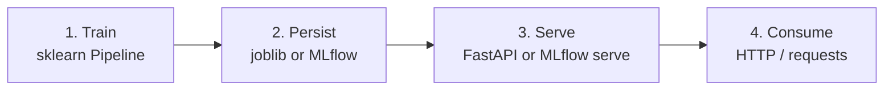

> You trained your model in a notebook, it looked amazing in the report, and now what?
> This guide takes you the rest of the way: train, persist, serve, and consume.

<!--more-->

## 📌 TL;DR

* **Train a full Pipeline** (preprocessing + model) as a single object so the preprocessing travels with the model.
* **Persist with `joblib`** (or with MLflow if you want tracking and versions) and pin your dependencies.
* **Path A, FastAPI + joblib:** spin up a server with Pydantic validation and automatic docs at `/docs`.
* **Path B, MLflow:** adds experiment tracking, a Model Registry with Staging/Production, and its own `serve`.
* **Rule of thumb:** start with FastAPI if the model is simple; move to MLflow when you need to compare experiments and version models in production.

---

This guide shows you the complete path to take a scikit-learn model to production: train, persist, serve, and consume.
It is aimed at someone who already trained models in a notebook but never exposed them as a service.
All the code is runnable and uses the Iris dataset, which ships with scikit-learn.

> **Scope:** this guide covers classic machine learning with scikit-learn (trees, random forests, regressions, clustering, etc.).
> It does not cover neural networks or deep learning (PyTorch, TensorFlow).
> If you want deep learning later, that is a different path: PyTorch/TensorFlow with TorchServe, Triton, or other inference servers.

## 1. Core concepts

Taking a model to production means exposing it so other applications or users can get predictions, in a stable and repeatable way.
In a notebook you train and explore; in production the model lives on a server that answers requests all day.

The full flow is:



Minimal vocabulary:

- **Pipeline**: a scikit-learn object that chains preprocessing and a model into a single step.
- **Serialize / persist**: save the trained model to a file so you can reload it later.
- **REST API**: a server interface where you make HTTP requests with JSON and get JSON responses.
- **Endpoint**: a concrete server route, for example `POST /predict`.
- **HTTP client**: the program that hits the server, for example `curl` or Python's `requests`.

## 2. Train the model

The key is to train a full `Pipeline` (preprocessing + model) as a single object.
That way, at prediction time, the same object applies the same preprocessing that was applied during training.
This avoids the classic mistake of preprocessing production input differently from training input.

### Set up the environment (uv)

`uv` is a fast Python package and environment manager.
You don't need to create and activate a venv by hand: `uv` handles it for you and records exact dependency versions in `uv.lock`.

Initialize the project and add the base dependencies:

```bash
uv init --bare
uv add scikit-learn joblib
```

From now on, run scripts with `uv run`, which uses the project environment automatically.

Create `train.py` with this content:

```python
import joblib
from sklearn.datasets import load_iris
from sklearn.ensemble import RandomForestClassifier
from sklearn.model_selection import GridSearchCV, train_test_split
from sklearn.pipeline import Pipeline
from sklearn.preprocessing import StandardScaler

X, y = load_iris(return_X_y=True)
X_train, X_test, y_train, y_test = train_test_split(
    X, y, test_size=0.2, random_state=42
)

pipeline = Pipeline(
    [
        ("scaler", StandardScaler()),
        ("model", RandomForestClassifier(random_state=42)),
    ]
)

params = {
    "model__n_estimators": [50, 100, 200],
    "model__max_depth": [None, 5, 10],
}

grid = GridSearchCV(pipeline, params, cv=5, scoring="accuracy", n_jobs=-1)
grid.fit(X_train, y_train)

print(f"Best hyperparameters: {grid.best_params_}")
print(f"Test accuracy: {grid.score(X_test, y_test):.4f}")

joblib.dump(grid.best_estimator_, "model.joblib")
print("Model saved to model.joblib")
```

Run it:

```bash
uv run python train.py
```

The names `model__n_estimators` and `model__max_depth` use the `model__` prefix because the model lives inside the Pipeline under the `"model"` key.
With `GridSearchCV` you search for the best hyperparameter combination using cross-validation.

## 3. Persist the model

Persisting means saving the trained model to disk so you don't have to retrain every time.
The most common approach with scikit-learn is `joblib`, which we already used above.

### Format comparison

| Method | Advantages | Risks / limitations |
|---|---|---|
| `joblib` | Fast, efficient with large NumPy arrays | Based on pickle: loading arbitrary code is dangerous. Requires matching dependency versions |
| `pickle` | Native to Python, serializes almost any object | Same as joblib, security risk |
| `skops.io` | Safer than pickle, does not execute arbitrary code | Fewer supported types |
| ONNX | Serves without Python, minimal environment, no code execution risk | Not all sklearn models are supported |

### Golden rules

- **Never load** a `joblib`/`pickle` that does not come from a trusted source: loading it executes arbitrary code.
- Save the full `Pipeline`, not just the model: the preprocessing has to travel with the model.
- **Pin your dependencies**: a model saved with one scikit-learn version can fail or give different results with another.
  Use the same environment for training and production.
  `uv` already recorded the exact versions in `uv.lock`; to export a `requirements.txt`:

```bash
uv export --format requirements-txt > requirements.txt
```

## 4. Path A: FastAPI + joblib

FastAPI spins up a web server in a few lines, validates input with Pydantic, and generates automatic docs at `/docs`.

### Install dependencies

`scikit-learn` and `joblib` were already added in section 2. Add the server ones:

```bash
uv add fastapi "uvicorn[standard]" requests
```

### Create the server

Create `app.py` with this content:

```python
import joblib
from functools import lru_cache

import numpy as np
from fastapi import FastAPI
from pydantic import BaseModel

MODEL_PATH = "model.joblib"

app = FastAPI(title="Iris Classifier API")


class IrisFeatures(BaseModel):
    sepal_length: float
    sepal_width: float
    petal_length: float
    petal_width: float


@lru_cache(maxsize=1)
def load_model():
    return joblib.load(MODEL_PATH)


@app.get("/health")
def health():
    return {"status": "ok"}


@app.post("/predict")
def predict(features: IrisFeatures):
    model = load_model()
    X = np.array(
        [
            [
                features.sepal_length,
                features.sepal_width,
                features.petal_length,
                features.petal_width,
            ]
        ]
    )
    prediction = model.predict(X)[0]
    probabilities = model.predict_proba(X)[0]
    return {
        "prediction": int(prediction),
        "probabilities": probabilities.tolist(),
    }
```

Key points:

- `lru_cache` loads the model once on the first request, not on every call.
- Pydantic (`IrisFeatures`) validates that the JSON carries the four fields and that they are numbers.
- `predict_proba` returns the probability of each class, useful to know how confident the prediction is.

### Start the server

```bash
uv run uvicorn app:app --reload
```

The server listens on `http://localhost:8000`.
Open `http://localhost:8000/docs` in your browser: FastAPI generates a UI to test the endpoint without writing code.

### Consume with curl

```bash
curl -X POST http://localhost:8000/predict \
  -H "Content-Type: application/json" \
  -d '{"sepal_length": 5.1, "sepal_width": 3.5, "petal_length": 1.4, "petal_width": 0.2}'
```

### Consume with requests in Python

```python
import requests

resp = requests.post(
    "http://localhost:8000/predict",
    json={
        "sepal_length": 5.1,
        "sepal_width": 3.5,
        "petal_length": 1.4,
        "petal_width": 0.2,
    },
)
print(resp.json())
```

Expected response, something like:

```json
{"prediction": 0, "probabilities": [0.98, 0.02, 0.0]}
```

## 5. Path B: MLflow

MLflow adds on top of the above: experiment tracking, model registration with versions, and its own `serve`.
Ideal when you want to compare experiments and have traceability of which model is in production.

### Install dependencies

`scikit-learn` is already added. Add MLflow:

```bash
uv add mlflow
```

### Train with tracking

Create `train_mlflow.py` with this content:

```python
import mlflow
import mlflow.sklearn
from sklearn.datasets import load_iris
from sklearn.ensemble import RandomForestClassifier
from sklearn.model_selection import train_test_split
from sklearn.pipeline import Pipeline
from sklearn.preprocessing import StandardScaler

X, y = load_iris(return_X_y=True)
X_train, X_test, y_train, y_test = train_test_split(
    X, y, test_size=0.2, random_state=42
)

mlflow.set_experiment("iris-classifier")

with mlflow.start_run():
    mlflow.sklearn.autolog()  # logs params, metrics, and the model automatically

    pipeline = Pipeline(
        [
            ("scaler", StandardScaler()),
            ("model", RandomForestClassifier(n_estimators=100, random_state=42)),
        ]
    )
    pipeline.fit(X_train, y_train)

    acc = pipeline.score(X_test, y_test)
    mlflow.log_metric("test_accuracy", acc)

    run_id = mlflow.active_run().info.run_id
    print(f"Run ID: {run_id}")
```

Run it:

```bash
uv run python train_mlflow.py
```

Then open the MLflow UI to see the logged experiment:

```bash
uv run mlflow ui
```

### Serve the model

`autolog()` already saved the run's model.
With the `RUN_ID` the script printed, serve it:

```bash
uv run mlflow models serve -m runs:/<RUN_ID>/model --port 8001
```

The server listens on `http://localhost:8001`.

### Consume the MLflow endpoint

MLflow does not accept arbitrary FastAPI-style JSON.
It expects a specific format: `dataframe_split` or `dataframe_records`.
With pandas it is the most comfortable:

```python
import pandas as pd
import requests

X = pd.DataFrame(
    [[5.1, 3.5, 1.4, 0.2]],
    columns=[
        "sepal length (cm)",
        "sepal width (cm)",
        "petal length (cm)",
        "petal width (cm)",
    ],
)

resp = requests.post(
    "http://localhost:8001/invocations",
    json={
        "dataframe_split": {
            "columns": X.columns.tolist(),
            "data": X.values.tolist(),
        }
    },
)
print(resp.json())
```

With `curl`:

```bash
curl -X POST http://localhost:8001/invocations \
  -H "Content-Type: application/json" \
  -d '{"dataframe_split": {"columns": ["sepal length (cm)", "sepal width (cm)", "petal length (cm)", "petal width (cm)"], "data": [[5.1, 3.5, 1.4, 0.2]]}}'
```

### Model Registry

Beyond tracking, MLflow lets you register models with a name and versions:

```python
import mlflow

mlflow.register_model(
    model_uri="runs:/<RUN_ID>/model",
    name="iris-classifier",
)
```

With the registry you can promote a version to "Staging" or "Production" from the UI and serve by name:

```bash
uv run mlflow models serve -m "models:/iris-classifier/Production" --port 8001
```

## 6. Comparison: FastAPI vs MLflow

| Criterion | FastAPI + joblib | MLflow |
|---|---|---|
| Simplicity | Fewer concepts, quick to grasp | More moving parts, steeper learning curve |
| Input validation | Pydantic, very flexible | Fixed format (dataframe), less control |
| Custom endpoints | Total control, add whatever you want | Limited to the invocation format |
| Experiment tracking | Not included | Included |
| Model versions | Manual (naming files) | Registry with Staging/Production |
| Data overhead | Minimal | Medium |

Rule of thumb: start with FastAPI if the model is simple or you are learning.
Move to or add MLflow when you need to compare experiments, version models in production, or have the team share the same registry.

## 7. scikit-learn alternatives and complements

scikit-learn is not the only library for classic machine learning.
Here are the most used alternatives and complements.

### Gradient boosting (wins almost always on tabular data)

- **XGBoost**: the most popular, heavily used in competitions and production.
- **LightGBM**: faster and lighter than XGBoost on large datasets.
- **CatBoost**: works well with categorical variables without preprocessing.

All three integrate with the scikit-learn API (same `.fit` and `.predict`), so you can drop them into a `Pipeline` just like a `RandomForestClassifier`.
They can be saved with `joblib` and served with the same paths from this guide.

### Classical statistics

- **statsmodels**: regressions with statistical inference (p-values, confidence intervals).
  Not a replacement for scikit-learn; a complement when you need statistics instead of prediction.

### Big data / distributed

- **Spark MLlib**: for data that does not fit on a single machine, runs on Spark clusters.
- **Dask-ML**: scales scikit-learn across multiple nodes without changing much code.

### High-level wrappers

- **PyCaret**: a wrapper over scikit-learn and the boosting libraries that automates much of the flow.
  Less control, but you get results faster.

### Extensions used with scikit-learn

- **imbalanced-learn**: techniques for imbalanced data (SMOTE, etc.).
- **category_encoders**: advanced encodings for categorical variables.
- **mlxtend**: assorted machine learning utilities and stacking.

### The other extreme: deep learning

- **PyTorch**, **TensorFlow/Keras**, and **JAX**: neural networks and deep learning.
  Not for classic ML; served with other servers (TorchServe, Triton, etc.).

Rule of thumb: in most projects the stack is not "scikit-learn or X", but **scikit-learn + XGBoost/LightGBM**, because they complement each other and share the same API.

## 8. Production checklist

- [ ] `uv.lock` (or the exported `requirements.txt`) with the exact versions used in training.
- [ ] Model persisted together with the preprocessing (the full Pipeline).
- [ ] Health endpoint (`/health`) so the orchestrator knows the service is alive.
- [ ] Input validation: pydantic in FastAPI or checks in your code.
- [ ] Test the endpoint with at least one real request before shipping.
- [ ] Measure quality (accuracy, etc.) and record the metric alongside the model.
- [ ] Never load artifacts from untrusted sources (code execution risk).
- [ ] Consider Docker to freeze the complete environment when you move to servers.

## 9. Resources

- scikit-learn, model persistence (official docs): https://scikit-learn.org/stable/model_persistence.html
- scikit-learn, pipelines and composite estimators: https://scikit-learn.org/stable/modules/compose.html
- scikit-learn, getting started: https://scikit-learn.org/stable/getting_started.html
- FastAPI, official tutorial: https://fastapi.tiangolo.com/tutorial/
- MLflow, documentation: https://mlflow.org/docs/latest/
- ONNX + sklearn-onnx (alternative for inference without Python): https://onnx.ai/sklearn-onnx/
- ONNX Runtime: https://onnxruntime.ai/
- BentoML (packaging and serving for any model): https://www.bentoml.com/
- XGBoost: https://xgboost.readthedocs.io/
- LightGBM: https://lightgbm.readthedocs.io/
- CatBoost: https://catboost.ai/docs/
