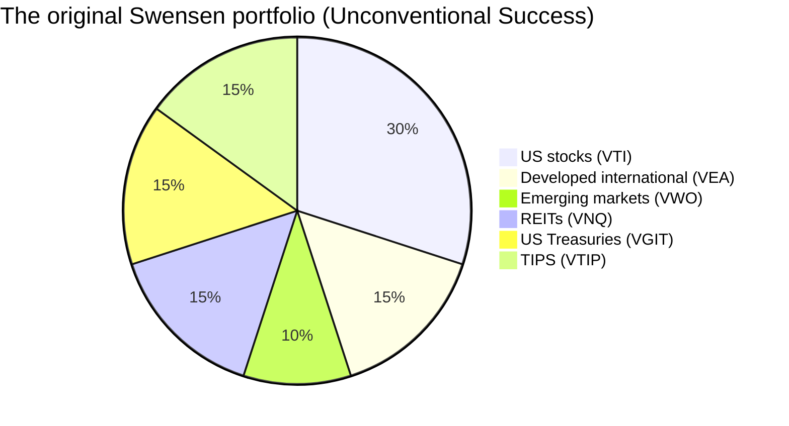
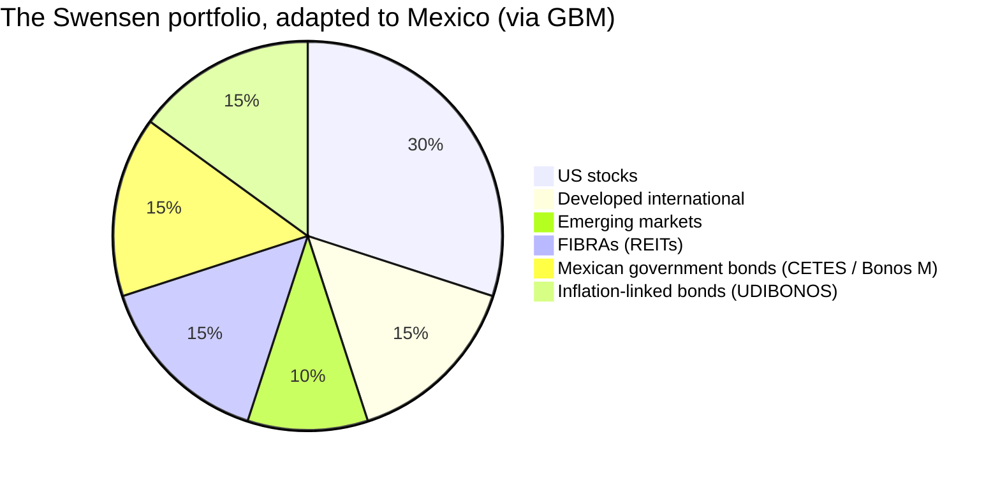
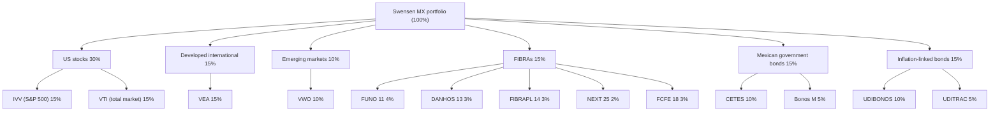

> David Swensen ran Yale's endowment for 36 years and turned roughly $1 billion into more than $40 billion.
> Then he wrote *Unconventional Success* so the rest of us could steal his homework.
> This is that homework, translated to the Mexican market and executed from a GBM account.

<!--more-->

## 📌 TL;DR

* **The original portfolio:** six asset classes, 70% equities and 30% fixed income, nothing but index funds, zero stock-picking, and relentless rebalancing.
* **The transformation rule:** when Mexico has a faithful local equivalent, use it (FIBRAs, CETES, UDIBONOS).
  When it doesn't, keep the original US instrument and buy it through GBM's SIC.
* **The result:** the exact same 30-15-10-15-15-15 allocation, with roughly 55% in dollars and 45% in pesos.
* **The catch:** it is boring on purpose.
  That is the point.

---

## The Man Behind the Model

If you follow money at all, you know the name.

David Swensen spent 36 years as Yale University's chief investment officer, growing the endowment from about $1 billion to more than $40 billion.
He pioneered what the industry now calls the **endowment model**: a heavy tilt toward equities and real assets, a thin sliver of bonds, a stubborn commitment to rebalancing, and zero patience for hot-shot managers charging 2-and-20.

In 2005 he published *Unconventional Success*, which handed the same playbook to everyday investors.
And here is the kicker, gringo: the whole thing is almost comically boring.
No meme stocks.
No crypto.
No picking the next Apple.
Just six asset classes, low-cost funds, and the discipline to buy whatever is down and trim whatever is up.

Boring beats exciting.
That is the entire secret.

## The Original Portfolio: Six Assets, 70/30

Swensen's recommendation for the individual investor breaks down like this:

| Instrument | What it is | Why Swensen used it |
| :--- | :--- | :--- |
| **VTI** | The whole US stock market | The core of global equity value, over 3,500 companies |
| **VEA** | Developed markets outside the US | Europe, Japan, Canada, Australia |
| **VWO** | Emerging markets | China, India, Taiwan, Brazil, Korea |
| **VNQ** | US real estate (REITs) | Diversification into real assets |
| **VGIT** | Intermediate US Treasuries | Ballast for the portfolio |
| **VTIP** | Short-term inflation-protected bonds | Protection against inflation |

Notice the fixed income is not an afterthought.
Thirty percent in bonds, fifteen percent of the whole portfolio dedicated to inflation protection.
Swensen was planning for a world where the dollar quietly rots, and he wanted his portfolio to rot slower.

## The One-to-One Transformation Rule

Here is the problem: that portfolio is pure America.

VTI, VEA, VWO, VNQ, VGIT, VTIP.
Six US tickers, and if you live in Mexico, you might reasonably wonder whether any of this works south of the border.

It does, and the rule is brutally simple:

* If Mexico has a **faithful local equivalent**, use that instead: FIBRAs for REITs, CETES and Bonos M for Treasuries, UDIBONOS for TIPS.
* If there is **no faithful local equivalent**, keep the original US instrument, which GBM makes available through the Sistema Internacional de Cotizaciones (SIC).

Nothing about the allocation changes.
You just swap the plumbing.

| Original class | % | Original | GBM transformation | Local or US? |
| :--- | :---: | :--- | :--- | :--- |
| US stocks | 30% | VTI | IVV + VTI (via SIC); peso option: IVVPESO | US (preferred) |
| Developed international | 15% | VEA | VEA (via SIC) | US (same ticker) |
| Emerging markets | 10% | VWO | VWO (via SIC) | US (same ticker) |
| REITs | 15% | VNQ | FIBRAs: FUNO 11, DANHOS 13, FIBRAPL 14, NEXT 25, FCFE 18 (or ETF FIBRATC 14) | Local |
| US Treasuries | 15% | VGIT | CETES and Bonos M | Local (preferred) |
| TIPS | 15% | VTIP | UDIBONOS and UDITRAC | Local (preferred) |

## The Adapted Portfolio

The pieces that go local are exactly the ones with a homegrown equivalent.
Real estate becomes FIBRAs.
US Treasuries become Mexican government debt.
TIPS become UDIBONOS.
Everything else stays in the original US ETFs.

## The Full Allocation Tree

## Asset Class by Asset Class

### US Stocks (30%) - Original: VTI

| Slice | % | Buy on GBM | Why |
| :--- | :---: | :--- | :--- |
| S&P 500 (large caps) | 15% | **IVV** (via SIC) | The ~500 biggest companies in America, home to Apple, Microsoft, and Nvidia. Cheap, liquid, and the gravitational center of global equities. |
| Total US market | 15% | **VTI** (via SIC) | Swensen's original ticker. Over 3,500 companies, including mid and small caps, so more diversified than the S&P 500 alone. |

Why this class exists:

* The US concentrates most of the world's stock market value, and its companies enjoy durable competitive advantages.
* The equity sleeve stays in US dollars by design: from GBM you buy it directly through the SIC.
* **Peso option:** if you prefer not to hold dollars, **IVVPESO** (S&P 500 with currency hedging) can replace part of IVV/VTI.

### Developed International (15%) - Original: VEA

| Slice | % | Buy on GBM | Why |
| :--- | :---: | :--- | :--- |
| Developed ex-US | 15% | **VEA** (via SIC) | Follows the FTSE Developed ex-US: Europe, Japan, Canada, Australia. Mature economies with deep capital markets. |

Why this class exists:

* It diversifies away from the US and reduces dependence on a single market.
* The original instrument is kept because no faithful local equivalent exists.

### Emerging Markets (10%) - Original: VWO

| Slice | % | Buy on GBM | Why |
| :--- | :---: | :--- | :--- |
| Global emerging markets | 10% | **VWO** (via SIC) | Follows the FTSE Emerging Markets: China, India, Taiwan, Brazil, Korea. Higher growth potential in exchange for more volatility. |

Why this class exists:

* Emerging markets trade cheaper and grow faster over the long run than developed ones.
* The US instrument is kept because there is no faithful local equivalent.
* Note: Mexico is not in this sleeve because the portfolio chose US equities as its core.
  If you wanted local exposure, NAFTRAC would be the natural piece, but it is not part of this version.

### FIBRAs (15%) - Original: VNQ

| Slice | % | Buy on GBM | Why |
| :--- | :---: | :--- | :--- |
| Diversified FIBRA | 4% | **FUNO 11** (Fibra Uno) | Mexico's largest FIBRA. A mix of offices, malls, industrial, and hotels across multiple cities. The most liquid, with the longest distribution history. |
| Mall-focused FIBRA | 3% | **DANHOS 13** (Fibra Danhos) | Focused on high-end malls in prime Mexico City spots (Paseo Santa Fe, Parque Delta). Rock-solid financials: LTV of 14% (lowest in the market), P/AFFO of 9.8x, cap rate of 10.97%. |
| Industrial FIBRA | 3% | **FIBRAPL 14** (Fibra Prologis) | The Mexican counterpart of Prologis, the world's largest logistics landlord. Directly exposed to nearshoring and industrial park demand. |
| Nearshoring industrial FIBRA | 2% | **NEXT 25** (Fibra Next) | Industrial FIBRA focused on logistics parks for manufacturing relocations. One of the best value plays around: 16.2% discount to NAV, cap rate of 11.99%, occupancy of 97.8%, P/AFFO of 15.0x, moderate LTV of 33.1%. |
| Infrastructure and towers FIBRA | 3% | **FCFE 18** (Fibra CFE) | A FIBRA E that leases telecom towers to CFE Telecomunicaciones. Long-term contract backed by the state, steady income (yield of 10.89%), and diversification away from traditional real estate. |

Why this class exists:

* FIBRAs are the Mexican equivalent of REITs (VNQ), which is why this is the sleeve that goes local.
* The selection leans on fundamentals from [ingresopasivo.mx](https://ingresopasivo.mx/fibras): price, NAV/CBFI, discount or premium, cap rate, P/AFFO, yield, LTV, and occupancy.
* The idea is to combine different segments (mixed, retail, industrial, infrastructure) and buy especially when the price sits at a discount to NAV.
* **Why NEXT 25 and not TERRA 13:** TERRA 13 is out by design.
  Among industrial FIBRAs, NEXT 25 trades at a discount (16.2%) with a high cap rate (11.99%), while FNOVA 17, the other industrial option, trades 48% above its NAV (a premium) with a cap rate of just 4.75%.
* FIBRA distributions enjoy favorable ISR tax treatment.
* **Simplicity option:** if you would rather not pick FIBRAs one by one, put the whole 15% into **FIBRATC 14**, the BBVA ETF tracking the S&P/BMV FIBRAS index.

### Mexican Government Bonds (15%) - Original: VGIT

| Slice | % | Buy on GBM | Why |
| :--- | :---: | :--- | :--- |
| Short term and liquidity | 10% | **CETES** | The risk-free rate in pesos. Buy at 91 or 182 days, defined maturity, pure stability. The conservative base that balances equity volatility. |
| Medium-term fixed rate | 5% | **Bonos M** | Mexican government bonds at a fixed rate with 3-5 year maturities. More yield than CETES in exchange for a bit more rate risk. |

Why this class exists:

* This sleeve replaces US Treasuries (VGIT) with their local equivalent: Mexican government debt.
* Local wins because your expenses are in pesos, and Mexican government debt removes currency risk from this part of the portfolio.
* Keeping some CETES also gives you dry powder to rebalance when the market takes a dive.

### Inflation-Linked Bonds (15%) - Original: VTIP

| Slice | % | Buy on GBM | Why |
| :--- | :---: | :--- | :--- |
| Direct inflation protection | 10% | **UDIBONOS** | Government bonds whose principal and yield track INPC, Mexican inflation. They protect real purchasing power. Buy via GBM or CETES Directo. |
| Inflation-linked bond ETF | 5% | **UDITRAC** | iShares ETF tracking the S&P/Valmer UDIBONOS index (1+ years). Same protection, traded as easily as any stock on GBM. |

Why this class exists:

* This sleeve replaces US TIPS (VTIP) with its local equivalent.
* Swensen devotes a sixth of the portfolio to inflation protection, and for good reason.
* Local wins because UDIBONOS protect against Mexican inflation (INPC), the one you actually pay at the supermarket, not US inflation.
* Mixing direct UDIBONOS with UDITRAC combines maturity certainty with exchange liquidity.

## How to Actually Execute This on GBM

* **Pesos vs dollars:** SIC instruments (IVV, VTI, VEA, VWO) are bought in dollars.
  FIBRAs, CETES, Bonos M, UDIBONOS, and UDITRAC are bought in pesos.
* **Whole shares only:** the BMV does not do fractions for most of these.
  Buy whole titles and let rebalancing handle the rounding.
* **Rebalancing:** once or twice a year, sell what went up and buy what went down to return to target.
  Rebalancing is the discipline that makes the strategy work, not a suggestion.
* **Emergency fund:** keep it separate, in CETES, outside this strategy.
* **Taxes:** FIBRA distributions get favorable ISR treatment.
  Income from CETES, Bonos M, and UDIBONOS is declared on the annual return.
* **Dollar exposure:** this version leaves roughly 55% of the portfolio in dollar-denominated instruments (the equity sleeve).
  Fixed income, inflation protection, and FIBRAs stay in pesos.

## The Risks

* **Market risk:** US, developed, and emerging equities can fall hard, like 2008 or 2020.
* **Currency risk:** the equity sleeve is in dollars.
  If the peso strengthens, that sleeve can drop in peso terms even as the asset rises in dollars.
* **Interest rate risk:** Bonos M and UDITRAC fall in price if Banxico raises rates.
* **Real estate risk:** FIBRAs depend on occupancy, rents, and the rate cycle.
* **Local concentration risk:** the FIBRA market is small, and some names (DANHOS 13, FCFE 18) are less liquid than FUNO 11.
* **Past performance:** no instrument guarantees future returns, no matter how smart the man behind the model was.

> **Disclaimer:** this post is educational and does not constitute financial, tax, or legal advice.
> Before investing, review each instrument, understand your risk profile, and talk to a qualified professional.

## Sources and Further Reading

* Product factsheets from BlackRock (iShares), Vanguard, and BBVA for the ETFs and FIBRAs.
* Public documentation from the BMV and the Sistema Internacional de Cotizaciones (SIC).
* The S&P/BMV FIBRAS index and the S&P/Valmer Mexico (UDIBONOS) index.
* [ingresopasivo.mx](https://ingresopasivo.mx/fibras): fundamental analysis of FIBRAs (price, NAV/CBFI, discount or premium, cap rate, P/AFFO, yield, LTV, occupancy).
* Wikipedia: David F. Swensen and the Yale University endowment.
* Bogleheads: the *Unconventional Success* portfolio, with fund selections and historical returns.
