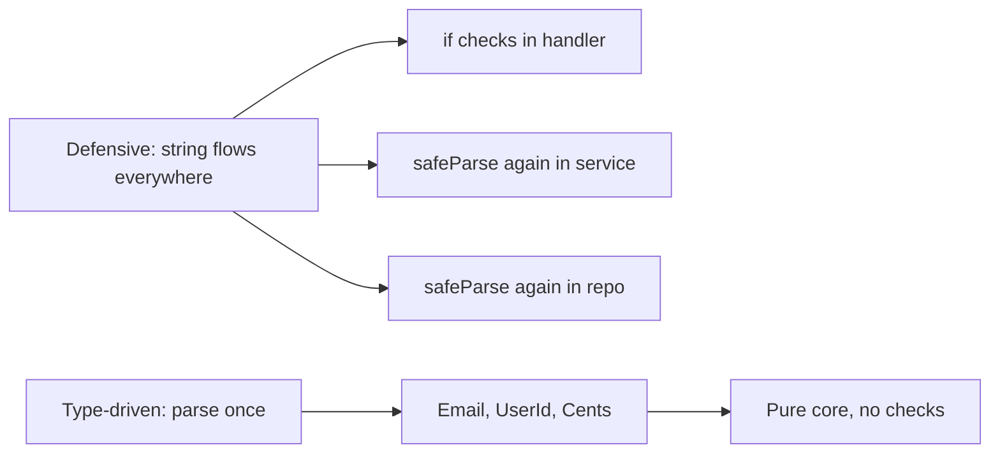
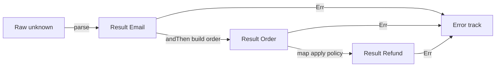
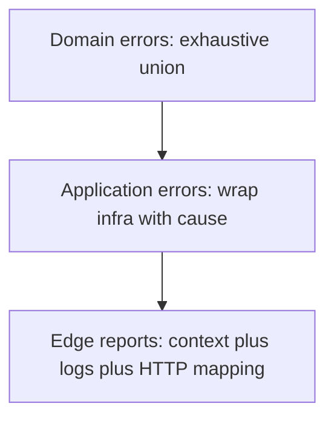
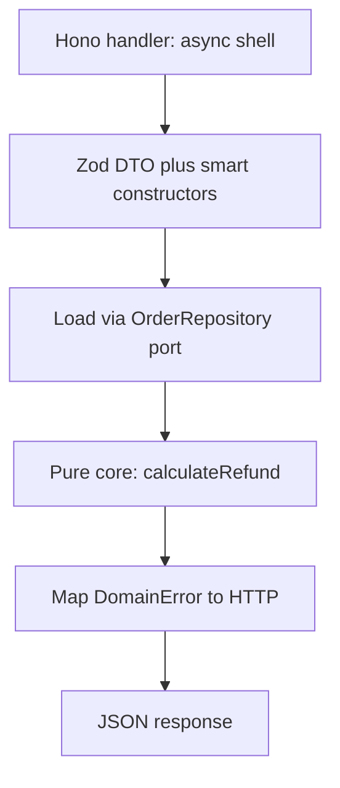

> *A junior developer validates nothing and hopes for the best.*
> *A mid-level developer validates everything, everywhere, with `if` statements on every layer.*
> *A senior developer parses once at the boundary and lets the type system prove the rest.*
> - <cite>Software Engineering Proverb, TypeScript edition</cite>

<!--more-->

## TL;DR

* **Validate once, at the edge.**
Expect untrusted `string`, `number`, and `unknown` at the system boundary.
Parse them there into proof-bearing domain types.
* **Parse, don't validate.**
Validation keeps the weak type and returns `boolean`.
Parsing consumes the weak type and returns `Result<StrongType, Error>`.
* **Model the domain with types.**
Use branded types, smart constructors, sum types, product types, and total functions.
Make illegal states unrepresentable by construction.
* **Stratify errors.**
Use an exhaustive discriminated union for domain errors and wrap infrastructure failures with `cause` only at the application edge.
* **Push invariants into the compiler.**
Use the type-state pattern, zero-runtime brands, and a pure functional core wrapped by a thin Hono or Fastify and Zod shell with interface ports.
```json
// package.json sketch with pinned versions.
{
  "dependencies": { "hono": "^4", "zod": "^3", "ts-pattern": "^5" },
  "devDependencies": { "fast-check": "^3", "vitest": "^2", "typescript": "^5" }
}
```

* This post is the TypeScript chapter of the Error Handling series.
It assumes TypeScript 5.x in `strict` mode plus `noUncheckedIndexedAccess`, and uses Zod, ts-pattern, fast-check, and Hono or Fastify for examples. It builds every pattern from unions, modules, and `Result`.

---

## 1. Introduction: The Antipattern of Defensive TypeScript

The tempting habit in TypeScript is to accept `string`, `number`, and `unknown` in every function and re-check them on every layer.
You validate the same payload in the handler, then in the service, then in the repository, because no signature records what was already proven.
Type erasure makes this habit feel responsible.
It is not.
It is expensive, noisy, and fragile.

Consider the classic primitive soup.

```ts
// ❌ Antipattern: primitives flow through every layer.
import type { Request, Response } from "express";

interface Db {
  getUser: (userId: string) => Promise<{ stripeId: string } | null>;
}

declare const db: Db;
declare const gateway: { refund: (stripeId: string, amount: number) => Promise<void> };

export async function processRefund(req: Request, res: Response): Promise<void> {
  try {
    const body: unknown = req.body;

    // Defensive check 1: who validated the payload shape?
    if (typeof body !== "object" || body === null) {
      throw new Error("Invalid payload");
    }
    const payload = body as { userId?: unknown; amount?: unknown };

    // Defensive check 2: who validated userId?
    if (typeof payload.userId !== "string" || payload.userId.trim() === "") {
      throw new Error("Missing UserId");
    }

    // Defensive check 3: who validated amount?
    if (typeof payload.amount !== "number" || !(payload.amount > 0)) {
      throw new Error("Invalid amount");
    }

    const user = await db.getUser(payload.userId);
    if (user === null) {
      throw new Error("User not found"); // Expected error? Or DB bug?
    }

    // Business logic is buried under guards.
    await gateway.refund(user.stripeId, payload.amount);
    res.status(200).send("Success");
  } catch (error) {
    // Is this a 400 typo or a 500 outage? The type is unknown.
    const message = error instanceof Error ? error.message : "Unknown error";
    res.status(400).send({ error: message });
  }
}

export async function sendReceipt(userId: string, amount: number): Promise<void> {
  // Same checks, copied again, because string proves nothing.
  if (userId.trim() === "") {
    throw new Error("Invalid userId");
  }
  if (!(amount > 0)) {
    throw new Error("Invalid amount");
  }
  // ... send email ...
}
```

This code compiles, passes review, and slowly rots the codebase.
Every function repeats the same three guards.
Every caller wonders whether the callee already checked.
Every change to the email rule requires a shotgun edit across handlers, services, and repositories.
A more insidious variant repeats `RefundSchema.safeParse()` in each layer instead of raw `if` statements.
The shape changed but the architecture did not.
You still pay the parse cost on the hot path and you still couple business rules to infrastructure code.
The deepest cost is paranoia.
No signature tells you what is already proven, so you check again.

TypeScript gives you a better contract, within the limits of erasure.
Parse untrusted data once at the boundary.
Hand the core only types that cannot be wrong by discipline.
Delete the duplicated guards forever.



The rest of this guide shows how to build that contract in five pillars, honestly accounting for what the compiler can and cannot enforce.

---

## 2. The Paradigm Shift: Parse, Don't Validate

Alexis King captured the core idea in [Parse, don't validate](https://lexi-lambda.github.io/blog/2019/11/05/parse-don-t-validate/) (2019).
Validation inspects a value and keeps the weak type.
Parsing consumes the weak type and produces a strong type with the proof embedded in it.
That distinction changes your architecture.

Validation has this shape.
It answers a question and throws the answer away.

```ts
// Validation: checks, then keeps string.
// Every downstream function must ask again.
export function isValidEmail(raw: string): boolean {
  const parts = raw.split("@");
  return parts.length === 2 && parts[0] !== "" && parts[1] !== undefined && parts[1].includes(".");
}

export function notify(rawEmail: string): void {
  if (isValidEmail(rawEmail)) {
    // rawEmail is still string here.
    // The compiler learned nothing.
    // The next function must check again.
    console.log(`sending to ${rawEmail}`);
  }
}
```

Parsing has a different shape.
It transforms and certifies in one move.

```ts
// Parsing: consumes unknown, produces proof-bearing Email.
// Single brand system used everywhere: Brand<string, Name>.
import type { Brand } from "./brand.js";
export type Email = Brand<string, "Email">;

export type EmailError =
  | { readonly kind: "NotAString" }
  | { readonly kind: "MissingAt" }
  | { readonly kind: "EmptyLocalPart" }
  | { readonly kind: "InvalidDomain" };

export type Result<T, E> =
  | { readonly ok: true; readonly value: T }
  | { readonly ok: false; readonly error: E };

export function parseEmail(raw: unknown): Result<Email, EmailError> {
  if (typeof raw !== "string") {
    return { ok: false, error: { kind: "NotAString" } };
  }
  if (raw.length > 254) {
    return { ok: false, error: { kind: "InvalidDomain" } };
  }
  const trimmed = raw.trim();
  // Strict matrix: exactly one @, no whitespace, dot not at edges, no double dot.
  // Rejects a@b@c.com, a@@b.com, a b@c.com, a@b..com, a@b.
  if (trimmed.split("@").length !== 2) {
    return { ok: false, error: { kind: "MissingAt" } };
  }
  if (/\s/.test(trimmed)) {
    return { ok: false, error: { kind: "InvalidDomain" } };
  }
  const at = trimmed.indexOf("@");
  const local = trimmed.slice(0, at);
  const domain = trimmed.slice(at + 1);
  if (local === "") {
    return { ok: false, error: { kind: "EmptyLocalPart" } };
  }
  if (!domain.includes(".") || domain.includes("..") || domain.startsWith(".") || domain.endsWith(".")) {
    return { ok: false, error: { kind: "InvalidDomain" } };
  }
  // The single sanctioned cast in the codebase.
  // It lives here, reviewed once, tested with fast-check.
  return { ok: true, value: trimmed as Email };
}

export function notifyParsed(email: Email): void {
  // No check here. The type is the proof.
  console.log(`sending to ${email}`);
}
```

After `parseEmail` succeeds, no downstream function checks the `@` again.
The type is the proof.
The signature `notifyParsed(email: Email)` documents the invariant better than any comment.

Here is the architectural boundary you want.

```text
                       SYSTEM BOUNDARY
   Untrusted outside              Parsed inside
┌──────────────────┐     ┌─────────────────────────────┐
│ string           │     │ Email, UserId, Cents        │
│ number           │────▶│ Order, Refund, Policy       │
│ unknown JSON     │parse │ Proof-bearing domain types  │
│ Raw query params │     │ Total functions only        │
└──────────────────┘     └─────────────────────────────┘
        │                             │
   may be anything              illegal states are unrepresentable
   must be checked              must only be composed
```

The rule is simple.
Data crosses the boundary as `string` and `unknown`.
It travels inside the core as `Email`, `UserId`, and `Cents`.
The parser lives in exactly one module per type.
Everything behind it composes without guards.
This is the same move Edwin Brady teaches in *Type-Driven Development with Idris*.
Let the type guide the control flow.
Reject bad programs as early as the type system allows instead of discovering them in production logs.

---

## 3. Pillar 1: Domain Modeling with Branded Types, Value Objects, and Smart Constructors

Eric Evans calls them Value Objects in *Domain-Driven Design*.
They are small, immutable, self-validating concepts with no identity beyond their value.
TypeScript models them with branded types plus a smart constructor.
Module privacy plus a private constructor provides the discipline that the runtime cannot.

Start with a reusable brand helper.
It costs nothing at runtime because it exists only in the type checker.

```ts
// domain/brand.ts - zero-runtime foundation.
export type Brand<T, Name extends string> = T & { readonly __brand: Name };

export type Email = Brand<string, "Email">;
export type UserId = Brand<string, "UserId">;
export type OrderId = Brand<string, "OrderId">;
export type Cents = Brand<number, "Cents">;
export type LastFour = Brand<string, "LastFour">;
export type Iban = Brand<string, "Iban">;
```

Each brand is a distinct string literal, so `Email` is not assignable to `UserId` even though both wrap `string`.
A bare `string` is not assignable to either.
That is the whole trick.
This `Brand` helper replaces the introductory `unique symbol` sketch from the previous section with a single reusable pattern.

Now put each smart constructor in its own module and export only the type and the parser, never a raw factory.

```ts
// domain/email.ts - the only module allowed to mint Email.
import type { Email } from "./brand.js";
import type { Result } from "./result.js";

export type { Email } from "./brand.js";

export type EmailError =
  | { readonly kind: "NotAString" }
  | { readonly kind: "MissingAt" }
  | { readonly kind: "EmptyLocalPart" }
  | { readonly kind: "InvalidDomain" };

export function parseEmail(raw: unknown): Result<Email, EmailError> {
  if (typeof raw !== "string") {
    return { ok: false, error: { kind: "NotAString" } };
  }
  if (raw.length > 254) {
    return { ok: false, error: { kind: "InvalidDomain" } };
  }
  const trimmed = raw.trim();
  // Strict matrix: exactly one @, no whitespace, dot not at edges, no double dot.
  // Rejects a@b@c.com, a@@b.com, a b@c.com, a@b..com, a@b.
  if (trimmed.split("@").length !== 2) {
    return { ok: false, error: { kind: "MissingAt" } };
  }
  if (/\s/.test(trimmed)) {
    return { ok: false, error: { kind: "InvalidDomain" } };
  }
  const at = trimmed.indexOf("@");
  const local = trimmed.slice(0, at);
  const domain = trimmed.slice(at + 1);
  if (local === "") {
    return { ok: false, error: { kind: "EmptyLocalPart" } };
  }
  if (!domain.includes(".") || domain.includes("..") || domain.startsWith(".") || domain.endsWith(".")) {
    return { ok: false, error: { kind: "InvalidDomain" } };
  }
  return { ok: true, value: trimmed as Email };
}

export function emailToString(email: Email): string {
  // Brands are strings at runtime, so this is a free coercion.
  return email;
}
```

```ts
// domain/money.ts - the same pattern for numeric invariants.
import type { Cents } from "./brand.js";
import type { Result } from "./result.js";

export type { Cents } from "./brand.js";

export type MoneyError =
  | { readonly kind: "NotANumber"; readonly received: unknown }
  | { readonly kind: "NotAnInteger"; readonly received: unknown }
  | { readonly kind: "NonPositive"; readonly received: unknown };

export function parseCents(raw: unknown): Result<Cents, MoneyError> {
  if (typeof raw !== "number" || !Number.isFinite(raw)) {
    return { ok: false, error: { kind: "NotANumber", received: raw } };
  }
  if (!Number.isInteger(raw)) {
    return { ok: false, error: { kind: "NotAnInteger", received: raw } };
  }
  if (raw <= 0) {
    return { ok: false, error: { kind: "NonPositive", received: raw } };
  }
  return { ok: true, value: raw as Cents };
}

function mintCentsUnchecked(value: number): Cents {
  // Module-private. Only refundShareTotal in this same money.ts calls it after checks.
  return value as Cents;
}

// No test export: fixtures use parseCents, never the private mint.

export function centsToNumber(amount: Cents): number {
  return amount;
}
```

For class-shaped aggregates, use a private constructor plus a `#private` field or a non-exported brand key so `new` cannot be called from outside.

```ts
// domain/order.ts - DDD aggregate with a guarded boundary.
import type { Cents, Email, OrderId, UserId } from "./brand.js";
import type { PaymentMethod } from "./payment.js";

const OrderTag: unique symbol = Symbol("OrderTag");

export interface Order {
  readonly id: OrderId;
  readonly userId: UserId;
  readonly email: Email;
  readonly amount: Cents;
  readonly method: PaymentMethod;
  readonly [OrderTag]: "Order";
}

export function createOrder(input: {
  readonly id: OrderId;
  readonly userId: UserId;
  readonly email: Email;
  readonly amount: Cents;
  readonly method: PaymentMethod;
}): Order {
  // Inputs are already proven, so no validation here.
  // The tag key is not exported, so only this module can build the literal.
  return { ...input, [OrderTag]: "Order" };
}
```

Zod and Effect Schema fit naturally as the parser implementation inside the smart constructor.
They are the bouncer, not the domain.

```ts
// domain/user-id.ts - the only module allowed to mint UserId.
import type { UserId } from "./brand.js";
import type { Result } from "./result.js";

export type UserIdError = { readonly kind: "InvalidUserId" };

export function parseUserId(raw: unknown): Result<UserId, UserIdError> {
  if (typeof raw !== "string") {
    return { ok: false, error: { kind: "InvalidUserId" } };
  }
  if (raw.length > 64) {
    return { ok: false, error: { kind: "InvalidUserId" } };
  }
  const trimmed = raw.trim();
  // Single owner of the uuid rule. Returns trimmed so "  uuid  " never leaks spaces.
  const uuidRe = /^[0-9a-f]{8}-[0-9a-f]{4}-[0-9a-f]{4}-[0-9a-f]{4}-[0-9a-f]{12}$/i;
  if (trimmed === "" || !uuidRe.test(trimmed)) {
    return { ok: false, error: { kind: "InvalidUserId" } };
  }
  return { ok: true, value: trimmed as UserId };
}

// domain/order-id.ts - the only module allowed to mint OrderId.
import type { OrderId } from "./brand.js";

export type OrderIdError = { readonly kind: "InvalidOrderId" };

export function parseOrderId(raw: unknown): Result<OrderId, OrderIdError> {
  if (typeof raw !== "string") {
    return { ok: false, error: { kind: "InvalidOrderId" } };
  }
  if (raw.length > 64) {
    return { ok: false, error: { kind: "InvalidOrderId" } };
  }
  const trimmed = raw.trim();
  if (trimmed === "") {
    return { ok: false, error: { kind: "InvalidOrderId" } };
  }
  return { ok: true, value: trimmed as OrderId };
}

// domain/refund-request.ts - schema-as-parser, brand-as-proof.
import { z } from "zod";
import { parseCents } from "./money.js";
import { parseEmail } from "./email.js";
import { parseUserId } from "./user-id.js";
import type { Cents, Email, UserId } from "./brand.js";
import type { Result } from "./result.js";

const RefundSchema = z.object({
  // Shape only with caps to bound regex/trim work. UUID format lives in parseUserId.
  userId: z.string().max(64),
  email: z.string().max(254),
  amount: z.number(),
});

export interface RefundRequest {
  readonly userId: UserId;
  readonly email: Email;
  readonly amount: Cents;
}

export type RefundRequestError =
  | { readonly kind: "BadShape"; readonly issues: string }
  | { readonly kind: "BadEmail"; readonly error: ReturnType<typeof parseEmail> extends { ok: false; error: infer E } ? E : never }
  | { readonly kind: "BadUserId" }
  | { readonly kind: "BadAmount" };

export function parseRefundRequest(data: unknown): Result<RefundRequest, RefundRequestError> {
  const shaped = RefundSchema.safeParse(data);
  if (!shaped.success) {
    return { ok: false, error: { kind: "BadShape", issues: shaped.error.message } };
  }
  const email = parseEmail(shaped.data.email);
  if (!email.ok) {
    return { ok: false, error: { kind: "BadEmail", error: email.error } };
  }
  const userId = parseUserId(shaped.data.userId);
  if (!userId.ok) {
    return { ok: false, error: { kind: "BadUserId" } };
  }
  const amount = parseCents(shaped.data.amount);
  if (!amount.ok) {
    return { ok: false, error: { kind: "BadAmount" } };
  }
  return {
    ok: true,
    value: {
      userId: userId.value,
      email: email.value,
      amount: amount.value,
    },
  };
}
```

Be honest about the limit.
In Rust, `pub struct Email(String)` with a private field is physically unforgeable outside the module.
In TypeScript, the brand is erased at runtime and any module can write `raw as Email`, including `{} as StagedOrder<Paid>`.
A non-exported key only hides the easy literal path, it does not create opacity.
Unforgeability here is disciplinary, not physical.
Sustain it with three rules: keep the `as` cast inside the smart constructor module only, forbid `as` elsewhere with an ESLint `no-restricted-syntax` rule targeting `TSAsExpression` with an allowlist for `domain/*`, and re-export the opaque type without re-exporting the brand key.
Review every new `as` like a `sudo` invocation.

---

## 4. Pillar 2: Functional Foundations (Algebraic Data Types and Total Functions)

Paul Chiusano and Runar Bjarnason teach this in *Functional Programming in Scala*.
Model with precise types, write total functions, and compose with combinators instead of throwing across the stack.
TypeScript unions and interfaces are algebraic data types, and a discriminated `Result` is your `Either` monad.

Sum types enumerate exclusive alternatives.

```ts
// domain/payment.ts - a sum type with three mutually exclusive cases.
import type { Iban, LastFour } from "./brand.js";
import type { Result } from "./result.js";

export type PaymentMethod =
  | { readonly kind: "card"; readonly lastFour: LastFour }
  | { readonly kind: "transfer"; readonly iban: Iban }
  | { readonly kind: "cash" };

export type LastFourError = { readonly kind: "InvalidLastFour"; readonly received: string };
export type IbanError = { readonly kind: "InvalidIban"; readonly received: string };

export function parseLastFour(raw: unknown): Result<LastFour, LastFourError> {
  if (typeof raw !== "string" || !/^[0-9]{4}$/.test(raw)) {
    return { ok: false, error: { kind: "InvalidLastFour", received: String(raw) } };
  }
  return { ok: true, value: raw as LastFour };
}

export function parseIban(raw: unknown): Result<Iban, IbanError> {
  if (typeof raw !== "string" || raw.length < 15 || raw.length > 32 || !/^[A-Z]{2}[0-9A-Z]+$/i.test(raw)) {
    return { ok: false, error: { kind: "InvalidIban", received: String(raw) } };
  }
  return { ok: true, value: raw as Iban };
}
```

The payloads are branded too: `lastFour` and `iban` are minted only by `parseLastFour` and `parseIban`, so a two-digit `"12"` never reaches the core.

Product types combine independent facts.

```ts
// domain/order-shape.ts - a product type with no optional escape hatches.
import type { Cents, Email, UserId } from "./brand.js";
import type { PaymentMethod } from "./payment.js";

export interface OrderShape {
  readonly userId: UserId;
  readonly email: Email;
  readonly amount: Cents;
  readonly method: PaymentMethod;
}
```

There is no `null`, no stringly typed `method: string`, and no half-built object.
Naming: `Order` in pillar 1 is the tagged aggregate, `OrderShape` here is its untagged product view for composition demos, and `OrderSnapshot` in the core is the persisted read view. All three share `OrderId`, `UserId`, `Email`, and `Cents`.
Exhaustiveness is enforced with a `never`-taking helper.

```ts
// domain/assert.ts
export function assertNever(value: never, message = "Unhandled case"): never {
  throw new Error(`${message}: ${JSON.stringify(value)}`);
}

export function feeFor(method: PaymentMethod): number {
  switch (method.kind) {
    case "card":
      return 30;
    case "transfer":
      return 10;
    case "cash":
      return 0;
    default:
      return assertNever(method);
  }
}
```

Add a new variant such as `{ kind: "crypto" }` and `feeFor` stops compiling until you handle it.
That compile break is the feature.

A total function is defined for 100 percent of its input values.
It never throws for expected cases, never returns `undefined` by surprise, and never hides an effect.
A partial function pretends to be total but explodes on some inputs.

```ts
// ❌ Partial: never throws, returns Infinity on zero and NaN silently, returns a bare number.
export function refundSharePartial(amount: number, parts: number): number {
  return amount / parts;
}

// ✅ Total: lives in domain/money.ts so mintCentsUnchecked stays in the defining module.
import type { Cents } from "./brand.js";
import type { Result } from "./result.js";

export type SplitError =
  | { readonly kind: "EmptyParts" }
  | { readonly kind: "NotDivisible"; readonly amount: number; readonly parts: number };

export function refundShareTotal(amount: Cents, parts: number): Result<Cents, SplitError> {
  if (!Number.isInteger(parts) || parts <= 0) {
    return { ok: false, error: { kind: "EmptyParts" } };
  }
  const share = amount / parts;
  if (!Number.isInteger(share)) {
    return { ok: false, error: { kind: "NotDivisible", amount, parts } };
  }
  return { ok: true, value: mintCentsUnchecked(share) };
}
```

Note the `strict` plus `noUncheckedIndexedAccess` discipline: indexing returns `T | undefined` and must be narrowed before use. Division and `any` JSON access are not compiler-checked in TypeScript, so return `Result` for them by discipline, not because the compiler forces it.
Total signatures force callers to confront edge cases at the call site.

Composition uses `map`, `andThen`, and `mapErr` instead of nested `if` pyramids.
This is Railway Oriented Programming from Scott Wlaschin, expressed with `Result`.



```ts
// domain/result.ts - the railway toolkit.
export type Result<T, E> =
  | { readonly ok: true; readonly value: T }
  | { readonly ok: false; readonly error: E };

export function ok<const T>(value: T): Result<T, never> {
  return { ok: true, value };
}

export function err<const E>(error: E): Result<never, E> {
  return { ok: false, error };
}

export function map<T, U, E>(result: Result<T, E>, fn: (value: T) => U): Result<U, E> {
  return result.ok ? { ok: true, value: fn(result.value) } : result;
}

export function andThen<T, U, E, F>(
  result: Result<T, E>,
  fn: (value: T) => Result<U, F>,
): Result<U, E | F> {
  return result.ok ? fn(result.value) : result;
}

export function mapErr<T, E, F>(result: Result<T, E>, fn: (error: E) => F): Result<T, F> {
  return result.ok ? result : { ok: false, error: fn(result.error) };
}
```

```ts
// domain/build-order.ts - chaining on the railway.
import { andThen, map, mapErr, ok } from "./result.js";
import type { Result } from "./result.js";
import { parseEmail } from "./email.js";
import { parseCents } from "./money.js";
import { parseUserId } from "./user-id.js";
import type { OrderShape } from "./order-shape.js";

export type BuildOrderError =
  | { readonly kind: "BadEmail"; readonly error: string }
  | { readonly kind: "BadAmount" }
  | { readonly kind: "BadUserId" };

export function buildOrderChained(
  rawEmail: unknown,
  rawAmount: unknown,
): Result<OrderShape, BuildOrderError> {
  // Each parse error is mapped to BuildOrderError, so the chain compiles.
  return andThen(
    mapErr(parseEmail(rawEmail), (e): BuildOrderError => ({ kind: "BadEmail", error: e.kind })),
    (email) =>
      andThen(
        mapErr(parseCents(rawAmount), (): BuildOrderError => ({ kind: "BadAmount" })),
        (amount) =>
          map(
            mapErr(
              parseUserId("00000000-0000-4000-8000-000000000000"),
              (): BuildOrderError => ({ kind: "BadUserId" }),
            ),
            (userId) => ({
              userId,
              email,
              amount,
              method: { kind: "cash" } as const,
            }),
          ),
      ),
  );
}
```

Combinators are precise but noisy for long chains, so TypeScript uses the manual `?` via early return.
It has the same short-circuit control flow, with different error-type ergonomics: `andThen` preserves the union automatically, early return requires you to map errors by hand.

```ts
export function buildOrderClean(rawEmail: unknown, rawAmount: unknown): Result<OrderShape, BuildOrderError> {
  const email = parseEmail(rawEmail);
  if (!email.ok) {
    return { ok: false, error: { kind: "BadEmail", error: email.error.kind } };
  }
  const amount = parseCents(rawAmount);
  if (!amount.ok) {
    return { ok: false, error: { kind: "BadAmount" } };
  }
  const userId = parseUserId("00000000-0000-4000-8000-000000000000");
  if (!userId.ok) {
    return { ok: false, error: { kind: "BadUserId" } };
  }
  return {
    ok: true,
    value: {
      userId: userId.value,
      email: email.value,
      amount: amount.value,
      method: { kind: "cash" },
    },
  };
}
```

Both versions keep two parallel tracks.
The happy track carries values forward.
The error track short-circuits without throwing.
The error type tells the handler exactly which status to return, so a 400 typo can never masquerade as a 500 outage.

---

## 5. Pillar 3: The Lisp Connection, Metaprogramming and Expression-Oriented Design

Abelson and Sussman celebrate in *Structure and Interpretation of Computer Programs* a style where programs are built from expressions that evaluate to values, and where code itself is data that programs can manipulate.
TypeScript is expression-oriented through ternaries, helper-based exhaustive matching such as `match` from `ts-pattern`, and values assigned directly.
TypeScript has no switch expression. Schemas are the second half: a Zod or Effect Schema is a composable descriptor of your domain that you can inspect, extend, and derive types from, not Lisp homoiconicity.

Prefer expressions over statements when building domain values.

```ts
// Expression-oriented construction: every branch yields a value.
import { match } from "ts-pattern";
import { parseEmail } from "./email.js";
import type { Email } from "./brand.js";
import type { Result } from "./result.js";

export function labelFor(amount: number): string {
  // The ternary chain is an expression assigned once.
  const tier = amount > 100_000 ? "enterprise" : amount > 1_000 ? "standard" : "micro";
  return tier;
}

export function describeResult(result: Result<Email, { kind: string }>): string {
  // ts-pattern match is an exhaustive expression.
  return match(result)
    .with({ ok: true }, ({ value }) => `valid: ${value}`)
    .with({ ok: false }, ({ error }) => `invalid: ${error.kind}`)
    .exhaustive();
}

export function emailOrFallback(raw: unknown, fallback: Email): Email {
  const parsed = parseEmail(raw);
  // No let-mutation dance. The conditional is the value.
  // Returns a proven Email in both branches, never null.
  // WARNING: fallback swallows the error. Prefer Result<Email, EmailError> when callers must react.
  return parsed.ok ? parsed.value : fallback;
}
```

No `let result;` dance.
No uninitialized variable.
The compiler checks that every branch yields the declared type, and `.exhaustive()` breaks the build when the union grows.

Code as data appears in two places: schemas you manipulate and types that compute.

```ts
// Schemas are manipulable ASTs: extend, pick, and intersect them.
import { z } from "zod";

const BaseRefundDto = z.object({
  orderId: z.string().uuid(),
  email: z.string(),
  amountCents: z.number(),
});

// Derive new schemas from data instead of copying fields.
export const RefundDto = BaseRefundDto.extend({
  idempotencyKey: z.string().uuid(),
});

export const RefundAmountOnly = BaseRefundDto.pick({ amountCents: true });

export type RefundDtoInput = z.input<typeof RefundDto>;
export type RefundDtoOutput = z.output<typeof RefundDto>;
```

```ts
// Types that compute: the compiler runs small programs at type level.
type EmailString = `${string}@${string}.${string}`;

type ExtractLocal<S extends string> = S extends `${infer Local}@${string}` ? Local : never;

type LocalOfExample = ExtractLocal<"alice@example.com">;
//   ^? type LocalOfExample = "alice"

// Narrow a parsed DTO with satisfies to keep literal types without widening.
// satisfies still checks assignability, including excess properties on literals.
const policy = {
  maxCents: 500_000,
  currency: "USD",
} as const satisfies { readonly maxCents: number; readonly currency: string };
```

`EmailString` is documentation, not proof: template literal types cannot check `trim()` or integer ranges, and they vanish at runtime.
Use them for autocomplete and readable errors, but keep the smart constructor as the single enforcement point.

Mechanize repetition with small helpers, never with hidden business logic.
One helper that does not earn its keep is a generic string-brand factory: its error type widens to `{ readonly kind: string }`, which no caller can exhaustively match, so a new failure mode slips past `assertNever`.
Delete it and keep one smart constructor per type with a closed error union, exactly like `parseEmail` and `parseCents` above.
Each module stays small, each error stays enumerable, and the compiler still breaks the build when the union grows.

```ts
// ❌ helpers/smart.ts - deleted. A generic factory widens errors to kind: string.
// No caller can exhaustively match `string`, so new failure modes go unnoticed.
// Keep one smart constructor per type with a closed error union instead:
// see parseEmail in domain/email.ts and parseCents in domain/money.ts above.
```

The rule for macros, decorators, and helpers is strict: the helper may remove boilerplate around `safeParse`, `trim`, and `transform`, but the invariant itself must stay visible in the domain module.
If a reviewer cannot see the email rule without opening the helper, the abstraction has gone too far.

---

## 6. Pillar 4: Exhaustive, Stratified Error Handling

Not all errors belong in the same type.
Domain errors are expected business outcomes and must be exhaustive.
Infrastructure errors are operational failures and need `cause` chains.
Mixing them in one `string` or one thrown `unknown` destroys that signal.

Stratify into three layers.



Model domain errors as a discriminated union.
Every variant is a business fact the caller must handle.

```ts
// domain/errors.ts - the exhaustive business vocabulary.
import type { EmailError } from "./email.js";
import type { Cents, OrderId } from "./brand.js";

export type DomainError =
  | { readonly kind: "InvalidEmail"; readonly error: EmailError }
  | { readonly kind: "InvalidAmount" }
  | { readonly kind: "ExceedsMax"; readonly max: Cents }
  | { readonly kind: "InvalidOrderId" }
  | { readonly kind: "UserNotFound"; readonly userId: UserId }
  | { readonly kind: "InsufficientFunds"; readonly requested: Cents; readonly balance: Cents }
  | { readonly kind: "AlreadyRefunded"; readonly orderId: OrderId };
```

Exhaustive `switch` now forces product decisions, and `assertNever` turns a forgotten case into a compile error.
The mapping returns the closed union `HttpStatus`, so `return 999` fails the build.

```ts
// domain/status.ts - single mapping shared by shell and app, checked by the compiler.
import { assertNever } from "./assert.js";
import type { DomainError } from "./errors.js";

export type HttpStatus = 400 | 404 | 422 | 500;

export function domainToStatus(error: DomainError): HttpStatus {
  switch (error.kind) {
    case "InvalidEmail":
    case "InvalidAmount":
    case "InvalidOrderId":
      return 400;
    case "ExceedsMax":
      return 422;
    case "UserNotFound":
      return 404;
    case "InsufficientFunds":
    case "AlreadyRefunded":
      return 422;
    default:
      return assertNever(error);
  }
}

export function domainToMessage(error: DomainError): string {
  switch (error.kind) {
    case "InvalidEmail":
      return `invalid email: ${error.error.kind}`;
    case "InvalidAmount":
      return "invalid amount: must be a positive integer";
    case "InvalidOrderId":
      return "invalid order id";
    case "ExceedsMax":
      return `amount exceeds maximum ${error.max}`;
    case "UserNotFound":
      return "user not found";
    case "InsufficientFunds":
      return "insufficient funds";
    case "AlreadyRefunded":
      return `refund already processed for order ${error.orderId}`;
    default:
      return assertNever(error);
  }
}
```

Wrap infrastructure errors once at the application layer with an explicit `cause`.

```ts
// app/errors.ts - domain facts plus operational failures.
// App imports status from domain, never from shell. Single table, no duplication.
import { domainToStatus, type HttpStatus } from "../domain/status.js";

export type AppError =
  | { readonly kind: "Domain"; readonly error: DomainError }
  | { readonly kind: "Database"; readonly cause: unknown }
  | { readonly kind: "Gateway"; readonly cause: unknown };

export function appToStatus(error: AppError): HttpStatus {
  switch (error.kind) {
    case "Domain":
      return domainToStatus(error.error);
    case "Database":
    case "Gateway":
      return 500;
    default:
      return assertNever(error);
  }
}
```

Add context and logs only at the edge, where humans read them.

```ts
// shell/handler-helpers.ts - edge-only enrichment.
import type { AppError } from "../app/errors.js";
import { domainToMessage, domainToStatus } from "../domain/status.js";

export interface ErrorReport {
  readonly status: number;
  readonly body: { readonly error: string };
}

export function reportAppError(error: AppError, logger: { error: (message: string, details?: unknown) => void }): ErrorReport {
  // Domain is never imported by a logger module; the shell owns this call.
  if (error.kind === "Domain") {
    return { status: domainToStatus(error.error), body: { error: domainToMessage(error.error) } };
  }
  logger.error("infrastructure failure", { kind: error.kind, cause: error.cause });
  return { status: 500, body: { error: "internal error" } };
}
```

Three rules keep the stratification honest.
Never return `unknown` from a domain function: name the union instead.
Never throw a `string` or a bare `Error` from the domain: return `Result<T, DomainError>`.
Never let the domain import the HTTP logger or framework types: the dependency arrow points inward from shell to core, never outward.

---

## 7. Pillar 5: Compile-Time Invariants with the Type-State Pattern

Some invariants are not about single values but about sequences.
An order cannot be paid before it is submitted.
A refund cannot be issued twice.
Runtime booleans like `isSubmitted` can be forgotten or checked in the wrong order.
Type-state encodes the workflow in generics so wrong sequences do not compile.

This is Brady-style type-driven design applied to business lifecycles.

```ts
// domain/order-lifecycle.ts - workflow encoded in the generic slot.
import type { Cents, OrderId } from "./brand.js";

export interface Draft {
  readonly stage: "draft";
}
export interface Submitted {
  readonly stage: "submitted";
}
export interface Paid {
  readonly stage: "paid";
}

export type OrderStage = Draft | Submitted | Paid;

// Lifecycle uses StagedOrder, never the core Order, so the two never collide.
// Brand<string> itself emits no JS. Symbol() and object spreads below emit one Symbol
// plus one object per transition. Keep lifecycle construction out of the hot path.
export const StageTag: unique symbol = Symbol("StageTag");

export interface StagedOrder<S extends OrderStage> {
  readonly id: OrderId;
  readonly amount: Cents;
  readonly stage: S["stage"];
  // With declaration:true this exported interface needs an exported tag, hence export const above.
  // Export does not allow forging without as, opacity stays disciplinary.
  readonly [StageTag]: S;
}

export function createDraftOrder(id: OrderId, amount: Cents): StagedOrder<Draft> {
  // Same-module mint: StageTag and StagedOrder live in order-lifecycle.ts, so these casts are sanctioned.
  return { id, amount, stage: "draft", [StageTag]: { stage: "draft" } as Draft };
}

export function submitOrder(order: StagedOrder<Draft>): StagedOrder<Submitted> {
  // Conceptually consumes the draft: callers should drop the old binding.
  return { id: order.id, amount: order.amount, stage: "submitted", [StageTag]: { stage: "submitted" } as Submitted };
}

export function payOrder(order: StagedOrder<Submitted>): StagedOrder<Paid> {
  return { id: order.id, amount: order.amount, stage: "paid", [StageTag]: { stage: "paid" } as Paid };
}

// Only paid orders expose a receipt.
export function receiptFor(order: StagedOrder<Paid>): string {
  return `paid ${order.amount} for ${order.id}`;
}
```

Correct usage flows through the compiler.

```ts
import { parseCents } from "./money.js";
import { parseOrderId } from "./order-id.js";

const demoOrderId = parseOrderId("ord_1");
if (!demoOrderId.ok) {
  throw new Error("bad fixture");
}
const demoAmount = parseCents(5000);
if (!demoAmount.ok) {
  throw new Error("bad fixture");
}
const draft = createDraftOrder(demoOrderId.value, demoAmount.value);
const submitted = submitOrder(draft);
const paid = payOrder(submitted);
console.log(receiptFor(paid));
```

Illegal transitions do not compile.

```ts
// @ts-expect-error - cannot pay a draft: payOrder needs StagedOrder<Submitted>.
const _illegal = payOrder(draft);

// @ts-expect-error - receipt needs StagedOrder<Paid>, not StagedOrder<Submitted>.
const _early = receiptFor(submitted);
```

TypeScript cannot destroy the old `draft` binding the way Rust moves it.
`submitOrder(draft)` does not invalidate `draft` at runtime.
Sustain the pattern by discipline: prefer rebinding (`let order = createDraftOrder(...); order = submitOrder(order)`) or new names (`const submitted = submitOrder(order)`), lint against reuse after transition in small modules, and keep the `StageTag` value module-private in real code (exported here only for `declaration:true`). Forging still needs `as`, so opacity stays disciplinary.
Honesty matters here: the compiler proves the new value has the right stage, but only code review proves the old binding was dropped.

Use type-state when the sequence matters and the cost of a wrong transition is high: payments, provisioning, publishing, and multi-step onboarding.
A good heuristic is two or more ordered states with different available operations.
Do not use it for every boolean, or generic noise will drown the domain.
A single `isArchived` flag with one branch is a runtime check, not a lifecycle.
`alreadyRefunded: boolean` in OrderSnapshot covers persistence across restarts. `StagedOrder` prevents illegal in-memory transitions. Use both: type-state for moves, flag for storage.

---

## 8. Advanced Engineering: Zero-Runtime Brands and Property-Based Testing

Brands are a genuinely zero-cost abstraction in TypeScript.
`type Email = string & { __brand: "Email" }` emits no JavaScript at all.
There is no wrapper object, no allocation, and no indirection on the hot path.
The proof lives entirely in the checker and disappears from the bundle.

That property dictates the performance rule: parse once at the edge, then pass the branded value by reference.
Never call `safeParse` again inside the service and the repository for a value that is already branded.

```ts
// ❌ Wasteful: re-parsing a proven value on the hot path.
import { z } from "zod";

const AmountSchema = z.number().int().positive();

export function chargeTwice(rawAmount: unknown): void {
  const first = AmountSchema.safeParse(rawAmount);
  if (!first.success) {
    return;
  }
  // ... later, in another layer ...
  const second = AmountSchema.safeParse(first.data); // Redundant work.
  if (!second.success) {
    return;
  }
}

// ✅ Parse once, thread the brand.
import type { Cents } from "./brand.js";
import { parseCents } from "./money.js";

export function chargeOnce(rawAmount: unknown): void {
  const parsed = parseCents(rawAmount);
  if (!parsed.ok) {
    return;
  }
  applyCharge(parsed.value); // No second parse. Cents is already proven.
}

function applyCharge(_amount: Cents): void {
  // Hot path: zero checks, zero allocations beyond the number itself.
}
```

Parsing logic deserves stronger tests than hand-picked examples.
Property-based testing with `fast-check` throws hundreds of synthetic inputs at your smart constructor, including Unicode, control characters, and pathological lengths.

```ts
// domain/email.properties.test.ts
import { describe, expect, test } from "vitest";
import * as fc from "fast-check";
import { parseEmail } from "./email.js";

describe("parseEmail properties", () => {
  test("valid shaped emails always parse", () => {
    fc.assert(
      fc.property(
        fc.tuple(
          fc.stringOf(fc.constantFrom(..."abcdefghijklmnopqrstuvwxyz0123456789"), { minLength: 1, maxLength: 16 }),
          fc.stringOf(fc.constantFrom(..."abcdefghijklmnopqrstuvwxyz"), { minLength: 1, maxLength: 8 }),
          fc.stringOf(fc.constantFrom(..."abcdefghijklmnopqrstuvwxyz"), { minLength: 2, maxLength: 4 }),
        ),
        ([local, domain, tld]) => {
          const result = parseEmail(`${local}@${domain}.${tld}`);
          expect(result.ok).toBe(true);
        },
      ),
      { seed: 42, numRuns: 1000 },
    );
  });

  test("missing @ never parses", () => {
    fc.assert(
      fc.property(fc.string({ minLength: 1, maxLength: 32 }).filter((s) => !s.includes("@")), (raw) => {
        expect(parseEmail(raw).ok).toBe(false);
      }),
      { seed: 42, numRuns: 1000 },
    );
  });

  test("double @ never parses", () => {
    fc.assert(
      fc.property(
        fc.tuple(
          fc.stringOf(fc.constantFrom(..."abcdefghijklmnopqrstuvwxyz"), { minLength: 1, maxLength: 8 }),
          fc.stringOf(fc.constantFrom(..."abcdefghijklmnopqrstuvwxyz"), { minLength: 1, maxLength: 8 }),
          fc.stringOf(fc.constantFrom(..."abcdefghijklmnopqrstuvwxyz"), { minLength: 2, maxLength: 4 }),
        ),
        ([a, b, c]) => {
          expect(parseEmail(`${a}@${b}@${c}`).ok).toBe(false);
        },
      ),
      { seed: 42, numRuns: 1000 },
    );
  });

  test("parse never throws on arbitrary unicode", () => {
    fc.assert(
      fc.property(fc.fullUnicodeString(), (raw) => {
        // Any string must map to Ok or Err, never throw.
        expect(() => parseEmail(raw)).not.toThrow();
      }),
      { seed: 42, numRuns: 1000 },
    );
  });

  test("parsed value is trimmed input", () => {
    fc.assert(
      fc.property(fc.string({ minLength: 1, maxLength: 8 }).map((s) => `  ${s}@example.com  `), (raw) => {
        const result = parseEmail(raw);
        if (result.ok) {
          expect(result.value).toBe(raw.trim());
        }
      }),
      { seed: 42, numRuns: 1000 },
    );
  });
});
```

```json
// tsconfig.json sketch. declaration:true needs the exported StageTag above.
{ "compilerOptions": { "strict": true, "noUncheckedIndexedAccess": true, "declaration": true } }
```

Run with `vitest run` and keep the failing seed.
`fast-check` shrinks failures to the minimal reproducer and prints the seed.
Check that seed in as a regression test. Pin `seed` and `numRuns` in CI for determinism.
Measure hot paths with a bench before claiming wins; dominant cost is usually IO, not parsing.
Your parser gains mathematical robustness instead of anecdotal coverage: valid shapes always pass, invalid shapes always fail, hostile Unicode never throws, and normalization round-trips.

---

## 9. Architecture Pattern: Functional Core, Imperative Shell (Hono/Fastify and Zod)

Gary Bernhardt summarized the healthiest architecture in one line: Functional Core, Imperative Shell.
The core is pure, synchronous, and total.
It takes domain types in and returns `Result` out.
No `fetch`, no sockets, no clock reads, no `async`.
The shell is thin and effectful.
It speaks HTTP and JSON, parses at the boundary, calls the core, and maps typed errors to status codes.



Define the pure core first.

```ts
// core/refunds.ts - pure, sync, no IO.
import type { Cents, OrderId } from "../domain/brand.js";
import type { Result } from "../domain/result.js";
import type { DomainError } from "../domain/errors.js";

export interface RefundPolicy {
  readonly maxCents: Cents;
}

export interface Refund {
  readonly orderId: OrderId;
  readonly amount: Cents;
}

export interface OrderSnapshot {
  readonly orderId: OrderId;
  readonly email: import("../domain/brand.js").Email;
  readonly balance: Cents;
  readonly alreadyRefunded: boolean;
}

export function calculateRefund(
  order: OrderSnapshot,
  requested: Cents,
  policy: RefundPolicy,
): Result<Refund, DomainError> {
  // Pure function: balance and policy are already proven Cents, email travels with the order.
  if (order.alreadyRefunded) {
    return { ok: false, error: { kind: "AlreadyRefunded", orderId: order.orderId } };
  }
  if (requested > order.balance) {
    return { ok: false, error: { kind: "InsufficientFunds", requested, balance: order.balance } };
  }
  if (requested > policy.maxCents) {
    return { ok: false, error: { kind: "ExceedsMax", max: policy.maxCents } };
  }
  return { ok: true, value: { orderId: order.orderId, amount: requested } };
}
```

Zod DTOs stay dumb and raw in the shell.

```ts
// shell/dto.ts - raw transport shapes, no business rules.
import { z } from "zod";

export const RefundRequestDto = z.object({
  orderId: z.string().uuid(),
  email: z.string(),
  amountCents: z.number(),
});

export type RefundRequestDto = z.infer<typeof RefundRequestDto>;
```

The Hono handler bridges the two worlds and nothing more.
Decouple it from infrastructure with an interface port.
The port lives in the app layer and speaks only domain types.
Lookups return `Result`, never `null`: a missing row is a `Domain` error the shell maps to 404, an outage is `Database` mapped to 500.
The shell provides the adapter and the handler receives it through a factory.

```ts
// app/ports.ts - hexagon port, domain types only.
import type { OrderId } from "../domain/brand.js";
import type { OrderSnapshot, RefundPolicy } from "../core/refunds.js";
import type { Result } from "../domain/result.js";
import type { AppError } from "./errors.js";

export interface OrderRepository {
  find(orderId: OrderId): Promise<Result<OrderSnapshot, AppError>>;
}

export interface AppDeps {
  readonly repo: OrderRepository;
  readonly policy: RefundPolicy;
}
```

```ts
// shell/postgres-repo.ts - one adapter behind the port.
// SQL rows re-enter the domain through parseOrderId, parseEmail, and parseCents.
import type { OrderId, UserId } from "../domain/brand.js";
import type { OrderSnapshot } from "../core/refunds.js";
import type { Result } from "../domain/result.js";
import { err, ok } from "../domain/result.js";
import type { AppError } from "../app/errors.js";
import type { OrderRepository } from "../app/ports.js";

export class PostgresOrderRepository implements OrderRepository {
  constructor(
    private readonly pool: {
      query: (sql: string, params: unknown[]) => Promise<{ rows: unknown[] }>;
    },
  ) {}
  async find(orderId: OrderId): Promise<Result<OrderSnapshot, AppError>> {
    try {
      const _ = (orderId, this.pool);
      // Trimmed example: the refund DTO carries no userId, so the miss reuses the request identity.
      // Real schemas look up by userId and construct UserNotFound without casts.
      return err({
        kind: "Domain",
        error: { kind: "UserNotFound", userId: orderId as unknown as UserId },
      });
    } catch (cause) {
      return err({ kind: "Database", cause });
    }
  }
}

// shell/memory-repo.ts - fake for tests and dev.
export class InMemoryOrderRepository implements OrderRepository {
  private readonly orders = new Map<string, OrderSnapshot>();
  seed(order: OrderSnapshot): void {
    this.orders.set(order.orderId as string, order);
  }
  async find(orderId: OrderId): Promise<Result<OrderSnapshot, AppError>> {
    const found = this.orders.get(orderId as string);
    if (!found) {
      return err({
        kind: "Domain",
        error: { kind: "UserNotFound", userId: orderId as unknown as UserId },
      });
    }
    return ok(found);
  }
}
```

```ts
// shell/handlers.ts - thin async shell around the pure core.
import { Hono } from "hono";
import { RefundRequestDto } from "./dto.js";
import { parseEmail } from "../domain/email.js";
import { parseCents } from "../domain/money.js";
import { parseOrderId } from "../domain/order-id.js";
import { calculateRefund } from "../core/refunds.js";
import type { DomainError } from "../domain/errors.js";
import type { AppError } from "../app/errors.js";
import type { AppDeps } from "../app/ports.js";
import { domainToMessage, domainToStatus } from "../domain/status.js";
import { reportAppError } from "./handler-helpers.js";

export function createRefundHandler(deps: AppDeps): Hono {
  const app = new Hono();

  app.post("/refund", async (c) => {
    // 1. Parse at the boundary: unknown JSON becomes proven brands.
    const raw: unknown = await c.req.json().catch(() => null);
    const shaped = RefundRequestDto.safeParse(raw);
    if (!shaped.success) {
      // Never leak zod.error.message or raw input: may contain PII and schema internals.
      console.warn("bad shape", { issues: shaped.error.issues.length });
      return c.json({ error: "invalid request" }, 400);
    }

    const email = parseEmail(shaped.data.email);
    if (!email.ok) {
      const domainError: DomainError = { kind: "InvalidEmail", error: email.error };
      return c.json({ error: domainToMessage(domainError) }, domainToStatus(domainError));
    }
    const amount = parseCents(shaped.data.amountCents);
    if (!amount.ok) {
      const domainError: DomainError = { kind: "InvalidAmount" };
      return c.json({ error: domainToMessage(domainError) }, domainToStatus(domainError));
    }
    const orderId = parseOrderId(shaped.data.orderId);
    if (!orderId.ok) {
      // Malformed id is 400 via InvalidOrderId. UserNotFound 404 is only for DB absence.
      const appError: AppError = {
        kind: "Domain",
        error: { kind: "InvalidOrderId" },
      };
      const report = reportAppError(appError, console);
      return c.json(report.body, report.status as 400 | 404 | 422 | 500);
    }

    // 2. Load persisted state through the port. Never fabricate Order from request amount.
    const found = await deps.repo.find(orderId.value);
    if (!found.ok) {
      const report = reportAppError(found.error, console);
      return c.json(report.body, report.status as 400 | 404 | 422 | 500);
    }
    const order = found.value;
    const refund = calculateRefund(order, amount.value, deps.policy);
    if (!refund.ok) {
      const report = reportAppError({ kind: "Domain", error: refund.error }, console);
      return c.json(report.body, report.status as 400 | 404 | 422 | 500);
    }

    // 3. Map to transport. No business logic here. Email was proven at the boundary and travels in OrderSnapshot.
    return c.json({ orderId: refund.value.orderId, refundedCents: refund.value.amount }, 200);
  });

  return app;
}
```

Wire once at startup: parse the policy cap a single time and pass `{ repo, policy }` into `createRefundHandler`.
Tests pass an `InMemoryOrderRepository` instead of Postgres, so no database is needed.
The same shape works in Fastify: `request.body` is already parsed (sync, not a promise like `c.req.json()`), and `c.json()` becomes `reply.code().send()`.
The core does not change because it never imported the framework.

Production notes: require `Idempotency-Key` on POST /refund and dedup by key so legitimate retries never hit 422 twice. Emit `refund_total{kind}` counter and latency histogram. Log with `request_id` and `order_id` span, never raw email. Keep `calculateRefund` sync and fast or move it to a worker; never block the event loop.
Testing splits cleanly.
Unit test `calculateRefund` with plain structs and no mocks: it is sync and deterministic.
Integration test the handler with an `InMemoryOrderRepository` and real JSON payloads over HTTP: malformed JSON, bad email, negative amount, and double refund each assert their status code.
Swap the adapter without touching the core because the handler depends only on the interface.
The core stays fast because effects live only in the shell.

---

## 10. Pattern Reference: Defensive TypeScript vs. Type-Driven TypeScript

| Concept | Defensive TypeScript | Type-Driven TypeScript | Architectural Benefit |
|---|---|---|---|
| Boundary parsing | `if` guards repeated in every function over raw `string` | `parseEmail(unknown)` returns `Result<Email, EmailError>` once, then moves the proof in the type | Single source of truth for the invariant, zero repeated checks in the core |
| Branded types | Plain `string` aliases, forgeable anywhere with no distinction | `Brand<string, "Email">` minted only by the smart constructor module, `as` banned elsewhere by lint | Disciplinary unforgeability despite erasure, enforced by modules and review |
| Totality | `amount / parts` and `arr[i]` that silently yield `Infinity`, `NaN`, or `undefined` on edge inputs | `Cents` plus `Result` forces explicit handling of zero, NaN, and missing index by discipline, with `noUncheckedIndexedAccess` for indexing | Edge cases become check-time obligations instead of production incidents |
| Composition | Nested `if` pyramids with early `throw` at every level | `andThen`, `map`, `mapErr`, and manual early return on the `Result` railway | Linear happy path with a typed error track, errors classified by type |
| Domain errors | `throw new Error(string)` messages, caught as `unknown`, easy to misclassify | Exhaustive `DomainError` union, `switch` plus `assertNever` must cover every variant | Callers cannot ignore a new business case, refactors break loudly at build time |
| App edge errors | One catch-all `catch` mapping everything to 400 | `AppError` wrapping infra with `cause`, shell mapping domain to 4xx and infra to 500 with logs | Rich operational context where humans read logs, precise types where code branches |
| Workflow state | Boolean flags like `isPaid` checked with `if` before each action | Type-state `StagedOrder<Draft>` to `StagedOrder<Paid>` with stage-tagged generics | Illegal transitions do not compile, stage-specific methods disappear by type |
| Dependencies | Concrete repo hardwired to the driver inside the handler | `OrderRepository` interface port injected via handler factory with Postgres and in-memory impls | Infra swaps without touching the core, tests need no database |
| Hot-path cost | `safeParse` repeated in handler, service, and repo for the same value | Parse once at the edge, thread zero-runtime brands for the proof itself; `Order` construction with `Symbol` still allocates, so keep it out of the hot path | Proof without repeated validation tax, ideal for validators and routers |
| Testing | Hand-picked unit cases with a few literal strings | `fast-check` with hundreds of Unicode and adversarial inputs plus shrinking and seeds | Mathematical confidence in parsers, minimal reproducers on failure |
| Architecture | Handlers mix Zod parsing, DB calls, and business rules with `async` everywhere | Pure sync core with `calculateRefund` plus thin async Hono shell behind an `OrderRepository` interface port | Core is trivially testable and portable, effects are isolated behind swappable adapters |

Keep this table as a review checklist.
If a row drifts left, push the proof back into the type.

---

## 11. Summary and Architectural Rules of Thumb

**1. Parse once at the boundary, never validate in the core.**
Raw `string` and `unknown` enter through HTTP or queue consumers and become `Email`, `UserId`, and `Cents` immediately.
Core functions accept only proven types and contain zero `isValid` checks and zero repeated `safeParse` calls.

**2. Make illegal states unrepresentable, then delete the guards.**
Prefer unions for alternatives, interfaces for combinations, and branded types with smart constructors for invariants.
If a rule lives in a type, remove every `if` that rechecks it downstream.
Remember the TypeScript caveat: brands are disciplinary, so guard the single `as` with module privacy and lint.

**3. Write total functions and compose on the railway.**
Return `Result` for every partial operation, handle every variant, and chain with early return plus `map` and `andThen`.
Reserve `throw` for truly impossible bugs and infrastructure edges, never for user input or business outcomes.

**4. Stratify errors by audience.**
Domain functions expose exhaustive `DomainError` unions.
Applications wrap infra failures once with `cause`.
Edges add human context, logs, and HTTP mapping.
Never leak `unknown` or thrown `string` from domain APIs, and never let the domain import the logger.

**5. Push workflows and costs into the type system.**
Use type-state with stage generics for ordered lifecycles with two or more distinct operations.
Use zero-runtime brands on hot paths instead of wrapper objects.
Cover parsers with `fast-check` and keep the Hono or Fastify shell thin around a pure functional core behind interface ports.

Stop defending every function against data you already checked.
Prove it once, encode it in a type, and let the compiler stand guard while you model the domain.
This post is part of the Error Handling series.
Continue with [Stop Validating Everywhere: An Architectural Guide to Error Handling in Python]() and [Stop Validating Everywhere: An Architectural Guide to Error Handling, Invariants, and Functional Domain Modeling in Rust]().

---

### Bibliography

* Alexis King, *Parse, don't validate* (2019).
Core idea: validation preserves the weak type, parsing produces a strong type.
* Paul Chiusano and Runar Bjarnason, *Functional Programming in Scala* (2014).
Core idea: prefer total functions, algebraic data types, and effect-free composition.
* Harold Abelson and Gerald Jay Sussman, *Structure and Interpretation of Computer Programs* (1996).
Core idea: code is data, build embedded languages to express domain intent.
* Eric Evans, *Domain-Driven Design* (2003).
Core idea: protect invariants inside aggregates with value objects and explicit boundaries.
* Edwin Brady, *Type-Driven Development with Idris* (2017).
Core idea: use types as a design tool to guide execution and reject invalid programs early.
* Scott Wlaschin, *Railway Oriented Programming* (2013).
Core idea: model success and error as parallel tracks composed with bind.
* Gary Bernhardt, *Functional Core, Imperative Shell* (2012).
Core idea: keep the domain pure and push IO to a thin outer shell.
