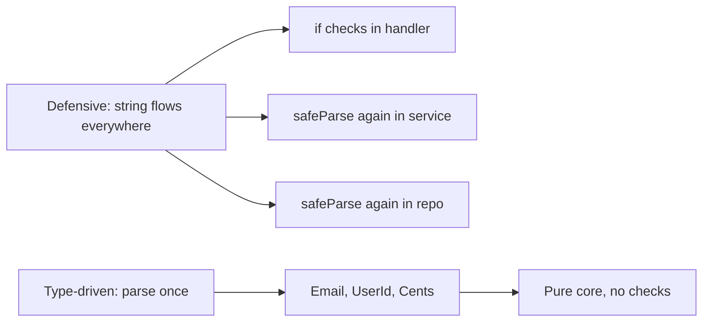
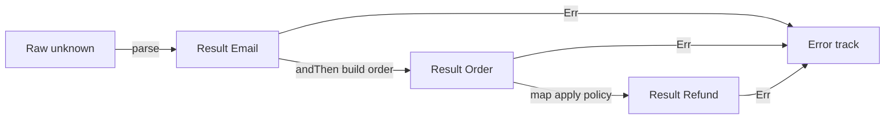
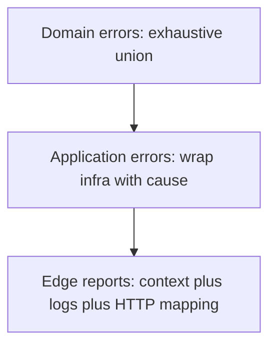
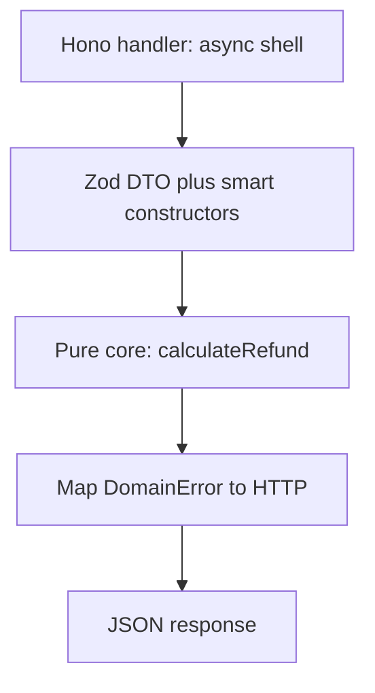

> *A junior developer validates nothing and hopes for the best.*
> *A mid-level developer validates everything, everywhere, with `if` statements on every layer.*
> *A senior developer parses once at the boundary and lets the type system prove the rest.*
> - <cite>Software Engineering Proverb, TypeScript edition</cite>

<!--more-->

## TL;DR

* **Validate once, at the edge.**
Expect untrusted `string`, `number`, and `unknown` at the system boundary.
Parse them there into proof-bearing domain types.
* **Parse, don't validate.**
Validation keeps the weak type and returns `boolean`.
Parsing consumes the weak type and returns `Result<StrongType, Error>`.
* **Model the domain with types.**
Use branded types, smart constructors, sum types, product types, and total functions.
Make illegal states unrepresentable by construction.
* **Stratify errors.**
Use an exhaustive discriminated union for domain errors and wrap infrastructure failures with `cause` only at the application edge.
* **Push invariants into the compiler.**
Use the type-state pattern, zero-runtime brands, and a pure functional core wrapped by a thin Hono or Fastify and Zod shell.
* This post is the TypeScript chapter of the Error Handling series.
It assumes only TypeScript 5.x in `strict` mode and builds every pattern from unions, modules, and `Result`.

---

## 1. Introduction: The Antipattern of Defensive TypeScript

The tempting habit in TypeScript is to accept `string`, `number`, and `unknown` in every function and re-check them on every layer.
You validate the same payload in the handler, then in the service, then in the repository, because no signature records what was already proven.
Type erasure makes this habit feel responsible.
It is not.
It is expensive, noisy, and fragile.

Consider the classic primitive soup.

```ts
// ❌ Antipattern: primitives flow through every layer.
import type { Request, Response } from "express";

interface Db {
  getUser: (userId: string) => Promise<{ stripeId: string } | null>;
}

declare const db: Db;
declare const gateway: { refund: (stripeId: string, amount: number) => Promise<void> };

export async function processRefund(req: Request, res: Response): Promise<void> {
  try {
    const body: unknown = await req.body;

    // Defensive check 1: who validated the payload shape?
    if (typeof body !== "object" || body === null) {
      throw new Error("Invalid payload");
    }
    const payload = body as { userId?: unknown; amount?: unknown };

    // Defensive check 2: who validated userId?
    if (typeof payload.userId !== "string" || payload.userId.trim() === "") {
      throw new Error("Missing UserId");
    }

    // Defensive check 3: who validated amount?
    if (typeof payload.amount !== "number" || !(payload.amount > 0)) {
      throw new Error("Invalid amount");
    }

    const user = await db.getUser(payload.userId);
    if (user === null) {
      throw new Error("User not found"); // Expected error? Or DB bug?
    }

    // Business logic is buried under guards.
    await gateway.refund(user.stripeId, payload.amount);
    res.status(200).send("Success");
  } catch (error) {
    // Is this a 400 typo or a 500 outage? The type is unknown.
    const message = error instanceof Error ? error.message : "Unknown error";
    res.status(400).send({ error: message });
  }
}

export async function sendReceipt(userId: string, amount: number): Promise<void> {
  // Same checks, copied again, because string proves nothing.
  if (userId.trim() === "") {
    throw new Error("Invalid userId");
  }
  if (!(amount > 0)) {
    throw new Error("Invalid amount");
  }
  // ... send email ...
}
```

This code compiles, passes review, and slowly rots the codebase.
Every function repeats the same three guards.
Every caller wonders whether the callee already checked.
Every change to the email rule requires a shotgun edit across handlers, services, and repositories.
A more insidious variant repeats `RefundSchema.safeParse()` in each layer instead of raw `if` statements.
The shape changed but the architecture did not.
You still pay the parse cost on the hot path and you still couple business rules to infrastructure code.
The deepest cost is paranoia.
No signature tells you what is already proven, so you check again.

TypeScript gives you a better contract, within the limits of erasure.
Parse untrusted data once at the boundary.
Hand the core only types that cannot be wrong by discipline.
Delete the duplicated guards forever.



The rest of this guide shows how to build that contract in five pillars, honestly accounting for what the compiler can and cannot enforce.

---

## 2. The Paradigm Shift: Parse, Don't Validate

Alexis King captured the core idea in [Parse, don't validate](https://lexi-lambda.github.io/blog/2019/11/05/parse-don-t-validate/) (2019).
Validation inspects a value and keeps the weak type.
Parsing consumes the weak type and produces a strong type with the proof embedded in it.
That distinction changes your architecture.

Validation has this shape.
It answers a question and throws the answer away.

```ts
// Validation: checks, then keeps string.
// Every downstream function must ask again.
export function isValidEmail(raw: string): boolean {
  const parts = raw.split("@");
  return parts.length === 2 && parts[0] !== "" && parts[1] !== undefined && parts[1].includes(".");
}

export function notify(rawEmail: string): void {
  if (isValidEmail(rawEmail)) {
    // rawEmail is still string here.
    // The compiler learned nothing.
    // The next function must check again.
    console.log(`sending to ${rawEmail}`);
  }
}
```

Parsing has a different shape.
It transforms and certifies in one move.

```ts
// Parsing: consumes unknown, produces proof-bearing Email.
declare const EmailBrand: unique symbol;
export type Email = string & { readonly [EmailBrand]: "Email" };

export type EmailError =
  | { readonly kind: "MissingAt" }
  | { readonly kind: "EmptyLocalPart" }
  | { readonly kind: "InvalidDomain" };

export type Result<T, E> =
  | { readonly ok: true; readonly value: T }
  | { readonly ok: false; readonly error: E };

export function parseEmail(raw: unknown): Result<Email, EmailError> {
  if (typeof raw !== "string") {
    return { ok: false, error: { kind: "MissingAt" } };
  }
  const trimmed = raw.trim();
  const at = trimmed.indexOf("@");
  if (at < 0) {
    return { ok: false, error: { kind: "MissingAt" } };
  }
  const local = trimmed.slice(0, at);
  const domain = trimmed.slice(at + 1);
  if (local === "") {
    return { ok: false, error: { kind: "EmptyLocalPart" } };
  }
  if (!domain.includes(".")) {
    return { ok: false, error: { kind: "InvalidDomain" } };
  }
  // The single sanctioned cast in the codebase.
  // It lives here, reviewed once, tested with fast-check.
  return { ok: true, value: trimmed as Email };
}

export function notifyParsed(email: Email): void {
  // No check here. The type is the proof.
  console.log(`sending to ${email}`);
}
```

After `parseEmail` succeeds, no downstream function checks the `@` again.
The type is the proof.
The signature `notifyParsed(email: Email)` documents the invariant better than any comment.

Here is the architectural boundary you want.

```text
                       SYSTEM BOUNDARY
   Untrusted outside              Parsed inside
┌──────────────────┐     ┌─────────────────────────────┐
│ string           │     │ Email, UserId, Cents        │
│ number           │────▶│ Order, Refund, Policy       │
│ unknown JSON     │parse │ Proof-bearing domain types  │
│ Raw query params │     │ Total functions only        │
└──────────────────┘     └─────────────────────────────┘
        │                             │
   may be anything              illegal states are unrepresentable
   must be checked              must only be composed
```

The rule is simple.
Data crosses the boundary as `string` and `unknown`.
It travels inside the core as `Email`, `UserId`, and `Cents`.
The parser lives in exactly one module per type.
Everything behind it composes without guards.
This is the same move Edwin Brady teaches in *Type-Driven Development with Idris*.
Let the type guide the control flow.
Reject bad programs as early as the type system allows instead of discovering them in production logs.

---

## 3. Pillar 1: Domain Modeling with Branded Types, Value Objects, and Smart Constructors

Eric Evans calls them Value Objects in *Domain-Driven Design*.
They are small, immutable, self-validating concepts with no identity beyond their value.
TypeScript models them with branded types plus a smart constructor.
Module privacy plus a private constructor provides the discipline that the runtime cannot.

Start with a reusable brand helper.
It costs nothing at runtime because it exists only in the type checker.

```ts
// domain/brand.ts - zero-runtime foundation.
export type Brand<T, Name extends string> = T & { readonly __brand: Name };

export type Email = Brand<string, "Email">;
export type UserId = Brand<string, "UserId">;
export type Cents = Brand<number, "Cents">;
```

Each brand is a distinct string literal, so `Email` is not assignable to `UserId` even though both wrap `string`.
A bare `string` is not assignable to either.
That is the whole trick.

Now put each smart constructor in its own module and export only the type and the parser, never a raw factory.

```ts
// domain/email.ts - the only module allowed to mint Email.
import type { Email } from "./brand.js";
import type { Result } from "./result.js";

export type { Email } from "./brand.js";

export type EmailError =
  | { readonly kind: "NotAString" }
  | { readonly kind: "MissingAt" }
  | { readonly kind: "EmptyLocalPart" }
  | { readonly kind: "InvalidDomain" };

export function parseEmail(raw: unknown): Result<Email, EmailError> {
  if (typeof raw !== "string") {
    return { ok: false, error: { kind: "NotAString" } };
  }
  const trimmed = raw.trim();
  const at = trimmed.indexOf("@");
  if (at < 0) {
    return { ok: false, error: { kind: "MissingAt" } };
  }
  if (trimmed.slice(0, at) === "") {
    return { ok: false, error: { kind: "EmptyLocalPart" } };
  }
  if (!trimmed.slice(at + 1).includes(".")) {
    return { ok: false, error: { kind: "InvalidDomain" } };
  }
  return { ok: true, value: trimmed as Email };
}

export function emailToString(email: Email): string {
  // Brands are strings at runtime, so this is a free coercion.
  return email;
}
```

```ts
// domain/money.ts - the same pattern for numeric invariants.
import type { Cents } from "./brand.js";
import type { Result } from "./result.js";

export type { Cents } from "./brand.js";

export type MoneyError = { readonly kind: "NonPositive"; readonly received: number };

export function parseCents(raw: unknown): Result<Cents, MoneyError> {
  if (typeof raw !== "number" || !Number.isFinite(raw)) {
    return { ok: false, error: { kind: "NonPositive", received: NaN } };
  }
  if (!Number.isInteger(raw) || raw <= 0) {
    return { ok: false, error: { kind: "NonPositive", received: raw } };
  }
  return { ok: true, value: raw as Cents };
}

export function centsToNumber(amount: Cents): number {
  return amount;
}
```

For class-shaped aggregates, use a private constructor plus a `#private` field or a non-exported brand key so `new` cannot be called from outside.

```ts
// domain/order.ts - DDD aggregate with a guarded boundary.
import type { Cents, Email, UserId } from "./brand.js";
import type { PaymentMethod } from "./payment.js";

const OrderTag: unique symbol = Symbol("OrderTag");

export interface Order {
  readonly id: string;
  readonly userId: UserId;
  readonly email: Email;
  readonly amount: Cents;
  readonly method: PaymentMethod;
  readonly [OrderTag]: "Order";
}

export function createOrder(input: {
  readonly id: string;
  readonly userId: UserId;
  readonly email: Email;
  readonly amount: Cents;
  readonly method: PaymentMethod;
}): Order {
  // Inputs are already proven, so no validation here.
  // The tag key is not exported, so only this module can build the literal.
  return { ...input, [OrderTag]: "Order" };
}
```

Zod and Effect Schema fit naturally as the parser implementation inside the smart constructor.
They are the bouncer, not the domain.

```ts
// domain/refund-request.ts - schema-as-parser, brand-as-proof.
import { z } from "zod";
import { parseCents } from "./money.js";
import { parseEmail } from "./email.js";
import type { Cents, Email, UserId } from "./brand.js";
import type { Result } from "./result.js";

const RefundSchema = z.object({
  userId: z.string().uuid(),
  email: z.string(),
  amount: z.number(),
});

export interface RefundRequest {
  readonly userId: UserId;
  readonly email: Email;
  readonly amount: Cents;
}

export type RefundRequestError =
  | { readonly kind: "BadShape"; readonly issues: string }
  | { readonly kind: "BadEmail"; readonly error: ReturnType<typeof parseEmail> extends { ok: false; error: infer E } ? E : never }
  | { readonly kind: "BadAmount" };

export function parseRefundRequest(data: unknown): Result<RefundRequest, RefundRequestError> {
  const shaped = RefundSchema.safeParse(data);
  if (!shaped.success) {
    return { ok: false, error: { kind: "BadShape", issues: shaped.error.message } };
  }
  const email = parseEmail(shaped.data.email);
  if (!email.ok) {
    return { ok: false, error: { kind: "BadEmail", error: email.error } };
  }
  const amount = parseCents(shaped.data.amount);
  if (!amount.ok) {
    return { ok: false, error: { kind: "BadAmount" } };
  }
  return {
    ok: true,
    value: {
      userId: shaped.data.userId as UserId,
      email: email.value,
      amount: amount.value,
    },
  };
}
```

Be honest about the limit.
In Rust, `pub struct Email(String)` with a private field is physically unforgeable outside the module.
In TypeScript, the brand is erased at runtime and any module can write `raw as Email`.
Unforgeability here is disciplinary, not physical.
Sustain it with three rules: keep the `as` cast inside the smart constructor module only, forbid `as` elsewhere with an ESLint rule such as `@typescript-eslint/consistent-type-assertions`, and re-export the opaque type without re-exporting the brand key.
Review every new `as` like a `sudo` invocation.

---

## 4. Pillar 2: Functional Foundations (Algebraic Data Types and Total Functions)

Paul Chiusano and Runar Bjarnason teach this in *Functional Programming in Scala*.
Model with precise types, write total functions, and compose with combinators instead of throwing across the stack.
TypeScript unions and interfaces are algebraic data types, and a discriminated `Result` is your `Either` monad.

Sum types enumerate exclusive alternatives.

```ts
// domain/payment.ts - a sum type with three mutually exclusive cases.
export type PaymentMethod =
  | { readonly kind: "card"; readonly lastFour: string }
  | { readonly kind: "transfer"; readonly iban: string }
  | { readonly kind: "cash" };
```

Product types combine independent facts.

```ts
// domain/order-shape.ts - a product type with no optional escape hatches.
import type { Cents, Email, UserId } from "./brand.js";
import type { PaymentMethod } from "./payment.js";

export interface OrderShape {
  readonly userId: UserId;
  readonly email: Email;
  readonly amount: Cents;
  readonly method: PaymentMethod;
}
```

There is no `null`, no stringly typed `method: string`, and no half-built object.
Exhaustiveness is enforced with a `never`-taking helper.

```ts
// domain/assert.ts
export function assertNever(value: never, message = "Unhandled case"): never {
  throw new Error(`${message}: ${JSON.stringify(value)}`);
}

export function feeFor(method: PaymentMethod): number {
  switch (method.kind) {
    case "card":
      return 30;
    case "transfer":
      return 10;
    case "cash":
      return 0;
    default:
      return assertNever(method);
  }
}
```

Add a new variant such as `{ kind: "crypto" }` and `feeFor` stops compiling until you handle it.
That compile break is the feature.

A total function is defined for 100 percent of its input values.
It never throws for expected cases, never returns `undefined` by surprise, and never hides an effect.
A partial function pretends to be total but explodes on some inputs.

```ts
// ❌ Partial: throws on zero and on NaN, returns a bare number.
export function refundSharePartial(amount: number, parts: number): number {
  return amount / parts;
}

// ✅ Total: every input maps to an explicit outcome.
import type { Cents } from "./brand.js";
import type { Result } from "./result.js";

export type SplitError = { readonly kind: "EmptyParts" } | { readonly kind: "NotDivisible" };

export function refundShareTotal(amount: Cents, parts: number): Result<Cents, SplitError> {
  if (!Number.isInteger(parts) || parts <= 0) {
    return { ok: false, error: { kind: "EmptyParts" } };
  }
  const share = amount / parts;
  if (!Number.isInteger(share)) {
    return { ok: false, error: { kind: "NotDivisible" } };
  }
  return { ok: true, value: share as Cents };
}
```

Note the `strict` plus `noUncheckedIndexedAccess` discipline: indexing, division, and JSON access are partial operations, so each one must return `Result` or narrow before use.
Total signatures force callers to confront edge cases at the call site.

Composition uses `map`, `andThen`, and `mapErr` instead of nested `if` pyramids.
This is Railway Oriented Programming from Scott Wlaschin, expressed with `Result`.



```ts
// domain/result.ts - the railway toolkit.
export type Result<T, E> =
  | { readonly ok: true; readonly value: T }
  | { readonly ok: false; readonly error: E };

export function ok<T>(value: T): Result<T, never> {
  return { ok: true, value };
}

export function err<E>(error: E): Result<never, E> {
  return { ok: false, error };
}

export function map<T, U, E>(result: Result<T, E>, fn: (value: T) => U): Result<U, E> {
  return result.ok ? { ok: true, value: fn(result.value) } : result;
}

export function andThen<T, U, E, F>(
  result: Result<T, E>,
  fn: (value: T) => Result<U, F>,
): Result<U, E | F> {
  return result.ok ? fn(result.value) : result;
}

export function mapErr<T, E, F>(result: Result<T, E>, fn: (error: E) => F): Result<T, F> {
  return result.ok ? result : { ok: false, error: fn(result.error) };
}
```

```ts
// domain/build-order.ts - chaining on the railway.
import { andThen, map, ok } from "./result.js";
import type { Result } from "./result.js";
import { parseEmail } from "./email.js";
import { parseCents } from "./money.js";
import type { OrderShape } from "./order-shape.js";

export function buildOrderChained(rawEmail: unknown, rawAmount: unknown): Result<OrderShape, string> {
  return andThen(parseEmail(rawEmail), (email) =>
    map(
      andThen(parseCents(rawAmount), (amount) =>
        ok({ email, amount } as const),
      ),
      ({ email: e, amount: a }) => ({
        // Placeholder userId and method for brevity; parse them the same way.
        userId: "00000000-0000-4000-8000-000000000000" as OrderShape["userId"],
        email: e,
        amount: a,
        method: { kind: "cash" } as const,
      }),
    ),
  );
}
```

Combinators are precise but noisy for long chains, so TypeScript uses the manual `?` via early return.
It is the same monadic bind with identical semantics.

```ts
export function buildOrderClean(rawEmail: unknown, rawAmount: unknown): Result<OrderShape, string> {
  const email = parseEmail(rawEmail);
  if (!email.ok) {
    return { ok: false, error: `bad email: ${email.error.kind}` };
  }
  const amount = parseCents(rawAmount);
  if (!amount.ok) {
    return { ok: false, error: "bad amount" };
  }
  return {
    ok: true,
    value: {
      userId: "00000000-0000-4000-8000-000000000000" as OrderShape["userId"],
      email: email.value,
      amount: amount.value,
      method: { kind: "cash" },
    },
  };
}
```

Both versions keep two parallel tracks.
The happy track carries values forward.
The error track short-circuits without throwing.
The error type tells the handler exactly which status to return, so a 400 typo can never masquerade as a 500 outage.

---

## 5. Pillar 3: The Lisp Connection, Metaprogramming and Expression-Oriented Design

Abelson and Sussman celebrate in *Structure and Interpretation of Computer Programs* a style where programs are built from expressions that evaluate to values, and where code itself is data that programs can manipulate.
TypeScript inherits that soul through its ML lineage: ternaries, `switch` expressions via helpers, and `ts-pattern` `match` all return values you assign directly.
Schemas are the second half: a Zod or Effect Schema is an abstract syntax tree describing your domain that you can inspect, compose, and generate code from.

Prefer expressions over statements when building domain values.

```ts
// Expression-oriented construction: every branch yields a value.
import { match } from "ts-pattern";
import { parseEmail } from "./email.js";
import type { Email } from "./brand.js";
import type { Result } from "./result.js";

export function labelFor(amount: number): string {
  // The ternary chain is an expression assigned once.
  const tier = amount > 100_000 ? "enterprise" : amount > 1_000 ? "standard" : "micro";
  return tier;
}

export function describeResult(result: Result<Email, { kind: string }>): string {
  // ts-pattern match is an exhaustive expression.
  return match(result)
    .with({ ok: true }, ({ value }) => `valid: ${value}`)
    .with({ ok: false }, ({ error }) => `invalid: ${error.kind}`)
    .exhaustive();
}

export function emailOrFallback(raw: unknown): Email | null {
  const parsed = parseEmail(raw);
  // No let-mutation dance. The conditional is the value.
  return parsed.ok ? parsed.value : null;
}
```

No `let result;` dance.
No uninitialized variable.
The compiler checks that every branch yields the declared type, and `.exhaustive()` breaks the build when the union grows.

Code as data appears in two places: schemas you manipulate and types that compute.

```ts
// Schemas are manipulable ASTs: extend, pick, and intersect them.
import { z } from "zod";

const BaseRefundDto = z.object({
  orderId: z.string().uuid(),
  email: z.string(),
  amountCents: z.number(),
});

// Derive new schemas from data instead of copying fields.
export const RefundDto = BaseRefundDto.extend({
  idempotencyKey: z.string().uuid(),
});

export const RefundAmountOnly = BaseRefundDto.pick({ amountCents: true });

export type RefundDtoInput = z.input<typeof RefundDto>;
export type RefundDtoOutput = z.output<typeof RefundDto>;
```

```ts
// Types that compute: the compiler runs small programs at type level.
type EmailString = `${string}@${string}.${string}`;

type ExtractLocal<S extends string> = S extends `${infer Local}@${string}` ? Local : never;

type LocalOfExample = ExtractLocal<"alice@example.com">;
//   ^? type LocalOfExample = "alice"

// Narrow a parsed DTO with satisfies so excess keys fail without widening.
const policy = {
  maxCents: 500_000,
  currency: "USD",
} as const satisfies { readonly maxCents: number; readonly currency: string };
```

`EmailString` is documentation, not proof: template literal types cannot check `trim()` or integer ranges, and they vanish at runtime.
Use them for autocomplete and readable errors, but keep the smart constructor as the single enforcement point.

Mechanize repetition with small helpers, never with hidden business logic.

```ts
// helpers/smart.ts - a factory that mechanizes the proof shape.
import { z } from "zod";
import type { Brand } from "./brand.js";
import type { Result } from "./result.js";

export function makeStringBrand<Name extends string>(name: Name, schema: z.ZodString) {
  return {
    schema: schema.transform((value) => value as Brand<string, Name>),
    parse(raw: unknown): Result<Brand<string, Name>, { readonly kind: string; readonly name: Name }> {
      const parsed = schema.safeParse(raw);
      if (!parsed.success) {
        return { ok: false, error: { kind: "invalid", name } };
      }
      return { ok: true, value: parsed.data as Brand<string, Name> };
    },
  };
}

// Usage keeps the rule visible at the call site.
export const EmailParser = makeStringBrand("Email", z.string().trim().min(3));
```

The rule for macros, decorators, and helpers is strict: the helper may remove boilerplate around `safeParse`, `trim`, and `transform`, but the invariant itself must stay visible in the domain module.
If a reviewer cannot see the email rule without opening the helper, the abstraction has gone too far.

---

## 6. Pillar 4: Exhaustive, Stratified Error Handling

Not all errors belong in the same type.
Domain errors are expected business outcomes and must be exhaustive.
Infrastructure errors are operational failures and need `cause` chains.
Mixing them in one `string` or one thrown `unknown` destroys that signal.

Stratify into three layers.



Model domain errors as a discriminated union.
Every variant is a business fact the caller must handle.

```ts
// domain/errors.ts - the exhaustive business vocabulary.
import type { EmailError } from "./email.js";

export type DomainError =
  | { readonly kind: "InvalidEmail"; readonly error: EmailError }
  | { readonly kind: "InvalidAmount" }
  | { readonly kind: "UserNotFound"; readonly userId: string }
  | { readonly kind: "InsufficientFunds"; readonly requested: number; readonly balance: number }
  | { readonly kind: "AlreadyRefunded"; readonly orderId: string };
```

Exhaustive `switch` now forces product decisions, and `assertNever` turns a forgotten case into a compile error.

```ts
// shell/http-status.ts - one mapping, checked by the compiler.
import { assertNever } from "./assert.js";
import type { DomainError } from "./domain/errors.js";

export function domainToStatus(error: DomainError): number {
  switch (error.kind) {
    case "InvalidEmail":
    case "InvalidAmount":
      return 400;
    case "UserNotFound":
      return 404;
    case "InsufficientFunds":
    case "AlreadyRefunded":
      return 422;
    default:
      return assertNever(error);
  }
}

export function domainToMessage(error: DomainError): string {
  switch (error.kind) {
    case "InvalidEmail":
      return `invalid email: ${error.error.kind}`;
    case "InvalidAmount":
      return "invalid amount: must be a positive integer";
    case "UserNotFound":
      return "user not found";
    case "InsufficientFunds":
      return "insufficient funds";
    case "AlreadyRefunded":
      return `refund already processed for order ${error.orderId}`;
    default:
      return assertNever(error);
  }
}
```

Wrap infrastructure errors once at the application layer with an explicit `cause`.

```ts
// app/errors.ts - domain facts plus operational failures.
import type { DomainError } from "./domain/errors.js";

export type AppError =
  | { readonly kind: "Domain"; readonly error: DomainError }
  | { readonly kind: "Database"; readonly cause: unknown }
  | { readonly kind: "Gateway"; readonly cause: unknown };

export function appToStatus(error: AppError): number {
  switch (error.kind) {
    case "Domain":
      return domainToStatus(error.error);
    case "Database":
    case "Gateway":
      return 500;
    default:
      return assertNever(error);
  }
}
```

Add context and logs only at the edge, where humans read them.

```ts
// shell/handler-helpers.ts - edge-only enrichment.
import type { AppError } from "./app/errors.js";

export interface ErrorReport {
  readonly status: number;
  readonly body: { readonly error: string };
}

export function reportAppError(error: AppError, logger: { error: (message: string, details?: unknown) => void }): ErrorReport {
  // Domain is never imported by a logger module; the shell owns this call.
  if (error.kind === "Domain") {
    return { status: domainToStatus(error.error), body: { error: domainToMessage(error.error) } };
  }
  logger.error("infrastructure failure", { kind: error.kind, cause: error.cause });
  return { status: 500, body: { error: "internal error" } };
}
```

Three rules keep the stratification honest.
Never return `unknown` from a domain function: name the union instead.
Never throw a `string` or a bare `Error` from the domain: return `Result<T, DomainError>`.
Never let the domain import the HTTP logger or framework types: the dependency arrow points inward from shell to core, never outward.

---

## 7. Pillar 5: Compile-Time Invariants with the Type-State Pattern

Some invariants are not about single values but about sequences.
An order cannot be paid before it is submitted.
A refund cannot be issued twice.
Runtime booleans like `isSubmitted` can be forgotten or checked in the wrong order.
Type-state encodes the workflow in generics so wrong sequences do not compile.

This is Brady-style type-driven design applied to business lifecycles.

```ts
// domain/order-lifecycle.ts - workflow encoded in the generic slot.
import type { Cents } from "./brand.js";

export interface Draft {
  readonly stage: "draft";
}
export interface Submitted {
  readonly stage: "submitted";
}
export interface Paid {
  readonly stage: "paid";
}

export type OrderStage = Draft | Submitted | Paid;

declare const StageTag: unique symbol;

export interface Order<S extends OrderStage> {
  readonly id: string;
  readonly amount: Cents;
  readonly stage: S["stage"];
  readonly [StageTag]: S;
}

export function createDraftOrder(id: string, amount: Cents): Order<Draft> {
  return { id, amount, stage: "draft", [StageTag]: { stage: "draft" } as Draft };
}

export function submitOrder(order: Order<Draft>): Order<Submitted> {
  // Conceptually consumes the draft: callers should drop the old binding.
  return { id: order.id, amount: order.amount, stage: "submitted", [StageTag]: { stage: "submitted" } as Submitted };
}

export function payOrder(order: Order<Submitted>): Order<Paid> {
  return { id: order.id, amount: order.amount, stage: "paid", [StageTag]: { stage: "paid" } as Paid };
}

// Only paid orders expose a receipt.
export function receiptFor(order: Order<Paid>): string {
  return `paid ${order.amount} for ${order.id}`;
}
```

Correct usage flows through the compiler.

```ts
const draft = createDraftOrder("ord_1", 5000 as Cents);
const submitted = submitOrder(draft);
const paid = payOrder(submitted);
console.log(receiptFor(paid));
```

Illegal transitions do not compile.

```ts
// @ts-expect-error - cannot pay a draft: payOrder needs Order<Submitted>.
// eslint-disable-next-line @typescript-eslint/no-unused-vars
const illegal = payOrder(draft);

// @ts-expect-error - receipt needs Order<Paid>, not Order<Submitted>.
// eslint-disable-next-line @typescript-eslint/no-unused-vars
const early = receiptFor(submitted);
```

TypeScript cannot destroy the old `draft` binding the way Rust moves it.
`submitOrder(draft)` does not invalidate `draft` at runtime.
Sustain the pattern by discipline: prefer shadowing (`const order = submitOrder(order)`), lint against reuse after transition in small modules, and keep the `StageTag` key non-exported so nobody can hand-forge `Order<Paid>`.
Honesty matters here: the compiler proves the new value has the right stage, but only code review proves the old binding was dropped.

Use type-state when the sequence matters and the cost of a wrong transition is high: payments, provisioning, publishing, and multi-step onboarding.
A good heuristic is two or more ordered states with different available operations.
Do not use it for every boolean, or generic noise will drown the domain.
A single `isArchived` flag with one branch is a runtime check, not a lifecycle.

---

## 8. Advanced Engineering: Zero-Runtime Brands and Property-Based Testing

Brands are a genuinely zero-cost abstraction in TypeScript.
`type Email = string & { __brand: "Email" }` emits no JavaScript at all.
There is no wrapper object, no allocation, and no indirection on the hot path.
The proof lives entirely in the checker and disappears from the bundle.

That property dictates the performance rule: parse once at the edge, then pass the branded value by reference.
Never call `safeParse` again inside the service and the repository for a value that is already branded.

```ts
// ❌ Wasteful: re-parsing a proven value on the hot path.
import { z } from "zod";

const AmountSchema = z.number().int().positive();

export function chargeTwice(rawAmount: unknown): void {
  const first = AmountSchema.safeParse(rawAmount);
  if (!first.success) {
    return;
  }
  // ... later, in another layer ...
  const second = AmountSchema.safeParse(first.data); // Redundant work.
  if (!second.success) {
    return;
  }
}

// ✅ Parse once, thread the brand.
import type { Cents } from "./brand.js";
import { parseCents } from "./money.js";

export function chargeOnce(rawAmount: unknown): void {
  const parsed = parseCents(rawAmount);
  if (!parsed.ok) {
    return;
  }
  applyCharge(parsed.value); // No second parse. Cents is already proven.
}

function applyCharge(_amount: Cents): void {
  // Hot path: zero checks, zero allocations beyond the number itself.
}
```

Parsing logic deserves stronger tests than hand-picked examples.
Property-based testing with `fast-check` throws hundreds of synthetic inputs at your smart constructor, including Unicode, control characters, and pathological lengths.

```ts
// domain/email.properties.test.ts
import { describe, expect, test } from "vitest";
import * as fc from "fast-check";
import { parseEmail } from "./email.js";

describe("parseEmail properties", () => {
  test("valid shaped emails always parse", () => {
    fc.assert(
      fc.property(
        fc.tuple(
          fc.stringOf(fc.constantFrom(..."abcdefghijklmnopqrstuvwxyz0123456789"), { minLength: 1, maxLength: 16 }),
          fc.stringOf(fc.constantFrom(..."abcdefghijklmnopqrstuvwxyz"), { minLength: 1, maxLength: 8 }),
          fc.stringOf(fc.constantFrom(..."abcdefghijklmnopqrstuvwxyz"), { minLength: 2, maxLength: 4 }),
        ),
        ([local, domain, tld]) => {
          const result = parseEmail(`${local}@${domain}.${tld}`);
          expect(result.ok).toBe(true);
        },
      ),
    );
  });

  test("missing @ never parses", () => {
    fc.assert(
      fc.property(fc.string({ minLength: 1, maxLength: 32 }).filter((s) => !s.includes("@")), (raw) => {
        expect(parseEmail(raw).ok).toBe(false);
      }),
    );
  });

  test("parse never throws on arbitrary unicode", () => {
    fc.assert(
      fc.property(fc.fullUnicodeString(), (raw) => {
        // Any string must map to Ok or Err, never throw.
        expect(() => parseEmail(raw)).not.toThrow();
      }),
    );
  });

  test("parsed value is trimmed input", () => {
    fc.assert(
      fc.property(fc.string({ minLength: 1, maxLength: 8 }).map((s) => `  ${s}@example.com  `), (raw) => {
        const result = parseEmail(raw);
        if (result.ok) {
          expect(result.value).toBe(raw.trim());
        }
      }),
    );
  });
});
```

Run with `vitest run` and keep the failing seed.
`fast-check` shrinks failures to the minimal reproducer and prints the seed.
Check that seed in as a regression test.
Your parser gains mathematical robustness instead of anecdotal coverage: valid shapes always pass, invalid shapes always fail, hostile Unicode never throws, and normalization round-trips.

---

## 9. Architecture Pattern: Functional Core, Imperative Shell (Hono/Fastify and Zod)

Gary Bernhardt summarized the healthiest architecture in one line: Functional Core, Imperative Shell.
The core is pure, synchronous, and total.
It takes domain types in and returns `Result` out.
No `fetch`, no sockets, no clock reads, no `async`.
The shell is thin and effectful.
It speaks HTTP and JSON, parses at the boundary, calls the core, and maps typed errors to status codes.



Define the pure core first.

```ts
// core/refunds.ts - pure, sync, no IO.
import type { Cents } from "./domain/brand.js";
import type { Result } from "./domain/result.js";
import type { DomainError } from "./domain/errors.js";

export interface RefundPolicy {
  readonly maxCents: number;
}

export interface Refund {
  readonly orderId: string;
  readonly amount: Cents;
}

export interface OrderSnapshot {
  readonly orderId: string;
  readonly balance: number;
  readonly alreadyRefunded: boolean;
}

export function calculateRefund(
  order: OrderSnapshot,
  requested: Cents,
  policy: RefundPolicy,
): Result<Refund, DomainError> {
  // Pure function: all inputs are already proven types.
  if (order.alreadyRefunded) {
    return { ok: false, error: { kind: "AlreadyRefunded", orderId: order.orderId } };
  }
  if (requested > order.balance) {
    return { ok: false, error: { kind: "InsufficientFunds", requested, balance: order.balance } };
  }
  if (requested > policy.maxCents) {
    return { ok: false, error: { kind: "InvalidAmount" } };
  }
  return { ok: true, value: { orderId: order.orderId, amount: requested } };
}
```

Zod DTOs stay dumb and raw in the shell.

```ts
// shell/dto.ts - raw transport shapes, no business rules.
import { z } from "zod";

export const RefundRequestDto = z.object({
  orderId: z.string().uuid(),
  email: z.string(),
  amountCents: z.number(),
});

export type RefundRequestDto = z.infer<typeof RefundRequestDto>;
```

The Hono handler bridges the two worlds and nothing more.

```ts
// shell/handlers.ts - thin async shell around the pure core.
import { Hono } from "hono";
import { RefundRequestDto } from "./dto.js";
import { parseEmail } from "./domain/email.js";
import { parseCents } from "./domain/money.js";
import { calculateRefund } from "./core/refunds.js";
import type { DomainError } from "./domain/errors.js";
import { domainToMessage, domainToStatus } from "./shell/http-status.js";

const app = new Hono();

app.post("/refund", async (c) => {
  // 1. Parse at the boundary: unknown JSON becomes proven brands.
  const raw: unknown = await c.req.json().catch(() => null);
  const shaped = RefundRequestDto.safeParse(raw);
  if (!shaped.success) {
    return c.json({ error: shaped.error.message }, 400);
  }

  const email = parseEmail(shaped.data.email);
  if (!email.ok) {
    const domainError: DomainError = { kind: "InvalidEmail", error: email.error };
    return c.json({ error: domainToMessage(domainError) }, domainToStatus(domainError));
  }
  const amount = parseCents(shaped.data.amountCents);
  if (!amount.ok) {
    const domainError: DomainError = { kind: "InvalidAmount" };
    return c.json({ error: domainToMessage(domainError) }, domainToStatus(domainError));
  }

  // 2. Rehydrate minimal state, then call the pure core.
  const order = { orderId: shaped.data.orderId, balance: 10_000, alreadyRefunded: false };
  const refund = calculateRefund(order, amount.value, { maxCents: 500_000 });
  if (!refund.ok) {
    return c.json({ error: domainToMessage(refund.error) }, domainToStatus(refund.error));
  }

  // 3. Map to transport. No business logic here.
  void email.value;
  return c.json({ orderId: refund.value.orderId, refundedCents: refund.value.amount }, 200);
});

export default app;
```

The same shape works in Fastify: replace `c.req.json()` with `request.body` and `c.json()` with `reply.code().send()`.
The core does not change because it never imported the framework.

Testing splits cleanly.
Unit test `calculateRefund` with plain structs and no mocks: it is sync and deterministic.
Integration test the handler with real JSON payloads over HTTP: malformed JSON, bad email, negative amount, and double refund each assert their status code.
The core stays fast because effects live only in the shell.

---

## 10. Pattern Reference: Defensive TypeScript vs. Type-Driven TypeScript

| Concept | Defensive TypeScript | Type-Driven TypeScript | Architectural Benefit |
|---|---|---|---|
| Boundary parsing | `if` guards repeated in every function over raw `string` | `parseEmail(unknown)` returns `Result<Email, EmailError>` once, then moves the proof in the type | Single source of truth for the invariant, zero repeated checks in the core |
| Branded types | Plain `string` aliases, forgeable anywhere with no distinction | `Brand<string, "Email">` minted only by the smart constructor module, `as` banned elsewhere by lint | Disciplinary unforgeability despite erasure, enforced by modules and review |
| Totality | `amount / parts` and `arr[i]` that throw or yield `undefined` on edge inputs | `Cents` plus `Result` forces explicit handling of zero, NaN, and missing index under `noUncheckedIndexedAccess` | Edge cases become compile-time obligations instead of production incidents |
| Composition | Nested `if` pyramids with early `throw` at every level | `andThen`, `map`, `mapErr`, and manual early return on the `Result` railway | Linear happy path with a typed error track, errors classified by type |
| Domain errors | `throw new Error(string)` messages, caught as `unknown`, easy to misclassify | Exhaustive `DomainError` union, `switch` plus `assertNever` must cover every variant | Callers cannot ignore a new business case, refactors break loudly at build time |
| App edge errors | One catch-all `catch` mapping everything to 400 | `AppError` wrapping infra with `cause`, shell mapping domain to 4xx and infra to 500 with logs | Rich operational context where humans read logs, precise types where code branches |
| Workflow state | Boolean flags like `isPaid` checked with `if` before each action | Type-state `Order<Draft>` to `Order<Paid>` with stage-tagged generics | Illegal transitions do not compile, stage-specific methods disappear by type |
| Hot-path cost | `safeParse` repeated in handler, service, and repo for the same value | Parse once at the edge, thread zero-runtime brands with no allocation | Proof without performance tax, ideal for validators and routers |
| Testing | Hand-picked unit cases with a few literal strings | `fast-check` with hundreds of Unicode and adversarial inputs plus shrinking and seeds | Mathematical confidence in parsers, minimal reproducers on failure |
| Architecture | Handlers mix Zod parsing, DB calls, and business rules with `async` everywhere | Pure sync core with `calculateRefund` plus thin async Hono and Zod shell | Core is trivially testable and portable, effects are isolated and auditable |

Keep this table as a review checklist.
If a row drifts left, push the proof back into the type.

---

## 11. Summary and Architectural Rules of Thumb

**1. Parse once at the boundary, never validate in the core.**
Raw `string` and `unknown` enter through HTTP or queue consumers and become `Email`, `UserId`, and `Cents` immediately.
Core functions accept only proven types and contain zero `isValid` checks and zero repeated `safeParse` calls.

**2. Make illegal states unrepresentable, then delete the guards.**
Prefer unions for alternatives, interfaces for combinations, and branded types with smart constructors for invariants.
If a rule lives in a type, remove every `if` that rechecks it downstream.
Remember the TypeScript caveat: brands are disciplinary, so guard the single `as` with module privacy and lint.

**3. Write total functions and compose on the railway.**
Return `Result` for every partial operation, handle every variant, and chain with early return plus `map` and `andThen`.
Reserve `throw` for truly impossible bugs and infrastructure edges, never for user input or business outcomes.

**4. Stratify errors by audience.**
Domain functions expose exhaustive `DomainError` unions.
Applications wrap infra failures once with `cause`.
Edges add human context, logs, and HTTP mapping.
Never leak `unknown` or thrown `string` from domain APIs, and never let the domain import the logger.

**5. Push workflows and costs into the type system.**
Use type-state with stage generics for ordered lifecycles with two or more distinct operations.
Use zero-runtime brands on hot paths instead of wrapper objects.
Cover parsers with `fast-check` and keep the Hono or Fastify shell thin around a pure functional core.

Stop defending every function against data you already checked.
Prove it once, encode it in a type, and let the compiler stand guard while you model the domain.
This post is part of the Error Handling series.
Continue with [Stop Validating Everywhere: An Architectural Guide to Error Handling in Python]() and [Stop Validating Everywhere: An Architectural Guide to Error Handling, Invariants, and Functional Domain Modeling in Rust]().

---

### Bibliography

* Alexis King, *Parse, don't validate* (2019).
Quotation: validation preserves the weak type, parsing produces a strong type.
* Paul Chiusano and Runar Bjarnason, *Functional Programming in Scala* (2014).
Quotation: prefer total functions, algebraic data types, and effect-free composition.
* Harold Abelson and Gerald Jay Sussman, *Structure and Interpretation of Computer Programs* (1996).
Quotation: code is data, build embedded languages to express domain intent.
* Eric Evans, *Domain-Driven Design* (2003).
Quotation: protect invariants inside aggregates with value objects and explicit boundaries.
* Edwin Brady, *Type-Driven Development with Idris* (2017).
Quotation: use types as a design tool to guide execution and reject invalid programs early.
* Scott Wlaschin, *Railway Oriented Programming* (2013).
Quotation: model success and error as parallel tracks composed with monadic bind.
* Gary Bernhardt, *Functional Core, Imperative Shell* (2012).
Quotation: keep the domain pure and push IO to a thin outer shell.
