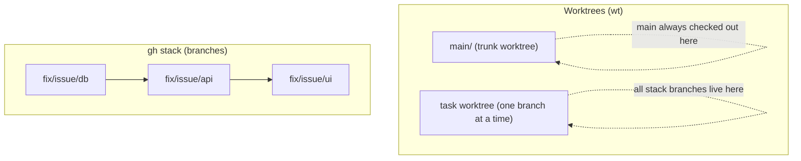
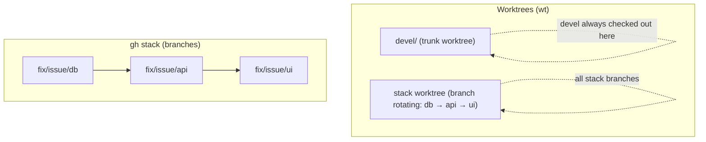

> *One task, one worktree.*
> *Every branch you do not have open is a context switch you do not have to pay.*
> — <cite>Personal Experience</cite>

<!--more-->

## TL;DR

* **Working on one thing at a time is over.** Today it is normal to juggle several tasks inside the same repo and across several projects at once. This workflow makes that the default.
* **Vendor-agnostic by design.** The interface is Git, not the editor. Any agent that writes to a folder works the same inside a worktree - no lock-in.
* **Jump without friction, between projects and between tasks.** `wt` and the `wts`/`wtl` pickers switch worktrees in seconds, whether you are jumping to another project or another branch in the same project.
* **Stacked PRs are the lens for reviewing AI-generated code.** `gh stack` turns a huge AI diff into a chain of small, bottom-up PRs you can actually review.
* **Worktrunk (`wt`) removes the friction.** It replaces verbose `git worktree` commands, copies your ignored local files (`.env`, caches) into new worktrees, installs dependencies, and sets the upstream automatically via hooks.

---

Every developer I know has a love-hate relationship with Git branches.

Branches are cheap to create and expensive to hold. If I switch to another branch, my uncommitted work follows me, my installed dependencies stay stale, and my `.env` either leaks into the repo or does not exist in the new branch.

Working on a single thing at a time is over. On a typical day I juggle several tasks inside the same project and two or three projects at once. The old flow - `stash`, switch, reinstall, remember where you were - does not scale when an agent can generate a full feature in one worktree while you review another.

That is why I wanted a setup that is vendor-agnostic. The interface is Git, not the editor. Whether the code was written by your favorite agent, a teammate, or by you, it lands in a folder that behaves the same way.

Two properties shape the workflow I landed on:

* Jumping between projects and between tasks inside a project should cost seconds, not minutes.
* A PR - especially one generated by AI - should be small enough that a reviewer can understand it in one sitting. Stacked PRs are the lens that makes AI code reviewable.

This post documents the setup I landed on after trying a few approaches: a bare Git repository, worktrees managed by Worktrunk (`wt`), and stacked PRs submitted with `gh stack`. It is the same battle-tested setup as before, now framed for the way we actually work today.

Here is the whole thing at a glance:



## 1. Why a bare repo and worktrees

A worktree is a second working directory attached to the same repository. Git stores the metadata in one `.bare` folder, and every branch gets its own checkout.

The layout I use looks like this:

```text
your-project/
├── .bare/            # Base bare Git repository
├── .git              # Pointer file that redirects to .bare
├── .worktreeinclude  # Ignored files copied into every new worktree (.env, etc.)
├── main/             # Worktree for the main branch
├── feature-login/    # Active worktree (managed by wt)
└── hotfix-bug/       # Active worktree (managed by wt)
```

The `.git` file is just a redirect:

```text
gitdir: ./.bare
```

## 2. One-time setup

### Step A: clone the bare repository

```bash
# 1. Create the project directory
mkdir your-project
cd your-project

# 2. Clone the repository as BARE
git clone --bare https://github.com/you/your-project.git .bare

# 3. Tell Git to use .bare as the root repository
echo "gitdir: ./.bare" > .git

# 4. Configure fetch so all remote branches are tracked correctly
git --git-dir=.bare config remote.origin.fetch "+refs/heads/*:refs/remotes/origin/*"

# 5. Fetch the updated references from the remote
git fetch origin

# 6. Create the initial main worktree
git worktree add main
```

**Note:** `git clone --bare` does not configure an upstream for any branch, not even the default one. That is why `git pull` fails with "There is no tracking information for the current branch".

You can fix each branch manually:

```bash
git branch --set-upstream-to=origin/main main
git branch --set-upstream-to=origin/develop develop

# Verify: branches with an upstream show as [origin/...]
git branch -vv
```

With the `wt` flow this is resolved automatically: a `pre-start` hook (Step B) runs `git push -u origin <branch>` when the worktree is created, so the upstream is configured before you return to the terminal.

### Step B: configure Worktrunk (`wt`)

Install Worktrunk and its shell integration:

```bash
brew install worktrunk && wt config shell install
```

Create or edit the Worktrunk config (`~/.config/worktrunk/config.toml` or `.config/wt.toml` inside the project) to:

1. Create worktrees next to `.bare`.
2. Copy `.env.local` from the primary worktree before the shell lands in the worktree (`pre-start`).
3. Set the upstream automatically with `git push -u origin <branch>` (`pre-start`).
4. Copy ignored caches and dependencies in the background (`post-start`).
5. Install dependencies (`post-start`).

```toml
[projects."github.com/you/your-project"]
worktree-path = "{{ repo_path }}/../{{ branch | sanitize }}"

[[projects."github.com/you/your-project".pre-start]]
env = "cp {{ primary_worktree_path }}/web/.env.local web/.env.local"

[[projects."github.com/you/your-project".pre-start]]
push = "git push -u origin {{ branch }}"

[[projects."github.com/you/your-project".post-start]]
copy = "wt step copy-ignored"

[[projects."github.com/you/your-project".post-start]]
install = "npm i"
```

Right after defining the config, create a worktree with your default branch and always work from there:

```bash
wt switch main
```

That worktree becomes the "primary" worktree as far as `wt` is concerned. When you `wt remove` another worktree, `wt` moves you back here. Without it, you end up in `.bare`, which has no branch checked out and is disorienting.

### Step C: define the ignored files to copy (`.worktreeinclude`)

Create `.worktreeinclude` at the project root (or inside the `main/` worktree). List the untracked files that should be replicated into every new branch, like environments or local credentials:

```text
# .worktreeinclude
.env
.env.local
config/settings.local.json
```

## 3. The daily loop with `wt`

### Start a task: `wts -c <branch>`

`wt switch -c` creates the branch, generates the worktree, runs the hooks (copies `.env`, installs deps) and changes your terminal directory in one step:

```bash
# wt switch -c <new-branch>
wt switch -c feature-login
```

If the branch already exists on the remote:

```bash
wt switch feature-login
```

### Inspect active worktrees: `wtl`

`wt list` shows the open worktrees, their Git state (local changes, commits ahead/behind) and which branch you are on (`@`):

```bash
wt list
```

### Develop and push (inside the worktree)

```bash
# 1. Check status
git status

# 2. Stage and commit
git add .
git commit -m "feat: add login screen"
git push -u origin feature-login
```

### Re-sync ignored files (optional)

If you edit `.worktreeinclude` later and want to sync the ignored files into the current worktree without recreating it:

```bash
wt step copy-ignored
```

### Merge and clean up

When the task is done, `wt merge main` merges the changes into `main`, removes the worktree folder and deletes the local branch:

```bash
wt merge main
```

To remove a worktree without merging:

```bash
wt remove
```

### Shell aliases: `wts`, `wtl`, `wtr`

Defined in `~/.zshrc`, these wrap the most common `wt` operations:

| Command | Equivalent to | Description |
| --- | --- | --- |
| `wts` | fzf picker + `wt switch` | Opens an fzf picker with `git status` and log previews; Enter switches worktrees |
| `wts <branch>` | `wt switch <branch>` | Switches directly to an existing worktree/branch |
| `wts -c <branch>` | `wt switch -c <branch>` | Creates a branch and a new worktree |
| `wtl` | `wt list` | Lists worktrees and their state |
| `wtr` | `wt remove` | Removes the current worktree |

The no-argument `wts` picker reads from `wt list --format json`:

```zsh
# wts - switch/create worktree (wt switch + fzf picker)
wts() {
  [[ $# -gt 0 ]] && { wt switch "$@"; return; }

  local target
  target=$(
    wt list --format json 2>/dev/null \
      | jq -r '.items[] | [.branch, .worktree.path] | @tsv' \
      | fzf --delimiter='\t' --with-nth=1 \
            --preview 'git -C {2} status -sb 2>/dev/null | head -15; echo; git -C {2} log --oneline -8 2>/dev/null' \
            --preview-window=right:45% \
      | cut -f1
  )
  [[ -n "$target" ]] && wt switch "$target"
}

alias wtl="wt list"
alias wtr="wt remove"
```

Requirements: `jq` and `fzf` installed.
The `wt()` wrapper from `worktrunk config shell init` (already loaded in `.zshrc`) handles the automatic `cd` when switching worktrees.

### Jumping between projects and between tasks

The same `wts`/`wtl` flow works across projects and across tasks inside one project - no extra tooling.

* **Between projects:** I keep each repo as its own bare setup (`your-project/`, `another-project/`). `wtl` is per-project, but `wts` (the fzf picker above) plus a quick `cd` to the other project root gives the same seconds-level switch. No `stash`, no waiting for reinstalls - each worktree keeps its own `node_modules` and `.env` via the hooks and `.worktreeinclude`.
* **Between tasks in one project:** `wts -c` opens a new worktree per task (`fix/auth`, `feat/payments`) while an agent keeps working in the other. I can have code being generated in `feature-login` while I review a stacked PR in `fix/issue/ui` - each folder is a fully runnable checkout.

This is what makes the setup vendor-agnostic in practice: the agent just sees a normal directory. It does not matter which agent wrote the code - the switch cost is the same.

## 4. Stacked PRs + Worktrunk

Stacked PRs are the lens that makes AI-generated code reviewable. An agent can easily produce a 600-line diff that no human can review in one sitting. Splitting it into a stack (`db -> api -> ui`) turns it into a chain of small, bottom-up PRs that a reviewer - or you, tomorrow - can understand one layer at a time.

The principle stays: one stack lives inside the worktree created by `wts -c`.[^stack-worktree]

`wt` manages worktrees and navigation; `gh stack` manages branches and PRs. The two flows are independent and only touch at the start (create the worktree) and at the end (cleanup).



### Full sequence

```zsh
wts -c fix/issue/db         # stack worktree (branch from the default branch)
# ...development and commits on db...
gh stack init fix/issue/db  # registers the stack in .git/gh-stack (checkout is a no-op)
gh stack add fix/issue/api  # new branch; checkout happens inside the same worktree
gh stack add fix/issue/ui
gh stack submit --auto --open
# ...merges bottom-up...
gh stack sync --prune       # deletes db/api; the terminal stays "hanging" on ui
wtr                         # removes the worktree, deletes ui (already merged) and cds to the primary worktree
```

### Why the ending works

`gh stack sync --prune` tries `git checkout devel` to move you to the trunk, but Git forbids it because `devel` has its own worktree ("already checked out at ..."). It also cannot delete `ui`: it is checked out in the stack worktree. The terminal staying "hanging" on `ui` is expected.[^ending-details]

`wtr` resolves everything from inside that same worktree: the removal renames the worktree to `.git/wt/trash/` first, then deletes the branch and worktrunk moves the shell to the primary worktree ("Switched to worktree for main").[^ending-details]

Notes:
* Worktree with uncommitted changes: `wtr -f`; branch not recognized as merged: `wtr -D`.
* `gh stack sync` (without `--prune`) works during development: the stack branches only exist in the stack worktree.

### `gh stack submit --auto`

Interactive mode opens a full-screen TUI (choose branches, titles, draft vs ready). `--auto` skips the editor and generates titles automatically. With `--auto` PRs are created as drafts; `--auto --open` creates them ready for review. In non-interactive terminals (CI) `--auto` is assumed implicitly.

### Optional hook: auto-initialize the stack

```toml
[[projects."github.com/you/your-project".pre-start]]
init = "gh stack init {{ branch }}"
```

`wts -c fix/issue/db` registers the stack automatically and you can run `gh stack add` directly. Use `pre-start` (blocking), not `post-start` (background): `gh stack add` needs `.git/gh-stack` to exist already, and `post-start` introduces a race condition.

Caveats:
* It runs on every `wts -c`: every new branch becomes a one-branch stack (harmless; `submit` creates a normal PR).
* `git rerere` is not enabled automatically (the prompt is non-interactive inside hooks).
* Requires authenticated `gh` and stacked PRs enabled on the repo.

### Alternative: the `wsp` helper

```zsh
alias wsp="gh stack sync --prune && wts ^"
```

This variant returns to the trunk and leaves the stack worktree for cleanup later with `wt remove <branch>`. If you prefer to end in the primary worktree with a single command, use `wtr` directly.

> **Honorable mention: Herdr users**
> If you already live in [Herdr](https://herdr.dev) (`brew install herdr`), this workflow needs no changes. Herdr owns terminals (workspaces/tabs/panes on a persisted server with `working`/`blocked`/`done` detection), `wt` owns Git checkouts. One Herdr tab per worktree is the natural mapping, and `herdr` reattach keeps agents alive after you close the lid. Stacked PRs and `wtr`/`wsp` work exactly the same inside a Herdr pane.

[^stack-worktree]: The whole stack lives inside one worktree folder; `gh stack add` rotates the checked-out branch inside that same folder, so you never pay a directory switch cost.
[^ending-details]: Low-level details: `wtr` checks whether the branch is integrated before deleting it - with squash merges this works via `patch-id` matching. While the stack lives `wt list` may show `branch_mismatch` on the stack worktree - cosmetic. `gh stack trunk` and trunk navigation do not work with worktrees; use `wts ^`.

## 5. Troubleshooting

### Error: "There is no tracking information for the current branch"

```text
git pull
There is no tracking information for the current branch.
Please specify which branch you want to merge with.
```

**Cause:** the local branch has no configured upstream (`branch.<branch>.remote` and `branch.<branch>.merge`). This happens when the branch was created or checked out from a fetch without tracking, common in the bare + worktrees flow.

**Fix:**

```bash
git branch --set-upstream-to=origin/<branch> <branch>
git pull
```

Or, once without changing the config: `git pull origin <branch>`.

**In the `wt` flow:** the `pre-start` hook (Step B) runs `git push -u origin <branch>` when the worktree is created, so new branches get their upstream before you return to the terminal.

### Error pushing a branch without upstream

```text
fatal: The current branch <branch> has no upstream branch.
```

**Fix:** push defining the upstream on the first push:

```bash
git push -u origin <branch>
```

## 6. Quick reference

### `wt` commands

| Operation | Command | Manual Git Equivalent |
| --- | --- | --- |
| **Interactive picker (fzf + preview)** | `wts` | `wt switch` (native picker) |
| **Create branch and worktree** | `wts -c <branch>` | `git worktree add -b <branch> <branch> main` |
| **Switch to existing worktree** | `wts <branch>` | `cd ../<branch>` |
| **List active worktrees** | `wtl` | `git worktree list` |
| **Copy `.worktreeinclude` files** | `wt step copy-ignored` | `cp ../main/.env .env` |
| **Merge to main and delete worktree** | `wt merge main` | `git checkout main && git merge <branch> && git worktree remove <branch> && git branch -d <branch>` |
| **Remove current worktree** | `wtr` | `git worktree remove <folder> && git branch -d <branch>` |

### Stacked PRs (`gh stack` + worktrunk)

| Operation | Command |
| --- | --- |
| **Initialize stack** | `gh stack init <b1> <b2> <b3>` |
| **Add branch to stack** | `gh stack add <branch>` |
| **Create stack PRs** | `gh stack submit --auto --open` |
| **Sync stack** | `gh stack sync` |
| **Clean merged branches** | `gh stack sync --prune` |
| **End the cycle** | `wtr` (or `wsp` to return to the trunk) |

---

That is the whole workflow.

What I value most now is not just the Git mechanics but how they fit the way we work today: parallel tasks in one project and jumps between projects are the default, the terminal and Git are the contract that any agent can target, and stacked PRs keep AI-generated changes reviewable instead of a single 600-line wall.

The worktree removes the cost of context switching, and `gh stack` removes the cost of keeping a PR small. The two tools compensate for each other's rough edges: the branch the stack is checked out on changes often, but you never notice because it happens inside a single folder.

If you try it, I recommend starting small: set up the bare repo and `wt`, keep the manual `git push -u` for a while, and only add `gh stack` once the worktree loop feels natural.
