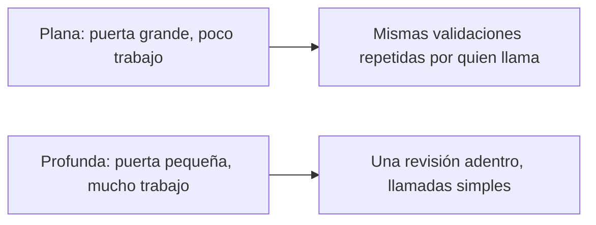

> *El buen código no es solo código que corre.*
> *El buen código es código que puedes cambiar rápido sin miedo.*
> - <cite>Tras John Ousterhout, A Philosophy of Software Design (ver Referencias)</cite>

<!--more-->

## TL;DR

* **Complejidad significa difícil de cambiar.** Un cambio pequeño pide cambios en muchos lugares, o mucho contexto, o riesgo poco claro.
* **Los módulos profundos ganan a los planos.** Puerta pequeña, mucho trabajo adentro. Profundidad es beneficio dividido entre costo de interfaz.
* **Usa esta receta en una feature nueva.** Escribe primero la firma de la puerta, luego el comentario de la puerta, y esconde el trabajo duro adentro.
* **Cierra tipos primero, Result después.** Vuelve irrepresentables los estados malos con tipos como `Cents`, y devuelve `Result` solo para los fallos que quedan.
* **Escribe primero el comentario de la puerta.** Declara el contrato y sus límites antes del cuerpo, y nombra por significado.
* **Las objeciones tienen respuesta.** Cuestan más ahora, pueden esconder de más, y casi nunca quitan velocidad. La sección 6 da cada respuesta, la 7 da tres ejercicios.

## 1. El problema real es el cambio

Que el código corra no basta.
El código que hoy corre igual te puede frenar mañana.
Ousterhout llama a ese freno complejidad.
Complejidad es todo lo que hace el código difícil de entender y cambiar.
Se nota en tres señales.
Primero, un cambio pequeño pide cambios en muchos lugares.
Segundo, debes cargar mucho contexto en la cabeza para actuar.
Tercero, no sabes qué es seguro tocar.

Defiendo una tesis en este post: puedes diseñar un módulo profundo en tu próxima feature con una receta corta y repetible.
Las secciones 2 a 5 dan cuatro reglas que sostienen esa tesis, la sección 6 responde objeciones justas y la 7 las vuelve tres ejercicios.
Las reglas vienen de Ousterhout, pero el código y la receta son míos.

**Términos usados abajo.**

* **Interfaz** es todo lo que debes aprender para usar un módulo: firmas, precondiciones, efectos laterales y límites de rendimiento.
* **Módulo profundo** ofrece mucho beneficio tras una interfaz pequeña. Un módulo grande con interfaz grande solo es grande.
* **Tipo marcado** como `Cents` es un contenedor validado, un valor simple que ya pasó las revisiones.
* **Función total** define un resultado para cada entrada de su tipo, sin lanzar ni fallar en casos esperados.
* **Analizar en el borde** significa convertir la entrada `unknown` en tipos marcados una sola vez, cerca de la entrada y la salida. Esta frase sigue a King (2019).
* **Result** es una unión discriminada con ramas `ok` y `error` que vuelve visibles los fallos esperados en el tipo. Este uso sigue a Wlaschin sobre programación orientada a rieles.

Puedes ver la versión completa en TypeScript en [Deja de Validar en Todas Partes en TypeScript]().

## 2. Las cajas profundas ganan a las planas

**Problema:** repetir una regla de dinero en el manejador, luego en el servicio y luego en el repositorio obliga a cada parte a reaprender la misma regla.

**Heurística:** prefiere una puerta pequeña con mucho trabajo detrás.
Por ejemplo, un ayudante plano de dinero podría exportar tres validadores y pedir siete parámetros sueltos, mientras uno profundo exporta un solo analizador más una función central como `charge(amount: Cents)` que esconde redondeo, idempotencia y escritura contable.

**Ejemplo:** la Figura 1 muestra el paso de validaciones repetidas a una sola revisión adentro.



Figura 1: las interfaces planas empujan validaciones repetidas a quien llama, mientras las profundas guardan una sola revisión adentro.
La profundidad es una razón entre beneficio y costo, no solo tamaño.
La misma idea vale en [la guía de Python]() y [la guía de Rust]().

**Excepción:** no profundices capas de paso, puntos de inyección o dobles de prueba, donde reenviar es el trabajo honesto.
Esta distinción sigue a Parnas (1972) sobre ocultar decisiones de diseño, no cableado.

**Revisión:** un módulo nuevo pasa cuando un solo dueño define la regla y quien llama recibe tipos marcados en vez de `unknown`.

## 3. Crea un módulo profundo en tu próxima feature

Esta es la receta central.
Úsala al empezar un ticket, no cuando el código ya se pudrió.
Toma unos 30 minutos la primera vez: 15 para hallar la unión, 30 para juntar una validación.

**Paso 1: nombra un solo trabajo.**
Elige `money.ts` para el dueño de la regla y `charge.ts` para la puerta profunda.
Un diff típico es pequeño, cerca de 60 líneas agregadas y 40 borradas, porque borras validaciones repetidas.

**Paso 2: escribe primero la firma de la puerta.**
Parte de esta forma y no agregues parámetros aún:

```ts
import type { Result } from "./result.js";
import type { Cents } from "./money.js";
import type { ChargeError, Receipt } from "./charge.js";

export function charge(amount: Cents): Result<Receipt, ChargeError>;
```

**Paso 3: escribe el comentario de la puerta antes del cuerpo.**
Declara qué promete, qué rechaza y cómo cada fallo se traduce en mensaje.
La sección 5 muestra la forma exacta en cuatro líneas.

**Paso 4: esconde el trabajo duro adentro.**
Mueve redondeo, creación de clave de idempotencia y escritura contable tras esa sola puerta.
El Listado 1 muestra el inicio plano, el Listado 2 muestra el final profundo con los mismos nombres.

**Paso 5: revisa la profundidad.**
Corre una búsqueda y confirma un solo dueño:

```bash
grep -rn "parseCents" --include="*.ts" .
```

Pasas cuando la búsqueda halla una sola definición de `parseCents` en `money.ts`, `charge.ts` toma `Cents` y nadie vuelve a validar un valor ya marcado.

**Problema:** subir la validación a quien llama reparte la misma regla de dinero en diez lugares que terminan por separarse.
En un cambio de facturación lo medí directo: un ajuste de redondeo tocó 10 archivos antes y 1 archivo después de juntar la regla.

**Excepción:** deja envoltorios delgados donde el trabajo es dirigir o inyectar, no aplicar la regla.

```ts
// Listado 1: antipatrón plano. No copiar.
// La misma regla se repite, los valores sin validar siguen fluyendo y los fallos se pierden en silencio.
import { parseCents, type Cents } from "./money.js";

declare function applyCharge(amount: Cents): void;

export function chargeHandler(rawAmount: unknown): void {
  const first = parseCents(rawAmount);
  if (!first.ok) {
    return;
  }
  chargeService(rawAmount); // desvío: pasa raw otra vez en vez de first.value
}

export function chargeService(rawAmount: unknown): void {
  const second = parseCents(rawAmount);
  if (!second.ok) {
    return;
  }
  applyCharge(second.value);
}
```

```ts
// Listado 2: un solo dueño analiza, el núcleo compone sin validaciones.
import type { Result } from "./result.js";
import { parseCents, type Cents, type MoneyError } from "./money.js";

export type ChargeError =
  | { readonly kind: "InvalidAmount"; readonly cause: MoneyError }
  | { readonly kind: "InsufficientFunds"; readonly needed: Cents };

export interface Receipt {
  readonly id: string;
  readonly amount: Cents;
}

declare function idempotencyKeyFor(amount: Cents): string;
declare function writeLedger(input: {
  readonly amount: Cents;
  readonly key: string;
}): Result<Receipt, ChargeError>;

export function chargeOnce(rawAmount: unknown): Result<Receipt, ChargeError> {
  const parsed = parseCents(rawAmount);
  if (!parsed.ok) {
    return { ok: false, error: { kind: "InvalidAmount", cause: parsed.error } };
  }
  return applyCharge(parsed.value);
}

function applyCharge(amount: Cents): Result<Receipt, ChargeError> {
  const key = idempotencyKeyFor(amount);
  return writeLedger({ amount, key });
}
```

Por tanto, el analizador vive en un solo lugar y todo lo de adentro compone sin validaciones repetidas.
Este es el paso de analizar una vez en el borde de las guías de manejo de errores, dicho aquí como forma de módulo.
La ganancia es menos cambios cuando la regla cambia, menos contexto por quien llama y riesgo más claro en el borde.

## 4. Cierra tipos primero, Result después

**Problema:** quien llama se ahoga cuando cada función lanza textos vagos tanto para resultados esperados como para fallos reales.

**Heurística:** divide el trabajo en dos pasos que se componen.
Primero cierra tipos para eliminar casos, luego devuelve `Result` para los fallos que quedan.
Cerrar tipos sigue a Ousterhout sobre definir errores fuera de existencia.
Devolver `Result` para el resto es mi extensión desde la serie de manejo de errores, no Ousterhout: él prefiere excepciones con enmascarado y agregado para casos de veras excepcionales.

**Ejemplo:** `Cents` vuelve irrepresentable el dinero negativo o malformado, lo que deja al núcleo total para su tipo de entrada.
Luego nombra los fallos restantes como una unión corta de dominio tal como `ChargeError`, para que quien llama vea cada resultado en el tipo.
Cada caso se traduce en un solo mensaje visible cerca de la entrada y la salida.

**Excepción:** los fallos de entrada y salida, la validación parcial y los bordes no confiables dentro del núcleo aún piden ramas explícitas de `Result`.
No uses `Result` para errores de programador que deben fallar fuerte.

**Revisión:** el núcleo toma `Cents`, define un resultado para cada `Cents` sin lanzar, y cada error de `Result` se traduce en un mensaje en el borde.

El mejor manejo de errores es entonces un caso que no puede pasar, más una rama visible para cada caso que sí puede.
Menos casos para quien llama significa menos estrés y menos errores.

## 5. Escribe primero el comentario de la puerta

**Problema:** quien lee un módulo debe reconstruir precondiciones, límites y trampas desde detalles regados.

**Heurística:** escribe el comentario de la interfaz antes que el código, declara el contrato y sus límites, y elige nombres por significado y no por construcción.

**Ejemplo:** el Listado 3 contrasta un comentario que recita el código con uno que declara el contrato.

```ts
// Listado 3: lo malo recita los pasos, lo bueno declara el contrato.
import type { Result } from "./result.js";
import type { Cents } from "./money.js";
import type { ChargeError, Receipt } from "./charge.js";

// Malo: recorre el monto, llama applyCharge, devuelve receipt.
// Bueno: charge toma dinero probado, esconde trabajo contable, reporta fallos de dominio.
// Devuelve ok con Receipt cuando la escritura contable tiene éxito.
// Devuelve InvalidAmount cuando el análisis falló en el borde.
// Devuelve InsufficientFunds cuando el saldo no cubre el monto.
// Quien llama traduce el error una vez, cerca de la entrada y la salida.
export function charge(amount: Cents): Result<Receipt, ChargeError> {
  return applyCharge(amount);
}

declare function applyCharge(amount: Cents): Result<Receipt, ChargeError>;
```

**Excepción:** un algoritmo de veras nuevo puede pedir un comentario más largo más un apunte a su origen, que aun así declara primero el contrato.

**Revisión:** una persona extraña puede decir qué promete el módulo y qué rechaza sin leer el cuerpo.
`parseCents` gana a `checkNumber` porque nombra el significado y no el mecanismo.
`Cents` gana a `positiveInt` por la misma razón.

## 6. Objeciones justas

**Objeción 1: los módulos profundos cuestan más tiempo ahora.**
Es cierto.
La respuesta es que ahorran más tiempo después, en cada cambio.
Los analizadores y tipos `Result` agregan código al inicio, aunque en bases con validación repetida ese analizador suele costar menos en un año que las validaciones regadas.

**Objeción 2: los módulos profundos pueden esconder de más.**
También es cierto.
Una vez hice facturación muy profunda al esconder la selección de moneda tras `charge`, y quien llamaba no pudo probar rutas multi moneda.
Lo dividí de vuelta en `parseCents` más `chargeIn(currency, amount)`.
El arreglo es puerta pequeña más comentario claro y no una puerta más grande que deja ver todo.
Deja envoltorios planos donde reenviar es el trabajo real.

**Objeción 3: analizar una vez debe quitar velocidad.**
En la práctica analizar una vez en el borde casi nunca domina el costo.
En muchas rutas web la entrada y la salida dominan, no una revisión del borde.
Los bucles calientes y rutas embebidas son distintos y merecen su propia medición.
Por tanto, mide antes de afirmar una mejora.

## 7. Tres ejercicios para usar hoy

Prueba esto en tu próximo cambio y quédate con lo que quite una revisión repetida.

**Ejercicio 1: junta una validación repetida.**
Elige una regla revisada en dos o más lugares.
Muévela a un solo módulo dueño y pasa el tipo marcado hasta el núcleo.
Esperado: la búsqueda encuentra una sola definición del analizador y quien llama recibe `Cents` en vez de `unknown`.

**Ejercicio 2: cierra un tipo para quitar una rama.**
Elige un `if` que cuida entradas malformadas dentro del núcleo.
Cámbialo por un tipo marcado como `Cents` más un retorno `Result` para el fallo restante.
Esperado: el núcleo pierde una rama y el borde traduce un error de dominio una sola vez.

**Ejercicio 3: escribe primero el comentario de la puerta.**
Elige una función nueva y redacta su contrato antes que su cuerpo.
Renombra hasta que una persona extraña diga su promesa sin leer adentro.
Esperado: un comentario de cuatro líneas más un nombre que dice significado, no mecanismo.

Síntesis: el ejercicio 1 arregla cambios en muchos lugares, el 2 arregla mucho contexto, el 3 arregla riesgo poco claro.
Eso vuelve a la tesis: el buen código cambia rápido sin miedo porque una sola puerta profunda guarda el trabajo duro.
Para seguir con código completo, ver [TypeScript](), [Python]() y [Rust]().

## Referencias

John Ousterhout, A Philosophy of Software Design (Yaknyam Press, 2018), capítulos 2, 4 y 7 sobre complejidad, módulos profundos y bajar la complejidad.
David Parnas, On the Criteria to Be Used in Decomposing Systems into Modules (1972), sobre ocultar decisiones de diseño.
Alexis King, Parse, do not validate (2019), sobre analizar en el borde hacia tipos precisos.
Scott Wlaschin, Railway Oriented Programming, sobre componer ramas de Result como rutas visibles.
