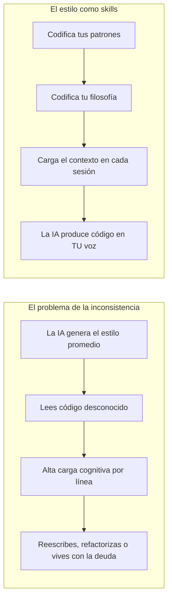

> *Cada línea de código que lees pero no escribiste es una línea que tienes que pensar dos veces.*
> *Cuanto más barato te resulte leerla, más cerca estará de código que tú habrías escrito.*
> — <cite>Experiencia personal</cite>

<!--more-->

## TL;DR

* **El problema real del código generado por IA no es la corrección, es la consistencia.** Un modelo que escribe un algoritmo perfecto en un estilo que tú nunca usarías te cuesta tiempo en cada línea.
* **El estilo de programación es una huella digital.** Los investigadores pueden identificarte como autor de una pieza de código, y tu estilo es más que cosmético. Es cómo descompones problemas, qué patrones eliges y tu modelo mental del mundo.
* **La IA genera el estilo de un desarrollador que no existe.** Promedia millones de repositorios en una voz genérica, por lo que el código siempre te resulta ligeramente ajeno.
* **La solución no es un mejor prompt, es externalizar tu estilo.** Codifica tus patrones y tu filosofía en contexto reutilizable (skills, AGENTS.md, ejemplos) para que el modelo produzca código que puedas leer sin esfuerzo.

---

Pasé mucho tiempo preguntándome por qué el desarrollo asistido por IA no se sentía tan productivo como debería.

El código era correcto. La lógica era sólida. Las pruebas pasaban. Y aun así, revisar cada pull request se sentía como leer un libro escrito por un extraño. Me encontraba reescribiendo funciones enteras no porque estuvieran mal, sino porque estaban escritas de una manera que yo nunca las habría escrito.

Fue entonces cuando tuve la realización que se convirtió en este post.

El cuello de botella nunca fue la capacidad de la IA para producir código funcional. El cuello de botella era la distancia entre el código que produce y el código que yo mismo produciría.

## Regla 1: El Código es una Huella Digital

Cada persona construye un modelo mental del mundo.

Ese modelo moldea cómo lees un enunciado de problema, cómo lo divides en piezas y qué soluciones te resultan *naturales*. Dos desarrolladores senior con el mismo bug no escriben el mismo refactor. Uno elige un tipo `Result`, el otro elige excepciones. Uno nombra las cosas con vocabulario de dominio, el otro con vocabulario de implementación. Ambos son correctos. Ambos son diferentes.

Tu código no es solo una descripción de lo que la máquina debe hacer.

Tu código es una descripción de cómo piensas.

Esto no es una afirmación poética, es un hecho medible. Hay todo un campo de investigación dedicado a ello: la **atribución de autoría de código** [^1]. La idea es simple. Si una pieza de código fuente lleva tu huella estilística, entonces puedes ser identificado como su autor.

Y los investigadores son notablemente buenos en ello:

* Los enfoques modernos basados en LLM atribuyen el código a su autor con alta precisión, prácticamente en segundos [^2].
* Tu estilo sobrevive incluso a la compilación. Los investigadores han desanonimizado a programadores a partir de binarios ejecutables compilados [^3].
* El estilo es lo suficientemente estable como para que exista trabajo dedicado tanto a atacar la atribución (transformación adversarial de estilo) como a defenderla [^4].

La conclusión es ineludible: el estilo es identidad. Es aprendible, es detectable y es estable con el tiempo.

Si eso es cierto, entonces cada IA que escribe código *tiene* un estilo. La pregunta es de quién.

## Regla 2: El Problema No Es la Calidad, Es la Consistencia

Aquí está la parte que me tomó demasiado tiempo entender.

Leer código es más caro que escribirlo. La literatura clásica de ingeniería de software sitúa la proporción en alrededor de 10 minutos de lectura por cada minuto de escritura [^5]. Cuando escribes, tu intención ya está en tu cabeza, por lo que el código es solo transcripción. Cuando lees el código de otra persona, tienes que reconstruir su intención desde cero.

Ahora piensa en lo que hace un LLM cuando genera código.

Muestrea de una distribución de probabilidad entrenada con la historia pública del software. Millones de repositorios, millones de autores, cada uno con un estilo, preferencias y modelos mentales diferentes. La salida es un *promedio* de todas esas voces.

Pero ese promedio no existe en la realidad.

Nadie escribe código en el estilo promedio. Todo desarrollador real escribe código en *su* estilo. Entonces el LLM te entrega algo que es casi, pero no del todo, como cualquier código que hayas visto antes. Es un extranjero en todos los codebases.

Esto tiene un costo concreto. Cuando revisas código generado por IA, no puedes apoyarte en tu intuición. Tu reconocimiento de patrones, el automatismo que te dice "esto es la búsqueda de usuario, esto es el límite de validación, aquí es donde debe manejarse el error" falla. Tienes que leer con cuidado, línea por línea, y reconstruir una intención que nunca formaste.

Cada línea que la IA escribe y que tú no habrías escrito es deuda cognitiva. La pagarás ahora, cuando la revises, y de nuevo después, cuando tengas que modificarla.

La corrección es necesaria pero no suficiente. Una solución solo es *barata* para ti cuando está escrita de la manera en que piensas.

## Regla 3: La Investigación Ya Lo Sabe

Asumí que esta era una esquina poco explorada del campo. Estaba equivocado.

Hay un cuerpo de trabajo pequeño pero creciente, y converge exactamente en este problema desde tres direcciones diferentes.

### Dirección 1: Los LLM escriben diferente que los humanos

La evidencia más directa proviene de un paper que compara empíricamente el estilo de código de la salida de los LLM contra el código escrito por humanos [^6]. Los autores resumen una taxonomía de **inconsistencias de estilo de código** en legibilidad, concisión y robustez. Las diferencias son sistemáticas, no aleatorias.

Trabajo complementario muestra que esas diferencias son incluso estadísticamente detectables: los clasificadores pueden distinguir de forma confiable el código escrito por humanos del generado por ChatGPT [^7].

### Dirección 2: La corrección funcional no es lo que quieren los desarrolladores

Los benchmarks históricamente han medido si el código generado pasa las pruebas, y nada más. Varios papers se oponen a eso.

Un benchmark, *NoFunEval*, muestra que los modelos de lenguaje de código fallan en requisitos más allá de la corrección funcional [^8]. Los desarrolladores piensan en *cómo* se implementa una función, no solo en *qué* hace. Les importan la mantenibilidad, la eficiencia, la seguridad y el encaje con el sistema circundante. Los modelos no demuestran ese entendimiento.

Otro benchmark, *CodeAlignBench*, evalúa si los modelos pueden seguir ajustes preferidos por el desarrollador, instrucciones que van más allá de la corrección [^9].

El mensaje es consistente: los benchmarks de corrección miden lo incorrecto, y la comunidad lo sabe.

### Dirección 3: La personalización es la frontera abierta

El trabajo más emocionante es el ataque directo al problema: generar código personalizado.

*MPCoder* es un generador de código personalizado multiusuario que aprende el estilo de un usuario en dos dimensiones [^10]. El aprendizaje de estilo explícito captura las convenciones de sintaxis y nombres. El aprendizaje de estilo implícito captura las convenciones semánticas y arquitectónicas. Esto está notablemente cerca de cómo pienso sobre mi propio estilo, y lo describo así más abajo.

*CodeFavor* entrena modelos para predecir las preferencias de código de los desarrolladores a partir de pares de candidatos [^11]. El marco, "gustos de código del desarrollador", es precisamente lo que encontré ausente en todos lados.

Pero aquí está el hueco que ninguno de estos cierra.

## Regla 4: Todos Hablan de Equipos, Nadie Habla de Ti

Lee los consejos prácticos sobre consistencia de código con IA en línea y encuentras los mismos temas repetidos [^12] [^13] [^14]:

* Define estándares de codificación del equipo.
* Agrega linters y formateadores al CI.
* Crea plantillas de prompts compartidas en todo el equipo.
* Revisa sistemáticamente.

Todo esto es verdad, todo es útil, y todo apunta a la unidad equivocada. El equipo es la unidad equivocada. El *individuo* es la unidad correcta.

Un linter atrapa la colocación de las llaves, pero no puede atrapar que tú eliges tipos `Result` mientras tu colega elige excepciones. Una plantilla de prompt puede estandarizar el fraseo, pero no puede codificar cómo descompones un problema en capas. Ningún estándar compartido puede hacer que el código de la IA se sienta como *tu* código, porque tu código está moldeado por tu modelo mental personal del mundo.

La dirección de investigación lo entiende. MPCoder es explícitamente sobre *múltiples usuarios*, cada uno con su propio estilo. Pero el camino de implementación que eligieron, el fine-tuning, no escala a un desarrollador individual. No puedes hacer fine-tuning de un modelo para cada desarrollador del equipo. Es demasiado caro, demasiado lento y requiere datos etiquetados en tu estilo.

Hay un camino más simple, y es el que he estado usando.

## Regla 5: Mi Solución, el Estilo como Skills

Déjame ser claro sobre una cosa primero.

No he resuelto completamente este problema. Los resultados son buenos, pero no son óptimos, y seré honesto sobre eso en la siguiente sección. Lo que he construido es una dirección que se siente correcta, y quiero compartirla.

La idea central es esta: **si el estilo es identidad, y la identidad es estable, entonces el estilo puede codificarse.**

Externalicé mi estilo en contexto reutilizable. En lugar de intentar que la IA lea mi mente, escribí cómo pienso e hice que ese contexto se cargue cada vez.

Guardo esto en un pequeño repositorio de skills [^15]. Cada skill es un conjunto enfocado de instrucciones que la IA carga cuando la tarea coincide. Dos de ellas cargan con la mayor parte del peso.

### La skill de manejo de errores

El mejor ejemplo es mi skill de manejo de errores. Codifica la arquitectura que describo en mis posts sobre manejo de errores [^16] [^17]. Las reglas centrales son:

* Valida en los bordes con un tipo `Result`, de forma defensiva.
* Parsea con Pydantic y tipos marcados (branded types), nunca solo valides.
* Afirma en el núcleo con una aserción fail-fast, de forma ofensiva.
* Nunca uses un `assert` simple, porque Python lo elimina bajo `-O`.

Estas reglas suenan a decisiones de ingeniería. Para mí son algo más. El patrón de Capas de Confianza, el tipo `Result`, los branded types, esa es mi firma. Es cómo pienso sobre dónde pueden ocurrir los errores y quién es responsable de ellos. Cuando la IA sigue estas reglas, no solo está produciendo buen código. Está produciendo código que coincide con mi modelo mental, así que puedo leerlo sin traducirlo.

### La skill to-plan

La segunda skill trata sobre planes, y me enseñó algo importante.

Noté que el mismo problema de consistencia ocurre antes de que exista el código. Cuando la IA planifica una función, el plan que produce no coincide con cómo descompongo los problemas. Así que codifiqué también mi formato de planificación.

El resultado es un formato de plan con una estructura específica: un PRD orientado a humanos y una especificación ejecutable para agentes, con seams, guardrails y evals. Ahora la IA produce planes en el formato exacto que diseñé, lo que significa que puedo revisar un plan de la misma manera que reviso uno mío.

El patrón se generaliza más allá de estas dos skills.

Lo que hace que esto funcione es el nivel de las decisiones codificadas.

* **Nivel 1, convenciones:** nombres, formato, estructura de archivos. Fáciles de codificar, fáciles de aplicar, pero de bajo valor. Un linter hace esto.
* **Nivel 2, patrones:** qué idioms usas, qué librerías, qué formas arquitectónicas. De mayor valor, y aquí es donde viven la mayoría de mis skills.
* **Nivel 3, filosofía:** cómo descompones problemas, qué consideras simple, dónde colocas los límites de confianza. El de mayor valor, y el más difícil de escribir, pero el más importante de capturar.

Mi skill de manejo de errores es en su mayoría Nivel 2 con una buena dosis de Nivel 3. La filosofía del límite de confianza es la parte de Nivel 3, y es la parte que hace que el código generado se sienta mío.

## Regla 6: Resultados y Limitaciones Honestas

Quiero informar lo que realmente sucedió, incluidas las partes que no salieron bien.

### Lo que funcionó

La skill de manejo de errores cambió genuinamente mi flujo de trabajo.

La IA ahora elige tipos `Result` en los bordes y aserciones en el núcleo sin que se le diga cada vez. El código generado sigue la forma de Capas de Confianza que yo habría usado. Las revisiones son más rápidas porque no tengo que traducir mentalmente la arquitectura. La consistencia entre sesiones, que es el objetivo real, es real.

La skill to-plan tuvo un efecto similar más arriba en el flujo. Los planes ahora llegan en un formato que puedo evaluar rápidamente, y puedo detectar un seam incorrecto de inmediato en lugar de leer diez párrafos para encontrarlo.

### Lo que no funcionó

Tengo que ser honesto sobre los límites.

Primero, la consistencia es probabilística, no determinista. La misma skill produce la misma arquitectura la mayoría de las veces, pero no siempre. Una de cada diez sesiones, la IA todavía se desvía hacia la voz promedio, y lo atrapo en la revisión.

Segundo, el contexto es finito. Una skill que codifique todo lo que creo sobre programación no cabría en una ventana de contexto, así que tengo que elegir qué importa más. La skill de manejo de errores gana porque el manejo de errores toca cada función. Otros aspectos de mi estilo aún no están capturados.

Tercero, las skills codifican lo que sé que hago, no lo que realmente hago. El hueco entre ambos me es invisible, y la skill hereda esa ceguera. Una IA que observe mi historial real podría cerrarlo, pero esa es una versión futura de esta idea.

Y cuarto, hay un impuesto de mantenimiento. Mi estilo evoluciona, y cada skill tiene que evolucionar con él, o empieza a aplicar decisiones que ya no tomo.

Ninguno de estos se siente como un callejón sin salida. Se sienten como la fricción normal de una técnica joven.

## La Conclusión

La corrección hizo de la IA una herramienta poderosa.

La consistencia es lo que hace que se sienta como *mi* herramienta.

Un modelo que escribe código funcional en una voz ajena es un generador de código que debo supervisar. Un modelo que escribe código como yo lo escribiría es una extensión de mi pensamiento. La diferencia no se mide con pruebas. Se mide por cuánto esfuerzo toma leer la salida.

Para cerrar esa brecha, deja de optimizar el prompt y empieza a externalizar el estilo:

1. **Acepta que el estilo es identidad.** Tus patrones y tu filosofía son una firma, y merecen ser tratados como un activo de primera clase.
2. **Codifica las decisiones de Nivel 2 y Nivel 3**, no solo las convenciones. Escribe la arquitectura que eliges y la filosofía detrás de ella.
3. **Carga ese contexto automáticamente.** Haz que el estilo sea una skill que se cargue sola, no un prompt que recuerdas pegar.
4. **Realimenta las correcciones.** Cada arreglo que haces en la revisión es una lección sobre tu estilo. Captúralo o el desvío regresa.

La meta nunca fue generar código más correcto. La meta es generar código que puedas leer sin esfuerzo, código que sea prácticamente tuyo.

<mark>Deja de intentar que la IA sea más inteligente. Haz que escriba como tú, y la IA se convierte en una extensión de tu pensamiento en lugar de un extraño en tu codebase.</mark>

## Referencias

[^1]: La [atribución de autoría de código](https://arxiv.org/abs/1512.08546) es un campo de investigación que identifica al autor de una pieza de código fuente a partir de su estilo.
[^2]: [I Can Find You in Seconds! Leveraging Large Language Models for Code Authorship Attribution](https://arxiv.org/abs/2501.08165), 2024.
[^3]: [When Coding Style Survives Compilation: De-anonymizing Programmers from Executable Binaries](https://arxiv.org/abs/1512.08546), 2015.
[^4]: [RoPGen: Towards Robust Code Authorship Attribution via Automatic Coding Style Transformation](https://arxiv.org/abs/2202.06043), 2022.
[^5]: R. Glass, [Facts and Fallacies of Software Engineering](https://en.wikipedia.org/wiki/Software_engineering), Addison-Wesley, 2002. La proporción de lectura a escritura de código se cita como aproximadamente 10:1.
[^6]: [Beyond Functional Correctness: Investigating Coding Style Inconsistencies in Large Language Models](https://arxiv.org/abs/2407.00456), 2024.
[^7]: [Discriminating Human-authored from ChatGPT-Generated Code Via Discernable Feature Analysis](https://arxiv.org/abs/2306.14397), 2023.
[^8]: [NoFunEval: Funny How Code LMs Falter on Requirements Beyond Functional Correctness](https://arxiv.org/abs/2401.15963), 2024.
[^9]: [CodeAlignBench: Assessing Code Generation Models on Developer-Preferred Code Adjustments](https://arxiv.org/abs/2510.27565), 2024.
[^10]: [MPCoder: Multi-user Personalized Code Generator with Explicit and Implicit Style Representation Learning](https://arxiv.org/abs/2406.17255), 2024.
[^11]: [Learning Code Preference via Synthetic Evolution](https://arxiv.org/abs/2410.03837), 2024.
[^12]: [The AI Code Consistency Problem: How to Maintain Coding Standards When Using AI](https://nosemicolons.com/posts/ai-code-consistency-standards/), 2026.
[^13]: [Maintaining AI-Generated Code Consistency with Team Style Guides](https://www.onspace.ai/blog/ai-code-consistency-style-guides), 2025.
[^14]: [The AI Code Generation Consistency Matrix](https://nosemicolons.com/posts/ai-code-generation-consistency-matrix/), 2026.
[^15]: [dinoesau/skills](https://github.com/dinoesau/skills/tree/main/skills) es un repositorio de skills reutilizables, incluyendo error-handling, coding-guide y to-plan.
[^16]: [Deja de Validar en Todas Partes: Una Guía Arquitectónica para el Manejo de Errores en TypeScript]()
[^17]: [Deja de Validar en Todas Partes: Una Guía Arquitectónica para el Manejo de Errores en Python]()
