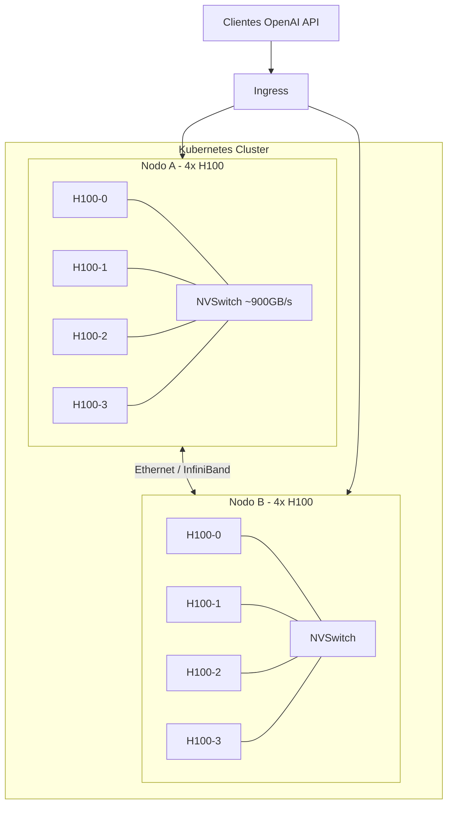
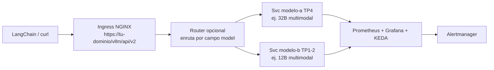
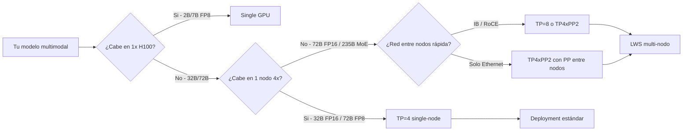
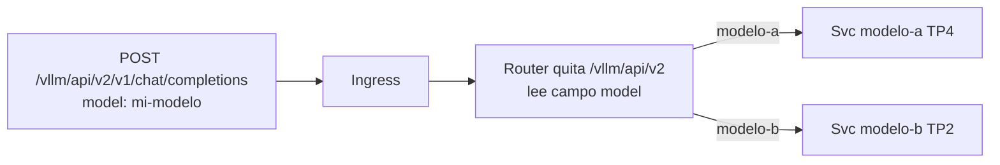
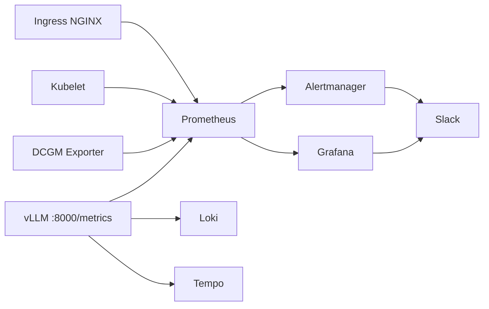

> Servir un modelo es la parte fácil.
> Mantenerlo observable, escalable, seguro y rápido con tráfico real es el otro 70% — y la parte que la mayoría de tutoriales se saltan.
> Esta es la checklist que falta, destilada de operar inferencia multimodal sobre 2 nodos x 4 H100 en Kubernetes.

<!--more-->

## 📌 TL;DR

* **Servir es solo el 30%.** Un `Deployment` que responde a `curl` no es producción.
  Sin observabilidad, autoscaling, gestión de pesos y seguridad, el primer pico te deja ciego con GPUs saturadas mientras Kubernetes cree que todo está idle.
* **Empieza simple, escala según el modelo.** La mayoría de modelos multimodales (7B-32B) caben en un solo nodo con Tensor Parallel `TP=4` — dos réplicas independientes te dan HA sin cruzar la red.
* **Solo ve multi-nodo cuando el modelo te obligue.** `70B+` denso o `200B+` MoE necesita LeaderWorkerSet (`LWS`) con `TP x PP` — más complejidad, cold start más lento y dependencia dura de la red entre nodos.
* **La checklist de producción siempre es la misma:** `GPU Operator + DCGM` -> `ServiceMonitor + alertas + dashboards` -> `TLS + auth + rate limiting` -> `pesos versionados + imagen pinneada` -> `KEDA sobre métricas vLLM` -> `PDB + anti-affinity`.
* **Esta guía es agnóstica al modelo.** Los ejemplos usan familias `Qwen3-VL` y `Gemma`, pero cada patrón aplica a cualquier modelo multimodal que soporte vLLM (LLaVA, Pixtral, InternVL, etc).

---

Si alguna vez seguiste un tutorial de `vLLM en Kubernetes`, conoces el flujo.
Instalas el GPU Operator, aplicas un `Deployment` con `--tensor-parallel-size 4`, haces port-forward, pruebas `curl /v1/chat/completions` y celebras.
Luego lo expones a usuarios reales y todo se rompe de formas que Kubernetes no puede ver.

Este post es el puente entre ese tutorial y un servicio real en producción.
Está basado en una [investigación de vLLM + Qwen3-VL sobre 2 nodos x 4 H100 SXM5 80GB](https://gist.github.com/dinoesau/b8e86151579b282dd353520bf5bd255d) — pero generalizada para que la apliques a cualquier modelo multimodal.

Cubriremos:

1. La arquitectura que realmente estás construyendo.
2. La base no negociable que hace visibles las H100 para Kubernetes.
3. Los tres conceptos de paralelismo que necesitas en 60 segundos.
4. Tres patrones de despliegue que cubren el 95% de casos.
5. El otro 70%: pesos, imágenes e ingress.
6. El stack de observabilidad que evita saturación a ciegas.
7. Autoscaling que realmente reacciona a la cola del engine.
8. Una checklist priorizada que puedes copiar.

## 1. Qué estás construyendo realmente

Asume dos nodos on-prem, cada uno con `4x H100 SXM5 80GB` (total 8 GPUs).
La interconexión intra-nodo es `NVLink 4.0 + NVSwitch (~900 GB/s)` — ideal para Tensor Parallel.
La interconexión entre nodos es la variable: si tienes `InfiniBand NDR 400G` o `RoCE`, el Tensor Parallel entre nodos es viable con `NCCL + GDRDMA`.
Si solo tienes `Ethernet 25/100G`, prefiere Pipeline Parallel entre nodos.

También asumimos `Kubernetes >= 1.27` con `containerd` y `nvidia-container-toolkit`.



Al final quieres esto:



Cada modelo multimodal detrás de ese ingress habla la misma API compatible con OpenAI en `/v1/chat/completions` — texto, imagen y video viajan como bloques `image_url`.

## 2. La planta baja: exponer H100 a Kubernetes

Sin esta capa ningún patrón de vLLM es estable en H100.
Es aburrida, es obligatoria, y es donde la mayoría de setups on-prem fallan en silencio.

### 2.1 NVIDIA GPU Operator

Es el patrón estándar CNCF para 2025-2026.
Un solo Helm chart instala `driver 550+`, `toolkit`, `device-plugin`, `DCGM Exporter`, `Node Feature Discovery`, y opcionalmente `MIG Manager`.
Es la única forma soportada de tener métricas `DCGM`, auto-upgrades y time-slicing/MIG vía ConfigMap sin instalar todo a mano.

```bash
helm repo add nvidia https://helm.ngc.nvidia.com/nvidia
helm repo update
helm upgrade --install gpu-operator nvidia/gpu-operator \
  --create-namespace --namespace gpu-operator \
  --set driver.enabled=true \
  --set toolkit.enabled=true \
  --set dcgmExporter.enabled=true \
  --wait

kubectl get nodes -o custom-columns=NAME:.metadata.name,GPU:.status.allocatable."nvidia\.com/gpu"
# esperado: 4 y 4
```

Si ves `0 GPUs`, revisa `kubectl describe node` para `nvidia.com/gpu` y `dmesg` por `XID errors` antes de tocar vLLM.

La alternativa manual (`driver` + DaemonSet `nvidia-device-plugin` standalone) pierde `DCGM` y gestión de ciclo de vida — no la uses en producción.

### 2.2 Cómo compartir una GPU (y cuándo no hacerlo)

| Modo | Cómo funciona | Cuándo usarlo | Trade-off clave |
| :--- | :--- | :--- | :--- |
| **Exclusive (default)** | `nvidia.com/gpu: 1` reserva una GPU completa | Producción para cualquier modelo >= 7B | Máximo rendimiento y aislamiento |
| **Time-slicing** | ConfigMap del Operator multiplexa slots temporales | Dev/staging, modelos auxiliares pequeños | Sin aislamiento de VRAM, overhead 5-15% |
| **MIG** | Particiona H100 en hasta 7 instancias físicas | Aislamiento duro por equipo | Rompe NVLink, incompatible con TP que necesita GPU completa |

Para inferencia multimodal en producción, usa `Exclusive`.
Time-slicing y MIG solo tienen sentido para dev o para modelos pequeños auxiliares que deben coexistir sin robarle una H100 completa a vLLM.

### 2.3 El spec de Pod que todo Pod vLLM necesita

Esto es independiente del patrón de despliegue.
Sin `/dev/shm` y `IPC_LOCK`, `NCCL` falla con `Bus error` o cae silenciosamente a `NET/Socket` y la latencia se multiplica por 10.

```yaml
resources:
  limits: { nvidia.com/gpu: "4" }
  requests: { nvidia.com/gpu: "4" }
securityContext:
  capabilities: { add: ["IPC_LOCK"] }
volumes:
  - name: dshm
    emptyDir: { medium: Memory, sizeLimit: 16Gi }
volumeMounts:
  - { mountPath: /dev/shm, name: dshm }
```

Verifica después del deploy con `NCCL_DEBUG=TRACE` — debes ver `via NET/IB/GDRDMA`, no `Socket`.

## 3. Paralelismo en 60 segundos

Los modelos multimodales añaden un vision encoder sobre el LLM, pero la matemática de escalado es la misma.

* **Tensor Parallel (TP):** parte cada capa entre GPUs, necesita `AllReduce` sincrónico por capa.
  Rápido dentro del nodo (NVLink), caro entre nodos.
* **Pipeline Parallel (PP):** parte por capas, cada GPU o nodo ejecuta un estadio.
  Menos comunicación, pero introduce burbujas en el pipeline.
* **Data Parallel (DP):** replica el modelo completo y reparte requests — throughput horizontal.
* **Expert Parallel (EP):** solo para MoE, escala expertos sin replicarlos.

La regla oficial de vLLM es `TP = GPUs por nodo` y `PP = número de nodos`.



Regla de sizing para multimodal: `pesos + vision cache + KV cache < VRAM * gpu-memory-utilization`.
Cada imagen de `1024px` añade `1-2 GB` de vision/KV cache — con `--limit-mm-per-prompt image=4` reserva `4-8 GB` extra.

## 4. Tres patrones que cubren el 95%

La investigación completa documenta seis patrones.
En la práctica, con tres basta — el resto son envoltorios o variantes solo para dev.

### 4.1 Patrón 1: Deployment single-node con `TP=4` (empieza aquí)

Un `Deployment` por modelo, `nvidia.com/gpu: 4`, `--tensor-parallel-size 4`.
Cada réplica es autosuficiente y nunca cruza la red.
Escalas horizontalmente añadiendo réplicas detrás de un `Service ClusterIP`.
Es el ejemplo canónico de `docs.vllm.ai/deployment/k8s`.

```yaml
apiVersion: apps/v1
kind: Deployment
metadata: { name: llm-multimodal-32b, namespace: llm-serving }
spec:
  replicas: 2
  selector: { matchLabels: { app: llm-multimodal } }
  template:
    metadata: { labels: { app: llm-multimodal } }
    spec:
      affinity:
        podAntiAffinity:
          preferredDuringSchedulingIgnoredDuringExecution:
            - weight: 100
              podAffinityTerm:
                labelSelector: { matchLabels: { app: llm-multimodal } }
                topologyKey: kubernetes.io/hostname
      volumes:
        - { name: cache, persistentVolumeClaim: { claimName: model-cache } }
        - { name: dshm, emptyDir: { medium: Memory, sizeLimit: 16Gi } }
      containers:
        - name: vllm
          image: vllm/vllm-openai:v0.11.0
          command: ["/bin/sh","-c"]
          args:
            - |
              vllm serve TU_MODELO_ID \
                --tensor-parallel-size 4 \
                --gpu-memory-utilization 0.90 \
                --max-model-len 16384 \
                --enable-prefix-caching \
                --enable-chunked-prefill \
                --limit-mm-per-prompt image=4,video=1 \
                --mm-encoder-tp-mode data \
                --trust-remote-code \
                --served-model-name llm-multimodal-32b
          ports: [{ containerPort: 8000, name: http }]
          env:
            - name: HF_TOKEN
              valueFrom: { secretKeyRef: { name: hf-token-secret, key: token } }
          resources:
            limits: { nvidia.com/gpu: "4", cpu: "16", memory: 96Gi }
            requests: { nvidia.com/gpu: "4", cpu: "8", memory: 32Gi }
          volumeMounts:
            - { mountPath: /root/.cache/huggingface, name: cache }
            - { mountPath: /dev/shm, name: dshm }
          startupProbe: { httpGet: { path: /health, port: 8000 }, failureThreshold: 60, periodSeconds: 10 }
          readinessProbe: { httpGet: { path: /health, port: 8000 }, periodSeconds: 5 }
          livenessProbe: { httpGet: { path: /health, port: 8000 }, periodSeconds: 10 }
---
apiVersion: v1
kind: Service
metadata: { name: llm-multimodal, namespace: llm-serving }
spec: { selector: { app: llm-multimodal }, ports: [{ name: http, port: 8000, targetPort: 8000 }] }
```

**Cuándo elegirlo:** cualquier modelo denso que quepa en `4x H100` (`~320 GB VRAM`) — típicamente hasta `32B FP16` o `70B FP8`.
Tu cluster `2x4` te da dos réplicas para HA sin tráfico entre nodos.
Cold start `60-180s` para un modelo 32B.

Añade `--quantization fp8` o una variante `FP8` pre-cuantizada si vas justo de VRAM — en H100, FP8 es nativo y da ~2x throughput sin pérdida perceptible para la mayoría de tareas.

### 4.2 Patrón 2: Multi-nodo con LeaderWorkerSet (`LWS`) — `TP x PP`

Un único servidor lógico distribuido en dos Pods que cooperan.
Usa el CRD `LeaderWorkerSet` (`kubernetes-sigs/lws`) para co-scheduling atómico y descubrimiento vía `LWS_GROUP_SIZE`, `LWS_LEADER_ADDRESS`, `LWS_WORKER_INDEX`.
El arranque es `--nnodes 2 --node-rank $IDX --master-addr $LEADER --tensor-parallel-size 4 --pipeline-parallel-size 2`.

```yaml
apiVersion: leaderworkerset.x-k8s.io/v1
kind: LeaderWorkerSet
metadata: { name: llm-multimodal-72b, namespace: llm-serving }
spec:
  replicas: 1
  leaderWorkerTemplate:
    size: 2
    restartPolicy: RecreateGroupOnPodRestart
    leaderTemplate:
      spec:
        containers:
          - name: vllm-leader
            image: vllm/vllm-openai:v0.11.0
            args:
              - |
                vllm serve TU_MODELO_GRANDE_ID \
                  --tensor-parallel-size 4 --pipeline-parallel-size 2 \
                  --nnodes $(LWS_GROUP_SIZE) --node-rank $(LWS_WORKER_INDEX) \
                  --master-addr $(LWS_LEADER_ADDRESS) \
                  --gpu-memory-utilization 0.90 --max-model-len 32768 \
                  --limit-mm-per-prompt image=8 --enable-prefix-caching --trust-remote-code
            resources: { limits: { nvidia.com/gpu: "4", memory: 400Gi } }
    workerTemplate:
      spec:
        containers:
          - name: vllm-worker
            image: vllm/vllm-openai:v0.11.0
            args:
              - |
                vllm serve TU_MODELO_GRANDE_ID \
                  --tensor-parallel-size 4 --pipeline-parallel-size 2 \
                  --nnodes $(LWS_GROUP_SIZE) --node-rank $(LWS_WORKER_INDEX) \
                  --master-addr $(LWS_LEADER_ADDRESS) --headless \
                  --gpu-memory-utilization 0.90 --max-model-len 32768 \
                  --limit-mm-per-prompt image=8 --trust-remote-code
            resources: { limits: { nvidia.com/gpu: "4", memory: 400Gi } }
```

**Cuándo elegirlo:** solo cuando el modelo no cabe en 4 GPUs — `70B+ FP16` o `200B+` MoE con `--enable-expert-parallel`.
La complejidad es alta, la latencia tiene burbujas de PP, `20-40%` caída de throughput con solo Ethernet, todo el grupo falla si cae un nodo, y el cold start llega a `3-5 minutos`.
Si no tienes InfiniBand, cuantiza a `FP8` para quedarte en Patrón 1 en vez de adoptar `LWS`.

### 4.3 Patrón 3: vLLM Production Stack (Helm)

Un Helm chart de `vllm-project/production-stack` que envuelve los Patrones 1 y 2 con `ServiceMonitor`, `PDB`, `KEDA ScaledObject`, router opcional prefix-aware y dashboards Grafana.

```yaml
replicaCount: 2
model:
  name: TU_MODELO_ID
  tensorParallelism: 4
  gpuMemoryUtilization: 0.90
  maxModelLen: 16384
  extraArgs: "--limit-mm-per-prompt image=4 --mm-encoder-tp-mode data --enable-prefix-caching"
resources: { limits: { nvidia.com/gpu: 4 } }
router: { enabled: true, prefixAwareRouting: true }
observability: { prometheus: true, grafana: true }
```

**Cuándo elegirlo:** quieres pasar de PoC a producción sin escribir manifests a mano, y te compensa acoplarte a Prometheus Operator.
Aún no cubre `LWS` multi-nodo — para eso sigues necesitando Patrón 2.

Otras plataformas (`KServe`, `KubeAI`, `AIBrix`, `llm-d`) siguen la misma idea — exponen un CRD `InferenceService` o `Model` y crean un `Deployment` vLLM debajo.
Úsalas si tu org ya las opera; si no, añaden abstracción que oculta `OOM` y fallos `NCCL` para un solo modelo.

| Criterio | P1 Deployment TP4 | P2 LWS TPxPP | P3 Production Stack |
| :--- | :--- | :--- | :--- |
| Complejidad | Baja | Alta | Baja-Media |
| Modelos soportados | Hasta 4 GPUs | Hasta 8 GPUs | Igual que P1 |
| Latencia | Mejor (solo NVLink) | Peor con Ethernet | Igual que P1 |
| Throughput por réplica | 1 nodo | Limitado por burbujas PP | Igual que P1 |
| HA | Sí (réplicas independientes) | No (grupo monolítico) | Sí |
| Red necesaria | Solo NVLink | IB/RoCE preferido | Solo NVLink |
| Cold start | 60-180s (32B) | 180-300s | Igual que P1 |
| Cuándo usar | Inicio por defecto | Solo si modelo > 4 GPUs | Equipo quiere convenciones Helm |

**Recomendación práctica:** empieza con Patrón 1 para cualquier multimodal `7B-32B`, evoluciona a un router prefix-aware (Patrón 3 o `AIBrix`/`llm-d`) cuando el tráfico supere `100-200 qps`, y solo adopta Patrón 2 si el caso realmente exige un modelo `70B+` que no cabe de otra forma.

## 5. El otro 70%: pesos, imágenes e ingress

Esto es lo que separa una demo de un servicio.

### 5.1 Almacenamiento de pesos

| Opción | Cómo | Pros | Contras |
| :--- | :--- | :--- | :--- |
| PVC `RWO` + initContainer | `huggingface-cli` llena PVC por Pod | Simple | No multi-nodo, cada Pod descarga 60 GB |
| PVC `RWX` NFS/CephFS | Un PVC RWX compartido | Sirve para LWS y réplicas | NFS lento para 70 GB |
| `hostPath` + DaemonSet prefetch | DaemonSet descarga a `/mnt/models` | Carga local rápida | Acoplado a nodos |
| Imagen con pesos baked | `COPY models` en `FROM vllm` | Cold start mínimo | Imagen de 70 GB |

Recomendado: `PVC RWX` con `CephFS`/`NFS` si podrías necesitar `LWS` en el futuro, si no `hostPath` si te quedarás en Patrón 1.
Siempre pre-calienta con un `Job` antes de desplegar vLLM:

```bash
huggingface-cli download TU_MODELO_ID --local-dir /cache/model --local-dir-use-symlinks False
```

Móntalo en `/root/.cache/huggingface` y verifica `startupProbe.failureThreshold >= 60` con `periodSeconds: 10` — un modelo 32B tarda `90-180s` en cargar y una probe corta lo reiniciará prematuramente con `KeyboardInterrupt: terminated`.

Pinnea el tag de imagen — nunca `latest`.
Usa `vllm/vllm-openai:v0.11.0` o superior para familias multimodales recientes, y un tag dedicado `gemma` o nightly si tu familia de modelo lo requiere.

### 5.2 Flags multimodales que realmente importan

No son opcionales para multimodal; omitirlos rompe la inferencia o desperdicia 20% de rendimiento.

* `--limit-mm-per-prompt image=4,video=1` — limita tokens de visión por request.
  Muy bajo y los usuarios ven `400: Too many images`; muy alto y reservas `4-8 GB` extra de vision/KV cache.
* `--mm-encoder-tp-mode data` — shard del vision encoder por datos da `6-19%` de aceleración en imágenes `512-1024px` con `TP>1`.
* `--enable-prefix-caching` + `--enable-chunked-prefill` — reducen `TTFT` cuando los prompts comparten prefijo o cuando las imágenes inflan el prompt.

En H100, `FP8` es de primera clase: usa una variante pre-cuantizada o `--quantization fp8` para ~2x throughput.

### 5.3 Exponer bajo un base path custom

vLLM sirve OpenAI-compatible en `/v1/chat/completions`, `/v1/models`, `/health`, `/metrics`.
Normalmente quieres `https://tu-dominio/vllm/api/v2/...` como raíz pública.
Elige una sola forma y no mezcles:

**Opción A — rewrite en el ingress (recomendada):**

```yaml
apiVersion: networking.k8s.io/v1
kind: Ingress
metadata:
  name: vllm-gateway
  namespace: llm-serving
  annotations:
    nginx.ingress.kubernetes.io/use-regex: "true"
    nginx.ingress.kubernetes.io/rewrite-target: /$2
    nginx.ingress.kubernetes.io/proxy-body-size: "50m"
    nginx.ingress.kubernetes.io/proxy-read-timeout: "300"
    nginx.ingress.kubernetes.io/proxy-send-timeout: "300"
    cert-manager.io/cluster-issuer: letsencrypt-prod
spec:
  ingressClassName: nginx
  tls: [{ hosts: [tu-dominio.com], secretName: vllm-tls }]
  rules:
    - host: tu-dominio.com
      http:
        paths:
          - path: /vllm/api/v2(/|$)(.*)
            pathType: ImplementationSpecific
            backend: { service: { name: vllm-router, port: { number: 80 } } }
```

El cliente llama `https://tu-dominio/vllm/api/v2/v1/chat/completions` y vLLM recibe `/v1/chat/completions`.

**Opción B — `--root-path` en vLLM (sin rewrite):**

```bash
vllm serve TU_MODELO_ID --host 0.0.0.0 --port 8000 --root-path /vllm/api/v2 --served-model-name mi-modelo
```

Entonces el ingress usa `path: /vllm/api/v2` `pathType: Prefix` sin `rewrite-target`.

Para múltiples modelos tras un mismo host, mantén un solo ingress y deja que el campo `model` enrute — un router prefix-aware (`Production Stack`, `AIBrix`, `llm-d`) lee `model: mi-modelo-a` vs `mi-modelo-b` y reenvía al `Service` correcto.
No crees subpaths `/vllm/api/v2/modelo-a` vs `/modelo-b` — el campo `model` ya es el selector.



Elijas lo que elijas, pon `proxy-body-size 50m` para imágenes `1024px` y `proxy-read-timeout 300` porque contextos largos y reasoning pueden tardar segundos.

## 6. Observabilidad: lo más caro de saltarse

Esta es la respuesta a "¿hace falta monitoreo?"
Sí — y es lo más caro de omitir.



### 6.1 Qué métricas recoger

vLLM expone en `:8000/metrics` con prefijo `vllm:`.
Para H100 multimodal las críticas son `vllm:time_to_first_token_seconds` (TTFT), `vllm:inter_token_latency_seconds` (TPOT), `vllm:e2e_request_latency_seconds`, `vllm:num_requests_waiting`, `vllm:num_requests_running`, `vllm:num_requests_swapped`, `vllm:kv_cache_usage_perc`, `vllm:prefix_cache_hits_total`, y contadores de tokens.
`DCGM Exporter` aporta `DCGM_FI_DEV_GPU_UTIL`, `DCGM_FI_DEV_FB_USED`, `DCGM_FI_DEV_GPU_TEMP`, y `DCGM_FI_DEV_XID_ERRORS`.

El desfase entre `vllm:kv_cache_usage_perc` y `DCGM_FI_DEV_FB_USED` es normal: vLLM pre-reserva `gpu-memory-utilization` (ej. `0.90`) al arrancar y `DCGM` ve esa reserva como usada aunque el pool de KV esté al 3%.

### 6.2 Scraping

Sin `ServiceMonitor`, Prometheus nunca descubre `/metrics` aunque el Pod esté healthy.

```yaml
apiVersion: monitoring.coreos.com/v1
kind: ServiceMonitor
metadata: { name: llm-multimodal, namespace: llm-serving, labels: { release: kube-prometheus-stack } }
spec:
  selector: { matchLabels: { app: llm-multimodal } }
  endpoints: [{ port: http, path: /metrics, interval: 15s, scrapeTimeout: 10s }]
```

Para `DCGM`, el GPU Operator ya crea su propio `ServiceMonitor` cuando `dcgmExporter.enabled=true`.

### 6.3 Alertas

El fallo silencioso más común: comparar `vllm:kv_cache_usage_perc > 90` en vez de `> 0.9` — nunca dispara porque la métrica es `0-1`, no `0-100`.

```yaml
apiVersion: monitoring.coreos.com/v1
kind: PrometheusRule
metadata: { name: llm-alerts, namespace: llm-serving }
spec:
  groups:
    - name: vllm.slo
      interval: 30s
      rules:
        - alert: LLMHighTTFT
          expr: histogram_quantile(0.95, sum by (le) (rate(vllm:time_to_first_token_seconds_bucket[5m]))) > 2
          for: 2m
          labels: { severity: warning }
          annotations: { summary: "TTFT p95 > 2s" }
        - alert: LLMQueueBacklog
          expr: vllm:num_requests_waiting > 5
          for: 5m
          labels: { severity: critical }
          annotations: { summary: "Cola vLLM > 5 por réplica — engine saturado" }
        - alert: LLMKVCacheSaturated
          expr: vllm:kv_cache_usage_perc > 0.9
          for: 5m
          labels: { severity: critical }
          annotations: { summary: "KV cache > 90% — añadir réplica o reducir max-model-len" }
        - alert: LLMMetricsAbsent
          expr: absent(vllm:num_requests_running)
          for: 5m
          labels: { severity: critical }
          annotations: { summary: "Sin métricas vLLM — Pod no expone /metrics" }
        - alert: GPUOverheating
          expr: DCGM_FI_DEV_GPU_TEMP > 85
          for: 5m
          labels: { severity: critical }
        - alert: GPUXidError
          expr: increase(DCGM_FI_DEV_XID_ERRORS[5m]) > 0
          labels: { severity: critical }
```

No construyas dashboards desde cero.
Importa Grafana IDs `25263` (vLLM moderno), `24756` (Monitoring V2), `23856` (KServe vLLM) y `25620` (serving overview), luego añade paneles `DCGM`.
El Production Stack ya los trae.

SLOs esperados para chat multimodal interactivo: `TTFT p95 < 300ms`, `inter-token p95 < 50ms`.
Si `kv_cache > 0.9` sostenido, estás saturado aunque `DCGM` diga `94% VRAM`.

Centraliza logs con `Loki` o `ELK` y alerta por `CUDA OOM` y `KeyboardInterrupt: terminated` — este último significa que tu `startupProbe` es corta.
Para correlación más profunda, habilita `OpenTelemetry` hacia `Tempo`/`Jaeger` para trazar gateway -> prefill -> decode, y habilita `pprof` solo en staging.

## 7. Autoscaling y cold start

No uses `HPA` por CPU.
vLLM satura `GPU` mientras `CPU` parece idle y la cola se forma dentro del engine — `HPA` nunca dispara.

Usa `KEDA` con Prometheus sobre `vllm:num_requests_waiting` y `vllm:kv_cache_usage_perc`.

```yaml
apiVersion: keda.sh/v1alpha1
kind: ScaledObject
metadata: { name: llm-scaler, namespace: llm-serving }
spec:
  scaleTargetRef: { name: llm-multimodal-32b }
  minReplicaCount: 1
  maxReplicaCount: 2
  cooldownPeriod: 300
  triggers:
    - type: prometheus
      metadata:
        serverAddress: http://kube-prometheus-stack-prometheus.monitoring:9090
        metricName: vllm_requests_waiting_per_replica
        query: 'sum(vllm:num_requests_waiting{namespace="llm-serving"}) / scalar(count(up{job="vllm"}==1) or vector(1))'
        threshold: "5"
```

En on-prem con dos nodos fijos, `Cluster Autoscaler`/`Karpenter` no puede añadir nodos GPU — solo escalas Pods.
Mitiga cold start con pesos pre-calentados, `startupProbe` generosa y opcionalmente snapshots de `NVIDIA Dynamo` para restaurar estado cargado.

## 8. La checklist de producción (P0/P1/P2)

Si el `Deployment` era el 30%, esto es el 70%.

| Bloque | Prioridad | Esfuerzo | Riesgo si se omite |
| :--- | :--- | :--- | :--- |
| Métricas + alertas + dashboards | **P0** | Medio | Operación a ciegas — GPUs saturadas parecen idle |
| Ingress TLS + auth + rate limit + NetworkPolicy | **P0** | Medio | Un loop vacía 8 H100s |
| Pesos versionados + PVC RWX + imagen pinneada | **P0** | Medio | Cold starts aleatorios, deploys no reproducibles |
| KEDA sobre métricas vLLM | **P0** | Bajo | Nunca escalas con la cola real |
| PDB + anti-affinity + ResourceQuota + PriorityClass | **P1** | Bajo | Un drain mata tu única réplica |
| Runbook para cold start + check `NCCL_DEBUG` | **P1** | Bajo | MTTR alto |
| Backup de PVC + rotar `HF_TOKEN` | **P1** | Bajo | Cache perdido, secreto filtrado |
| Traces (OTel) + profiling | **P2** | Medio | Debugging lento |
| Canary + CI/CD + SLO error budget | **P2** | Alto | Deploys sin rollback |

**Definition of Done para prod:** los cuatro P0 en verde.
Dashboards muestran `TTFT` y `KV cache`, las alertas disparan en staging, el ingress tiene `TLS` y auth verificado con `curl` externo, el PVC tiene pesos pre-calentados y `startupProbe` sin restarts, y `KEDA` escala con `vllm:num_requests_waiting` bajo carga.

**Orden sugerido:**

* Semana 1 — fundaciones: `GPU Operator`, verificar `4+4` GPUs, desplegar `kube-prometheus-stack` con `DCGM`.
* Semana 2 — PoC Patrón 1: desplegar un modelo multimodal pequeño (`7B TP1`) y luego tu objetivo (`32B TP4`), valida `/health` y `curl` multimodal.
* Semana 3 — almacenamiento y tuning: migrar a `RWX` o `hostPath` pre-calentado, activar `FP8` si aplica, ajustar `gpu-memory-utilization` y `max-model-len`, añadir `ServiceMonitor` y `PrometheusRule`.
* Semana 4 — producción: añadir `KEDA`, ingress con `TLS` y auth, `PDB`, anti-affinity, `NetworkPolicy`, backup de PVC y dashboards `25263`/`24756`.
* Solo si hace falta — `LWS` para `70B+`/`MoE`.

## 9. Consumir desde tu app

vLLM es compatible con OpenAI, así que cualquier cliente OpenAI funciona — `LangChain` es solo un wrapper.
Apunta `base_url` a tu ingress o al `Service ClusterIP` dentro del cluster.

```python
from langchain_openai import ChatOpenAI
from langchain_core.messages import HumanMessage
import base64

# vía ingress público - nota el sufijo /v1 tras tu base path
llm = ChatOpenAI(
    model="mi-modelo-multimodal",
    base_url="https://tu-dominio.com/vllm/api/v2/v1",
    api_key="dummy",  # o clave real si tu ingress la exige
    temperature=0.2,
    max_tokens=1024,
)

# solo texto
print(llm.invoke("Explica PagedAttention en 3 bullets.").content)

# multimodal - imagen local como base64
with open("ticket.jpg", "rb") as f:
    b64 = base64.b64encode(f.read()).decode()
    data_url = f"data:image/jpeg;base64,{b64}"

msg = HumanMessage(content=[
    {"type": "text", "text": "Extrae fecha, proveedor y total como JSON."},
    {"type": "image_url", "image_url": {"url": data_url}},
])
print(llm.invoke([msg]).content)

# dentro del cluster sin ingress
# ChatOpenAI(model="mi-modelo-multimodal", base_url="http://llm-multimodal.llm-serving.svc:8000/v1", api_key="dummy")
```

Si ves `400: Too many images`, superaste `--limit-mm-per-prompt` — sube el flag o envía menos imágenes.
Si ves `503` o latencia alta, correlaciona con `vllm:num_requests_waiting` y `vllm:kv_cache_usage_perc` en Grafana antes de reintentar — más retries con `KV cache > 0.9` solo empeoran la cola.

Dentro del cluster el mismo endpoint responde en `http://llm-multimodal.llm-serving.svc:8000/v1/chat/completions` — sin ingress para llamadas servicio-a-servicio.

## 10. Cierre: el modelo no es el producto

Elegir un modelo multimodal es un cambio de una línea en `vllm serve TU_MODELO_ID`.
Hacer que ese modelo sea observable, enrutable, autoescalable y resiliente en Kubernetes con H100s es el producto real.

Empieza con Patrón 1.
Entrega la checklist P0 antes de optimizar el prompt.
Todo lo demás — `LWS`, canary, traces — puede venir después de que puedas responder "¿cuánto mide la cola y cuánto está lleno el KV cache?" a las 3 AM.

> La investigación completa que inspiró esta guía — con YAML exhaustivo, matriz de seis patrones y comandos paso a paso — está disponible en [gist.github.com/dinoesau/b8e86151579b282dd353520bf5bd255d](https://gist.github.com/dinoesau/b8e86151579b282dd353520bf5bd255d).
> Las familias de modelos evolucionan rápido (Qwen, Gemma, Pixtral, InternVL) — verifica el tag exacto en HuggingFace y la imagen `vLLM >= 0.11.0` antes de hacer `vllm serve`.

---

## Fuentes y lectura adicional

* `docs.vllm.ai/deployment/k8s`, `docs.vllm.ai/serving/parallelism_scaling`, `docs.vllm.ai/deployment/frameworks/lws`.
* `docs.vllm.ai/design/metrics` y `docs.vllm.ai/usage/metrics`.
* `grafana.com` dashboards `25263`, `24756`, `23856`, `25620`.
* `github.com/qwenlm/qwen3-vl` y model cards en HuggingFace para flags multimodales.
* Patrones de producción de `thegoodshell.com/vllm-kubernetes`, `scaleops.com/blog/vllm-kubernetes` y `spheron.network`.
