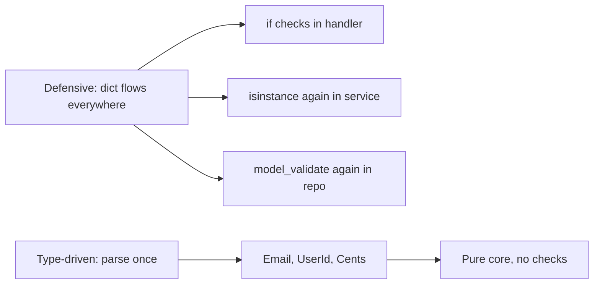
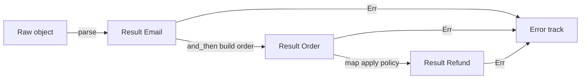
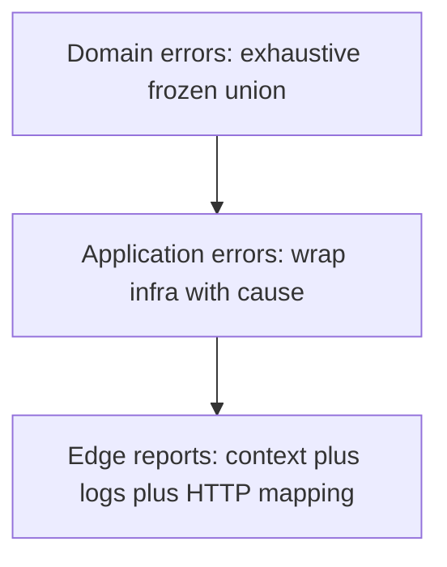
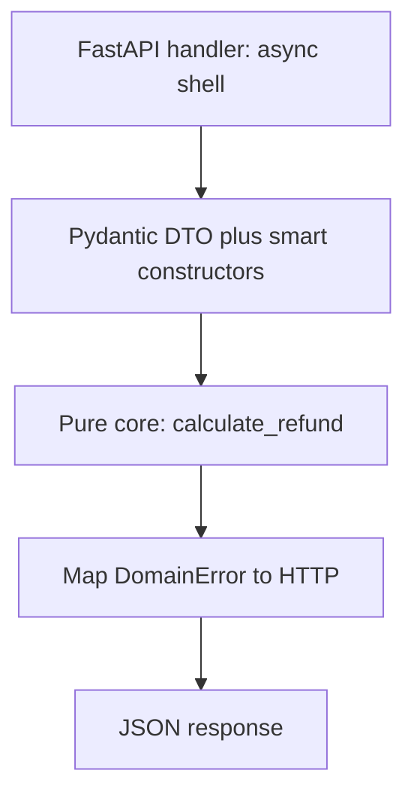

> *Un desarrollador junior no valida nada y espera lo mejor.*
> *Un desarrollador intermedio valida todo, en todas partes, con `if` e `isinstance` en cada capa.*
> *Un desarrollador senior parsea una vez en el borde y deja que el sistema de tipos demuestre el resto.*
> - <cite>Proverbio de Ingeniería de Software, edición Python</cite>

<!--more-->

## TL;DR

* **Valida una vez, en el borde.**
  Espera `dict`, `str` y `Any` no confiables en la frontera del sistema.
  Parséalos ahí en tipos de dominio con prueba integrada.
* **Parsea, no valides.**
  Validar conserva el tipo débil y devuelve `bool`.
  Parsear consume el tipo débil y devuelve `Result[StrongType, Error]`.
* **Modela el dominio con tipos.**
  Usa `NewType` como punto de partida, value objects congelados con smart constructors, sum types, product types y funciones totales.
  Haz que los estados ilegales sean irrepresentables por construcción.
* **Estratifica los errores.**
  Usa una unión congelada exhaustiva para errores de dominio y envuelve las fallas de infraestructura una sola vez en el borde de aplicación.
* **Empuja las invariantes al verificador.**
  Usa el patrón type-state, `mypy --strict` / `pyright`, value objects con `slots` parseados una vez, y un núcleo funcional puro envuelto por un shell delgado de FastAPI con Pydantic.
* Este post es el capítulo Python de la serie Error Handling.
  Solo asume Python 3.12+, `mypy --strict` y Pydantic v2, y construye cada patrón con dataclasses, módulos y `Result`.

---

## 1. Introducción: El Antipatrón del Python Defensivo

El hábito tentador en Python dinámico es aceptar `dict`, `str` y `Any` en cada función y volver a comprobarlos en cada capa.
Validas el mismo payload en el handler, luego en el servicio, luego en el repositorio, porque ninguna firma registra lo que ya fue probado.

Considera la clásica sopa de primitivas.

```python
from fastapi import FastAPI, Request
from fastapi.responses import JSONResponse

app = FastAPI()


@app.post("/refund")
async def process_refund(req: Request) -> JSONResponse:
    # ❌ Antipattern: dict/Any flows through every layer.
    try:
        body: object = await req.json()  # Raises on malformed JSON.

        # Defensive check 1: who validated the payload shape?
        if not isinstance(body, dict):
            raise ValueError("Invalid payload")

        # Defensive check 2: who validated user_id?
        if "userId" not in body or not isinstance(body["userId"], str):
            raise ValueError("Missing UserId")

        # Defensive check 3: who validated amount?
        amount = body.get("amount")
        if not isinstance(amount, (int, float)) or amount <= 0:
            raise ValueError("Invalid amount")

        user = await get_user(body["userId"])
        if user is None:
            raise ValueError("User not found")  # Expected error? Or DB bug?

        # Business logic is buried under guards.
        await gateway.refund(user.stripe_id, amount)
        return JSONResponse({"message": "Success"}, status_code=200)
    except Exception as exc:
        # Is this a 400 typo or a 500 outage? The type is lost.
        return JSONResponse({"error": str(exc)}, status_code=400)
```

Este código compila, pasa el review y pudre lentamente el codebase.
Cada función repite los mismos tres guardias.
Cada llamador se pregunta si el llamado ya comprobó.
Cada cambio en la regla de monto exige una edición shotgun en handlers, servicios y repositorios.
Una variante más insidiosa repite `RefundSchema.model_validate()` en cada capa en lugar de `if` crudos.
La forma cambió pero la arquitectura no.
Sigues pagando el costo de parseo en el hot path y sigues acoplando reglas de negocio a código de infraestructura.

El costo más profundo es la **paranoia**.
Ninguna firma te dice qué ya está probado, así que vuelves a comprobar.
Y el `except Exception -> 400` confunde un typo de usuario con una base de datos caída: ambos se vuelven `400 Bad Request`, el outage nunca pagina, y el cliente reintenta una petición que jamás tendrá éxito.

Python te ofrece un contrato mejor, dentro de límites honestos.
Parsea los datos no confiables una vez en la frontera.
Entrega al núcleo solo tipos que son incorrectos por violación de convención, no por accidente.
Elimina para siempre los guardias duplicados.



El resto de esta guía muestra cómo construir ese contrato en cinco pilares, reconociendo con honestidad lo que `mypy` y `pyright` pueden y no pueden garantizar.
Python no tiene privacidad física ni prueba total en compilación.
La garantía es **convención más verificador de tipos más una guarda mínima en runtime en la frontera**.

---

## 2. El Cambio de Paradigma: Parsea, No Valides

Alexis King capturó la idea central en [Parse, don't validate](https://lexi-lambda.github.io/blog/2019/11/05/parse-don-t-validate/) (2019).
Validar inspecciona un valor y conserva el tipo débil.
Parsear consume el tipo débil y produce un tipo fuerte con la prueba integrada.
Esa distinción cambia tu arquitectura.

La validación tiene esta forma.
Responde una pregunta y desecha la respuesta.

```python
# Validation: checks, then keeps str.
# Every downstream function must ask again.
def is_valid_email(raw: str) -> bool:
    parts = raw.split("@")
    return len(parts) == 2 and parts[0] != "" and "." in parts[1]


def notify(raw_email: str) -> None:
    if is_valid_email(raw_email):
        # raw_email is still str here.
        # The checker learned nothing.
        # The next function must check again.
        print(f"sending to {raw_email}")
```

El parseo tiene una forma distinta.
Transforma y certifica en un solo movimiento.

```python
from dataclasses import dataclass


@dataclass(frozen=True, slots=True)
class Ok[T]:
    value: T


@dataclass(frozen=True, slots=True)
class Err[E]:
    error: E


type Result[T, E] = Ok[T] | Err[E]


@dataclass(frozen=True, slots=True)
class MissingAt:
    pass


@dataclass(frozen=True, slots=True)
class EmptyLocalPart:
    pass


@dataclass(frozen=True, slots=True)
class InvalidDomain:
    reason: str


type EmailError = MissingAt | EmptyLocalPart | InvalidDomain


@dataclass(frozen=True, slots=True)
class Email:
    """Proof-bearing email. Only mintable via parse_email."""
    _value: str

    def __str__(self) -> str:
        return self._value


def parse_email(raw: object) -> Result[Email, EmailError]:
    if not isinstance(raw, str):
        return Err(MissingAt())
    trimmed = raw.strip()
    at = trimmed.find("@")
    if at < 0:
        return Err(MissingAt())
    if trimmed[:at] == "":
        return Err(EmptyLocalPart())
    if "." not in trimmed[at + 1 :]:
        return Err(InvalidDomain(reason="domain must contain a dot"))
    # The single sanctioned construction in the codebase.
    # It lives here, reviewed once, tested with Hypothesis.
    return Ok(Email(_value=trimmed))


def notify_parsed(email: Email) -> None:
    # No check here. The type is the proof.
    print(f"sending to {email}")
```

Después de que `parse_email` tiene éxito, ninguna función aguas abajo vuelve a comprobar el `@`.
El tipo es la prueba.
La firma `notify_parsed(email: Email)` documenta la invariante mejor que cualquier comentario.

Esta es la frontera arquitectónica que buscas.

```text
                       SYSTEM BOUNDARY
   Untrusted outside              Parsed inside
┌──────────────────┐     ┌─────────────────────────────┐
│ dict / str / Any │     │ Email, UserId, Cents        │
│ raw JSON         │────▶│ Order, Refund, Policy       │
│ query params     │parse │ Proof-bearing domain types  │
│ DB rows          │     │ Total functions only        │
└──────────────────┘     └─────────────────────────────┘
        │                             │
   may be anything              illegal states are unrepresentable
   must be checked              must only be composed
```

La regla es simple.
Los datos cruzan la frontera como `dict` y `str`.
Viajan dentro del núcleo como `Email`, `UserId` y `Cents`.
El parser vive en exactamente un módulo por tipo.
Todo lo que está detrás compone sin guardias.
Es el mismo movimiento que Edwin Brady enseña en *Type-Driven Development with Idris*.
Deja que el tipo guíe el flujo de control.
Rechaza programas inválidos tan pronto como el verificador lo permita en lugar de descubrirlos en los logs de producción.

---

## 3. Pilar 1: Modelado del Dominio con NewTypes, Value Objects y Smart Constructors

Eric Evans los llama Value Objects en *Domain-Driven Design*.
Son conceptos pequeños, inmutables y autovalidados sin identidad más allá de su valor.
Python los modela con una dataclass congelada más un smart constructor.
La disciplina de módulo más un campo privado por convención provee la barrera que el runtime no puede.

Empieza con `NewType` y entiende por qué no basta.

```python
from typing import NewType

# NewType is zero-cost at runtime: it is the identity function.
ValidatedUserId = NewType("ValidatedUserId", str)
PositiveAmount = NewType("PositiveAmount", float)


def charge(user_id: ValidatedUserId, amount: PositiveAmount) -> None:
    print(f"charging {user_id} {amount}")


# ❌ Forges instantly. The checker trusts you, the runtime does nothing.
charge(ValidatedUserId(""), PositiveAmount(-99.0))
```

`NewType` es solo un hint para el verificador.
Puede forjarse desde cualquier módulo con una llamada.
No lleva lógica de validación ni un lugar donde ponerla.
Úsalo como documentación para primitivas ya parseadas, nunca como mecanismo de garantía.

El patrón real es un **value object congelado con smart constructor**.

```python
from dataclasses import dataclass


@dataclass(frozen=True, slots=True)
class UserId:
    """Branded UUID. Mint only via UserId.parse."""
    _value: str

    @classmethod
    def parse(cls, raw: object) -> Result["UserId", str]:
        import uuid

        if not isinstance(raw, str):
            return Err("user id must be a string")
        try:
            uuid.UUID(raw)
        except ValueError:
            return Err(f"invalid uuid: {raw!r}")
        return Ok(cls(_value=raw))

    def __str__(self) -> str:
        return self._value


@dataclass(frozen=True, slots=True)
class Cents:
    """Non-negative integer money in minor units."""
    _value: int

    @classmethod
    def parse(cls, raw: object) -> Result["Cents", str]:
        if isinstance(raw, bool) or not isinstance(raw, int):
            return Err(f"amount must be an int, got {type(raw).__name__}")
        if raw <= 0:
            return Err(f"amount must be positive, got {raw}")
        return Ok(cls(_value=raw))

    def to_int(self) -> int:
        return self._value
```

Propiedades clave:

* **`frozen=True`** hace las instancias hasheables y no mutables. Ningún setter puede romper silenciosamente la invariante tras la construcción.
* **`slots=True`** elimina `__dict__`, reduce memoria y superficie de inyección de atributos en hot paths.
* **`_value` por convención** señala "no construir directamente". Python no puede prohibirlo físicamente, así que la frontera de módulo es disciplinaria: solo `parse` acuña, los reviewers rechazan `Email("...")` directo fuera del módulo que lo define, y una regla de lint puede marcarlo.
* **`parse` retorna `Result`**, nunca lanza para entradas malas esperadas. El llamador debe manejar `Err` antes de tocar el valor.

Pydantic v2 encaja como implementación del parser dentro del smart constructor, no como dominio.
Usa metadata `Annotated` más `field_validator` para que la regla siga visible en el sitio de definición.

```python
from typing import Annotated

from pydantic import BaseModel, ValidationError, field_validator


class _RefundInput(BaseModel):
    user_id: str
    amount_cents: int

    @field_validator("user_id")
    @classmethod
    def _must_be_uuid(cls, v: str) -> str:
        import uuid

        uuid.UUID(v)
        return v

    @field_validator("amount_cents")
    @classmethod
    def _must_be_positive(cls, v: int) -> int:
        if v <= 0:
            raise ValueError("amount_cents must be positive")
        return v


# Annotated documents the transport contract for OpenAPI and TypeAdapter.
UserIdRaw = Annotated[str, "uuid-string"]
CentsRaw = Annotated[int, "positive-int"]


@dataclass(frozen=True, slots=True)
class TrustedRefund:
    user_id: UserId
    amount: Cents


def parse_refund_request(data: object) -> Result[TrustedRefund, list[str]]:
    try:
        raw = _RefundInput.model_validate(data)
    except ValidationError as exc:
        return Err([f"{'.'.join(map(str, e['loc']))}: {e['msg']}" for e in exc.errors(include_input=False)])
    user_id = UserId.parse(raw.user_id)
    amount = Cents.parse(raw.amount_cents)
    match (user_id, amount):
        case (Ok(uid), Ok(cents)):
            return Ok(TrustedRefund(user_id=uid, amount=cents))
        case (Err(e), _):
            return Err([e])
        case (_, Err(e)):
            return Err([e])
```

La misma forma escala a `Order`: un producto congelado de piezas ya probadas, construible solo desde entradas probadas.

```python
@dataclass(frozen=True, slots=True)
class Order:
    order_id: str
    user_id: UserId
    email: Email
    amount: Cents
```

Sé honesto sobre el límite.
En Rust, `pub struct Email(String)` con campo privado es físicamente inforjable fuera del módulo.
En Python, cualquier módulo puede escribir `Email(_value="garbage")`.
La inforjabilidad aquí es disciplinaria, no física.
Sosténla con tres reglas: mantén la construcción directa dentro del módulo que define el tipo, prohíbela fuera por review y lint, y nunca reexportes el campo crudo como API pública.
Revisa cada construcción directa como una invocación `sudo`.

---

## 4. Pilar 2: Fundamentos Funcionales (Tipos Algebraicos y Funciones Totales)

Paul Chiusano y Runar Bjarnason lo enseñan en *Functional Programming in Scala*.
Modela con tipos precisos, escribe funciones totales y compone con combinadores en lugar de lanzar excepciones por todo el stack.
Las uniones y dataclasses congeladas de Python son tipos algebraicos de datos, y `Result` es tu `Either`.

Los sum types enumeran alternativas exclusivas.

```python
from typing import Literal


@dataclass(frozen=True, slots=True)
class Card:
    kind: Literal["card"] = "card"
    last_four: str = ""


@dataclass(frozen=True, slots=True)
class Transfer:
    kind: Literal["transfer"] = "transfer"
    iban: str = ""


@dataclass(frozen=True, slots=True)
class Cash:
    kind: Literal["cash"] = "cash"


type PaymentMethod = Card | Transfer | Cash
```

Los product types combinan hechos independientes.

```python
@dataclass(frozen=True, slots=True)
class OrderShape:
    user_id: UserId
    email: Email
    amount: Cents
    method: PaymentMethod
```

No hay escape con `None`, ni `method: str` como string tipado, ni objetos a medio construir.
La exhaustividad se impone con un helper que toma `Never`. Nunca uses el `assert` builtin para invariantes: desaparece bajo `python -O`.

```python
from typing import Never


def assert_never(value: Never) -> Never:
    raise AssertionError(f"unhandled case: {value!r}")


def fee_for(method: PaymentMethod) -> int:
    match method:
        case Card():
            return 30
        case Transfer():
            return 10
        case Cash():
            return 0
```

Agrega una variante como `Crypto` y `fee_for` falla el chequeo de tipos hasta que la manejes.
Con `mypy --strict`, un `match` sin comodín sobre una unión se marca cuando falta un brazo.
Ese fallo en compilación es la funcionalidad.

Una función total está definida para el 100 por ciento de sus valores de entrada.
Nunca lanza para casos esperados, nunca devuelve `None` por sorpresa y nunca esconde un efecto.
Una función parcial finge ser total pero explota con algunas entradas.

```python
# ❌ Partial: raises ZeroDivisionError on zero, hides NaN and negatives.
def refund_share_partial(amount: int, parts: int) -> int:
    return amount // parts


@dataclass(frozen=True, slots=True)
class EmptyParts:
    pass


@dataclass(frozen=True, slots=True)
class NotDivisible:
    amount: int
    parts: int


type SplitError = EmptyParts | NotDivisible


# ✅ Total: every input maps to an explicit outcome.
def refund_share_total(amount: Cents, parts: int) -> Result[Cents, SplitError]:
    if parts <= 0:
        return Err(EmptyParts())
    raw = amount.to_int()
    if raw % parts != 0:
        return Err(NotDivisible(amount=raw, parts=parts))
    return Ok(Cents(_value=raw // parts))
```

La composición usa `map`, `and_then` y `map_err` en lugar de pirámides de `if` anidados.
Esto es Railway Oriented Programming de Scott Wlaschin, expresado con `Result`.



```python
from typing import Callable, TypeVar

T = TypeVar("T")
U = TypeVar("U")
E = TypeVar("E")
F = TypeVar("F")


def map_result(result: Result[T, E], fn: Callable[[T], U]) -> Result[U, E]:
    match result:
        case Ok(value):
            return Ok(fn(value))
        case Err(_):
            return result


def and_then(result: Result[T, E], fn: Callable[[T], Result[U, F]]) -> Result[U, E | F]:
    match result:
        case Ok(value):
            return fn(value)
        case Err(_):
            return result


def map_err(result: Result[T, E], fn: Callable[[E], F]) -> Result[T, F]:
    match result:
        case Ok(_):
            return result
        case Err(error):
            return Err(fn(error))
```

Los combinadores son precisos pero ruidosos para cadenas largas, así que Python usa el `?` manual vía early return.
Es el mismo bind monádico con semántica idéntica.

```python
def build_order_clean(raw_email: object, raw_amount: object) -> Result[OrderShape, str]:
    email = parse_email(raw_email)
    if isinstance(email, Err):
        return Err(f"bad email: {email.error!r}")
    amount = Cents.parse(raw_amount)
    if isinstance(amount, Err):
        return Err(f"bad amount: {amount.error}")
    user = UserId.parse("00000000-0000-4000-8000-000000000000")
    if isinstance(user, Err):  # Impossible by construction, kept for totality.
        return Err(user.error)
    return Ok(OrderShape(user_id=user.value, email=email.value, amount=amount.value, method=Cash()))
```

Ambas versiones mantienen dos rieles paralelos.
El riel feliz lleva valores hacia adelante.
El riel de error cortocircuita sin lanzar.
El tipo de error le dice al handler exactamente qué status devolver, así un typo 400 jamás se disfraza de outage 500.

---

## 5. Pilar 3: La Conexión Lisp, Metaprogramación y Diseño Orientado a Expresiones

Abelson y Sussman celebran en *Structure and Interpretation of Computer Programs* un estilo donde los programas se construyen con expresiones que evalúan a valores, y donde el código mismo es dato que los programas pueden manipular.
Python hereda esa alma vía `match`, ternarios y comprehensions que devuelven valores asignables directamente.
La metadata `Annotated` es la segunda mitad: un objeto esquema que describe tu dominio y que Pydantic inspecciona en runtime.

Prefiere expresiones sobre sentencias al construir valores de dominio.

```python
def tier_for(amount_cents: int) -> str:
    # The ternary chain is an expression assigned once.
    return "enterprise" if amount_cents > 100_000 else "standard" if amount_cents > 1_000 else "micro"


def describe_email(result: Result[Email, EmailError]) -> str:
    # match is an exhaustive expression.
    match result:
        case Ok(value):
            return f"valid: {value}"
        case Err(error):
            return f"invalid: {type(error).__name__}"


def active_emails(raw_items: list[object]) -> list[Email]:
    # The comprehension is the value. No push-to-mutable-list dance.
    return [r.value for r in (parse_email(raw) for raw in raw_items) if isinstance(r, Ok)]
```

Sin danza de `result = None`.
Sin variable sin inicializar.
El verificador comprueba que cada rama devuelva el tipo declarado, y `assert_never` rompe el build cuando la unión crece.

El código como dato aparece en dos lugares: metadata `Annotated` que Pydantic lee, y decoradores que generan parsers.

```python
from pydantic import TypeAdapter

EmailAdapter: TypeAdapter[Email] = TypeAdapter(Email)
```

Un movimiento más fuerte es un decorador pequeño que mecaniza la forma de la prueba en veinte value objects sin esconder la regla.

```python
from typing import Any


def branded_str_validator(pattern: str) -> Any:
    import re

    compiled = re.compile(pattern)

    def _validate(v: object) -> str:
        if not isinstance(v, str):
            raise ValueError("must be a string")
        cleaned = v.strip()
        if not compiled.fullmatch(cleaned):
            raise ValueError(f"must match {pattern}")
        return cleaned

    return _validate
```

Aplicado con la regla visible en el sitio de llamada:

```python
from pydantic import BeforeValidator

SlugRaw = Annotated[str, BeforeValidator(branded_str_validator(r"[a-z0-9-]+"))]


class _SlugInput(BaseModel):
    slug: SlugRaw


@dataclass(frozen=True, slots=True)
class Slug:
    _value: str

    @classmethod
    def parse(cls, raw: object) -> Result["Slug", str]:
        try:
            cleaned = _SlugInput.model_validate({"slug": raw}).slug
        except ValidationError:
            return Err(f"invalid slug: {raw!r}")
        return Ok(cls(_value=cleaned))
```

La regla para decoradores, descriptores y metaclases es estricta: el helper puede eliminar boilerplate alrededor de `strip`, regex y `model_validate`, pero la invariante misma debe quedar visible en el módulo de dominio.
Si un reviewer no puede ver la regla del slug sin abrir el decorador, la abstracción fue demasiado lejos.
La regla vive en la definición, el decorador solo mecaniza.

---

## 6. Pilar 4: Manejo de Errores Exhaustivo y Estratificado

No todos los errores pertenecen al mismo tipo.
Los errores de dominio son resultados de negocio esperados y deben ser exhaustivos.
Los errores de infraestructura son fallas operativas y necesitan cadenas de causa.
Mezclarlos en un `str` o un `except Exception` pelado destruye esa señal.

Estratifica en tres capas.



Modela los errores de dominio como una unión discriminada congelada.
Cada variante es un hecho de negocio que el llamador debe manejar.

```python
@dataclass(frozen=True, slots=True)
class InvalidEmail:
    detail: EmailError


@dataclass(frozen=True, slots=True)
class InvalidAmount:
    detail: str


@dataclass(frozen=True, slots=True)
class UserNotFound:
    user_id: str


@dataclass(frozen=True, slots=True)
class InsufficientFunds:
    requested: int
    balance: int


@dataclass(frozen=True, slots=True)
class AlreadyRefunded:
    order_id: str


type DomainError = InvalidEmail | InvalidAmount | UserNotFound | InsufficientFunds | AlreadyRefunded
```

El `match` exhaustivo ahora fuerza decisiones de producto, y `assert_never` convierte un caso olvidado en un fallo ruidoso.

```python
def domain_to_status(error: DomainError) -> int:
    match error:
        case InvalidEmail() | InvalidAmount():
            return 400
        case UserNotFound():
            return 404
        case InsufficientFunds() | AlreadyRefunded():
            return 422


def domain_to_message(error: DomainError) -> str:
    match error:
        case InvalidEmail(detail=detail):
            return f"invalid email: {type(detail).__name__}"
        case InvalidAmount(detail=detail):
            return f"invalid amount: {detail}"
        case UserNotFound():
            return "user not found"
        case InsufficientFunds(requested=requested, balance=balance):
            return f"insufficient funds: requested {requested}, balance {balance}"
        case AlreadyRefunded(order_id=order_id):
            return f"refund already processed for order {order_id}"
```

Envuelve los errores de infraestructura una sola vez en la capa de aplicación con causa explícita.

```python
@dataclass(frozen=True, slots=True)
class DbError:
    cause: str


@dataclass(frozen=True, slots=True)
class GatewayError:
    cause: str


type AppError = DomainError | DbError | GatewayError


def app_to_status(error: AppError) -> int:
    match error:
        case DbError() | GatewayError():
            return 500
        case _:
            # Narrowed to DomainError by exhaustion above.
            domain: DomainError = error
            return domain_to_status(domain)
```

Agrega contexto y logs solo en el borde, donde los leen los humanos.

```python
import logging

logger = logging.getLogger(__name__)


def report_app_error(error: AppError) -> tuple[int, dict[str, str]]:
    # Domain is never imported by a logger module; the shell owns this call.
    match error:
        case DbError(cause=cause) | GatewayError(cause=cause):
            logger.error("infrastructure failure", extra={"kind": type(error).__name__, "cause": cause})
            return 500, {"error": "internal error"}
        case _:
            domain: DomainError = error
            return domain_to_status(domain), {"error": domain_to_message(domain)}
```

Tres reglas mantienen honesta la estratificación.
Nunca retornes un `str` pelado desde una función de dominio: nombra la unión.
Nunca hagas `raise` para resultados de dominio: retorna `Result[T, DomainError]`.
Nunca dejes que el dominio importe el framework HTTP o el logger: la flecha de dependencia apunta del shell hacia el núcleo, jamás al revés.
Reserva `raise` para el borde y para aserciones internas de bugs que deben volverse 500s.

---

## 7. Pilar 5: Invariantes en Tiempo de Compilación con el Patrón Type-State

Algunas invariantes no tratan de valores aislados sino de secuencias.
Una orden no puede pagarse antes de enviarse.
Un reembolso no puede emitirse dos veces.
Los booleanos en runtime como `is_submitted` pueden olvidarse o comprobarse en orden incorrecto.
El type-state codifica el workflow en genéricos para que las secuencias incorrectas las rechace `mypy` o `pyright`.

Este es el diseño type-driven de Brady aplicado a ciclos de vida de negocio.

```python
from typing import Generic


@dataclass(frozen=True, slots=True)
class Draft:
    stage: Literal["draft"] = "draft"


@dataclass(frozen=True, slots=True)
class Submitted:
    stage: Literal["submitted"] = "submitted"


@dataclass(frozen=True, slots=True)
class Paid:
    stage: Literal["paid"] = "paid"


S = TypeVar("S", bound=object)


@dataclass(frozen=True, slots=True)
class OrderState(Generic[S]):
    order_id: str
    amount: Cents
    state: S


def create_draft(order_id: str, amount: Cents) -> OrderState[Draft]:
    return OrderState(order_id=order_id, amount=amount, state=Draft())


def submit_order(order: OrderState[Draft]) -> OrderState[Submitted]:
    # Conceptually consumes the draft: callers should drop the old binding.
    return OrderState(order_id=order.order_id, amount=order.amount, state=Submitted())


def pay_order(order: OrderState[Submitted]) -> OrderState[Paid]:
    return OrderState(order_id=order.order_id, amount=order.amount, state=Paid())


# Only paid orders expose a receipt.
def receipt_for(order: OrderState[Paid]) -> str:
    return f"paid {order.amount.to_int()} for {order.order_id}"
```

El uso correcto fluye por el verificador.

```python
def checkout_demo(amount: Cents) -> str:
    draft = create_draft("ord_1", amount)
    submitted = submit_order(draft)
    paid = pay_order(submitted)
    return receipt_for(paid)
```

Las transiciones ilegales son errores estáticos.

```python
def illegal_demo(amount: Cents) -> None:
    draft = create_draft("ord_1", amount)
    paid = pay_order(draft)  # type: ignore[arg-type] -- mypy: needs OrderState[Submitted]
    _ = paid
```

Corre `mypy --strict` y la segunda línea falla con `Argument 1 has incompatible type OrderState[Draft]; expected OrderState[Submitted]`.
`pyright` reporta el mismo mismatch.
Mantén una red mínima en runtime para datos rehidratados de la base de datos, donde el verificador no puede ver la fila:

```python
def rehydrate_paid(order_id: str, amount: Cents, stage: object) -> Result[OrderState[Paid], str]:
    if stage != "paid":
        return Err(f"cannot rehydrate paid order from stage {stage!r}")
    return Ok(OrderState(order_id=order_id, amount=amount, state=Paid()))
```

Python no puede destruir el binding viejo de `draft` como lo mueve Rust.
`submit_order(draft)` no invalida `draft` en runtime.
Sostén el patrón por disciplina: prefiere reasignar (`order = submit_order(order)`), mantén las transiciones en un módulo pequeño, y nunca forjes `OrderState[Paid]` a mano fuera de él.
La honestidad importa: el verificador prueba que el valor nuevo tiene el stage correcto, pero solo el review prueba que el binding viejo se abandonó.

Usa type-state cuando la secuencia importa y el costo de una transición incorrecta es alto: pagos, aprovisionamiento, publicación y onboarding multietapa.
Una buena heurística son dos o más estados ordenados con operaciones distintas disponibles.
No lo uses para cada booleano, o el ruido de genéricos ahogará el dominio.
Un solo flag `is_archived` con una rama es un chequeo en runtime, no un ciclo de vida.

---

## 8. Ingeniería Avanzada: Rendimiento Parse-Once y Property-Based Testing

`NewType` es una abstracción genuinamente de costo cero: es la función identidad en runtime.
Las dataclasses congeladas con `slots` están cerca: una asignación pequeña, sin `__dict__`, sin validadores por instancia tras la construcción.
La prueba vive en el tipo y en la única llamada a `parse`, no en comprobaciones repetidas.

Esa propiedad dicta la regla de rendimiento: parsea una vez en el borde, luego pasa el valor probado por referencia.
Nunca llames `model_validate` de nuevo dentro del servicio y el repositorio para un valor que ya es `Cents` o `Email`.

```python
# ❌ Wasteful: re-parsing a proven value on the hot path.
from pydantic import TypeAdapter

AmountAdapter = TypeAdapter(int)


def charge_twice(raw_amount: object) -> None:
    first = Cents.parse(raw_amount)
    if isinstance(first, Err):
        return
    # ... later, in another layer ...
    second = Cents.parse(first.value.to_int())  # Redundant work.
    if isinstance(second, Err):
        return


# ✅ Parse once, thread the brand.
def charge_once(raw_amount: object) -> None:
    parsed = Cents.parse(raw_amount)
    if isinstance(parsed, Err):
        return
    apply_charge(parsed.value)  # No second parse. Cents is already proven.


def apply_charge(_amount: Cents) -> None:
    # Hot path: zero checks, zero extra allocations beyond the object itself.
    pass
```

La lógica de parseo merece tests más fuertes que ejemplos elegidos a mano.
El property-based testing con [Hypothesis](https://hypothesis.readthedocs.io/) lanza cientos de entradas sintéticas a tu smart constructor, incluyendo Unicode, caracteres de control y longitudes patológicas.

```python
from hypothesis import example, given
from hypothesis import strategies as st

email_strategy = st.tuples(
    st.text(alphabet="abcdefghijklmnopqrstuvwxyz0123456789", min_size=1, max_size=16),
    st.text(alphabet="abcdefghijklmnopqrstuvwxyz", min_size=1, max_size=8),
    st.text(alphabet="abcdefghijklmnopqrstuvwxyz", min_size=2, max_size=4),
).map(lambda parts: f"{parts[0]}@{parts[1]}.{parts[2]}")


@given(email_strategy)
def test_valid_shaped_emails_always_parse(raw: str) -> None:
    assert isinstance(parse_email(raw), Ok)


@given(st.text(min_size=1, max_size=32).filter(lambda s: "@" not in s))
def test_missing_at_never_parses(raw: str) -> None:
    assert isinstance(parse_email(raw), Err)


@given(st.text(alphabet=st.characters()))
def test_parse_never_raises_on_arbitrary_unicode(raw: str) -> None:
    # Any input must map to Ok or Err, never raise.
    assert isinstance(parse_email(raw), (Ok, Err))


@given(st.text(alphabet="abcdefghijklmnopqrstuvwxyz", min_size=1, max_size=8))
@example("  ALICE@Example.COM  ")
def test_parsed_value_is_trimmed_input(local: str) -> None:
    raw = f"  {local}@example.com  "
    result = parse_email(raw)
    assert isinstance(result, Ok)
    assert str(result.value) == raw.strip()
```

Corre con `pytest` y conserva la semilla que falla.
Hypothesis reduce los fallos al reproductor mínimo e imprime la semilla.
Registra esa semilla con `@example` como regression test.
Tu parser gana robustez matemática en lugar de cobertura anecdótica: las formas válidas siempre pasan, las inválidas siempre fallan, el Unicode hostil nunca lanza, y la normalización hace round-trip.

---

## 9. Patrón de Arquitectura: Functional Core, Imperative Shell (FastAPI y Pydantic)

Gary Bernhardt resumió la arquitectura más sana en una línea: Functional Core, Imperative Shell.
El núcleo es puro, síncrono y total.
Toma tipos de dominio y retorna `Result`.
Sin `await`, sin sockets, sin lecturas de reloj, sin imports de FastAPI.
El shell es delgado y efectista.
Habla HTTP y JSON, parsea en la frontera, llama al núcleo y mapea errores tipados a status codes.



Define primero el núcleo puro.

```python
# core/refunds.py - pure, sync, no IO.
@dataclass(frozen=True, slots=True)
class RefundPolicy:
    max_cents: int


@dataclass(frozen=True, slots=True)
class Refund:
    order_id: str
    amount: Cents


@dataclass(frozen=True, slots=True)
class OrderSnapshot:
    order_id: str
    balance: int
    already_refunded: bool


def calculate_refund(
    order: OrderSnapshot,
    requested: Cents,
    policy: RefundPolicy,
) -> Result[Refund, DomainError]:
    # Pure function: all inputs are already proven types.
    if order.already_refunded:
        return Err(AlreadyRefunded(order_id=order.order_id))
    if requested.to_int() > order.balance:
        return Err(InsufficientFunds(requested=requested.to_int(), balance=order.balance))
    if requested.to_int() > policy.max_cents:
        return Err(InvalidAmount(detail="exceeds policy maximum"))
    return Ok(Refund(order_id=order.order_id, amount=requested))
```

Los DTOs Pydantic se quedan tontos y crudos en el shell.

```python
# shell/dto.py - raw transport shapes, no business rules.
class RefundRequestDto(BaseModel):
    order_id: str
    email: str
    amount_cents: int
```

El handler FastAPI conecta los dos mundos y nada más.

```python
# shell/handlers.py - thin async shell around the pure core.
from fastapi import FastAPI
from fastapi.responses import JSONResponse
from pydantic import ValidationError

shell_app = FastAPI()


@shell_app.post("/refund")
async def refund_handler(payload: object) -> JSONResponse:
    # 1. Parse at the boundary: unknown JSON becomes proven brands.
    try:
        shaped = RefundRequestDto.model_validate(payload)
    except ValidationError as exc:
        return JSONResponse({"error": exc.errors(include_input=False)}, status_code=400)

    email = parse_email(shaped.email)
    if isinstance(email, Err):
        err: DomainError = InvalidEmail(detail=email.error)
        return JSONResponse({"error": domain_to_message(err)}, status_code=domain_to_status(err))

    amount = Cents.parse(shaped.amount_cents)
    if isinstance(amount, Err):
        err = InvalidAmount(detail=amount.error)
        return JSONResponse({"error": domain_to_message(err)}, status_code=domain_to_status(err))

    # 2. Rehydrate minimal state, then call the pure core.
    order = OrderSnapshot(order_id=shaped.order_id, balance=10_000, already_refunded=False)
    refund = calculate_refund(order, amount.value, RefundPolicy(max_cents=500_000))
    if isinstance(refund, Err):
        return JSONResponse(
            {"error": domain_to_message(refund.error)},
            status_code=domain_to_status(refund.error),
        )

    # 3. Map to transport. No business logic here.
    return JSONResponse(
        {"orderId": refund.value.order_id, "refundedCents": refund.value.amount.to_int()},
        status_code=200,
    )
```

El testing se separa limpiamente.
Haz unit tests a `calculate_refund` con structs planos y sin mocks: es síncrono y determinista.
Haz tests de integración al handler con payloads JSON reales sobre HTTP: JSON malformado, email inválido, monto negativo y doble refund, cada uno afirmando su status code.
El núcleo se mantiene rápido porque los efectos viven solo en el shell.

---

## 10. Referencia de Patrones: Python Defensivo vs. Python Type-Driven

| Concepto | Python Defensivo | Python Type-Driven | Beneficio Arquitectónico |
|---|---|---|---|
| Parseo en frontera | `if` e `isinstance` repetidos en cada función sobre `dict` crudo | `parse_email(object)` retorna `Result[Email, EmailError]` una vez, luego mueve la prueba en el tipo | Única fuente de verdad para la invariante, cero comprobaciones repetidas en el núcleo |
| Tipos marcados / valor | Aliases de `str` planos, forjables en cualquier parte sin distinción | `NewType` para docs más value objects con `slots` congelados acuñados solo por `parse`, construcción directa prohibida por review | Inforjabilidad disciplinaria a pesar del runtime dinámico, impuesta por módulos y verificador |
| Totalidad | `amount // parts` y `row["key"]` que lanzan o devuelven `None` en bordes | `Cents` más `Result` fuerza manejo explícito de cero, negativos y claves faltantes bajo `mypy --strict` | Los edge cases se vuelven obligaciones en chequeo en lugar de incidentes en producción |
| Composición | Pirámides de `if` anidados con `raise` temprano en cada nivel | `and_then`, `map_result`, `map_err` y early return manual sobre el riel `Result` | Happy path lineal con riel de error tipado, errores clasificados por tipo |
| Errores de dominio | `raise ValueError(str)`, atrapados como `Exception`, fáciles de clasificar mal | Unión exhaustiva `DomainError`, `match` más `assert_never` debe cubrir cada variante | Ningún llamador puede ignorar un caso nuevo de negocio, los refactors rompen ruidosamente en chequeo |
| Errores de borde | Un único `except Exception` mapeando todo a 400 | `AppError` envolviendo infra con `cause`, shell mapeando dominio a 4xx e infra a 500 con logs | Contexto operativo rico donde los humanos leen logs, tipos precisos donde el código ramifica |
| Estado de workflow | Flags booleanos como `is_paid` comprobados con `if` antes de cada acción | Type-state `OrderState[Draft]` a `OrderState[Paid]` con genéricos por etapa | Las transiciones ilegales son errores del verificador, los métodos por etapa desaparecen por tipo |
| Costo en hot path | `model_validate` repetido en handler, servicio y repo para el mismo valor | Parsea una vez en el borde, propaga value objects con `slots` sin revalidar | Prueba sin impuesto de rendimiento, ideal para routers y workers |
| Testing | Casos unitarios a mano con pocas cadenas literales | Hypothesis con cientos de entradas Unicode y adversariales más shrinking y `@example` | Confianza matemática en parsers, reproductores mínimos al fallar |
| Arquitectura | Handlers mezclan parseo Pydantic, llamadas a BD y reglas de negocio con `async` en todas partes | Núcleo puro síncrono con `calculate_refund` más shell delgado async de FastAPI con Pydantic | El núcleo es trivialmente testeable y portable, los efectos están aislados y auditables |

Guarda esta tabla como checklist de review.
Si una fila deriva a la izquierda, devuelve la prueba al tipo.

---

## 11. Resumen y Reglas de Oro Arquitectónicas

**1. Parsea una vez en la frontera, nunca valides en el núcleo.**
`dict` y `str` crudos entran por HTTP o consumidores de cola y se vuelven `Email`, `UserId` y `Cents` de inmediato.
Las funciones del núcleo solo aceptan tipos probados y contienen cero comprobaciones `is_valid` y cero `model_validate` repetidos.

**2. Haz que los estados ilegales sean irrepresentables, luego borra los guardias.**
Prefiere uniones para alternativas, dataclasses congeladas para combinaciones, y value objects con smart constructors para invariantes.
Si una regla vive en un tipo, elimina cada `if` que la vuelva a comprobar aguas abajo.
Recuerda la salvedad Python: la privacidad es disciplinaria, así que protege la construcción directa con fronteras de módulo y `mypy --strict`.

**3. Escribe funciones totales y compone sobre el riel.**
Retorna `Result` para cada operación parcial, maneja cada variante, y encadena con early return más `map_result` y `and_then`.
Reserva `raise` para bugs verdaderamente imposibles y bordes de infraestructura, nunca para input de usuario o resultados de negocio.

**4. Estratifica los errores por audiencia.**
Las funciones de dominio exponen uniones exhaustivas `DomainError`.
La aplicación envuelve fallas de infra una vez con `cause`.
Los bordes agregan contexto humano, logs y mapeo HTTP.
Nunca filtres `Exception` pelados desde APIs de dominio, y nunca dejes que el dominio importe el framework.

**5. Empuja workflows y costos al sistema de tipos.**
Usa type-state con genéricos por etapa para ciclos ordenados con dos o más operaciones distintas.
Usa value objects con `slots` en hot paths en lugar de parseo Pydantic repetido.
Cubre los parsers con Hypothesis y mantén el shell FastAPI delgado alrededor de un núcleo funcional puro.

Deja de defender cada función contra datos que ya comprobaste.
Pruébalo una vez, codifícalo en un tipo, y deja que el verificador monte guardia mientras modelas el dominio.
Este post es parte de la serie Error Handling.
Continúa con [Deja de Validar en Todas Partes: Guía Arquitectónica de Manejo de Errores, Invariantes y Modelado Funcional del Dominio en TypeScript]() y [Deja de Validar en Todas Partes: Guía Arquitectónica de Manejo de Errores, Invariantes y Modelado Funcional del Dominio en Rust]().

---

### Bibliografía

* Alexis King, *Parse, don't validate* (2019).
Cita: validar preserva el tipo débil, parsear produce un tipo fuerte.
* Paul Chiusano y Runar Bjarnason, *Functional Programming in Scala* (2014).
Cita: prefiere funciones totales, tipos algebraicos de datos y composición sin efectos.
* Harold Abelson y Gerald Jay Sussman, *Structure and Interpretation of Computer Programs* (1996).
Cita: el código es dato, construye lenguajes embebidos para expresar la intención del dominio.
* Eric Evans, *Domain-Driven Design* (2003).
Cita: protege las invariantes dentro de agregados con value objects y fronteras explícitas.
* Edwin Brady, *Type-Driven Development with Idris* (2017).
Cita: usa los tipos como herramienta de diseño para guiar la ejecución y rechazar programas inválidos temprano.
* Scott Wlaschin, *Railway Oriented Programming* (2013).
Cita: modela éxito y error como rieles paralelos compuestos con bind monádico.
* Gary Bernhardt, *Functional Core, Imperative Shell* (2012).
Cita: mantén el dominio puro y empuja el IO a un shell externo delgado.
