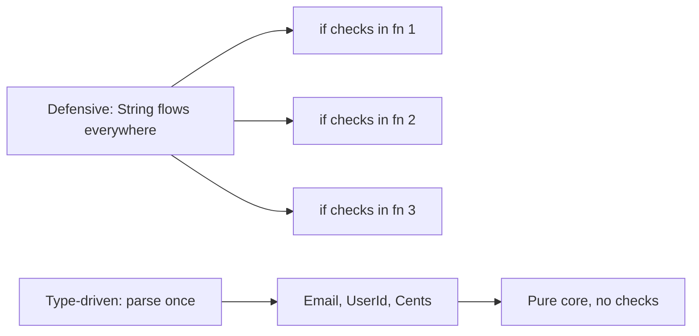
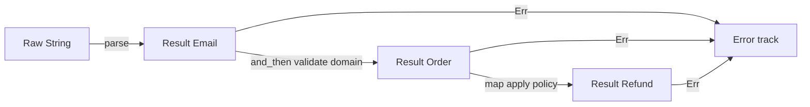
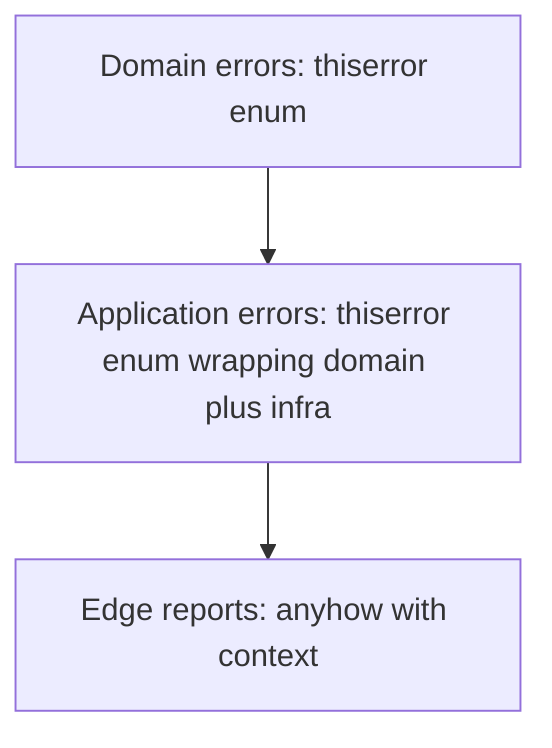
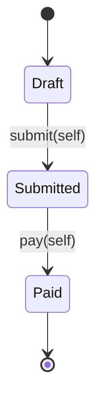
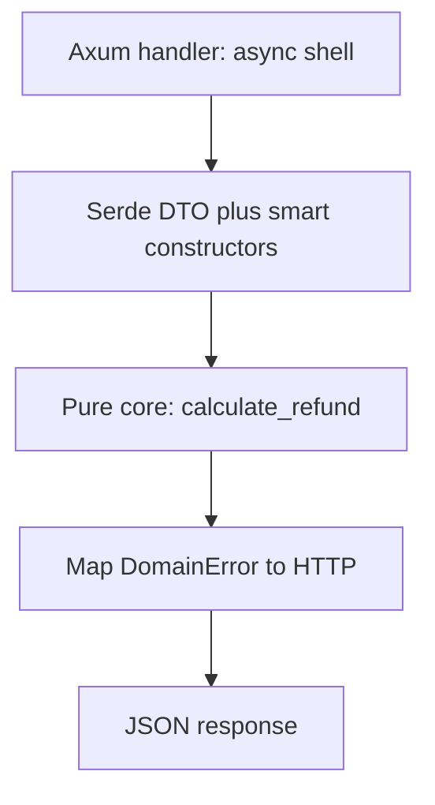

> *Un desarrollador junior no valida nada y espera lo mejor.*
> *Un desarrollador intermedio valida todo, en todas partes, con sentencias `if` en cada capa.*
> *Un desarrollador senior parsea una vez en la frontera y deja que el sistema de tipos pruebe el resto.*
> - <cite>Proverbio de Ingeniería de Software, edición Rust</cite>

<!--more-->

## TL;DR

* **Valida una vez, en el borde.**
Espera `String`, `i32` y JSON no confiables en la frontera del sistema.
Parsealos allí en tipos de dominio con prueba integrada.
* **Parsea, no valides.**
Validar conserva el tipo débil y devuelve `bool`.
Parsear consume el tipo débil y devuelve `Result<StrongType, Error>`.
* **Modela el dominio con tipos.**
Usa newtypes, smart constructors, sum types, product types y funciones totales.
Haz que los estados ilegales sean irrepresentables por construcción.
* **Estratifica los errores.**
Usa `thiserror` para errores de dominio exhaustivos en bibliotecas y `anyhow` con contexto solo en el borde de la aplicación.
* **Lleva las invariantes al compilador.**
Usa el patrón type-state, newtypes prestados de costo cero y un núcleo funcional puro envuelto por un shell delgado con Axum y Serde.
* Este post es el capítulo Rust de la serie Error Handling.
Asume solo Rust y construye cada patrón con `Result`, módulos, traits y ownership.

---

## 1. Introducción: El Antipatrón del Rust Defensivo

El hábito tentador es verificar cada entrada en cada función.
Validas el mismo `String` en el handler, luego en el servicio, luego en el repositorio, porque ninguna firma registra qué ya está probado.
En Rust, ese hábito es costoso e innecesario.
El compilador no es un verificador de sintaxis.
Es un motor de pruebas de teoremas en tiempo de compilación, y las cadenas defensivas de `if` lo desperdician.

Considera la clásica sopa de primitivos.

```rust
// ❌ Antipattern: primitives flow through every layer.
use std::collections::HashMap;

pub struct Database {
    balances: HashMap<String, i64>,
}

impl Database {
    pub fn get_balance(&self, user_id: &str) -> Option<i64> {
        self.balances.get(user_id).copied()
    }
}

pub fn process_refund(
    db: &Database,
    user_id: String,
    email: String,
    amount_cents: i32,
) -> Result<String, String> {
    // Defensive check 1: who validated user_id?
    if user_id.trim().is_empty() {
        return Err("invalid user_id".to_string());
    }
    // Defensive check 2: who validated email?
    if !email.contains('@') {
        return Err("invalid email".to_string());
    }
    // Defensive check 3: who validated amount?
    if amount_cents <= 0 {
        return Err("invalid amount".to_string());
    }
    // Business logic is buried under guards.
    let balance = db
        .get_balance(&user_id)
        .ok_or_else(|| "user not found".to_string())?;
    if balance < amount_cents as i64 {
        return Err("insufficient funds".to_string());
    }
    Ok(format!("refunded {amount_cents} to {user_id}"))
}

pub fn send_receipt(user_id: String, email: String, amount_cents: i32) -> Result<(), String> {
    // Same three checks, copied again.
    if user_id.trim().is_empty() {
        return Err("invalid user_id".to_string());
    }
    if !email.contains('@') {
        return Err("invalid email".to_string());
    }
    if amount_cents <= 0 {
        return Err("invalid amount".to_string());
    }
    // ... send email ...
    Ok(())
}
```

Este código compila, pasa revisión y pudre lentamente la base de código.
Cada función repite los mismos tres guardias.
Cada llamador se pregunta si el llamado ya verificó.
Cada cambio en la regla de email exige una edición dispersa entre capas.
El rendimiento paga escaneos y ramificaciones repetidas en la ruta caliente.
El acoplamiento crece porque las reglas de negocio sobre identidad y dinero se filtran al código de infraestructura.
El costo más profundo es la paranoia.
Ninguna firma te dice qué ya está probado, así que verificas de nuevo.

Rust te ofrece un mejor contrato.
Parsea datos no confiables una vez en la frontera.
Entrega al núcleo solo tipos que no pueden estar mal.
Elimina los guardias duplicados para siempre.



El resto de esta guía muestra cómo construir ese contrato en cinco pilares.

---

## 2. El Cambio de Paradigma: Parsea, No Valides

Alexis King capturó la idea central en [Parse, don't validate](https://lexi-lambda.github.io/blog/2019/11/05/parse-don-t-validate/) (2019).
Validar inspecciona un valor y conserva el tipo débil.
Parsear consume el tipo débil y produce un tipo fuerte con la prueba integrada en él.
Esa distinción cambia tu arquitectura.

La validación tiene esta forma.
Responde una pregunta y desecha la respuesta.

```rust
// Validation: checks, then keeps String.
pub fn is_valid_email(raw: &str) -> bool {
    let parts: Vec<&str> = raw.split('@').collect();
    parts.len() == 2 && !parts[0].is_empty() && parts[1].contains('.')
}

pub fn notify(raw_email: String) {
    if is_valid_email(&raw_email) {
        // raw_email is still String here.
        // The compiler learned nothing.
        // The next function must check again.
        println!("sending to {raw_email}");
    }
}
```

El parsing tiene una forma distinta.
Transforma y certifica en un solo movimiento.

```rust
// Parsing: consumes String, produces proof-bearing Email.
#[derive(Debug, Clone, PartialEq, Eq)]
pub struct Email(String);

#[derive(Debug, Clone, PartialEq, Eq)]
pub enum EmailError {
    MissingAt,
    EmptyLocalPart,
    InvalidDomain,
}

impl Email {
    pub fn parse(raw: String) -> Result<Self, EmailError> {
        let raw = raw.trim().to_string();
        let (_, domain) = raw.split_once('@').ok_or(EmailError::MissingAt)?;
        let local = raw.split('@').next().unwrap_or_default();
        if local.is_empty() {
            return Err(EmailError::EmptyLocalPart);
        }
        if !domain.contains('.') {
            return Err(EmailError::InvalidDomain);
        }
        Ok(Self(raw))
    }

    pub fn as_str(&self) -> &str {
        &self.0
    }
}
```

Después de que `Email::parse` tiene éxito, ninguna función aguas abajo vuelve a verificar el `@`.
El tipo es la prueba.
La firma `fn notify(email: Email)` documenta la invariante mejor que cualquier comentario.

Esta es la frontera arquitectónica que quieres.

```text
                         SYSTEM BOUNDARY
   Untrusted outside              Parsed inside
┌──────────────────┐     ┌─────────────────────────────┐
│ String           │     │ Email, UserId, Cents        │
│ i32              │────▶│ Order, Refund, Policy       │
│ serde_json::Value│parse │ Proof-bearing domain types  │
│ Raw query params │     │ Total functions only        │
└──────────────────┘     └─────────────────────────────┘
        │                             │
   may be anything              illegal states do not compile
   must be checked              must only be composed
```

La regla es simple.
Los datos cruzan la frontera como `String` e `i32`.
Viajan dentro del núcleo como `Email`, `UserId` y `Cents`.
El parser vive en exactamente un módulo por tipo.
Todo lo que está detrás compone sin guardias.

Este es el mismo movimiento que Edwin Brady enseña en *Type-Driven Development with Idris*.
Deja que el tipo guíe el flujo de control.
Rechaza programas malos durante la compilación en lugar de descubrirlos en los logs de producción.

---

## 3. Pilar 1: Modelado de Dominio con Newtypes, Value Objects y Smart Constructors

Eric Evans los llama Value Objects en *Domain-Driven Design*.
Son conceptos pequeños, inmutables y autovalidados sin identidad más allá de su valor.
Rust los modela con el patrón newtype más un smart constructor.
La privacidad de módulo hace que la garantía sea física, no social.

El truco es el campo privado.

```rust
// src/domain/email.rs
use std::fmt;
use std::str::FromStr;

#[derive(Debug, Clone, PartialEq, Eq, Hash)]
pub struct Email(String);

#[derive(Debug, Clone, PartialEq, Eq)]
pub enum EmailError {
    MissingAt,
    EmptyLocalPart,
    InvalidDomain,
}

impl std::fmt::Display for EmailError {
    fn fmt(&self, f: &mut fmt::Formatter<'_>) -> fmt::Result {
        match self {
            Self::MissingAt => write!(f, "email must contain @"),
            Self::EmptyLocalPart => write!(f, "email local part is empty"),
            Self::InvalidDomain => write!(f, "email domain must contain ."),
        }
    }
}

impl std::error::Error for EmailError {}

impl Email {
    /// Smart constructor: the only way to build an Email.
    pub fn parse(raw: String) -> Result<Self, EmailError> {
        let trimmed = raw.trim().to_string();
        let (local, domain) = trimmed.split_once('@').ok_or(EmailError::MissingAt)?;
        if local.is_empty() {
            return Err(EmailError::EmptyLocalPart);
        }
        if !domain.contains('.') {
            return Err(EmailError::InvalidDomain);
        }
        Ok(Self(trimmed))
    }

    pub fn as_str(&self) -> &str {
        &self.0
    }
}

impl FromStr for Email {
    type Err = EmailError;

    fn from_str(s: &str) -> Result<Self, Self::Err> {
        Self::parse(s.to_string())
    }
}

impl fmt::Display for Email {
    fn fmt(&self, f: &mut fmt::Formatter<'_>) -> fmt::Result {
        f.write_str(&self.0)
    }
}

impl AsRef<str> for Email {
    fn as_ref(&self) -> &str {
        &self.0
    }
}
```

Como el `String` interno es privado y el struct vive en su propio módulo, ningún otro módulo puede escribir `Email("garbage".to_string())`.
El compilador lo rechaza.
El único camino es `Email::parse`, que devuelve `Result`.
Esta es la frontera del Agregado en DDD, impuesta por `mod`, no por disciplina.

Aplica el mismo patrón a cada primitivo que lleve una regla.

```rust
use std::num::TryFromIntError;

#[derive(Debug, Clone, Copy, PartialEq, Eq, PartialOrd, Ord, Hash)]
pub struct Cents(u64);

#[derive(Debug, Clone, PartialEq, Eq)]
pub enum MoneyError {
    NonPositive,
}

impl Cents {
    pub fn parse(raw: i64) -> Result<Self, MoneyError> {
        if raw <= 0 {
            return Err(MoneyError::NonPositive);
        }
        Ok(Self(raw as u64))
    }

    pub fn value(self) -> u64 {
        self.0
    }
}

impl TryFrom<i64> for Cents {
    type Error = MoneyError;

    fn try_from(value: i64) -> Result<Self, Self::Error> {
        Self::parse(value)
    }
}

#[derive(Debug, Clone, PartialEq, Eq, Hash)]
pub struct UserId(String);

#[derive(Debug, Clone, PartialEq, Eq)]
pub enum UserIdError {
    Empty,
}

impl UserId {
    pub fn parse(raw: String) -> Result<Self, UserIdError> {
        let trimmed = raw.trim().to_string();
        if trimmed.is_empty() {
            return Err(UserIdError::Empty);
        }
        Ok(Self(trimmed))
    }
}
```

Ahora tus firmas del núcleo prueban sus precondiciones.

```rust
pub fn process_refund_typed(
    db: &Database,
    user_id: UserId,
    email: Email,
    amount: Cents,
) -> Result<String, DomainError> {
    // No email check here.
    // No amount check here.
    // The types already proved it.
    let _ = email;
    let balance = db
        .get_balance(user_id.as_str())
        .ok_or(DomainError::UserNotFound)?;
    if balance < amount.value() as i64 {
        return Err(DomainError::InsufficientFunds);
    }
    Ok(format!("refunded {} to {}", amount.value(), user_id.as_str()))
}
```

Todavía necesitas accesores como `as_str` o `Display`, y eso es intencional.
Los llamadores pueden leer el valor pero no pueden forjarlo.
Eso es encapsulamiento sin costo de runtime.

---

## 4. Pilar 2: Fundamentos Funcionales (Tipos Algebraicos y Funciones Totales)

Paul Chiusano y Runar Bjarnason enseñan esto en *Functional Programming in Scala*, conocido como el Red Book.
Modela con tipos precisos, escribe funciones totales y compone con combinadores en lugar de usar panics para el control de flujo.
Los enums y structs de Rust son tipos algebraicos de datos, y `Result` es tu mónada `Either`.

Los sum types enumeran alternativas exclusivas.

```rust
#[derive(Debug, Clone, PartialEq, Eq)]
pub struct CardDetails {
    pub last_four: String,
}

#[derive(Debug, Clone, PartialEq, Eq)]
pub struct TransferDetails {
    pub iban: String,
}

#[derive(Debug, Clone, PartialEq, Eq)]
pub enum PaymentMethod {
    Card(CardDetails),
    Transfer(TransferDetails),
    Cash,
}
```

Los product types combinan hechos independientes.

```rust
use crate::domain::email::Email;

#[derive(Debug, Clone, PartialEq, Eq)]
pub struct Order {
    pub id: UserId,
    pub email: Email,
    pub amount: Cents,
    pub method: PaymentMethod,
}
```

No hay null, no hay valor ausente implícito y no hay campo de método como string sin estructura.
Un `match` sobre `PaymentMethod` debe manejar cada brazo o la compilación falla.
Esa exhaustividad es una prueba sobre tus ramas de negocio.

Una función total está definida para el 100 por ciento de sus valores de entrada.
Nunca hace panic, nunca bloquea con entradas ocultas y nunca usa el panic como control de flujo.
Una función parcial finge ser total pero explota con algunas entradas.

```rust
// ❌ Partial: panics on zero and on overflow in debug builds.
pub fn refund_share_partial(amount: u64, parts: u64) -> u64 {
    amount / parts
}

// ✅ Total: every input maps to an explicit outcome.
#[derive(Debug, Clone, PartialEq, Eq)]
pub enum SplitError {
    EmptyParts,
}

pub fn refund_share_total(amount: Cents, parts: u64) -> Result<Cents, SplitError> {
    if parts == 0 {
        return Err(SplitError::EmptyParts);
    }
    // Integer division is safe here because parts is nonzero.
    Ok(Cents::from_raw(amount.value() / parts))
}
```

Este ejemplo asume un `from_raw` privado del crate usado solo tras la prueba, o puedes devolver `u64` directamente.
El punto se mantiene.
Las firmas totales obligan a los llamadores a enfrentar los casos borde en tiempo de compilación.

La composición usa `map`, `and_then` y `map_err` en lugar de pirámides de `if` anidados.
Esto es Railway Oriented Programming de Scott Wlaschin, expresado con `Result`.



```rust
use crate::domain::email::{Email, EmailError};

#[derive(Debug, Clone, PartialEq, Eq)]
pub enum OrderError {
    Email(EmailError),
    Money(MoneyError),
}

pub fn build_order(raw_email: String, raw_amount: i64) -> Result<Order, OrderError> {
    Email::parse(raw_email)
        .map_err(OrderError::Email)
        .and_then(|email| {
            Cents::parse(raw_amount)
                .map_err(OrderError::Money)
                .map(|amount| (email, amount))
        })
        .map(|(email, amount)| Order {
            id: UserId::parse("placeholder".to_string()).expect("static is valid"),
            email,
            amount,
            method: PaymentMethod::Cash,
        })
}
```

Mejor aún, usa el operador `?`, que es bind monádico con retorno temprano en la vía de error.

```rust
pub fn build_order_clean(raw_email: String, raw_amount: i64) -> Result<Order, OrderError> {
    let email = Email::parse(raw_email).map_err(OrderError::Email)?;
    let amount = Cents::parse(raw_amount).map_err(OrderError::Money)?;
    Ok(Order {
        id: UserId::parse("placeholder".to_string()).expect("static is valid"),
        email,
        amount,
        method: PaymentMethod::Cash,
    })
}
```

Ambas versiones mantienen dos vías paralelas.
La vía feliz lleva valores hacia adelante.
La vía de error cortocircuita sin panics.
El tipo de error le dice al handler exactamente qué estado devolver, así un typo 400 nunca puede disfrazarse de caída 500.

---

## 5. Pilar 3: La Conexión Lisp, Metaprogramación y Diseño Orientado a Expresiones

Rust hereda su alma de expresiones de la tradición Lisp, Scheme y ML que Abelson y Sussman celebran en *Structure and Interpretation of Computer Programs*.
Casi todo evalúa a un valor.
Eso te permite asignar resultados validados directamente en lugar de mutar temporales con cadenas de sentencias.

```rust
// Expression-driven domain construction.
use crate::domain::email::EmailError;

pub fn classify(raw: &str) -> Result<Email, EmailError> {
    let email: Email = match Email::parse(raw.to_string()) {
        Ok(valid) => valid,
        Err(EmailError::MissingAt) => {
            // Repair path stays an expression too.
            Email::parse(format!("{raw}@example.com"))?
        }
        Err(other) => return Err(other),
    };
    Ok(email)
}

pub fn label(amount: Cents) -> &'static str {
    // if is an expression, not a statement.
    let tier = if amount.value() > 1_000_00 {
        "enterprise"
    } else if amount.value() > 10_00 {
        "standard"
    } else {
        "micro"
    };
    tier
}
```

Sin danza de `let mut result;`.
Sin variable sin inicializar.
El compilador verifica que cada rama produzca el tipo declarado.

La idea Lisp más profunda es código como datos.
SICP te enseña a construir lenguajes de dominio incrustados donde los programas manipulan programas.
Las macros procedurales de Rust hacen esto a nivel de árbol de sintaxis abstracta durante la compilación.
Una macro lee tu definición de struct como datos y emite el smart constructor, el tipo de error y las impls de traits por ti.

El crate `nutype` es la versión pragmática de esa idea.
Declaras la invariante, la macro genera el boilerplate.

```rust
// AST-level abstraction: declare the rule, derive the proof.
use nutype::nutype;

#[nutype(validate(greater > 0), derive(Debug, Clone, Copy, PartialEq, Eq))]
pub struct CentsNutype(i64);

#[nutype(validate(not_empty, len_char_max = 254), derive(Debug, Clone, PartialEq, Eq))]
pub struct EmailNutype(String);
```

`nutype` expande a un newtype de campo privado con `try_from`, `FromStr`, `Display`, `AsRef` y un enum de error preciso.
Obtienes la misma garantía de privacidad de módulo que un smart constructor manual sin repetirlo veinte veces.

Cuando la invariante es realmente específica del dominio, escribe tu propia macro derivada o de atributo.
La forma siempre es la misma.
Parsea el `TokenStream` de entrada en tipos `syn`, valida el AST y emite una salida `quote` con el constructor.

```rust
// Conceptual sketch of a custom smart-constructor macro.
// Real proc macros live in a separate -macros crate.
use proc_macro::TokenStream;
use quote::quote;
use syn::{DeriveInput, parse_macro_input};

#[proc_macro_derive(NonEmptyString)]
pub fn non_empty_string(input: TokenStream) -> TokenStream {
    let ast = parse_macro_input!(input as DeriveInput);
    let name = &ast.ident;
    let expanded = quote! {
        impl #name {
            pub fn parse(raw: String) -> Result<Self, crate::domain::NonEmptyError> {
                if raw.trim().is_empty() {
                    return Err(crate::domain::NonEmptyError::Empty);
                }
                Ok(Self(raw.trim().to_string()))
            }
        }
    };
    TokenStream::from(expanded)
}
```

Usa macros para eliminar repetición, nunca para ocultar reglas de negocio.
La invariante debe quedar visible en la definición del tipo.
La macro solo mecaniza la prueba.

---

## 6. Pilar 4: Manejo Exhaustivo y Estratificado de Errores (`thiserror` vs `anyhow`)

No todos los errores pertenecen al mismo tipo.
Los errores de dominio son resultados de negocio esperados y deben ser exhaustivos.
Los errores de infraestructura son fallas operativas y necesitan contexto y backtraces.
Mezclarlos en un `String` o en un error boxeado destruye esa señal.

Estratifica en tres capas.



Modela errores de dominio con `thiserror`.
Cada variante es un hecho de negocio que el llamador debe manejar.

```rust
// src/domain/error.rs
use thiserror::Error;

use crate::domain::email::EmailError;

#[derive(Debug, Error, PartialEq, Eq)]
pub enum DomainError {
    #[error("invalid email: {0}")]
    InvalidEmail(#[from] EmailError),

    #[error("invalid amount: must be positive")]
    InvalidAmount,

    #[error("user not found")]
    UserNotFound,

    #[error("insufficient funds")]
    InsufficientFunds,

    #[error("refund already processed for order {order_id}")]
    AlreadyRefunded { order_id: String },
}
```

El `match` exhaustivo ahora fuerza decisiones de producto.

```rust
use crate::domain::error::DomainError;

pub fn refund_status_code(err: &DomainError) -> u16 {
    // Removing a variant breaks this match at compile time.
    // That is the feature.
    match err {
        DomainError::InvalidEmail(_) | DomainError::InvalidAmount => 400,
        DomainError::UserNotFound => 404,
        DomainError::InsufficientFunds | DomainError::AlreadyRefunded { .. } => 422,
    }
}
```

Envuelve errores de infraestructura una vez en la capa de aplicación.

```rust
// src/app/error.rs
use thiserror::Error;

use crate::domain::error::DomainError;

#[derive(Debug, Error)]
pub enum AppError {
    #[error("domain error: {0}")]
    Domain(#[from] DomainError),

    #[error("database error: {0}")]
    Database(#[from] sqlx::Error),

    #[error("payment gateway error: {0}")]
    Gateway(#[from] reqwest::Error),
}
```

Usa `anyhow` solo en el borde final: binarios, CLIs, scripts de migración y el tipo de retorno de `main`.
Agrega contexto y backtraces donde los humanos leen logs, no donde las bibliotecas definen contratos.

```rust
// src/main.rs
use anyhow::Context;

#[tokio::main]
async fn main() -> anyhow::Result<()> {
    let pool = sqlx::PgPool::connect(&std::env::var("DATABASE_URL")?)
        .await
        .context("failed to connect to Postgres")?;
    run_server(pool).await.context("server crashed")?;
    Ok(())
}
```

La regla práctica es nítida.
Si publicas el tipo, usa `thiserror`.
Si ejecutas el binario, usa `anyhow`.
Nunca devuelvas `anyhow::Error` desde funciones de dominio, porque borra los casos exhaustivos que tus llamadores necesitan.
Nunca uses errores `String` en código nuevo, porque borran estructura e impiden matching programático.

---

## 7. Pilar 5: Invariantes en Tiempo de Compilación con el Patrón Type-State

Algunas invariantes no tratan de valores aislados sino de secuencias.
Una orden no puede pagarse antes de enviarse.
Un reembolso no puede emitirse dos veces.
Los booleanos de runtime como `is_submitted` pueden olvidarse o verificarse en orden incorrecto.
El type-state codifica el flujo en genéricos para que las secuencias incorrectas no compilen.

Este es el diseño guiado por tipos al estilo Brady aplicado a ciclos de vida de negocio.

```rust
// src/domain/order_state.rs
use std::marker::PhantomData;

#[derive(Debug, Clone, PartialEq, Eq)]
pub struct Draft;
#[derive(Debug, Clone, PartialEq, Eq)]
pub struct Submitted;
#[derive(Debug, Clone, PartialEq, Eq)]
pub struct Paid;

#[derive(Debug, Clone, PartialEq, Eq)]
pub struct Order<State> {
    id: String,
    amount: Cents,
    state: PhantomData<State>,
}

impl Order<Draft> {
    pub fn new(id: String, amount: Cents) -> Self {
        Self {
            id,
            amount,
            state: PhantomData,
        }
    }

    pub fn submit(self) -> Order<Submitted> {
        // self is moved and destroyed here.
        // The Draft value cannot be used again.
        Order {
            id: self.id,
            amount: self.amount,
            state: PhantomData,
        }
    }
}

impl Order<Submitted> {
    pub fn pay(self) -> Order<Paid> {
        Order {
            id: self.id,
            amount: self.amount,
            state: PhantomData,
        }
    }
}

impl Order<Paid> {
    pub fn receipt(&self) -> String {
        format!("paid {} cents for {}", self.amount.value(), self.id)
    }
}
```

El ownership hace el trabajo pesado.
Cada transición toma `self` por valor y devuelve un nuevo estado.
El valor anterior se mueve y desaparece.
No existe un use-after-free lógico donde handles `Draft` obsoletos persisten y se reenvían.

```rust
let draft = Order::<Draft>::new("ord_1".to_string(), Cents::parse(5000).unwrap());
let submitted = draft.submit();
// draft.submit(); // ❌ Compile error: value moved.
let paid = submitted.pay();
println!("{}", paid.receipt());
// paid.pay(); // ❌ Compile error: no method pay on Order<Paid>.
```



Usa type-state cuando la secuencia importa y el costo de una transición incorrecta es alto: pagos, aprovisionamiento, publicación y onboarding multietapa.
No lo uses para cada booleano, o el ruido genérico ahogará el dominio.
Una buena heurística son dos o más estados ordenados con operaciones distintas disponibles.

---

## 8. Ingeniería Avanzada: Ref Types de Costo Cero y Property-Based Testing

Los newtypes propios como `Email(String)` asignan una vez y son perfectos para almacenamiento y APIs.
Las rutas calientes como routers, validadores y parsers deberían evitar incluso esa asignación cuando solo prestan.
Los lifetimes permiten construir newtypes prestados con costo cero de heap.

```rust
// Zero-cost borrowed view: no allocation, same proof shape.
#[derive(Debug, Clone, Copy, PartialEq, Eq, Hash)]
pub struct EmailRef<'a>(&'a str);

#[derive(Debug, Clone, PartialEq, Eq)]
pub enum EmailRefError {
    MissingAt,
    EmptyLocalPart,
    InvalidDomain,
}

impl<'a> EmailRef<'a> {
    pub fn parse(raw: &'a str) -> Result<Self, EmailRefError> {
        let trimmed = raw.trim();
        let (local, domain) = trimmed.split_once('@').ok_or(EmailRefError::MissingAt)?;
        if local.is_empty() {
            return Err(EmailRefError::EmptyLocalPart);
        }
        if !domain.contains('.') {
            return Err(EmailRefError::InvalidDomain);
        }
        Ok(Self(trimmed))
    }

    pub fn as_str(self) -> &'a str {
        self.0
    }

    pub fn to_owned_email(self) -> Email {
        // Single upgrade point from borrowed to owned.
        Email::parse(self.0.to_string()).expect("borrowed was already valid")
    }
}
```

`EmailRef<'a>` es un puntero más una longitud.
Se copia con `Copy`, nunca toca el allocator y aun así garantiza la invariante.
Parsea prestado en el borde, promueve a propio solo cuando debes almacenar.
Esta es la promesa de abstracción de costo cero: seguridad sin impuesto de runtime.

La lógica de parsing merece pruebas más fuertes que ejemplos manuales.
El property-based testing con `proptest` lanza miles de entradas sintéticas a tu smart constructor, incluyendo Unicode, caracteres de control y longitudes patológicas.

```rust
// tests/email_properties.rs
use proptest::prelude::*;

use rust_error_handling::domain::email::Email;

proptest! {
    #[test]
    fn valid_emails_always_parse(s in "[a-z0-9]{1,16}@[a-z]{1,8}\\.[a-z]{2,4}") {
        prop_assert!(Email::parse(s).is_ok());
    }

    #[test]
    fn missing_at_never_parses(s in "[a-z0-9 ]{1,32}") {
        prop_assume!(!s.contains('@'));
        prop_assert!(Email::parse(s).is_err());
    }

    #[test]
    fn parse_never_panics(s in "\\PC*") {
        // Any Unicode string must map to Ok or Err, never panic.
        let _ = Email::parse(s);
    }

    #[test]
    fn trimmed_value_roundtrips(s in " *[a-z]{1,8}@example\\.com *") {
        let email = Email::parse(s.clone()).unwrap();
        prop_assert_eq!(email.as_str(), s.trim());
    }
}
```

Ejecuta con `cargo test` y semántica `cargo proptest`.
Si un caso falla, `proptest` lo reduce al reproductor mínimo y guarda el seed.
Agrega ese seed como prueba de regresión.
Tu parser gana robustez matemática en lugar de cobertura anecdótica.

---

## 9. Patrón de Arquitectura: Núcleo Funcional, Shell Imperativo (Axum y Serde)

Gary Bernhardt resumió la arquitectura más sana en una línea: Functional Core, Imperative Shell.
El núcleo es puro, síncrono y total.
Toma tipos de dominio y devuelve `Result`.
Sin `async`, sin sockets, sin estado global, sin lecturas de reloj.
El shell es delgado y efectista.
Habla HTTP y JSON, parsea en la frontera, llama al núcleo y mapea errores tipados a códigos de estado.



Define primero el núcleo puro.

```rust
// src/core/refunds.rs
use crate::domain::error::DomainError;

#[derive(Debug, Clone, PartialEq, Eq)]
pub struct RefundPolicy {
    pub max_cents: u64,
}

#[derive(Debug, Clone, PartialEq, Eq)]
pub struct Refund {
    pub order_id: String,
    pub amount: Cents,
}

pub fn calculate_refund(
    order: &Order,
    requested: Cents,
    policy: &RefundPolicy,
) -> Result<Refund, DomainError> {
    // Pure function: no IO, no async, no globals.
    // All inputs are already proven types.
    if requested.value() > order.amount.value() {
        return Err(DomainError::InsufficientFunds);
    }
    if requested.value() > policy.max_cents {
        return Err(DomainError::InvalidAmount);
    }
    Ok(Refund {
        order_id: order.id.clone(),
        amount: requested,
    })
}
```

Los DTOs de Serde quedan tontos y crudos en el shell.

```rust
// src/shell/dto.rs
use serde::{Deserialize, Serialize};

#[derive(Debug, Deserialize)]
pub struct RefundRequestDto {
    pub order_id: String,
    pub email: String,
    pub amount_cents: i64,
}

#[derive(Debug, Serialize)]
pub struct RefundResponseDto {
    pub order_id: String,
    pub refunded_cents: u64,
}
```

El handler de Axum une los dos mundos y nada más.

```rust
// src/shell/handlers.rs
use axum::{Json, extract::State, http::StatusCode, response::IntoResponse};

use crate::app::error::AppError;
use crate::core::refunds::{RefundPolicy, calculate_refund};
use crate::domain::error::DomainError;

pub async fn refund_handler(
    State(policy): State<RefundPolicy>,
    Json(raw): Json<RefundRequestDto>,
) -> Result<impl IntoResponse, AppError> {
    // 1. Parse at the boundary: String and i64 become Email, UserId, Cents.
    let email = Email::parse(raw.email).map_err(DomainError::InvalidEmail)?;
    let user_id = UserId::parse(raw.order_id).map_err(|_| DomainError::UserNotFound)?;
    let amount = Cents::parse(raw.amount_cents).map_err(|_| DomainError::InvalidAmount)?;

    // 2. Rehydrate or fetch minimal state, then call the pure core.
    let order = Order {
        id: user_id,
        email,
        amount,
        method: PaymentMethod::Cash,
    };
    let refund = calculate_refund(&order, amount, &policy)?;

    // 3. Map to DTO. No business logic here.
    let body = RefundResponseDto {
        order_id: refund.order_id,
        refunded_cents: refund.amount.value(),
    };
    Ok((StatusCode::OK, Json(body)))
}
```

Mapea errores tipados a HTTP una vez, de forma exhaustiva.

```rust
impl IntoResponse for AppError {
    fn into_response(self) -> axum::response::Response {
        let (status, message) = match &self {
            Self::Domain(err) => match err {
                DomainError::InvalidEmail(_) | DomainError::InvalidAmount => {
                    (StatusCode::BAD_REQUEST, err.to_string())
                }
                DomainError::UserNotFound => (StatusCode::NOT_FOUND, err.to_string()),
                DomainError::InsufficientFunds | DomainError::AlreadyRefunded { .. } => {
                    (StatusCode::UNPROCESSABLE_ENTITY, err.to_string())
                }
            },
            Self::Database(_) | Self::Gateway(_) => (
                StatusCode::INTERNAL_SERVER_ERROR,
                "internal error".to_string(),
            ),
        };
        (status, Json(serde_json::json!({ "error": message }))).into_response()
    }
}
```

El testing se divide limpiamente.
Prueba unitaria de `calculate_refund` con structs planos y sin mocks.
Prueba de integración del handler con `tower::ServiceExt::oneshot` y payloads JSON reales.
El núcleo queda rápido y determinista porque los efectos viven solo en el shell.

---

## 10. Referencia de Patrones: Rust Defensivo vs. Rust Guiado por Tipos

| Concepto | Rust Defensivo | Rust Guiado por Tipos | Beneficio Arquitectónico |
|---|---|---|---|
| Parsing de frontera | Guardias `if` repetidos en cada función sobre `String` crudo | `Email::parse(String)` devuelve `Result<Email, EmailError>` una vez, luego mueve la prueba en el tipo | Una sola fuente de verdad para la invariante, cero chequeos repetidos en el núcleo |
| Newtypes | Alias de `String` planos, forjables en cualquier parte | `pub struct Email(String)` con campo privado, inforjable fuera de `mod` | Imposibilidad física de construcción inválida, impuesta por el compilador |
| Totalidad | División e indexación sobre `u64` que hacen panic en entradas borde | `Cents(u64)` más `Result` fuerza manejo explícito de cero y negativos | Los casos borde se vuelven obligaciones de compilación en lugar de incidentes |
| Composición | Pirámides de `if` anidados con `return Err` temprano en cada nivel | `and_then`, `map`, `map_err` y `?` sobre la vía `Result` | Ruta feliz lineal con vía de error tipada, errores clasificados por tipo |
| Errores de dominio | Mensajes `Result<T, String>`, fáciles de tragar o clasificar mal | Enum exhaustivo con `thiserror`, `match` debe cubrir cada variante | Los llamadores no pueden ignorar un caso nuevo, los refactors rompen en build |
| Errores de borde | Un solo tipo de error genérico desde el dominio hasta `main` | `anyhow` con `.context()` solo en `main` y binarios | Contexto operativo rico donde los humanos leen logs, tipos precisos donde el código ramifica |
| Estado de flujo | Banderas como `is_paid` verificadas con `if` antes de cada acción | Type-state `Order<Draft>` a `Order<Paid>` con semántica de move | Las transiciones ilegales no compilan, los handles obsoletos se destruyen por ownership |
| Costo en hot path | Newtypes `String` clonados y asignados en cada capa | `EmailRef<'a>` prestado sin heap, promoción a propio una vez | Prueba sin impuesto de rendimiento, ideal para routers y parsers |
| Testing | Casos `#[test]` manuales con unos pocos strings literales | `proptest` con miles de entradas Unicode y adversariales más shrinking | Confianza matemática en parsers, reproductores mínimos al fallar |
| Arquitectura | Handlers que mezclan parsing Serde, DB y reglas con `async` en todas partes | Núcleo sync puro con `calculate_refund` más shell delgado Axum y Serde | Núcleo trivialmente testeable y portable, efectos aislados y auditables |

Guarda esta tabla como checklist de revisión.
Si una fila se desliza a la izquierda, devuelve la prueba al tipo.

---

## 11. Resumen y Reglas de Oro Arquitectónicas

**1. Parsea una vez en la frontera, nunca valides en el núcleo.**
Los `String` e `i32` crudos entran por Serde o CLI y se convierten de inmediato en `Email`, `UserId` y `Cents`.
Las funciones del núcleo aceptan solo tipos probados y contienen cero chequeos `is_valid`.

**2. Haz irrepresentables los estados ilegales, luego borra los guardias.**
Prefiere `enum` para alternativas, `struct` para combinaciones y newtypes de campo privado para invariantes.
Si una regla vive en un tipo, elimina cada `if` que la reverifique aguas abajo.

**3. Escribe funciones totales y compone sobre la vía.**
Devuelve `Result` en cada operación parcial, maneja cada variante y encadena con `?`, `map` y `and_then`.
Reserva los panics para bugs realmente imposibles, nunca para entrada de usuario.

**4. Estratifica errores por audiencia.**
Las bibliotecas de dominio exponen enums exhaustivos con `thiserror`.
Las aplicaciones envuelven fallas de infra una vez.
Los binarios agregan contexto humano con `anyhow`.
Nunca filtres `anyhow` o errores `String` desde APIs de dominio.

**5. Lleva flujos y costos al sistema de tipos.**
Usa type-state con semántica de move para ciclos ordenados.
Usa vistas prestadas `EmailRef<'a>` en rutas calientes.
Cubre parsers con `proptest` y mantén el shell Axum delgado alrededor de un núcleo funcional puro.

Deja de defender cada función contra datos que ya verificaste.
Pruébalo una vez, codifícalo en un tipo y deja que `rustc` monte guardia mientras modelas el dominio.

---

### Bibliografía

* Alexis King, *Parse, don't validate* (2019).
Tesis: validar preserva el tipo débil, parsear produce un tipo fuerte.
* Paul Chiusano y Runar Bjarnason, *Functional Programming in Scala* (2014).
Tesis: prefiere funciones totales, tipos algebraicos y composición libre de efectos.
* Harold Abelson y Gerald Jay Sussman, *Structure and Interpretation of Computer Programs* (1996).
Tesis: el código es datos, construye lenguajes incrustados para expresar intención de dominio.
* Eric Evans, *Domain-Driven Design* (2003).
Tesis: protege invariantes dentro de agregados con value objects y fronteras explícitas.
* Edwin Brady, *Type-Driven Development with Idris* (2017).
Tesis: usa tipos como herramienta de diseño para guiar la ejecución y rechazar programas inválidos temprano.
* Scott Wlaschin, *Railway Oriented Programming* (2013).
Tesis: modela éxito y error como vías paralelas compuestas con bind monádico.
* Gary Bernhardt, *Functional Core, Imperative Shell* (2012).
Tesis: mantén el dominio puro y empuja IO al shell exterior delgado.
