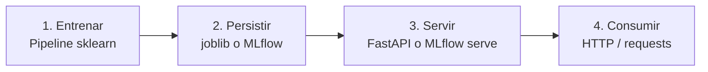

> Entrenaste tu modelo en un notebook, quedó increíble en el reporte, y ahora qué?
> Esta guía te lleva el resto del camino: entrenar, persistir, servir y consumir.

<!--more-->

## 📌 TL;DR

* **Entrena un Pipeline completo** (preprocesamiento + modelo) como un solo objeto para que el preprocesamiento viaje con el modelo.
* **Persiste con `joblib`** (o con MLflow si quieres tracking y versiones) y versiona las dependencias.
* **Ruta A, FastAPI + joblib:** levanta un servidor con validación Pydantic y documentación automática en `/docs`.
* **Ruta B, MLflow:** agrega tracking de experimentos, Model Registry con Staging/Production y un `serve` propio.
* **Regla práctica:** empieza con FastAPI si es un modelo simple; migra a MLflow cuando necesites comparar experimentos y versionar en producción.

---

Esta guía te muestra el camino completo para llevar un modelo entrenado con scikit-learn a producción: entrenar, persistir, servir y consumir.
Está pensada para alguien que ya entrenó modelos en un notebook pero nunca los expuso como un servicio.
Todo el código es ejecutable y usa el dataset Iris, que viene incluido en scikit-learn.

> **Alcance:** esta guía cubre machine learning clásico con scikit-learn (árboles, bosques de decisión, regresiones, clustering, etc.).
> No cubre redes neuronales ni deep learning (PyTorch, TensorFlow).
> Si más adelante quieres deep learning, ese es otro camino: PyTorch/TensorFlow con TorchServe, Triton u otros servidores de inferencia.

## 1. Conceptos previos

Llevar un modelo a producción significa exponerlo para que otras aplicaciones o usuarios puedan obtener predicciones, de forma estable y repetible.
En un notebook entrenas y exploras; en producción el modelo vive en un servidor que responde peticiones todo el día.

El flujo completo es:



Vocabulario mínimo:

- **Pipeline**: objeto de scikit-learn que encadena preprocesamiento y modelo en un solo paso.
- **Serializar / persistir**: guardar el modelo entrenado a un archivo para poder recargarlo después.
- **API REST**: interfaz de un servidor a la que se le hacen peticiones HTTP con JSON y devuelve respuestas JSON.
- **Endpoint**: una ruta concreta del servidor, por ejemplo `POST /predict`.
- **Cliente HTTP**: el programa que le pega al servidor, por ejemplo `curl` o `requests` en Python.

## 2. Entrenar el modelo

La clave es entrenar un `Pipeline` completo (preprocesamiento + modelo) como un solo objeto.
Así, al momento de predecir, el mismo objeto aplica el preprocesamiento que se aplicó al entrenar.
Eso evita el error clásico de preprocesar el input de producción distinto que el de entrenamiento.

### Preparar el entorno (uv)

`uv` es un gestor de paquetes y entornos de Python rápido.
Con él no necesitas crear y activar un venv a mano: `uv` lo maneja por ti y deja las versiones exactas de las dependencias en `uv.lock`.

Inicializa el proyecto y agrega las dependencias base:

```bash
uv init --bare
uv add scikit-learn joblib
```

A partir de ahora ejecuta los scripts con `uv run`, que usa el entorno del proyecto automáticamente.

Crea el archivo `train.py` con este contenido:

```python
import joblib
from sklearn.datasets import load_iris
from sklearn.ensemble import RandomForestClassifier
from sklearn.model_selection import GridSearchCV, train_test_split
from sklearn.pipeline import Pipeline
from sklearn.preprocessing import StandardScaler

X, y = load_iris(return_X_y=True)
X_train, X_test, y_train, y_test = train_test_split(
    X, y, test_size=0.2, random_state=42
)

pipeline = Pipeline(
    [
        ("scaler", StandardScaler()),
        ("model", RandomForestClassifier(random_state=42)),
    ]
)

params = {
    "model__n_estimators": [50, 100, 200],
    "model__max_depth": [None, 5, 10],
}

grid = GridSearchCV(pipeline, params, cv=5, scoring="accuracy", n_jobs=-1)
grid.fit(X_train, y_train)

print(f"Mejores hiperparámetros: {grid.best_params_}")
print(f"Accuracy en test: {grid.score(X_test, y_test):.4f}")

joblib.dump(grid.best_estimator_, "model.joblib")
print("Modelo guardado en model.joblib")
```

Ejecútalo:

```bash
uv run python train.py
```

Los nombres `model__n_estimators` y `model__max_depth` usan el prefijo `model__` porque el modelo vive dentro del Pipeline bajo la clave `"model"`.
Con `GridSearchCV` se busca la mejor combinación de hiperparámetros con validación cruzada.

## 3. Persistir el modelo

Persistir significa guardar el modelo entrenado a disco para no tener que reentrenar cada vez.
La forma más común con scikit-learn es `joblib`, que ya usamos arriba.

### Comparativa de formatos

| Método | Ventajas | Riesgos / limitaciones |
|---|---|---|
| `joblib` | Rápido, eficiente con arrays grandes de NumPy | Basado en pickle: cargar código arbitrario es peligroso. Requiere mismas versiones de dependencias |
| `pickle` | Nativo de Python, serializa casi cualquier objeto | Igual que joblib, riesgo de seguridad |
| `skops.io` | Más seguro que pickle, no ejecuta código arbitrario | Menos tipos soportados |
| ONNX | Sirve sin Python, entorno mínimo, sin riesgo de ejecutar código | No todos los modelos sklearn son soportados |

### Reglas de oro

- **Nunca cargues** un `joblib`/`pickle` que no venga de una fuente confiable: al cargarlo se ejecuta código arbitrario.
- Guarda el `Pipeline` completo, no solo el modelo: el preprocesamiento tiene que viajar con el modelo.
- **Versiona las dependencias**: un modelo guardado con una versión de scikit-learn puede fallar o dar resultados distintos con otra.
  Usa el mismo entorno en entrenamiento y producción.
  `uv` ya guardó las versiones exactas en `uv.lock`; para exportar un `requirements.txt`:

```bash
uv export --format requirements-txt > requirements.txt
```

## 4. Ruta A: FastAPI + joblib

FastAPI levanta un servidor web en pocas líneas, valida el input con Pydantic y genera documentación automática en `/docs`.

### Instalar dependencias

`scikit-learn` y `joblib` ya están agregados desde la sección 2. Agrega las del servidor:

```bash
uv add fastapi "uvicorn[standard]" requests
```

### Crear el servidor

Crea `app.py` con este contenido:

```python
import joblib
from functools import lru_cache

import numpy as np
from fastapi import FastAPI
from pydantic import BaseModel

MODEL_PATH = "model.joblib"

app = FastAPI(title="Iris Classifier API")


class IrisFeatures(BaseModel):
    sepal_length: float
    sepal_width: float
    petal_length: float
    petal_width: float


@lru_cache(maxsize=1)
def load_model():
    return joblib.load(MODEL_PATH)


@app.get("/health")
def health():
    return {"status": "ok"}


@app.post("/predict")
def predict(features: IrisFeatures):
    model = load_model()
    X = np.array(
        [
            [
                features.sepal_length,
                features.sepal_width,
                features.petal_length,
                features.petal_width,
            ]
        ]
    )
    prediction = model.predict(X)[0]
    probabilities = model.predict_proba(X)[0]
    return {
        "prediction": int(prediction),
        "probabilities": probabilities.tolist(),
    }
```

Puntos clave:

- `lru_cache` carga el modelo una sola vez al primer request, no en cada petición.
- Pydantic (`IrisFeatures`) valida que el JSON traiga los cuatro campos y que sean números.
- `predict_proba` devuelve la probabilidad de cada clase, útil para saber qué tan segura está la predicción.

### Levantar el servidor

```bash
uv run uvicorn app:app --reload
```

El servidor queda escuchando en `http://localhost:8000`.
Abre `http://localhost:8000/docs` en el navegador: FastAPI genera una interfaz para probar el endpoint sin escribir código.

### Consumir con curl

```bash
curl -X POST http://localhost:8000/predict \
  -H "Content-Type: application/json" \
  -d '{"sepal_length": 5.1, "sepal_width": 3.5, "petal_length": 1.4, "petal_width": 0.2}'
```

### Consumir con requests en Python

```python
import requests

resp = requests.post(
    "http://localhost:8000/predict",
    json={
        "sepal_length": 5.1,
        "sepal_width": 3.5,
        "petal_length": 1.4,
        "petal_width": 0.2,
    },
)
print(resp.json())
```

Respuesta esperada, algo así:

```json
{"prediction": 0, "probabilities": [0.98, 0.02, 0.0]}
```

## 5. Ruta B: MLflow

MLflow agrega sobre lo anterior: tracking de experimentos, registro de modelos con versiones y un `serve` propio.
Ideal cuando quieres comparar experimentos y tener trazabilidad de qué modelo está en producción.

### Instalar dependencias

`scikit-learn` ya está agregado. Agrega MLflow:

```bash
uv add mlflow
```

### Entrenar con tracking

Crea `train_mlflow.py` con este contenido:

```python
import mlflow
import mlflow.sklearn
from sklearn.datasets import load_iris
from sklearn.ensemble import RandomForestClassifier
from sklearn.model_selection import train_test_split
from sklearn.pipeline import Pipeline
from sklearn.preprocessing import StandardScaler

X, y = load_iris(return_X_y=True)
X_train, X_test, y_train, y_test = train_test_split(
    X, y, test_size=0.2, random_state=42
)

mlflow.set_experiment("iris-classifier")

with mlflow.start_run():
    mlflow.sklearn.autolog()  # registra params, métricas y el modelo automáticamente

    pipeline = Pipeline(
        [
            ("scaler", StandardScaler()),
            ("model", RandomForestClassifier(n_estimators=100, random_state=42)),
        ]
    )
    pipeline.fit(X_train, y_train)

    acc = pipeline.score(X_test, y_test)
    mlflow.log_metric("test_accuracy", acc)

    run_id = mlflow.active_run().info.run_id
    print(f"Run ID: {run_id}")
```

Ejecútalo:

```bash
uv run python train_mlflow.py
```

Después abre la UI de MLflow para ver el experimento registrado:

```bash
uv run mlflow ui
```

### Servir el modelo

`autolog()` ya guardó el modelo del run.
Con el `RUN_ID` que imprimió el script, se sirve:

```bash
uv run mlflow models serve -m runs:/<RUN_ID>/model --port 8001
```

El servidor queda escuchando en `http://localhost:8001`.

### Consumir el endpoint de MLflow

MLflow no acepta el JSON arbitrario de FastAPI.
Espera un formato específico: `dataframe_split` o `dataframe_records`.
Con pandas es lo más cómodo:

```python
import pandas as pd
import requests

X = pd.DataFrame(
    [[5.1, 3.5, 1.4, 0.2]],
    columns=[
        "sepal length (cm)",
        "sepal width (cm)",
        "petal length (cm)",
        "petal width (cm)",
    ],
)

resp = requests.post(
    "http://localhost:8001/invocations",
    json={
        "dataframe_split": {
            "columns": X.columns.tolist(),
            "data": X.values.tolist(),
        }
    },
)
print(resp.json())
```

Con `curl`:

```bash
curl -X POST http://localhost:8001/invocations \
  -H "Content-Type: application/json" \
  -d '{"dataframe_split": {"columns": ["sepal length (cm)", "sepal width (cm)", "petal length (cm)", "petal width (cm)"], "data": [[5.1, 3.5, 1.4, 0.2]]}}'
```

### Model Registry

Además del tracking, MLflow permite registrar modelos con nombre y versiones:

```python
import mlflow

mlflow.register_model(
    model_uri="runs:/<RUN_ID>/model",
    name="iris-classifier",
)
```

Con el registro puedes promover una versión a "Staging" o "Production" desde la UI y servir por nombre:

```bash
uv run mlflow models serve -m "models:/iris-classifier/Production" --port 8001
```

## 6. Comparación: FastAPI vs MLflow

| Criterio | FastAPI + joblib | MLflow |
|---|---|---|
| Simplicidad | Menos conceptos, se entiende rápido | Más piezas, curva de aprendizaje mayor |
| Validación del input | Pydantic, muy flexible | Formato fijo (dataframe), menos control |
| Endpoints personalizados | Total control, agregas lo que quieras | Limitado al formato de invocación |
| Tracking de experimentos | No incluido | Incluido |
| Versiones de modelos | Manual (nombrar archivos) | Registry con Staging/Production |
| Cargas de datos | Mínimas | Media |

Regla práctica: empieza con FastAPI si es un modelo simple o estás aprendiendo.
Migra o úsalo con MLflow cuando necesites comparar experimentos, versionar modelos en producción o que el equipo comparta el mismo registro.

## 7. Alternativas y complementos a scikit-learn

scikit-learn no es la única librería para machine learning clásico.
Aquí tienes las alternativas y complementos más usados.

### Gradiente boosting (ganan casi siempre en datos tabulares)

- **XGBoost**: la más popular, muy usada en competiciones y producción.
- **LightGBM**: más rápida y ligera que XGBoost en conjuntos grandes.
- **CatBoost**: funciona bien con variables categóricas sin preprocesar.

Las tres se integran con el API de scikit-learn (mismo `.fit` y `.predict`), así que puedes meterlas dentro de un `Pipeline` igual que un `RandomForestClassifier`.
Pueden guardarse con `joblib` y servirse con las mismas rutas de esta guía.

### Estadística clásica

- **statsmodels**: regresiones con inferencia estadística (p-values, intervalos de confianza).
  No es un reemplazo de scikit-learn, es un complemento cuando necesitas estadística en vez de predicción.

### Big data / distribuido

- **Spark MLlib**: para datos que no caben en una sola máquina, corre sobre clústeres Spark.
- **Dask-ML**: escala scikit-learn sobre varios nodos sin cambiar mucho el código.

### Wrappers de alto nivel

- **PyCaret**: wrapper sobre scikit-learn y las librerías de boosting que automatiza mucho del flujo.
  Menos control, pero llegas a resultados más rápido.

### Extensiones que se usan con scikit-learn

- **imbalanced-learn**: técnicas para datos desbalanceados (SMOTE, etc.).
- **category_encoders**: codificaciones avanzadas para variables categóricas.
- **mlxtend**: utilidades varias de machine learning y stacking.

### El otro extremo: deep learning

- **PyTorch**, **TensorFlow/Keras** y **JAX**: redes neuronales y deep learning.
  No son para ML clásico; se sirven con otros servidores (TorchServe, Triton, etc.).

Regla práctica: en la mayoría de proyectos el stack no es "scikit-learn o X", sino **scikit-learn + XGBoost/LightGBM**, porque se complementan y comparten el mismo API.

## 8. Checklist de producción

- [ ] `uv.lock` (o el `requirements.txt` exportado) con las versiones exactas usadas en entrenamiento.
- [ ] Modelo persistido junto con el preprocesamiento (el Pipeline completo).
- [ ] Endpoint de salud (`/health`) para que el orquestador sepa si el servicio vive.
- [ ] Validación del input: pydantic en FastAPI o chequeos en tu código.
- [ ] Prueba el endpoint con al menos un request real antes de subir.
- [ ] Mide la calidad (accuracy, etc.) y registra la métrica junto al modelo.
- [ ] Nunca cargar artefactos de fuentes no confiables (riesgo de ejecución de código).
- [ ] Considera Docker para congelar el entorno completo cuando pases a servidores.

## 9. Recursos

- scikit-learn, model persistence (documentación oficial): https://scikit-learn.org/stable/model_persistence.html
- scikit-learn, pipelines y estimadores compuestos: https://scikit-learn.org/stable/modules/compose.html
- scikit-learn, getting started: https://scikit-learn.org/stable/getting_started.html
- FastAPI, tutorial oficial: https://fastapi.tiangolo.com/tutorial/
- MLflow, documentación: https://mlflow.org/docs/latest/
- ONNX + sklearn-onnx (alternativa para inferencia sin Python): https://onnx.ai/sklearn-onnx/
- ONNX Runtime: https://onnxruntime.ai/
- BentoML (empaquetado y serving para cualquier modelo): https://www.bentoml.com/
- XGBoost: https://xgboost.readthedocs.io/
- LightGBM: https://lightgbm.readthedocs.io/
- CatBoost: https://catboost.ai/docs/
