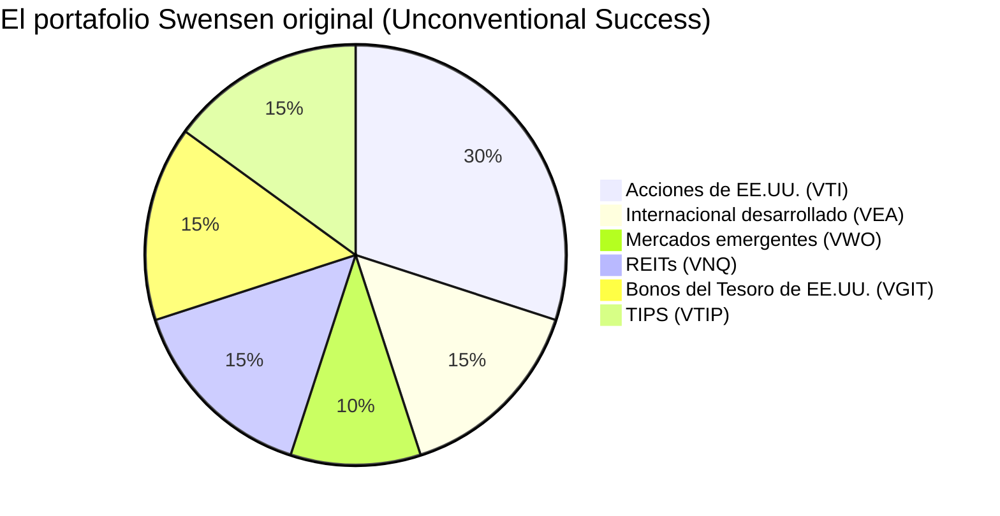
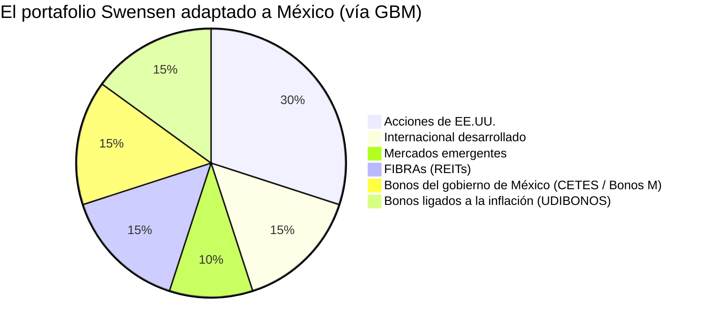
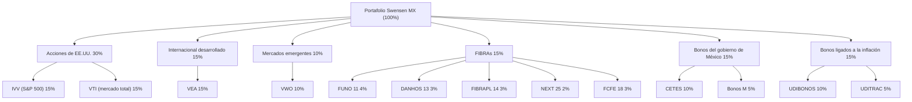

> David Swensen dirigió el endowment de Yale durante 36 años y convirtió aproximadamente $1,000 millones de dólares en más de $40,000 millones.
> Luego escribió *Unconventional Success* para que el resto de nosotros pudiéramos copiarle la tarea.
> Esta es esa tarea, traducida al mercado mexicano y ejecutada desde una cuenta de GBM.

<!--more-->

## 📌 TL;DR

* **El portafolio original:** seis clases de activo, 70% renta variable y 30% renta fija, solo fondos indexados, cero selección de acciones y un rebalanceo incansable.
* **La regla de transformación:** cuando México tiene un equivalente local fiel, se usa ese equivalente (FIBRAs, CETES, UDIBONOS).
  Cuando no lo tiene, se conserva el instrumento de EE.UU. original y se compra a través del SIC de GBM.
* **El resultado:** la misma asignación exacta de 30-15-10-15-15-15, con aproximadamente 55% en dólares y 45% en pesos.
* **El detalle:** es aburrido a propósito.
  Ese es el punto.

---

## El Hombre Detrás del Modelo

Si sigues el mundo del dinero, conoces el nombre.

David Swensen pasó 36 años como director de inversiones de la Universidad de Yale, haciendo crecer el endowment de unos $1,000 millones de dólares a más de $40,000 millones.
Pionero de lo que la industria ahora llama el **modelo endowment**: un fuerte sesgo hacia renta variable y activos reales, una delgada franja de bonos, un compromiso terco con el rebalanceo y cero paciencia con gestores estrella que cobran 2 y 20.

En 2005 publicó *Unconventional Success*, que entregó el mismo manual a los inversionistas comunes.
Y aquí está el detalle: todo el asunto es casi cómicamente aburrido.
Nada de acciones meme.
Nada de cripto.
Nada de elegir al próximo Apple.
Solo seis clases de activo, fondos de bajo costo y la disciplina de comprar lo que baja y recortar lo que sube.

Lo aburrido vence a lo emocionante.
Ese es todo el secreto.

## El Portafolio Original: Seis Activos, 70/30

La recomendación de Swensen para el inversionista individual se desglosa así:

| Instrumento | Qué es | Por qué lo usó Swensen |
| :--- | :--- | :--- |
| **VTI** | Todo el mercado accionario de EE.UU. | El núcleo del valor accionario global, más de 3,500 empresas |
| **VEA** | Mercados desarrollados fuera de EE.UU. | Europa, Japón, Canadá, Australia |
| **VWO** | Mercados emergentes | China, India, Taiwán, Brasil, Corea |
| **VNQ** | Bienes raíces de EE.UU. (REITs) | Diversificación hacia activos reales |
| **VGIT** | Bonos del Tesoro de EE.UU. intermedios | Lastre del portafolio |
| **VTIP** | Bonos ligados a la inflación a corto plazo | Protección contra la inflación |

Nota que la renta fija no es un complemento.
Treinta por ciento en bonos, quince por ciento del portafolio completo dedicado a la protección contra la inflación.
Swensen planeaba para un mundo en el que el dólar se devalúa en silencio, y quería que su portafolio se devaluara más lento.

## La Regla de Transformación Uno a Uno

Aquí está el problema: ese portafolio es puro Estados Unidos.

VTI, VEA, VWO, VNQ, VGIT, VTIP.
Seis tickers de EE.UU., y si vives en México, es razonable preguntarse si algo de esto funciona al sur de la frontera.

Sí funciona, y la regla es brutalmente simple:

* Si México tiene un **equivalente local fiel**, se usa ese en su lugar: FIBRAs para REITs, CETES y Bonos M para bonos del Tesoro, UDIBONOS para TIPS.
* Si **no existe un equivalente local fiel**, se conserva el instrumento de EE.UU. original, que GBM pone a disposición a través del Sistema Internacional de Cotizaciones (SIC).

Nada de la asignación cambia.
Solo se cambia la plomería.

| Clase original | % | Original | Transformación para GBM | ¿Local o de EE.UU.? |
| :--- | :---: | :--- | :--- | :--- |
| Acciones de EE.UU. | 30% | VTI | IVV + VTI (vía SIC); opción en pesos: IVVPESO | EE.UU. (preferido) |
| Internacional desarrollado | 15% | VEA | VEA (vía SIC) | EE.UU. (mismo ticker) |
| Mercados emergentes | 10% | VWO | VWO (vía SIC) | EE.UU. (mismo ticker) |
| REITs | 15% | VNQ | FIBRAs: FUNO 11, DANHOS 13, FIBRAPL 14, NEXT 25, FCFE 18 (o ETF FIBRATC 14) | Local |
| Bonos del Tesoro de EE.UU. | 15% | VGIT | CETES y Bonos M | Local (preferido) |
| TIPS | 15% | VTIP | UDIBONOS y UDITRAC | Local (preferido) |

## El Portafolio Adaptado

Las piezas que se vuelven locales son exactamente las que tienen un equivalente nacional.
Los bienes raíces se convierten en FIBRAs.
Los bonos del Tesoro de EE.UU. se convierten en deuda del gobierno mexicano.
Los TIPS se convierten en UDIBONOS.
Todo lo demás se mantiene en los ETFs originales de EE.UU.

## El Árbol Completo de la Asignación

## Desglose Clase por Clase

### Acciones de EE.UU. (30%) - Original: VTI

| Tramo | % | Qué comprar en GBM | Por qué |
| :--- | :---: | :--- | :--- |
| S&P 500 (grandes empresas) | 15% | **IVV** (vía SIC) | Las ~500 empresas más grandes de EE.UU., hogar de Apple, Microsoft y Nvidia. Barato, líquido y el centro gravitacional de la renta variable global. |
| Mercado total de EE.UU. | 15% | **VTI** (vía SIC) | El ticker original de Swensen. Más de 3,500 empresas, incluidas medianas y pequeñas, por lo que diversifica más que el S&P 500 aislado. |

Justificación de la clase:

* EE.UU. concentra la mayor parte del valor accionario mundial y sus empresas tienen ventaja competitiva sostenible.
* La renta variable se mantiene en dólares por decisión de diseño: desde GBM se compra directo vía SIC.
* **Opción en pesos:** si prefieres no mantener dólares, **IVVPESO** (S&P 500 con cobertura cambiaria) puede sustituir una parte de IVV/VTI.

### Internacional Desarrollado (15%) - Original: VEA

| Tramo | % | Qué comprar en GBM | Por qué |
| :--- | :---: | :--- | :--- |
| Desarrollados fuera de EE.UU. | 15% | **VEA** (vía SIC) | Sigue el FTSE Developed ex-US: Europa, Japón, Canadá, Australia. Economías maduras con mercados de capital profundos. |

Justificación de la clase:

* Diversifica lejos de EE.UU. y reduce la dependencia de un solo mercado.
* Se conserva el instrumento original porque no existe un equivalente local fiel.

### Mercados Emergentes (10%) - Original: VWO

| Tramo | % | Qué comprar en GBM | Por qué |
| :--- | :---: | :--- | :--- |
| Emergentes globales | 10% | **VWO** (vía SIC) | Sigue el FTSE Emerging Markets: China, India, Taiwán, Brasil, Corea. Mayor crecimiento potencial a cambio de más volatilidad. |

Justificación de la clase:

* Los emergentes cotizan más baratos y crecen más rápido en el largo plazo que los desarrollados.
* Se conserva el instrumento de EE.UU. porque no existe un equivalente local fiel.
* Nota: México no aparece aquí porque el portafolio eligió renta variable de EE.UU. como núcleo.
  Si quisieras exposición local, NAFTRAC sería la pieza natural, pero no está en esta versión.

### FIBRAs (15%) - Original: VNQ

| Tramo | % | Qué comprar en GBM | Por qué |
| :--- | :---: | :--- | :--- |
| FIBRA diversificada | 4% | **FUNO 11** (Fibra Uno) | La FIBRA más grande de México. Mezcla de oficinas, centros comerciales, industrial y hoteles en varias ciudades. La más líquida y con el historial de distribuciones más largo. |
| FIBRA de centros comerciales | 3% | **DANHOS 13** (Fibra Danhos) | Enfocada en plazas de segmento alto en zonas prime de la CDMX (Paseo Santa Fe, Parque Delta). Financieramente sólida: LTV de 14% (el más bajo del mercado), P/AFFO de 9.8x y cap rate de 10.97%. |
| FIBRA industrial | 3% | **FIBRAPL 14** (Fibra Prologis) | La contraparte mexicana de Prologis, el mayor dueño de naves logísticas del mundo. Expuesta directamente al nearshoring y a la demanda de parques industriales. |
| FIBRA industrial de nearshoring | 2% | **NEXT 25** (Fibra Next) | FIBRA industrial enfocada en parques logísticos para la relocalización de manufactura. Una de las mejores combinaciones de valor: descuento de 16.2% sobre el NAV, cap rate de 11.99%, ocupación de 97.8%, P/AFFO de 15.0x y LTV moderado de 33.1%. |
| FIBRA de infraestructura y torres | 3% | **FCFE 18** (Fibra CFE) | Una FIBRA E que arrienda torres de telecomunicaciones a CFE Telecomunicaciones. Contrato de largo plazo con respaldo del estado, ingresos estables (yield de 10.89%) y diversificación respecto al real estate tradicional. |

Justificación de la clase:

* Las FIBRAs son el equivalente mexicano de los REITs (VNQ), por eso es la clase que se vuelve local.
* La selección de cada FIBRA se apoya en los datos fundamentales de [ingresopasivo.mx](https://ingresopasivo.mx/fibras): precio, NAV/CBFI, descuento o premio, cap rate, P/AFFO, yield, LTV y ocupación.
* La idea es combinar segmentos distintos (mixto, comercial, industrial, infraestructura) y comprar sobre todo cuando el precio está con descuento frente al NAV.
* **Por qué NEXT 25 y no TERRA 13:** TERRA 13 salió del portafolio por decisión de diseño.
  Entre las FIBRAs industriales, NEXT 25 cotiza con descuento (16.2%) y cap rate alto (11.99%), mientras que FNOVA 17, la otra opción industrial, cotiza 48% por arriba de su NAV (premio) y con cap rate de solo 4.75%.
* Las distribuciones de FIBRAs tienen tratamiento fiscal favorable de ISR.
* **Opción de simplicidad:** si prefieres no elegir FIBRAs una por una, coloca el 15% completo en **FIBRATC 14**, el ETF de BBVA que replica el índice S&P/BMV FIBRAS.

### Bonos del Gobierno de México (15%) - Original: VGIT

| Tramo | % | Qué comprar en GBM | Por qué |
| :--- | :---: | :--- | :--- |
| Corto plazo y liquidez | 10% | **CETES** | La tasa libre de riesgo en pesos. Se compran a 91 o 182 días, vencimiento definido, pura estabilidad. La base conservadora que equilibra la volatilidad de las acciones. |
| Mediano plazo a tasa fija | 5% | **Bonos M** | Bonos del gobierno mexicano a tasa fija con vencimiento de 3-5 años. Más rendimiento que los CETES a cambio de algo más de riesgo de tasa. |

Justificación de la clase:

* Esta clase reemplaza a los bonos del Tesoro de EE.UU. (VGIT) con su equivalente local: la deuda del gobierno mexicano.
* Lo local gana porque tus gastos están en pesos, y la deuda del gobierno mexicano elimina el riesgo cambiario de esta parte.
* Mantener una parte en CETES también te da liquidez para rebalancear cuando el mercado se desploma.

### Bonos Ligados a la Inflación (15%) - Original: VTIP

| Tramo | % | Qué comprar en GBM | Por qué |
| :--- | :---: | :--- | :--- |
| Protección directa contra la inflación | 10% | **UDIBONOS** | Bonos del gobierno cuyo capital y rendimiento se ajustan con el INPC, la inflación mexicana. Protegen tu poder adquisitivo real. Se compran vía GBM o CETES Directo. |
| ETF de bonos ligados a la inflación | 5% | **UDITRAC** | ETF de iShares que sigue el índice S&P/Valmer de Udibonos (1+ años). La misma protección, operado con la facilidad de un título en GBM. |

Justificación de la clase:

* Esta clase reemplaza a los TIPS de EE.UU. (VTIP) con su equivalente local.
* Swensen dedica una sexta parte del portafolio a la protección contra la inflación, y con razón.
* Lo local gana porque los UDIBONOS protegen contra la inflación mexicana (INPC), la que de verdad pagas en el supermercado, y no la inflación de EE.UU.
* Mezclar UDIBONOS directos con UDITRAC combina certeza de vencimiento con liquidez bursátil.

## Cómo Ejecutarlo en GBM

* **En pesos vs dólares:** los instrumentos del SIC (IVV, VTI, VEA, VWO) se compran en dólares.
  Las FIBRAs, CETES, Bonos M, UDIBONOS y UDITRAC se compran en pesos.
* **Órdenes en títulos completos:** la BMV no maneja fracciones en la mayoría de estos instrumentos.
  Compra títulos completos y usa el rebalanceo para redondear.
* **Rebalanceo:** una o dos veces al año, vende lo que subió y compra lo que bajó para volver a la asignación meta.
  El rebalanceo es la disciplina que hace funcionar la estrategia, no una sugerencia.
* **Fondo de emergencia:** mantenlo separado, en CETES, fuera de esta estrategia.
* **Fiscalidad:** las distribuciones de FIBRAs tienen tratamiento favorable de ISR.
  El rendimiento de CETES, Bonos M y UDIBONOS se declara en la declaración anual.
* **Exposición al dólar:** esta versión deja aproximadamente 55% del portafolio en instrumentos denominados en dólares (la renta variable).
  La renta fija, la protección contra la inflación y las FIBRAs quedan en pesos.

## Los Riesgos

* **Riesgo de mercado:** las acciones de EE.UU., desarrollados y emergentes pueden caer con fuerza, como en 2008 o 2020.
* **Riesgo cambiario:** la parte de renta variable está en dólares.
  Si el peso se fortalece, esa parte medida en pesos puede bajar aunque el activo suba en dólares.
* **Riesgo de tasa de interés:** los Bonos M y UDITRAC bajan de precio si Banxico sube las tasas.
* **Riesgo inmobiliario:** las FIBRAs dependen de la ocupación, las rentas y el ciclo de tasas.
* **Riesgo de concentración local:** el mercado de FIBRAs es pequeño, y algunas (DANHOS 13, FCFE 18) tienen menos liquidez que FUNO 11.
* **Rendimiento pasado:** ningún instrumento garantiza rendimientos futuros, por muy inteligente que fuera el hombre detrás del modelo.

> **Aviso:** esta publicación es educativa y no constituye asesoría financiera, fiscal ni legal.
> Antes de invertir, revisa cada instrumento, entiende tu perfil de riesgo y consulta a un profesional calificado.

## Fuentes y Lectura Adicional

* Fichas de producto de BlackRock (iShares), Vanguard y BBVA para los ETFs y FIBRAs.
* Documentación pública de la BMV y del Sistema Internacional de Cotizaciones (SIC).
* El índice S&P/BMV FIBRAS y el índice S&P/Valmer México (Udibonos).
* [ingresopasivo.mx](https://ingresopasivo.mx/fibras): análisis fundamental de FIBRAs (precio, NAV/CBFI, descuento o premio, cap rate, P/AFFO, yield, LTV, ocupación).
* Wikipedia: David F. Swensen y el endowment de la Universidad de Yale.
* Bogleheads: el portafolio de *Unconventional Success* con selección de fondos y retornos históricos.
