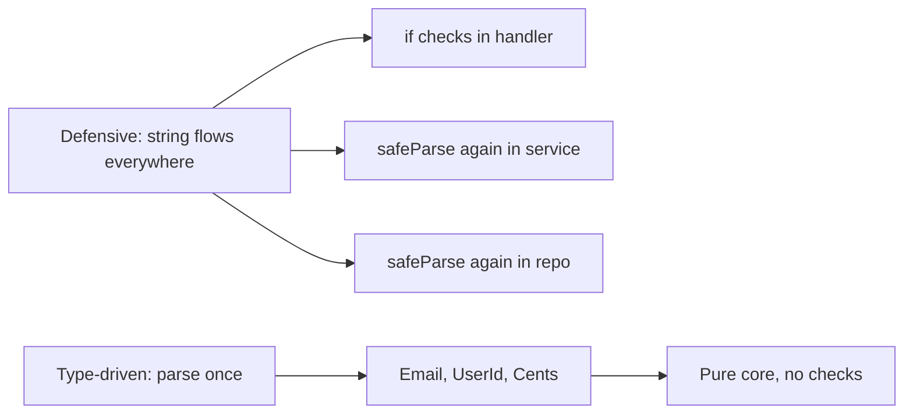
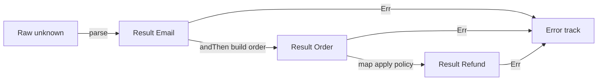
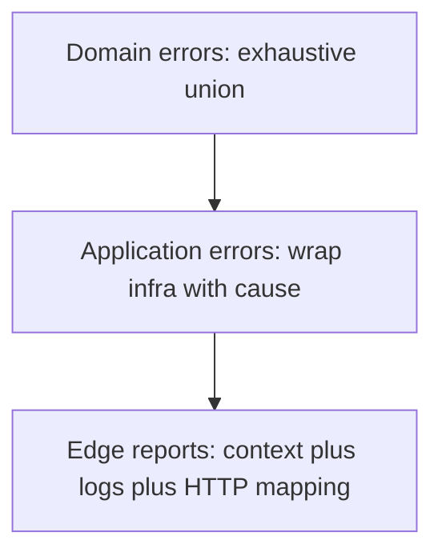
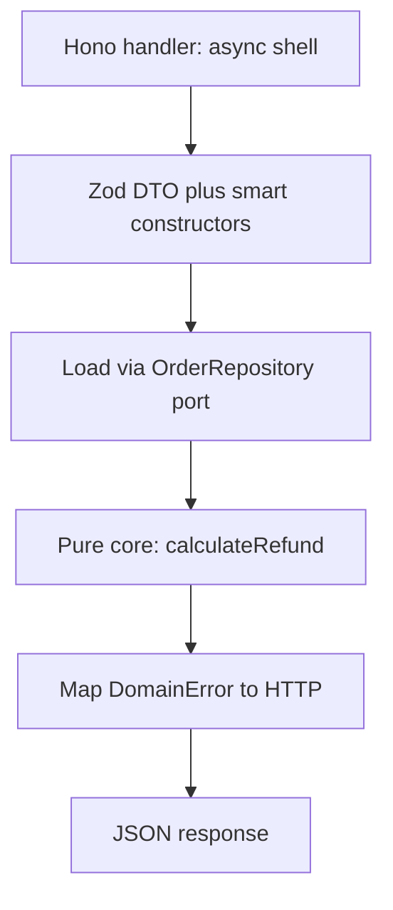

> *Un desarrollador junior no valida nada y espera lo mejor.*
> *Un desarrollador intermedio valida todo, en todas partes, con sentencias `if` en cada capa.*
> *Un desarrollador senior parsea una vez en el borde y deja que el sistema de tipos demuestre el resto.*
> - <cite>Proverbio de Ingeniería de Software, edición TypeScript</cite>

<!--more-->

## TL;DR

* **Valida una vez, en el borde.**
Espera `string`, `number` y `unknown` no confiables en la frontera del sistema.
Parséalos ahí en tipos de dominio con prueba integrada.
* **Parsea, no valides.**
Validar conserva el tipo débil y devuelve `boolean`.
Parsear consume el tipo débil y devuelve `Result<StrongType, Error>`.
* **Modela el dominio con tipos.**
Usa branded types, smart constructors, sum types, product types y funciones totales.
Haz que los estados ilegales sean irrepresentables por construcción.
* **Estratifica los errores.**
Usa una unión discriminada exhaustiva para errores de dominio y envuelve las fallas de infraestructura con `cause` solo en el borde de aplicación.
* **Empuja las invariantes al compilador.**
Usa el patrón type-state, brands de costo cero en runtime y un núcleo funcional puro envuelto por un shell delgado de Hono o Fastify con Zod con puertos de interfaz.
```json
// package.json sketch con versiones fijas.
{
  "dependencies": { "hono": "^4", "zod": "^3", "ts-pattern": "^5" },
  "devDependencies": { "fast-check": "^3", "vitest": "^2", "typescript": "^5" }
}
```

* Este post es el capítulo TypeScript de la serie Error Handling.
Asume TypeScript 5.x en modo `strict` más `noUncheckedIndexedAccess`, y usa Zod, ts-pattern, fast-check y Hono o Fastify en los ejemplos. Construye cada patrón con uniones, módulos y `Result`.

---

## 1. Introducción: El Antipatrón del TypeScript Defensivo

El hábito tentador en TypeScript es aceptar `string`, `number` y `unknown` en cada función y volver a comprobarlos en cada capa.
Validas el mismo payload en el handler, luego en el servicio, luego en el repositorio, porque ninguna firma registra lo ya demostrado.
El type erasure hace que este hábito parezca responsable.
No lo es.
Es costoso, ruidoso y frágil.

Considera la clásica sopa de primitivos.

```ts
// ❌ Antipattern: primitives flow through every layer.
import type { Request, Response } from "express";

interface Db {
  getUser: (userId: string) => Promise<{ stripeId: string } | null>;
}

declare const db: Db;
declare const gateway: { refund: (stripeId: string, amount: number) => Promise<void> };

export async function processRefund(req: Request, res: Response): Promise<void> {
  try {
    const body: unknown = req.body;

    // Defensive check 1: who validated the payload shape?
    if (typeof body !== "object" || body === null) {
      throw new Error("Invalid payload");
    }
    const payload = body as { userId?: unknown; amount?: unknown };

    // Defensive check 2: who validated userId?
    if (typeof payload.userId !== "string" || payload.userId.trim() === "") {
      throw new Error("Missing UserId");
    }

    // Defensive check 3: who validated amount?
    if (typeof payload.amount !== "number" || !(payload.amount > 0)) {
      throw new Error("Invalid amount");
    }

    const user = await db.getUser(payload.userId);
    if (user === null) {
      throw new Error("User not found"); // Expected error? Or DB bug?
    }

    // Business logic is buried under guards.
    await gateway.refund(user.stripeId, payload.amount);
    res.status(200).send("Success");
  } catch (error) {
    // Is this a 400 typo or a 500 outage? The type is unknown.
    const message = error instanceof Error ? error.message : "Unknown error";
    res.status(400).send({ error: message });
  }
}

export async function sendReceipt(userId: string, amount: number): Promise<void> {
  // Same checks, copied again, because string proves nothing.
  if (userId.trim() === "") {
    throw new Error("Invalid userId");
  }
  if (!(amount > 0)) {
    throw new Error("Invalid amount");
  }
  // ... send email ...
}
```

Este código compila, pasa el review y pudre lentamente el codebase.
Cada función repite las mismas tres guardas.
Cada llamador se pregunta si el llamado ya comprobó.
Cada cambio en la regla de email exige una edición shotgun en handlers, servicios y repositorios.
Una variante más insidiosa repite `RefundSchema.safeParse()` en cada capa en vez de `if` crudos.
La forma cambió pero la arquitectura no.
Sigues pagando el costo de parseo en el hot path y sigues acoplando reglas de negocio al código de infraestructura.
El costo más profundo es la paranoia.
Ninguna firma te dice qué ya está probado, así que vuelves a comprobar.

TypeScript te ofrece un contrato mejor, dentro de los límites del borrado.
Parsea los datos no confiables una vez en el borde.
Entrega al núcleo solo tipos que no pueden estar mal por disciplina.
Elimina para siempre las guardas duplicadas.



El resto de esta guía muestra cómo construir ese contrato en cinco pilares, reconociendo con honestidad lo que el compilador puede y no puede garantizar.

---

## 2. El Cambio de Paradigma: Parse, Don't Validate

Alexis King capturó la idea central en [Parse, don't validate](https://lexi-lambda.github.io/blog/2019/11/05/parse-don-t-validate/) (2019).
Validar inspecciona un valor y conserva el tipo débil.
Parsear consume el tipo débil y produce un tipo fuerte con la prueba integrada.
Esa distinción cambia tu arquitectura.

Validar tiene esta forma.
Responde una pregunta y desecha la respuesta.

```ts
// Validation: checks, then keeps string.
// Every downstream function must ask again.
export function isValidEmail(raw: string): boolean {
  const parts = raw.split("@");
  return parts.length === 2 && parts[0] !== "" && parts[1] !== undefined && parts[1].includes(".");
}

export function notify(rawEmail: string): void {
  if (isValidEmail(rawEmail)) {
    // rawEmail is still string here.
    // The compiler learned nothing.
    // The next function must check again.
    console.log(`sending to ${rawEmail}`);
  }
}
```

Parsear tiene una forma distinta.
Transforma y certifica en un solo movimiento.

```ts
// Parsing: consumes unknown, produces proof-bearing Email.
// Single brand system used everywhere: Brand<string, Name>.
import type { Brand } from "./brand.js";
export type Email = Brand<string, "Email">;

export type EmailError =
  | { readonly kind: "NotAString" }
  | { readonly kind: "MissingAt" }
  | { readonly kind: "EmptyLocalPart" }
  | { readonly kind: "InvalidDomain" };

export type Result<T, E> =
  | { readonly ok: true; readonly value: T }
  | { readonly ok: false; readonly error: E };

export function parseEmail(raw: unknown): Result<Email, EmailError> {
  if (typeof raw !== "string") {
    return { ok: false, error: { kind: "NotAString" } };
  }
  if (raw.length > 254) {
    return { ok: false, error: { kind: "InvalidDomain" } };
  }
  const trimmed = raw.trim();
  // Strict matrix: exactly one @, no whitespace, dot not at edges, no double dot.
  // Rejects a@b@c.com, a@@b.com, a b@c.com, a@b..com, a@b.
  if (trimmed.split("@").length !== 2) {
    return { ok: false, error: { kind: "MissingAt" } };
  }
  if (/\s/.test(trimmed)) {
    return { ok: false, error: { kind: "InvalidDomain" } };
  }
  const at = trimmed.indexOf("@");
  const local = trimmed.slice(0, at);
  const domain = trimmed.slice(at + 1);
  if (local === "") {
    return { ok: false, error: { kind: "EmptyLocalPart" } };
  }
  if (!domain.includes(".") || domain.includes("..") || domain.startsWith(".") || domain.endsWith(".")) {
    return { ok: false, error: { kind: "InvalidDomain" } };
  }
  // The single sanctioned cast in the codebase.
  // It lives here, reviewed once, tested with fast-check.
  return { ok: true, value: trimmed as Email };
}

export function notifyParsed(email: Email): void {
  // No check here. The type is the proof.
  console.log(`sending to ${email}`);
}
```

Después de que `parseEmail` tiene éxito, ninguna función río abajo vuelve a comprobar el `@`.
El tipo es la prueba.
La firma `notifyParsed(email: Email)` documenta la invariante mejor que cualquier comentario.

Esta es la frontera arquitectónica que quieres.

```text
                       SYSTEM BOUNDARY
   Untrusted outside              Parsed inside
┌──────────────────┐     ┌─────────────────────────────┐
│ string           │     │ Email, UserId, Cents        │
│ number           │────▶│ Order, Refund, Policy       │
│ unknown JSON     │parse │ Proof-bearing domain types  │
│ Raw query params │     │ Total functions only        │
└──────────────────┘     └─────────────────────────────┘
        │                             │
   may be anything              illegal states are unrepresentable
   must be checked              must only be composed
```

La regla es simple.
Los datos cruzan la frontera como `string` y `unknown`.
Viajan dentro del núcleo como `Email`, `UserId` y `Cents`.
El parser vive en exactamente un módulo por tipo.
Todo lo que está detrás compone sin guardas.
Es el mismo movimiento que Edwin Brady enseña en *Type-Driven Development with Idris*.
Deja que el tipo guíe el flujo de control.
Rechaza los programas malos tan pronto como el sistema de tipos lo permite en vez de descubrirlos en los logs de producción.

---

## 3. Pilar 1: Modelado del Dominio con Branded Types, Value Objects y Smart Constructors

Eric Evans los llama Value Objects en *Domain-Driven Design*.
Son conceptos pequeños, inmutables y autovalidados sin identidad más allá de su valor.
TypeScript los modela con branded types más un smart constructor.
La privacidad del módulo más un constructor privado aportan la disciplina que el runtime no puede.

Empieza con un helper de brand reutilizable.
No cuesta nada en runtime porque solo existe en el type checker.

```ts
// domain/brand.ts - zero-runtime foundation.
export type Brand<T, Name extends string> = T & { readonly __brand: Name };

export type Email = Brand<string, "Email">;
export type UserId = Brand<string, "UserId">;
export type OrderId = Brand<string, "OrderId">;
export type Cents = Brand<number, "Cents">;
```

Cada brand es un literal de string distinto, así que `Email` no es asignable a `UserId` aunque ambos envuelvan `string`.
Un `string` pelado no es asignable a ninguno.
Ese es todo el truco.

Ahora coloca cada smart constructor en su propio módulo y exporta solo el tipo y el parser, nunca una fábrica cruda.

```ts
// domain/email.ts - the only module allowed to mint Email.
import type { Email } from "./brand.js";
import type { Result } from "./result.js";

export type { Email } from "./brand.js";

export type EmailError =
  | { readonly kind: "NotAString" }
  | { readonly kind: "MissingAt" }
  | { readonly kind: "EmptyLocalPart" }
  | { readonly kind: "InvalidDomain" };

export function parseEmail(raw: unknown): Result<Email, EmailError> {
  if (typeof raw !== "string") {
    return { ok: false, error: { kind: "NotAString" } };
  }
  if (raw.length > 254) {
    return { ok: false, error: { kind: "InvalidDomain" } };
  }
  const trimmed = raw.trim();
  // Strict matrix: exactly one @, no whitespace, dot not at edges, no double dot.
  // Rejects a@b@c.com, a@@b.com, a b@c.com, a@b..com, a@b.
  if (trimmed.split("@").length !== 2) {
    return { ok: false, error: { kind: "MissingAt" } };
  }
  if (/\s/.test(trimmed)) {
    return { ok: false, error: { kind: "InvalidDomain" } };
  }
  const at = trimmed.indexOf("@");
  const local = trimmed.slice(0, at);
  const domain = trimmed.slice(at + 1);
  if (local === "") {
    return { ok: false, error: { kind: "EmptyLocalPart" } };
  }
  if (!domain.includes(".") || domain.includes("..") || domain.startsWith(".") || domain.endsWith(".")) {
    return { ok: false, error: { kind: "InvalidDomain" } };
  }
  return { ok: true, value: trimmed as Email };
}

export function emailToString(email: Email): string {
  // Brands are strings at runtime, so this is a free coercion.
  return email;
}
```

```ts
// domain/money.ts - the same pattern for numeric invariants.
import type { Cents } from "./brand.js";
import type { Result } from "./result.js";

export type { Cents } from "./brand.js";

export type MoneyError =
  | { readonly kind: "NotANumber"; readonly received: unknown }
  | { readonly kind: "NotAnInteger"; readonly received: unknown }
  | { readonly kind: "NonPositive"; readonly received: unknown };

export function parseCents(raw: unknown): Result<Cents, MoneyError> {
  if (typeof raw !== "number" || !Number.isFinite(raw)) {
    return { ok: false, error: { kind: "NotANumber", received: raw } };
  }
  if (!Number.isInteger(raw)) {
    return { ok: false, error: { kind: "NotAnInteger", received: raw } };
  }
  if (raw <= 0) {
    return { ok: false, error: { kind: "NonPositive", received: raw } };
  }
  return { ok: true, value: raw as Cents };
}

function mintCentsUnchecked(value: number): Cents {
  // Module-private. Only refundShareTotal in this same money.ts calls it after checks.
  return value as Cents;
}

// No test export: fixtures use parseCents, never the private mint.

export function centsToNumber(amount: Cents): number {
  return amount;
}
```

Para agregados con forma de clase, usa un constructor privado más un campo `#private` o una clave de brand no exportada para que `new` no pueda llamarse desde fuera.

```ts
// domain/order.ts - DDD aggregate with a guarded boundary.
import type { Cents, Email, OrderId, UserId } from "./brand.js";
import type { PaymentMethod } from "./payment.js";

const OrderTag: unique symbol = Symbol("OrderTag");

export interface Order {
  readonly id: OrderId;
  readonly userId: UserId;
  readonly email: Email;
  readonly amount: Cents;
  readonly method: PaymentMethod;
  readonly [OrderTag]: "Order";
}

export function createOrder(input: {
  readonly id: OrderId;
  readonly userId: UserId;
  readonly email: Email;
  readonly amount: Cents;
  readonly method: PaymentMethod;
}): Order {
  // Inputs are already proven, so no validation here.
  // The tag key is not exported, so only this module can build the literal.
  return { ...input, [OrderTag]: "Order" };
}
```

Zod y Effect Schema encajan con naturalidad como implementación del parser dentro del smart constructor.
Son el guardia de la puerta, no el dominio.

```ts
// domain/user-id.ts - the only module allowed to mint UserId.
import type { UserId } from "./brand.js";
import type { Result } from "./result.js";

export type UserIdError = { readonly kind: "InvalidUserId" };

export function parseUserId(raw: unknown): Result<UserId, UserIdError> {
  if (typeof raw !== "string") {
    return { ok: false, error: { kind: "InvalidUserId" } };
  }
  if (raw.length > 64) {
    return { ok: false, error: { kind: "InvalidUserId" } };
  }
  const trimmed = raw.trim();
  // Single owner of the uuid rule. Returns trimmed so "  uuid  " never leaks spaces.
  const uuidRe = /^[0-9a-f]{8}-[0-9a-f]{4}-[0-9a-f]{4}-[0-9a-f]{4}-[0-9a-f]{12}$/i;
  if (trimmed === "" || !uuidRe.test(trimmed)) {
    return { ok: false, error: { kind: "InvalidUserId" } };
  }
  return { ok: true, value: trimmed as UserId };
}

// domain/order-id.ts - the only module allowed to mint OrderId.
import type { OrderId } from "./brand.js";

export type OrderIdError = { readonly kind: "InvalidOrderId" };

export function parseOrderId(raw: unknown): Result<OrderId, OrderIdError> {
  if (typeof raw !== "string") {
    return { ok: false, error: { kind: "InvalidOrderId" } };
  }
  if (raw.length > 64) {
    return { ok: false, error: { kind: "InvalidOrderId" } };
  }
  const trimmed = raw.trim();
  if (trimmed === "") {
    return { ok: false, error: { kind: "InvalidOrderId" } };
  }
  return { ok: true, value: trimmed as OrderId };
}

// domain/refund-request.ts - schema-as-parser, brand-as-proof.
import { z } from "zod";
import { parseCents } from "./money.js";
import { parseEmail } from "./email.js";
import { parseUserId } from "./user-id.js";
import type { Cents, Email, UserId } from "./brand.js";
import type { Result } from "./result.js";

const RefundSchema = z.object({
  // Shape only with caps to bound regex/trim work. UUID format lives in parseUserId.
  userId: z.string().max(64),
  email: z.string().max(254),
  amount: z.number(),
});

export interface RefundRequest {
  readonly userId: UserId;
  readonly email: Email;
  readonly amount: Cents;
}

export type RefundRequestError =
  | { readonly kind: "BadShape"; readonly issues: string }
  | { readonly kind: "BadEmail"; readonly error: ReturnType<typeof parseEmail> extends { ok: false; error: infer E } ? E : never }
  | { readonly kind: "BadUserId" }
  | { readonly kind: "BadAmount" };

export function parseRefundRequest(data: unknown): Result<RefundRequest, RefundRequestError> {
  const shaped = RefundSchema.safeParse(data);
  if (!shaped.success) {
    return { ok: false, error: { kind: "BadShape", issues: shaped.error.message } };
  }
  const email = parseEmail(shaped.data.email);
  if (!email.ok) {
    return { ok: false, error: { kind: "BadEmail", error: email.error } };
  }
  const userId = parseUserId(shaped.data.userId);
  if (!userId.ok) {
    return { ok: false, error: { kind: "BadUserId" } };
  }
  const amount = parseCents(shaped.data.amount);
  if (!amount.ok) {
    return { ok: false, error: { kind: "BadAmount" } };
  }
  return {
    ok: true,
    value: {
      userId: userId.value,
      email: email.value,
      amount: amount.value,
    },
  };
}
```

Sé honesto sobre el límite.
En Rust, `pub struct Email(String)` con campo privado es infalsificable fuera del módulo de forma física.
En TypeScript, el brand se borra en runtime y cualquier módulo puede escribir `raw as Email`.
La infalsificabilidad aquí es disciplinaria, no física.
Sostenla con tres reglas: conserva el cast `as` solo dentro del módulo del smart constructor, prohíbe `as` fuera con `no-restricted-syntax` para `TSAsExpression` con allowlist en `domain/*`, y reexporta el tipo opaco sin reexportar la clave del brand.
Revisa cada `as` nuevo como una invocación a `sudo`.

---

## 4. Pilar 2: Fundamentos Funcionales (Tipos Algebraicos y Funciones Totales)

Paul Chiusano y Runar Bjarnason enseñan esto en *Functional Programming in Scala*.
Modela con tipos precisos, escribe funciones totales y compone con combinadores en vez de lanzar excepciones por el stack.
Las uniones e interfaces de TypeScript son tipos algebraicos de datos, y un `Result` discriminado es tu mónada `Either`.

Los sum types enumeran alternativas excluyentes.

```ts
// domain/payment.ts - a sum type with three mutually exclusive cases.
export type PaymentMethod =
  | { readonly kind: "card"; readonly lastFour: string }
  | { readonly kind: "transfer"; readonly iban: string }
  | { readonly kind: "cash" };
```

Los product types combinan hechos independientes.

```ts
// domain/order-shape.ts - a product type with no optional escape hatches.
import type { Cents, Email, UserId } from "./brand.js";
import type { PaymentMethod } from "./payment.js";

export interface OrderShape {
  readonly userId: UserId;
  readonly email: Email;
  readonly amount: Cents;
  readonly method: PaymentMethod;
}
```

No hay `null`, no hay `method: string` como stringly typed, ni objetos a medio construir.
La exhaustividad se impone con un helper que acepta `never`.

```ts
// domain/assert.ts
export function assertNever(value: never, message = "Unhandled case"): never {
  throw new Error(`${message}: ${JSON.stringify(value)}`);
}

export function feeFor(method: PaymentMethod): number {
  switch (method.kind) {
    case "card":
      return 30;
    case "transfer":
      return 10;
    case "cash":
      return 0;
    default:
      return assertNever(method);
  }
}
```

Agrega una variante nueva como `{ kind: "crypto" }` y `feeFor` deja de compilar hasta que la manejes.
Esa ruptura de compilación es la funcionalidad.

Una función total está definida para el 100 por ciento de sus valores de entrada.
Nunca lanza para casos esperados, nunca devuelve `undefined` por sorpresa y nunca esconde un efecto.
Una función parcial finge ser total pero explota con algunas entradas.

```ts
// ❌ Partial: never throws, returns Infinity on zero and NaN silently, returns a bare number.
export function refundSharePartial(amount: number, parts: number): number {
  return amount / parts;
}

// ✅ Total: lives in domain/money.ts so mintCentsUnchecked stays in the defining module.
import type { Cents } from "./brand.js";
import type { Result } from "./result.js";

export type SplitError =
  | { readonly kind: "EmptyParts" }
  | { readonly kind: "NotDivisible"; readonly amount: number; readonly parts: number };

export function refundShareTotal(amount: Cents, parts: number): Result<Cents, SplitError> {
  if (!Number.isInteger(parts) || parts <= 0) {
    return { ok: false, error: { kind: "EmptyParts" } };
  }
  const share = amount / parts;
  if (!Number.isInteger(share)) {
    return { ok: false, error: { kind: "NotDivisible", amount, parts } };
  }
  return { ok: true, value: mintCentsUnchecked(share) };
}
```

Nota la disciplina de `strict` más `noUncheckedIndexedAccess`: indexar devuelve `T | undefined` y debe estrecharse. La división y el acceso a JSON `any` no los chequea el compilador, así que devuelven `Result` por disciplina.
Las firmas totales obligan a los llamadores a enfrentar los casos borde en el sitio de llamada.

La composición usa `map`, `andThen` y `mapErr` en vez de pirámides de `if` anidados.
Esto es Railway Oriented Programming de Scott Wlaschin, expresado con `Result`.



```ts
// domain/result.ts - the railway toolkit.
export type Result<T, E> =
  | { readonly ok: true; readonly value: T }
  | { readonly ok: false; readonly error: E };

export function ok<T>(value: T): Result<T, never> {
  return { ok: true, value };
}

export function err<E>(error: E): Result<never, E> {
  return { ok: false, error };
}

export function map<T, U, E>(result: Result<T, E>, fn: (value: T) => U): Result<U, E> {
  return result.ok ? { ok: true, value: fn(result.value) } : result;
}

export function andThen<T, U, E, F>(
  result: Result<T, E>,
  fn: (value: T) => Result<U, F>,
): Result<U, E | F> {
  return result.ok ? fn(result.value) : result;
}

export function mapErr<T, E, F>(result: Result<T, E>, fn: (error: E) => F): Result<T, F> {
  return result.ok ? result : { ok: false, error: fn(result.error) };
}
```

```ts
// domain/build-order.ts - chaining on the railway.
import { andThen, map, mapErr, ok } from "./result.js";
import type { Result } from "./result.js";
import { parseEmail } from "./email.js";
import { parseCents } from "./money.js";
import { parseUserId } from "./user-id.js";
import type { OrderShape } from "./order-shape.js";

export type BuildOrderError =
  | { readonly kind: "BadEmail"; readonly error: string }
  | { readonly kind: "BadAmount" }
  | { readonly kind: "BadUserId" };

export function buildOrderChained(
  rawEmail: unknown,
  rawAmount: unknown,
): Result<OrderShape, BuildOrderError> {
  // Each parse error is mapped to BuildOrderError, so the chain compiles.
  return andThen(
    mapErr(parseEmail(rawEmail), (e): BuildOrderError => ({ kind: "BadEmail", error: e.kind })),
    (email) =>
      andThen(
        mapErr(parseCents(rawAmount), (): BuildOrderError => ({ kind: "BadAmount" })),
        (amount) =>
          map(
            mapErr(
              parseUserId("00000000-0000-4000-8000-000000000000"),
              (): BuildOrderError => ({ kind: "BadUserId" }),
            ),
            (userId) => ({
              userId,
              email,
              amount,
              method: { kind: "cash" } as const,
            }),
          ),
      ),
  );
}
```

Los combinadores son precisos pero ruidosos para cadenas largas, así que TypeScript usa el `?` manual con early return.
Tiene el mismo cortocircuito en el flujo, con distinta ergonomía en el tipo de error: `andThen` preserva la unión, el early return exige mapear a mano.

```ts
export function buildOrderClean(rawEmail: unknown, rawAmount: unknown): Result<OrderShape, BuildOrderError> {
  const email = parseEmail(rawEmail);
  if (!email.ok) {
    return { ok: false, error: { kind: "BadEmail", error: email.error.kind } };
  }
  const amount = parseCents(rawAmount);
  if (!amount.ok) {
    return { ok: false, error: { kind: "BadAmount" } };
  }
  const userId = parseUserId("00000000-0000-4000-8000-000000000000");
  if (!userId.ok) {
    return { ok: false, error: { kind: "BadUserId" } };
  }
  return {
    ok: true,
    value: {
      userId: userId.value,
      email: email.value,
      amount: amount.value,
      method: { kind: "cash" },
    },
  };
}
```

Ambas versiones mantienen dos rieles paralelos.
El riel feliz lleva valores hacia adelante.
El riel de error cortocircuita sin lanzar.
El tipo de error le dice al handler exactamente qué status devolver, así que un typo 400 jamás se disfraza de apagón 500.

---

## 5. Pilar 3: La Conexión Lisp, Metaprogramación y Diseño Orientado a Expresiones

Abelson y Sussman celebran en *Structure and Interpretation of Computer Programs* un estilo donde los programas se construyen con expresiones que evalúan a valores, y donde el código mismo es dato que los programas pueden manipular.
TypeScript es orientado a expresiones con ternarios y matching exhaustivo vía helpers como `match` de `ts-pattern`, que devuelven valores asignables. TypeScript no tiene switch expression.
Los schemas son la segunda mitad: un Schema de Zod o Effect es un descriptor componible de tu dominio que puedes inspeccionar, extender y del que puedes derivar tipos, no homoiconicidad Lisp.

Prefiere expresiones sobre sentencias al construir valores del dominio.

```ts
// Expression-oriented construction: every branch yields a value.
import { match } from "ts-pattern";
import { parseEmail } from "./email.js";
import type { Email } from "./brand.js";
import type { Result } from "./result.js";

export function labelFor(amount: number): string {
  // The ternary chain is an expression assigned once.
  const tier = amount > 100_000 ? "enterprise" : amount > 1_000 ? "standard" : "micro";
  return tier;
}

export function describeResult(result: Result<Email, { kind: string }>): string {
  // ts-pattern match is an exhaustive expression.
  return match(result)
    .with({ ok: true }, ({ value }) => `valid: ${value}`)
    .with({ ok: false }, ({ error }) => `invalid: ${error.kind}`)
    .exhaustive();
}

export function emailOrFallback(raw: unknown, fallback: Email): Email {
  const parsed = parseEmail(raw);
  // No let-mutation dance. The conditional is the value.
  // Returns a proven Email in both branches, never null.
  // WARNING: fallback swallows the error. Prefer Result<Email, EmailError> when callers must react.
  return parsed.ok ? parsed.value : fallback;
}
```

Sin danza de `let result;`.
Sin variables sin inicializar.
El compilador comprueba que cada rama produzca el tipo declarado, y `.exhaustive()` rompe el build cuando la unión crece.

El código como dato aparece en dos lugares: schemas que manipulas y tipos que computan.

```ts
// Schemas are manipulable ASTs: extend, pick, and intersect them.
import { z } from "zod";

const BaseRefundDto = z.object({
  orderId: z.string().uuid(),
  email: z.string(),
  amountCents: z.number(),
});

// Derive new schemas from data instead of copying fields.
export const RefundDto = BaseRefundDto.extend({
  idempotencyKey: z.string().uuid(),
});

export const RefundAmountOnly = BaseRefundDto.pick({ amountCents: true });

export type RefundDtoInput = z.input<typeof RefundDto>;
export type RefundDtoOutput = z.output<typeof RefundDto>;
```

```ts
// Types that compute: the compiler runs small programs at type level.
type EmailString = `${string}@${string}.${string}`;

type ExtractLocal<S extends string> = S extends `${infer Local}@${string}` ? Local : never;

type LocalOfExample = ExtractLocal<"alice@example.com">;
//   ^? type LocalOfExample = "alice"

// Narrow a parsed DTO with satisfies para conservar literales sin widening. satisfies chequea asignabilidad, incluyendo exceso en literales.
const policy = {
  maxCents: 500_000,
  currency: "USD",
} as const satisfies { readonly maxCents: number; readonly currency: string };
```

`EmailString` es documentación, no prueba: los template literal types no pueden comprobar `trim()` ni rangos de enteros, y se desvanecen en runtime.
Úsalos para autocompletado y errores legibles, pero conserva el smart constructor como único punto de cumplimiento.

Mecaniza la repetición con helpers pequeños, nunca con lógica de negocio oculta.

```ts
// helpers/smart.ts - a factory that mechanizes the proof shape.
import { z } from "zod";
import type { Brand } from "./brand.js";
import type { Result } from "./result.js";

// Generic mint for string brands. Sanctioned only because it lives with the helper
// and callers still declare the full rule inline. Do not add a second Email parser:
// canonical Email comes from domain/email.ts parseEmail. This is the same rule via Zod.
export function makeStringBrand<Name extends string>(name: Name, schema: z.ZodType<string>) {
  return {
    schema,
    parse(raw: unknown): Result<Brand<string, Name>, { readonly kind: string; readonly name: Name }> {
      const parsed = schema.safeParse(raw);
      if (!parsed.success) {
        return { ok: false, error: { kind: "invalid", name } };
      }
      // Single sanctioned cast for this generic helper. Prefer per-type parseEmail in real code.
      return { ok: true, value: parsed.data as Brand<string, Name> };
    },
  };
}

// Same email rule expressed via Zod. Pick one source of truth per codebase.
export const EmailParser = makeStringBrand("Email", z.string().trim().email());
```

La regla para macros, decoradores y helpers es estricta: el helper puede eliminar boilerplate alrededor de `safeParse`, `trim` y `transform`, pero la invariante debe seguir visible en el módulo de dominio.
Si un revisor no puede ver la regla de email sin abrir el helper, la abstracción fue demasiado lejos.

---

## 6. Pilar 4: Manejo de Errores Exhaustivo y Estratificado

No todos los errores pertenecen al mismo tipo.
Los errores de dominio son resultados de negocio esperados y deben ser exhaustivos.
Los errores de infraestructura son fallas operativas y necesitan cadenas de `cause`.
Mezclarlos en un solo `string` o en un `unknown` lanzado destruye esa señal.

Estratifica en tres capas.



Modela los errores de dominio como unión discriminada.
Cada variante es un hecho de negocio que el llamador debe manejar.

```ts
// domain/errors.ts - the exhaustive business vocabulary.
import type { EmailError } from "./email.js";
import type { Cents, OrderId } from "./brand.js";

export type DomainError =
  | { readonly kind: "InvalidEmail"; readonly error: EmailError }
  | { readonly kind: "InvalidAmount" }
  | { readonly kind: "ExceedsMax"; readonly max: Cents }
  | { readonly kind: "InvalidOrderId" }
  | { readonly kind: "UserNotFound"; readonly userId: UserId }
  | { readonly kind: "InsufficientFunds"; readonly requested: Cents; readonly balance: Cents }
  | { readonly kind: "AlreadyRefunded"; readonly orderId: OrderId };
```

El `switch` exhaustivo ahora obliga decisiones de producto, y `assertNever` convierte un caso olvidado en error de compilación.

```ts
// domain/status.ts - single mapping shared by shell and app, checked by the compiler.
import { assertNever } from "./assert.js";
import type { DomainError } from "./errors.js";

export function domainToStatus(error: DomainError): number {
  switch (error.kind) {
    case "InvalidEmail":
    case "InvalidAmount":
    case "InvalidOrderId":
      return 400;
    case "ExceedsMax":
      return 422;
    case "UserNotFound":
      return 404;
    case "InsufficientFunds":
    case "AlreadyRefunded":
      return 422;
    default:
      return assertNever(error);
  }
}

export function domainToMessage(error: DomainError): string {
  switch (error.kind) {
    case "InvalidEmail":
      return `invalid email: ${error.error.kind}`;
    case "InvalidAmount":
      return "invalid amount: must be a positive integer";
    case "InvalidOrderId":
      return "invalid order id";
    case "ExceedsMax":
      return `amount exceeds maximum ${error.max}`;
    case "UserNotFound":
      return "user not found";
    case "InsufficientFunds":
      return "insufficient funds";
    case "AlreadyRefunded":
      return `refund already processed for order ${error.orderId}`;
    default:
      return assertNever(error);
  }
}
```

Envuelve los errores de infraestructura una vez en la capa de aplicación con un `cause` explícito.

```ts
// app/errors.ts - domain facts plus operational failures.
// App imports status from domain, never from shell. Single table, no duplication.
import { domainToStatus } from "../domain/status.js";

export type AppError =
  | { readonly kind: "Domain"; readonly error: DomainError }
  | { readonly kind: "Database"; readonly cause: unknown }
  | { readonly kind: "Gateway"; readonly cause: unknown };

export function appToStatus(error: AppError): number {
  switch (error.kind) {
    case "Domain":
      return domainToStatus(error.error);
    case "Database":
    case "Gateway":
      return 500;
    default:
      return assertNever(error);
  }
}
```

Agrega contexto y logs solo en el borde, donde los leen los humanos.

```ts
// shell/handler-helpers.ts - edge-only enrichment.
import type { AppError } from "../app/errors.js";
import { domainToMessage, domainToStatus } from "../domain/status.js";

export interface ErrorReport {
  readonly status: number;
  readonly body: { readonly error: string };
}

export function reportAppError(error: AppError, logger: { error: (message: string, details?: unknown) => void }): ErrorReport {
  // Domain is never imported by a logger module; the shell owns this call.
  if (error.kind === "Domain") {
    return { status: domainToStatus(error.error), body: { error: domainToMessage(error.error) } };
  }
  logger.error("infrastructure failure", { kind: error.kind, cause: error.cause });
  return { status: 500, body: { error: "internal error" } };
}
```

Tres reglas mantienen honesta la estratificación.
Nunca retornes `unknown` desde una función de dominio: nombra la unión en su lugar.
Nunca lances un `string` ni un `Error` pelado desde el dominio: devuelve `Result<T, DomainError>`.
Nunca dejes que el dominio importe el logger HTTP ni los tipos del framework: la flecha de dependencia apunta del shell hacia el núcleo, jamás al revés.

---

## 7. Pilar 5: Invariantes en Tiempo de Compilación con el Patrón Type-State

Algunas invariantes no tratan de valores aislados sino de secuencias.
Una orden no puede pagarse antes de enviarse.
Un reembolso no puede emitirse dos veces.
Los booleanos en runtime como `isSubmitted` pueden olvidarse o comprobarse en el orden wrong.
El type-state codifica el flujo en genéricos para que las secuencias incorrectas no compilen.

Es el diseño type-driven al estilo Brady aplicado a ciclos de vida del negocio.

```ts
// domain/order-lifecycle.ts - workflow encoded in the generic slot.
import type { Cents, OrderId } from "./brand.js";

export interface Draft {
  readonly stage: "draft";
}
export interface Submitted {
  readonly stage: "submitted";
}
export interface Paid {
  readonly stage: "paid";
}

export type OrderStage = Draft | Submitted | Paid;

// Lifecycle uses StagedOrder, never the core Order, so the two never collide.
// Brand<string> itself emits no JS. Symbol() and object spreads below emit one Symbol
// plus one object per transition. Keep lifecycle construction out of the hot path.
export const StageTag: unique symbol = Symbol("StageTag");

export interface StagedOrder<S extends OrderStage> {
  readonly id: OrderId;
  readonly amount: Cents;
  readonly stage: S["stage"];
  // With declaration:true this exported interface needs an exported tag, hence export const above.
  // Export does not allow forging without as, opacity stays disciplinary.
  readonly [StageTag]: S;
}

export function createDraftOrder(id: OrderId, amount: Cents): StagedOrder<Draft> {
  // Same-module mint: StageTag and StagedOrder live in order-lifecycle.ts, so these casts are sanctioned.
  return { id, amount, stage: "draft", [StageTag]: { stage: "draft" } as Draft };
}

export function submitOrder(order: StagedOrder<Draft>): StagedOrder<Submitted> {
  // Conceptually consumes the draft: callers should drop the old binding.
  return { id: order.id, amount: order.amount, stage: "submitted", [StageTag]: { stage: "submitted" } as Submitted };
}

export function payOrder(order: StagedOrder<Submitted>): StagedOrder<Paid> {
  return { id: order.id, amount: order.amount, stage: "paid", [StageTag]: { stage: "paid" } as Paid };
}

// Only paid orders expose a receipt.
export function receiptFor(order: StagedOrder<Paid>): string {
  return `paid ${order.amount} for ${order.id}`;
}
```

El uso correcto fluye por el compilador.

```ts
import { parseCents } from "./money.js";
import { parseOrderId } from "./order-id.js";

const demoOrderId = parseOrderId("ord_1");
if (!demoOrderId.ok) {
  throw new Error("bad fixture");
}
const demoAmount = parseCents(5000);
if (!demoAmount.ok) {
  throw new Error("bad fixture");
}
const draft = createDraftOrder(demoOrderId.value, demoAmount.value);
const submitted = submitOrder(draft);
const paid = payOrder(submitted);
console.log(receiptFor(paid));
```

Las transiciones ilegales no compilan.

```ts
// @ts-expect-error - cannot pay a draft: payOrder needs StagedOrder<Submitted>.
const _illegal = payOrder(draft);

// @ts-expect-error - receipt needs StagedOrder<Paid>, not StagedOrder<Submitted>.
const _early = receiptFor(submitted);
```

TypeScript no puede destruir el binding viejo de `draft` como lo mueve Rust.
`submitOrder(draft)` no invalida `draft` en runtime.
Sostén el patrón por disciplina: prefiere reasignar (`let order = createDraftOrder(...); order = submitOrder(order)`) o nuevos nombres (`const submitted = submitOrder(order)`), usa lint contra la reutilización tras la transición en módulos pequeños, y mantén la clave `StageTag` sin exportar. Aun así, `{} as Order<Paid>` puede forjar, la garantía es disciplinaria.
La honestidad importa aquí: el compilador demuestra que el valor nuevo tiene la etapa correcta, pero solo el review demuestra que el binding viejo se descartó.

Usa type-state cuando la secuencia importa y el costo de una transición wrong es alto: pagos, aprovisionamiento, publicación y onboarding en varios pasos.
Una buena heurística son dos o más estados ordenados con operaciones disponibles distintas.
No lo uses para cada booleano, o el ruido de genéricos ahogará el dominio.
Un solo flag `isArchived` con una rama es un chequeo en runtime, no un ciclo de vida.
`alreadyRefunded: boolean` en OrderSnapshot cubre persistencia entre reinicios. `StagedOrder` previene transiciones ilegales en memoria. Usa ambos.

---

## 8. Ingeniería Avanzada: Brands de Costo Cero y Property-Based Testing

Los brands son una abstracción genuinamente de costo cero en TypeScript.
`type Email = string & { __brand: "Email" }` no emite ningún JavaScript.
No hay objeto envoltorio, no hay asignación extra ni indirección en el hot path.
La prueba vive por completo en el checker y desaparece del bundle.

Esa propiedad dicta la regla de rendimiento: parsea una vez en el borde y luego pasa el valor brandeado por referencia.
Nunca vuelvas a llamar `safeParse` dentro del servicio y el repositorio para un valor que ya es brand.

```ts
// ❌ Wasteful: re-parsing a proven value on the hot path.
import { z } from "zod";

const AmountSchema = z.number().int().positive();

export function chargeTwice(rawAmount: unknown): void {
  const first = AmountSchema.safeParse(rawAmount);
  if (!first.success) {
    return;
  }
  // ... later, in another layer ...
  const second = AmountSchema.safeParse(first.data); // Redundant work.
  if (!second.success) {
    return;
  }
}

// ✅ Parse once, thread the brand.
import type { Cents } from "./brand.js";
import { parseCents } from "./money.js";

export function chargeOnce(rawAmount: unknown): void {
  const parsed = parseCents(rawAmount);
  if (!parsed.ok) {
    return;
  }
  applyCharge(parsed.value); // No second parse. Cents is already proven.
}

function applyCharge(_amount: Cents): void {
  // Hot path: zero checks, zero allocations beyond the number itself.
}
```

La lógica de parseo merece pruebas más fuertes que ejemplos elegidos a mano.
El property-based testing con `fast-check` lanza cientos de entradas sintéticas a tu smart constructor, incluyendo Unicode, caracteres de control y longitudes patológicas.

```ts
// domain/email.properties.test.ts
import { describe, expect, test } from "vitest";
import * as fc from "fast-check";
import { parseEmail } from "./email.js";

describe("parseEmail properties", () => {
  test("valid shaped emails always parse", () => {
    fc.assert(
      fc.property(
        fc.tuple(
          fc.stringOf(fc.constantFrom(..."abcdefghijklmnopqrstuvwxyz0123456789"), { minLength: 1, maxLength: 16 }),
          fc.stringOf(fc.constantFrom(..."abcdefghijklmnopqrstuvwxyz"), { minLength: 1, maxLength: 8 }),
          fc.stringOf(fc.constantFrom(..."abcdefghijklmnopqrstuvwxyz"), { minLength: 2, maxLength: 4 }),
        ),
        ([local, domain, tld]) => {
          const result = parseEmail(`${local}@${domain}.${tld}`);
          expect(result.ok).toBe(true);
        },
      ),
      { seed: 42, numRuns: 1000 },
    );
  });

  test("missing @ never parses", () => {
    fc.assert(
      fc.property(fc.string({ minLength: 1, maxLength: 32 }).filter((s) => !s.includes("@")), (raw) => {
        expect(parseEmail(raw).ok).toBe(false);
      }),
      { seed: 42, numRuns: 1000 },
    );
  });

  test("double @ never parses", () => {
    fc.assert(
      fc.property(
        fc.tuple(
          fc.stringOf(fc.constantFrom(..."abcdefghijklmnopqrstuvwxyz"), { minLength: 1, maxLength: 8 }),
          fc.stringOf(fc.constantFrom(..."abcdefghijklmnopqrstuvwxyz"), { minLength: 1, maxLength: 8 }),
          fc.stringOf(fc.constantFrom(..."abcdefghijklmnopqrstuvwxyz"), { minLength: 2, maxLength: 4 }),
        ),
        ([a, b, c]) => {
          expect(parseEmail(`${a}@${b}@${c}`).ok).toBe(false);
        },
      ),
      { seed: 42, numRuns: 1000 },
    );
  });

  test("parse never throws on arbitrary unicode", () => {
    fc.assert(
      fc.property(fc.fullUnicodeString(), (raw) => {
        // Any string must map to Ok or Err, never throw.
        expect(() => parseEmail(raw)).not.toThrow();
      }),
      { seed: 42, numRuns: 1000 },
    );
  });

  test("parsed value is trimmed input", () => {
    fc.assert(
      fc.property(fc.string({ minLength: 1, maxLength: 8 }).map((s) => `  ${s}@example.com  `), (raw) => {
        const result = parseEmail(raw);
        if (result.ok) {
          expect(result.value).toBe(raw.trim());
        }
      }),
      { seed: 42, numRuns: 1000 },
    );
  });
});
```

```json
// tsconfig.json sketch. declaration:true needs the exported StageTag above.
{ "compilerOptions": { "strict": true, "noUncheckedIndexedAccess": true, "declaration": true } }
```

Ejecuta con `vitest run` y conserva la semilla que falla.
`fast-check` reduce las fallas al reproductor mínimo e imprime la semilla. Fija `seed` y `numRuns` en CI.
Registra esa semilla como prueba de regresión.
Tu parser gana robustez matemática en vez de cobertura anecdótica: las formas válidas siempre pasan, las inválidas siempre fallan, el Unicode hostil jamás lanza y la normalización hace round-trip.

---

## 9. Patrón de Arquitectura: Functional Core, Imperative Shell (Hono/Fastify y Zod)

Gary Bernhardt resumió la arquitectura más sana en una línea: Functional Core, Imperative Shell.
El núcleo es puro, síncrono y total.
Recibe tipos de dominio y devuelve `Result`.
Sin `fetch`, sin sockets, sin lecturas al reloj, sin `async`.
El shell es delgado y efectista.
Habla HTTP y JSON, parsea en la frontera, llama al núcleo y mapea errores tipados a códigos de status.



Define primero el núcleo puro.

```ts
// core/refunds.ts - pure, sync, no IO.
import type { Cents, OrderId } from "../domain/brand.js";
import type { Result } from "../domain/result.js";
import type { DomainError } from "../domain/errors.js";

export interface RefundPolicy {
  readonly maxCents: Cents;
}

export interface Refund {
  readonly orderId: OrderId;
  readonly amount: Cents;
}

export interface OrderSnapshot {
  readonly orderId: OrderId;
  readonly email: import("../domain/brand.js").Email;
  readonly balance: Cents;
  readonly alreadyRefunded: boolean;
}

export function calculateRefund(
  order: OrderSnapshot,
  requested: Cents,
  policy: RefundPolicy,
): Result<Refund, DomainError> {
  // Pure function: balance and policy are already proven Cents, email travels with the order.
  if (order.alreadyRefunded) {
    return { ok: false, error: { kind: "AlreadyRefunded", orderId: order.orderId } };
  }
  if (requested > order.balance) {
    return { ok: false, error: { kind: "InsufficientFunds", requested, balance: order.balance } };
  }
  if (requested > policy.maxCents) {
    return { ok: false, error: { kind: "ExceedsMax", max: policy.maxCents } };
  }
  return { ok: true, value: { orderId: order.orderId, amount: requested } };
}
```

Los DTOs de Zod se quedan tontos y crudos en el shell.

```ts
// shell/dto.ts - raw transport shapes, no business rules.
import { z } from "zod";

export const RefundRequestDto = z.object({
  orderId: z.string().uuid(),
  email: z.string(),
  amountCents: z.number(),
});

export type RefundRequestDto = z.infer<typeof RefundRequestDto>;
```

El handler de Hono conecta los dos mundos y nada más.
Desacoplalo de la infraestructura con un puerto de interfaz.
El puerto vive en la capa de aplicación y solo habla tipos de dominio.
El shell provee el adaptador y el handler lo recibe vía factory.

```ts
// app/ports.ts - hexagon port, domain types only.
import type { OrderId } from "../domain/brand.js";
import type { OrderSnapshot, RefundPolicy } from "../core/refunds.js";

export interface OrderRepository {
  find(orderId: OrderId): Promise<OrderSnapshot | null>;
}

export interface AppDeps {
  readonly repo: OrderRepository;
  readonly policy: RefundPolicy;
}
```

```ts
// shell/postgres-repo.ts - one adapter behind the port.
// SQL rows re-enter the domain through parseOrderId, parseEmail, and parseCents.
import type { OrderId } from "../domain/brand.js";
import type { OrderSnapshot } from "../core/refunds.js";
import type { OrderRepository } from "../app/ports.js";

export class PostgresOrderRepository implements OrderRepository {
  constructor(
    private readonly pool: {
      query: (sql: string, params: unknown[]) => Promise<{ rows: unknown[] }>;
    },
  ) {}
  async find(orderId: OrderId): Promise<OrderSnapshot | null> {
    const _ = (orderId, this.pool);
    return null;
  }
}

// shell/memory-repo.ts - fake for tests and dev.
export class InMemoryOrderRepository implements OrderRepository {
  private readonly orders = new Map<string, OrderSnapshot>();
  seed(order: OrderSnapshot): void {
    this.orders.set(order.orderId as string, order);
  }
  async find(orderId: OrderId): Promise<OrderSnapshot | null> {
    return this.orders.get(orderId as string) ?? null;
  }
}
```

```ts
// shell/handlers.ts - thin async shell around the pure core.
import { Hono } from "hono";
import { RefundRequestDto } from "./dto.js";
import { parseEmail } from "../domain/email.js";
import { parseCents } from "../domain/money.js";
import { parseOrderId } from "../domain/order-id.js";
import { calculateRefund } from "../core/refunds.js";
import type { DomainError } from "../domain/errors.js";
import type { UserId } from "../domain/brand.js";
import type { AppError } from "../app/errors.js";
import type { AppDeps } from "../app/ports.js";
import { domainToMessage, domainToStatus } from "../domain/status.js";
import { reportAppError } from "./handler-helpers.js";

export function createRefundHandler(deps: AppDeps): Hono {
  const app = new Hono();

  app.post("/refund", async (c) => {
    // 1. Parse at the boundary: unknown JSON becomes proven brands.
    const raw: unknown = await c.req.json().catch(() => null);
    const shaped = RefundRequestDto.safeParse(raw);
    if (!shaped.success) {
      // Never leak zod.error.message or raw input: may contain PII and schema internals.
      console.warn("bad shape", { issues: shaped.error.issues.length });
      return c.json({ error: "invalid request" }, 400);
    }

    const email = parseEmail(shaped.data.email);
    if (!email.ok) {
      const domainError: DomainError = { kind: "InvalidEmail", error: email.error };
      return c.json({ error: domainToMessage(domainError) }, domainToStatus(domainError));
    }
    const amount = parseCents(shaped.data.amountCents);
    if (!amount.ok) {
      const domainError: DomainError = { kind: "InvalidAmount" };
      return c.json({ error: domainToMessage(domainError) }, domainToStatus(domainError));
    }
    const orderId = parseOrderId(shaped.data.orderId);
    if (!orderId.ok) {
      // Malformed id is 400 via InvalidOrderId. UserNotFound 404 is only for DB absence.
      const appError: AppError = {
        kind: "Domain",
        error: { kind: "InvalidOrderId" },
      };
      const report = reportAppError(appError, console);
      return c.json(report.body, report.status as 400 | 404 | 422 | 500);
    }

    // 2. Load persisted state through the port. Never fabricate Order from request amount.
    let order;
    try {
      order = await deps.repo.find(orderId.value);
    } catch (cause) {
      const report = reportAppError({ kind: "Database", cause }, console);
      return c.json(report.body, report.status as 400 | 404 | 422 | 500);
    }
    if (order === null) {
      // Trimmed example: the refund DTO carries no userId, so the miss reuses the request identity.
      // Real schemas look up by userId and construct UserNotFound without casts.
      const userId = orderId.value as unknown as UserId;
      const report = reportAppError(
        { kind: "Domain", error: { kind: "UserNotFound", userId } },
        console,
      );
      return c.json(report.body, report.status as 400 | 404 | 422 | 500);
    }
    const refund = calculateRefund(order, amount.value, deps.policy);
    if (!refund.ok) {
      const report = reportAppError({ kind: "Domain", error: refund.error }, console);
      return c.json(report.body, report.status as 400 | 404 | 422 | 500);
    }

    // 3. Map to transport. No business logic here. Email was proven at the boundary and travels in OrderSnapshot.
    return c.json({ orderId: refund.value.orderId, refundedCents: refund.value.amount }, 200);
  });

  return app;
}
```

Conecta una vez en el arranque: parsea el cap de la policy una sola vez y pasa `{ repo, policy }` a `createRefundHandler`.
Los tests pasan un `InMemoryOrderRepository` en vez de Postgres, así no necesitan base de datos.
La misma forma funciona en Fastify: `request.body` ya viene parseado (síncrono, no promesa como `c.req.json()`), y `c.json()` se vuelve `reply.code().send()`.
El núcleo no cambia porque jamás importó el framework.

Notas de producción: exige `Idempotency-Key` en POST /refund con dedup por key para que reintentos legítimos no reciban 422 dos veces. Emite contador `refund_total{kind}` e histograma de latencia. Loguea con `request_id` y `order_id`, nunca email crudo. Mantén `calculateRefund` sync y rápido o muévelo a worker.
El testing se separa con limpieza.
Prueba `calculateRefund` en unit con structs planos y sin mocks: es síncrono y determinista.
Prueba el handler en integración con un `InMemoryOrderRepository` y payloads JSON reales por HTTP: JSON malformado, email malo, monto negativo y doble reembolso, cada uno con su status esperado.
Intercambia el adaptador sin tocar el núcleo porque el handler solo depende de la interfaz.
El núcleo se mantiene rápido porque los efectos viven solo en el shell.

---

## 10. Referencia de Patrones: TypeScript Defensivo vs. TypeScript Type-Driven

| Concepto | TypeScript Defensivo | TypeScript Type-Driven | Beneficio Arquitectónico |
|---|---|---|---|
| Boundary parsing | Guardas `if` repetidas en cada función sobre `string` crudo | `parseEmail(unknown)` devuelve `Result<Email, EmailError>` una vez, y mueve la prueba en el tipo | Única fuente de verdad para la invariante, cero chequeos repetidos en el núcleo |
| Branded types | Alias de `string` planos, falsificables en cualquier parte | `Brand<string, "Email">` acuñado solo por el módulo del smart constructor, `as` prohibido fuera por lint | Infalsificabilidad disciplinaria a pesar del borrado, sostenida por módulos y review |
| Totalidad | `amount / parts` y `arr[i]` que dan `Infinity`, `NaN` o `undefined` en silencio | `Cents` más `Result` obliga a manejar cero, NaN e índice ausente por disciplina, con `noUncheckedIndexedAccess` para indexar | Los casos borde se vuelven obligaciones en chequeo en vez de incidentes |
| Composición | Pirámides de `if` anidados con `throw` temprano en cada nivel | `andThen`, `map`, `mapErr` y early return manual sobre el riel de `Result` | Camino feliz lineal con riel de error tipado, errores clasificados por tipo |
| Errores de dominio | `throw new Error(string)`, atrapado como `unknown`, fácil de clasificar mal | Unión `DomainError` exhaustiva, `switch` más `assertNever` debe cubrir cada variante | Ningún llamador puede ignorar un caso de negocio nuevo, los refactors rompen fuerte en build |
| Errores de borde | Un solo `catch` que mapea todo a 400 | `AppError` que envuelve infra con `cause`, shell que mapea dominio a 4xx e infra a 500 con logs | Contexto operativo rico donde leen los humanos, tipos precisos donde ramifica el código |
| Workflow state | Banderas como `isPaid` comprobadas con `if` antes de cada acción | Type-state `StagedOrder<Draft>` a `StagedOrder<Paid>` con genéricos marcados por etapa | Las transiciones ilegales no compilan, los métodos por etapa desaparecen por tipo |
| Dependencias | Repo concreto atado al driver dentro del handler | Puerto de interfaz `OrderRepository` inyectado vía factory con impls Postgres e in-memory | La infra se intercambia sin tocar el núcleo, los tests no necesitan base de datos |
| Costo en hot path | `safeParse` repetido en handler, servicio y repo para el mismo valor | Parseo único en el borde, brands de costo cero para la prueba; construir `Order` con `Symbol` sí asigna, mantenlo fuera del hot path | Prueba sin revalidación, ideal para validadores y routers |
| Testing | Casos unitarios a mano con pocos strings literales | `fast-check` con cientos de entradas Unicode y adversariales más shrinking y semillas | Confianza matemática en parsers, reproductores mínimos al fallar |
| Arquitectura | Handlers que mezclan parseo Zod, llamadas a BD y reglas con `async` por todas partes | Núcleo síncrono puro con `calculateRefund` más shell delgado async de Hono tras un puerto de interfaz `OrderRepository` | Núcleo trivialmente testeable y portable, efectos aislados tras adaptadores intercambiables |

Conserva esta tabla como checklist de review.
Si una fila deriva a la izquierda, devuelve la prueba al tipo.

---

## 11. Resumen y Reglas de Oro Arquitectónicas

**1. Parsea una vez en el borde, nunca valides en el núcleo.**
Los `string` y `unknown` crudos entran por HTTP o consumidores de cola y se convierten de inmediato en `Email`, `UserId` y `Cents`.
Las funciones del núcleo solo aceptan tipos probados y contienen cero chequeos `isValid` y cero `safeParse` repetidos.

**2. Haz irrepresentables los estados ilegales, luego borra las guardas.**
Prefiere uniones para alternativas, interfaces para combinaciones y branded types con smart constructors para invariantes.
Si una regla vive en un tipo, elimina cada `if` que la vuelva a comprobar río abajo.
Recuerda la salvedad de TypeScript: los brands son disciplinarios, así que custodia el único `as` con privacidad de módulo y lint.

**3. Escribe funciones totales y compone sobre el riel.**
Devuelve `Result` para cada operación parcial, maneja cada variante y encadena con early return más `map` y `andThen`.
Reserva `throw` para bugs verdaderamente imposibles y bordes de infraestructura, nunca para input de usuario o resultados de negocio.

**4. Estratifica los errores por audiencia.**
Las funciones de dominio exponen uniones `DomainError` exhaustivas.
Las aplicaciones envuelven una vez las fallas de infra con `cause`.
Los bordes agregan contexto humano, logs y mapeo a HTTP.
Nunca filtres `unknown` ni `string` lanzados desde APIs de dominio, y nunca dejes que el dominio importe el logger.

**5. Empuja los flujos y los costos al sistema de tipos.**
Usa type-state con genéricos por etapa para ciclos ordenados con dos o más operaciones distintas.
Usa brands de costo cero en hot paths en vez de objetos envoltorio.
Cubre los parsers con `fast-check` y mantén el shell de Hono o Fastify delgado alrededor de un núcleo funcional puro tras puertos de interfaz.

Deja de defender cada función contra datos que ya comprobaste.
Demuéstralo una vez, codifícalo en un tipo y deja que el compilador monte guardia mientras modelas el dominio.
Este post es parte de la serie Error Handling.
Continúa con [Deja de Validar en Todas Partes: Una Guía Arquitectónica para el Manejo de Errores en Python]() y [Deja de Validar en Todas Partes: Guía Arquitectónica de Manejo de Errores, Invariantes y Modelado Funcional del Dominio en Rust]().

---

### Bibliografía

* Alexis King, *Parse, don't validate* (2019).
Idea clave: validar conserva el tipo débil, parsear produce un tipo fuerte.
* Paul Chiusano y Runar Bjarnason, *Functional Programming in Scala* (2014).
Idea clave: prefiere funciones totales, tipos algebraicos de datos y composición sin efectos.
* Harold Abelson y Gerald Jay Sussman, *Structure and Interpretation of Computer Programs* (1996).
Idea clave: el código es dato, construye lenguajes embebidos para expresar la intención del dominio.
* Eric Evans, *Domain-Driven Design* (2003).
Idea clave: protege las invariantes dentro de los agregados con value objects y fronteras explícitas.
* Edwin Brady, *Type-Driven Development with Idris* (2017).
Idea clave: usa los tipos como herramienta de diseño para guiar la ejecución y rechazar temprano los programas inválidos.
* Scott Wlaschin, *Railway Oriented Programming* (2013).
Idea clave: modela el éxito y el error como rieles paralelos compuestos con bind monádico.
* Gary Bernhardt, *Functional Core, Imperative Shell* (2012).
Idea clave: mantén puro el dominio y empuja el IO a un shell externo delgado.
