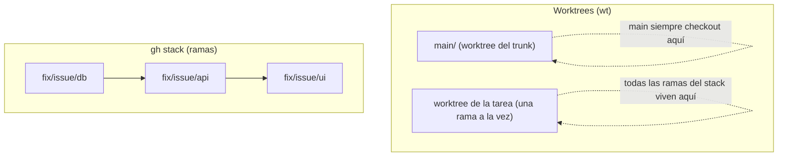
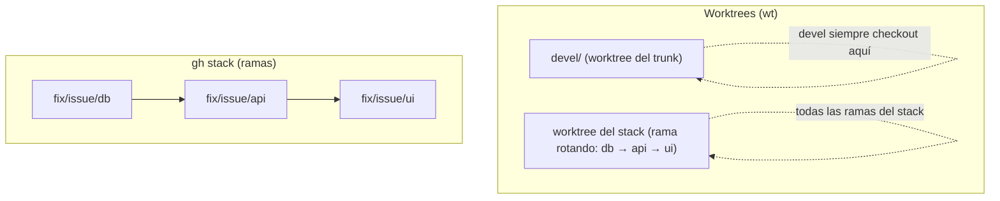

> *Una tarea, un worktree.*
> *Cada rama que no tienes abierta es un cambio de contexto que no tienes que pagar.*
> — <cite>Experiencia personal</cite>

<!--more-->

## TL;DR

* **Una tarea = un worktree.** Los worktrees te permiten tener varias ramas checkout al mismo tiempo, cada una en su propia carpeta, sin cambiar de contexto.
* **Worktrunk (`wt`) elimina la fricción.** Reemplaza los comandos verbosos de `git worktree`, copia tus archivos locales ignorados (`.env`, caches) a los worktrees nuevos, instala dependencias y configura el upstream automáticamente vía hooks.
* **Los stacked PRs mantienen las reviews pequeñas.** `gh stack` convierte una cadena de ramas dependientes en una cadena de PRs pequeños que se fusionan de abajo hacia arriba.
* **Las herramientas apenas se tocan.** `wt` gestiona carpetas y navegación, `gh stack` gestiona ramas y PRs. Solo se tocan al inicio (crear el worktree) y al final (limpieza).

---

Todo desarrollador tiene una relación de amor-odio con las ramas de Git.

Las ramas son baratas de crear y caras de mantener. Si cambio a otra rama, mi trabajo sin commitear me sigue, las dependencias instaladas quedan viejas y mi `.env` o se filtra al repo o no existe en la rama nueva.

Dos dolores dan forma a cómo diseño un flujo de trabajo:

* Cambiar de tarea no debería costar más de unos segundos.
* Un PR debería ser lo bastante pequeño como para que un revisor lo entienda de una sentada.

Este post documenta el setup en el que aterricé después de probar varias aproximaciones: un repositorio Git bare, worktrees gestionados por Worktrunk (`wt`) y stacked PRs creados con `gh stack`.

Así se ve todo de un vistazo:



## 1. Por qué un repo bare y worktrees

Un worktree es un segundo directorio de trabajo conectado al mismo repositorio. Git guarda los metadatos en una carpeta `.bare`, y cada rama tiene su propio checkout.

El layout que uso se ve así:

```text
mi-proyecto/
├── .bare/            # Repositorio Git base (bare)
├── .git              # Archivo de redirección apunta a .bare
├── .worktreeinclude  # Archivos ignorados que se copiarán a cada nuevo worktree (.env, etc.)
├── main/             # Worktree para la rama principal
├── feature-login/    # Worktree activo (administrado por wt)
└── hotfix-bug/       # Worktree activo (administrado por wt)
```

El archivo `.git` es solo una redirección:

```text
gitdir: ./.bare
```

## 2. Configuración inicial (solo la primera vez)

### Paso A: clonar el repositorio bare

```bash
# 1. Crear el directorio del proyecto
mkdir mi-proyecto
cd mi-proyecto

# 2. Clonar el repositorio como BARE
git clone --bare https://github.com/usuario/repositorio.git .bare

# 3. Indicar a Git que use .bare como el repositorio raíz
echo "gitdir: ./.bare" > .git

# 4. Configurar el fetch para traer todas las ramas remotas correctamente
git --git-dir=.bare config remote.origin.fetch "+refs/heads/*:refs/remotes/origin/*"

# 5. Traer las referencias actualizadas del remoto
git fetch origin

# 6. Crear el worktree inicial de main
git worktree add main
```

**Nota:** `git clone --bare` no configura el upstream de ninguna rama (ni siquiera la de defecto), por eso `git pull` falla con "There is no tracking information for the current branch".

Puedes arreglar cada rama manualmente:

```bash
git branch --set-upstream-to=origin/main main
git branch --set-upstream-to=origin/develop develop

# Verifica: las ramas con upstream aparecen con [origin/...]
git branch -vv
```

Con el flujo `wt` esto se resuelve automáticamente: el hook `pre-start` del Paso B ejecuta `git push -u origin <rama>` al crear el worktree, así el upstream queda configurado antes de volver a la terminal.

### Paso B: configurar Worktrunk (`wt`)

Asegúrate de instalar Worktrunk y su integración de shell:

```bash
brew install worktrunk && wt config shell install
```

Crea o edita la configuración de Worktrunk (`~/.config/worktrunk/config.toml` o `.config/wt.toml` dentro del proyecto) para:

1. Crear worktrees junto a `.bare`.
2. Copiar el `.env.local` desde el worktree principal antes de que el shell caiga en el worktree (`pre-start`).
3. Configurar el upstream automáticamente con `git push -u origin <rama>` (`pre-start`).
4. Copiar caches y dependencias ignoradas en background (`post-start`).
5. Instalar dependencias (`post-start`).

```toml
[projects."github.com/usuario/repositorio"]
worktree-path = "{{ repo_path }}/../{{ branch | sanitize }}"

[[projects."github.com/usuario/repositorio".pre-start]]
env = "cp {{ primary_worktree_path }}/web/.env.local web/.env.local"

[[projects."github.com/usuario/repositorio".pre-start]]
push = "git push -u origin {{ branch }}"

[[projects."github.com/usuario/repositorio".post-start]]
copy = "wt step copy-ignored"

[[projects."github.com/usuario/repositorio".post-start]]
install = "npm i"
```

Justo después de definir el config, crea un worktree con tu rama por defecto y trabaja siempre desde ahí:

```bash
wt switch main
```

Ese worktree se convierte en el "principal" a ojos de `wt`. Cuando hagas `wt remove` de otro worktree, `wt` te mueve a este worktree. De lo contrario te deja en `.bare` (sin rama checkout, desorientador).

### Paso C: definir archivos ignorados a copiar (`.worktreeinclude`)

En la raíz del proyecto o dentro del worktree `main/`, crea el archivo `.worktreeinclude`. Especifica los archivos no rastreados que deseas replicar en cada nueva rama (por ejemplo, entornos o credenciales locales):

```text
# .worktreeinclude
.env
.env.local
config/settings.local.json
```

## 3. El flujo diario con `wt`

### Iniciar una tarea: `wts -c <rama>`

`wt switch -c` crea la rama, genera el worktree, ejecuta los hooks (copiar `.env`, instalar dependencias) y cambia el directorio de tu terminal en un solo paso:

```bash
# wt switch -c <nueva-rama>
wt switch -c feature-login
```

Si la rama ya existe en el remoto:

```bash
wt switch feature-login
```

### Listar worktrees activos: `wtl`

`wt list` muestra los worktrees abiertos, su estado de Git (cambios locales, commits adelantados/atrasados) y la rama en la que te encuentras (`@`):

```bash
wt list
```

### Desarrollar y enviar cambios (dentro del worktree)

```bash
# 1. Verificar estado
git status

# 2. Guardar cambios y subir rama
git add .
git commit -m "feat: agregar pantalla de inicio de sesión"
git push -u origin feature-login
```

### Copiar manualmente archivos ignorados (opcional)

Si modificas el archivo `.worktreeinclude` más adelante y quieres sincronizar los archivos ignorados en el worktree actual sin crearlo de nuevo:

```bash
wt step copy-ignored
```

### Fusión local y limpieza automática

Cuando termines tu trabajo, `wt merge main` realiza todo el proceso de integración y limpieza: fusiona los cambios en `main`, borra la carpeta del worktree y elimina la rama local.

```bash
# Desde el worktree feature-login, fusionar en main y limpiar
wt merge main
```

Si prefieres eliminar un worktree manualmente sin fusionarlo:

```bash
wt remove
```

### Atajos de shell: `wts`, `wtl`, `wtr`

Definidos en `~/.zshrc`, resumen las operaciones más comunes de `wt`:

| Comando | Equivale a | Descripción |
| --- | --- | --- |
| `wts` | picker fzf + `wt switch` | Abre un picker fzf con preview de `git status` y log; Enter cambia al worktree |
| `wts <rama>` | `wt switch <rama>` | Cambia directo a un worktree/rama existente |
| `wts -c <rama>` | `wt switch -c <rama>` | Crea rama y worktree nuevo |
| `wtl` | `wt list` | Lista worktrees y su estado |
| `wtr` | `wt remove` | Elimina el worktree actual |

El picker de `wts` sin argumentos se alimenta de `wt list --format json`:

```zsh
# wts - switch/create worktree (wt switch + fzf picker)
wts() {
  [[ $# -gt 0 ]] && { wt switch "$@"; return; }

  local target
  target=$(
    wt list --format json 2>/dev/null \
      | jq -r '.items[] | [.branch, .worktree.path] | @tsv' \
      | fzf --delimiter='\t' --with-nth=1 \
            --preview 'git -C {2} status -sb 2>/dev/null | head -15; echo; git -C {2} log --oneline -8 2>/dev/null' \
            --preview-window=right:45% \
      | cut -f1
  )
  [[ -n "$target" ]] && wt switch "$target"
}

alias wtl="wt list"
alias wtr="wt remove"
```

Requisitos: `jq` y `fzf` instalados.
El wrapper `wt()` de `worktrunk config shell init` (ya cargado en `.zshrc`) se encarga del `cd` automático al cambiar de worktree.

## 4. Stacked PRs + Worktrunk

El principio: una tarea = un worktree; el stack completo vive dentro del worktree creado por `wts -c`.

`wt` gestiona worktrees y navegación; `gh stack` gestiona ramas y PRs. Los dos flujos son independientes y solo se tocan al inicio (crear el worktree) y al final (limpieza).



### Secuencia completa

```zsh
wts -c fix/issue/db         # worktree del stack (rama desde la default branch)
# ...desarrollo y commits en db...
gh stack init fix/issue/db  # registra el stack en .git/gh-stack (checkout no-op)
gh stack add fix/issue/api  # rama nueva; checkout dentro del mismo worktree
gh stack add fix/issue/ui
gh stack submit --auto --open
# ...merges bottom-up...
gh stack sync --prune       # borra db/api; el terminal queda "colgado" en ui
wtr                         # remueve el worktree, borra ui (integrada) y te cd al primario
```

### Por qué el final funciona así

`gh stack sync --prune` intenta `git checkout devel` para moverte al trunk, pero git lo prohíbe porque `devel` tiene su propio worktree ("already checked out at ..."). Tampoco puede borrar `ui`: está checkout en el worktree del stack. Que el terminal quede "colgado" en `ui` es esperado.

`wtr` resuelve todo desde el mismo worktree: la remoción renombra el worktree a `.git/wt/trash/` primero, luego borra la rama (check de integración; con squash merge funciona vía patch-id match) y worktrunk mueve el shell al worktree primario ("Switched to worktree for main").

Notas:
- Worktree con cambios sin commitear: `wtr -f`; rama no reconocida como integrada: `wtr -D`.
- `wt list` muestra `branch_mismatch` en el worktree del stack mientras viva el stack: cosmético.
- `gh stack trunk` y la navegación hacia el trunk fallan con worktrees; usar `wts ^`.
- `gh stack sync` (sin `--prune`) funciona durante el desarrollo: las ramas del stack solo existen en el worktree del stack.

### `gh stack submit --auto`

Interactivo abre un TUI full-screen (elegir ramas, títulos, draft vs ready). `--auto` salta el editor y genera títulos automáticos. Con `--auto` los PRs se crean como draft; `--auto --open` los crea listos para review. En terminal no interactiva (CI) `--auto` se asume implícito.

### Hook opcional: auto-inicializar el stack

```toml
[[projects."github.com/usuario/repositorio".pre-start]]
init = "gh stack init {{ branch }}"
```

`wts -c fix/issue/db` registra el stack automáticamente y puedes hacer `gh stack add` directo. Usar `pre-start` (bloqueante), no `post-start` (background): `gh stack add` necesita que `.git/gh-stack` ya exista, y con `post-start` hay race condition.

Caveats:
- Corre en cada `wts -c`: toda rama nueva se vuelve stack de una rama (inofensivo; `submit` crea un PR normal).
- `git rerere` no se habilita solo (el prompt es no interactivo dentro de hooks).
- Requiere `gh` autenticado y stacked PRs habilitado en el repo.

### Alternativa: helper `wsp`

```zsh
alias wsp="gh stack sync --prune && wts ^"
```

Variante que vuelve al trunk y deja el worktree del stack para limpiar después con `wt remove <rama>`. Si prefieres terminar en el worktree primario con un solo comando, usa `wtr` directo.

## 5. Solución de problemas

### Error: "There is no tracking information for the current branch"

```text
git pull
There is no tracking information for the current branch.
Please specify which branch you want to merge with.
```

**Causa:** la rama local no tiene configurado su upstream (`branch.<rama>.remote` y `branch.<rama>.merge`). Esto pasa cuando la rama se creó o checkout desde un fetch sin tracking, común en el flujo bare + worktrees.

**Arreglo puntual:**

```bash
git branch --set-upstream-to=origin/<rama> <rama>
git pull
```

O una sola vez sin cambiar la config: `git pull origin <rama>`.

**En el flujo `wt`:** el hook `pre-start` (Paso B) ejecuta `git push -u origin <rama>` al crear el worktree, así que las ramas nuevas quedan con upstream configurado antes de volver a la terminal.

### Error al hacer push de una rama sin upstream

```text
fatal: The current branch <rama> has no upstream branch.
```

**Arreglo:** empuja definiendo el upstream en el primer push:

```bash
git push -u origin <rama>
```

## 6. Referencia rápida

### Comandos `wt`

| Operación | Comando | Equivalente Git Manual |
| --- | --- | --- |
| **Picker interactivo (fzf + preview)** | `wts` | `wt switch` (picker nativo) |
| **Crear rama y worktree** | `wts -c <rama>` | `git worktree add -b <rama> <rama> main` |
| **Cambiar a worktree existente** | `wts <rama>` | `cd ../<rama>` |
| **Listar worktrees activos** | `wtl` | `git worktree list` |
| **Copiar archivos de `.worktreeinclude`** | `wt step copy-ignored` | `cp ../main/.env .env` |
| **Fusionar a main y borrar worktree** | `wt merge main` | `git checkout main && git merge <rama> && git worktree remove <rama> && git branch -d <rama>` |
| **Eliminar worktree actual** | `wtr` | `git worktree remove <carpeta> && git branch -d <rama>` |

### Stacked PRs (`gh stack` + worktrunk)

| Operación | Comando |
| --- | --- |
| **Inicializar stack** | `gh stack init <b1> <b2> <b3>` |
| **Agregar rama al stack** | `gh stack add <rama>` |
| **Crear PRs del stack** | `gh stack submit --auto --open` |
| **Sincronizar stack** | `gh stack sync` |
| **Limpiar ramas mergeadas** | `gh stack sync --prune` |
| **Terminar ciclo** | `wtr` (o `wsp` para volver al trunk) |

---

Ese es el flujo completo.

Me costó tiempo apreciar lo que los worktrees y los stacked PRs dan juntos. El worktree elimina el costo de cambiar de contexto, y `gh stack` elimina el costo de mantener un PR pequeño. Las dos herramientas compensan sus bordes ásperos: la rama donde está checkout el stack cambia seguido, pero nunca lo notas porque ocurre dentro de una sola carpeta.

Si lo pruebas, te recomiendo empezar pequeño: configura el repo bare y `wt`, mantén el `git push -u` manual un tiempo, y solo agrega `gh stack` una vez que el loop de worktrees te sienta natural.
